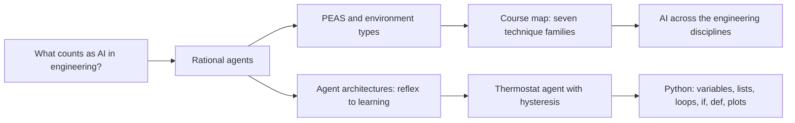

# Week 01: Artificial Intelligence in Engineering: Agents and First Steps in Python

**Artificial Intelligence Applications in Engineering (MUH-920 Mühendislikte Yapay Zeka Uygulamaları)** Prof. Dr. Utku Kose, Süleyman Demirel University

   

[Start here](../../start-here/README.md) | [All weeks](../../README.md#weekly-schedule) | [Week 2](../week-02/README.md)

## Overview

Engineering has always delegated decisions to machines: A governor regulates the speed of a steam engine, a thermostat switches a boiler and an autopilot holds an altitude. Artificial intelligence extends this delegation to decisions that need perception, reasoning, search, learning or language [1, 2]. The week defines artificial intelligence through the idea of a rational agent, introduces the vocabulary used for the rest of the semester, and places the families of techniques covered in the course on one map. The practical work builds a first agent in Python: a heating controller that keeps a room in Isparta comfortable during a real January, driven by reanalysis weather data [3, 4].

**Estimated study time:** 8 to 10 hours.

## Learning outcomes

By the end of the week, students are expected to define artificial intelligence from the rational-agent perspective, to outline its history, to place machine learning, deep learning and intelligent optimisation within its family and relate it to neighbouring fields, to describe an engineering system with the PEAS scheme and classify its environment, to distinguish reflex, model-based, goal-based, utility-based and learning agents, to explain why hysteresis turns a simple reflex into an agent with memory, to name the main environments for Python programming, and to run, modify and evaluate a short Python simulation in Google Colab.

## Week at a glance

## Materials of the week

| Material | What it contains | Link |
|---|---|---|
| Lecture page | Eleven sections with nine knowledge checks, an animation, four figures and ten review cards | [Open the lecture page](https://utkukose.github.io/ai-applications-in-engineering-NB-lecture/weeks/week-01/lecture.html) |
| Lecture notes | The printable version of the week: the lecture with Python step 1 and the outputs of its code, followed by the discipline challenges and the tasks | [Open the PDF](Week01_Lecture_Notes.pdf) |
| Interactive lab | *Agent workbench: Heating a room through a winter week*, with a self-assessment of six questions, three reflection prompts and an exportable learning log | [Open the lab](https://utkukose.github.io/ai-applications-in-engineering-NB-lecture/weeks/week-01/lab.html) |
| Colab notebook | Python step 1: Values, variables and decisions, followed by five hands-on sections with exercises and immediate feedback | [Open in Colab](https://colab.research.google.com/github/utkukose/ai-applications-in-engineering-NB-lecture/blob/main/weeks/week-01/NB01_first_agent.ipynb), [view on GitHub](NB01_first_agent.ipynb) |

## Contents

| Lecture page | Colab notebook |
|---|---|
| [What engineers mean by artificial intelligence](https://utkukose.github.io/ai-applications-in-engineering-NB-lecture/weeks/week-01/lecture.html#what-engineers-mean-by-artificial-intelligence) | [Python step 1: Values, variables and decisions](https://colab.research.google.com/github/utkukose/ai-applications-in-engineering-NB-lecture/blob/main/weeks/week-01/NB01_first_agent.ipynb#scrollTo=python-step) |
| [A short history of artificial intelligence](https://utkukose.github.io/ai-applications-in-engineering-NB-lecture/weeks/week-01/lecture.html#a-short-history-of-artificial-intelligence) | [1. Variables and a first decision](https://colab.research.google.com/github/utkukose/ai-applications-in-engineering-NB-lecture/blob/main/weeks/week-01/NB01_first_agent.ipynb#scrollTo=section-1) |
| [The family of artificial intelligence](https://utkukose.github.io/ai-applications-in-engineering-NB-lecture/weeks/week-01/lecture.html#the-family-of-artificial-intelligence) | [2. One day of a room with lists and loops](https://colab.research.google.com/github/utkukose/ai-applications-in-engineering-NB-lecture/blob/main/weeks/week-01/NB01_first_agent.ipynb#scrollTo=section-2) |
| [Artificial intelligence and neighbouring fields](https://utkukose.github.io/ai-applications-in-engineering-NB-lecture/weeks/week-01/lecture.html#artificial-intelligence-and-neighbouring-fields) | [3. Real weather: Isparta in January 2025](https://colab.research.google.com/github/utkukose/ai-applications-in-engineering-NB-lecture/blob/main/weeks/week-01/NB01_first_agent.ipynb#scrollTo=section-3) |
| [Agents, environments and performance measures](https://utkukose.github.io/ai-applications-in-engineering-NB-lecture/weeks/week-01/lecture.html#agents-environments-and-performance-measures) | [4. Agents as functions](https://colab.research.google.com/github/utkukose/ai-applications-in-engineering-NB-lecture/blob/main/weeks/week-01/NB01_first_agent.ipynb#scrollTo=section-4) |
| [Agent architectures: From reflexes to learning](https://utkukose.github.io/ai-applications-in-engineering-NB-lecture/weeks/week-01/lecture.html#agent-architectures-from-reflexes-to-learning) | [5. The trade-off curve](https://colab.research.google.com/github/utkukose/ai-applications-in-engineering-NB-lecture/blob/main/weeks/week-01/NB01_first_agent.ipynb#scrollTo=section-5) |
| [A map of the course: Families of techniques](https://utkukose.github.io/ai-applications-in-engineering-NB-lecture/weeks/week-01/lecture.html#a-map-of-the-course-families-of-techniques) |  |
| [Artificial intelligence across the engineering disciplines](https://utkukose.github.io/ai-applications-in-engineering-NB-lecture/weeks/week-01/lecture.html#artificial-intelligence-across-the-engineering-disciplines) |  |
| [How to study this course](https://utkukose.github.io/ai-applications-in-engineering-NB-lecture/weeks/week-01/lecture.html#how-to-study-this-course) |  |
| [Engineering judgement: When not to use artificial intelligence](https://utkukose.github.io/ai-applications-in-engineering-NB-lecture/weeks/week-01/lecture.html#engineering-judgement-when-not-to-use-artificial-intelligence) |  |
| [Python, programming environments and Google Colab](https://utkukose.github.io/ai-applications-in-engineering-NB-lecture/weeks/week-01/lecture.html#python-programming-environments-and-google-colab) |  |
| [Review cards](https://utkukose.github.io/ai-applications-in-engineering-NB-lecture/weeks/week-01/lecture.html#review-cards) |  |

## Study path

| Step | Activity | Suggested time |
|---|---|---|
| 1 | Read the [lecture page](https://utkukose.github.io/ai-applications-in-engineering-NB-lecture/weeks/week-01/lecture.html) and answer its knowledge checks, or read the [PDF notes](Week01_Lecture_Notes.pdf) | 2 hours |
| 2 | Explore the simulation of the [interactive lab](https://utkukose.github.io/ai-applications-in-engineering-NB-lecture/weeks/week-01/lab.html#explore) | 1 hour |
| 3 | Work through [Python step 1](https://colab.research.google.com/github/utkukose/ai-applications-in-engineering-NB-lecture/blob/main/weeks/week-01/NB01_first_agent.ipynb#scrollTo=python-step) at the start of the Colab notebook | 1 hour |
| 4 | Continue with the hands-on sections of the [notebook](https://colab.research.google.com/github/utkukose/ai-applications-in-engineering-NB-lecture/blob/main/weeks/week-01/NB01_first_agent.ipynb) and their exercises | 3 hours |
| 5 | Solve the [discipline challenge](#discipline-challenges) of your department | 1 hour |
| 6 | Take the [self-assessment](https://utkukose.github.io/ai-applications-in-engineering-NB-lecture/weeks/week-01/lab.html#check) in the lab | 20 minutes |
| 7 | Answer the [reflection prompts](https://utkukose.github.io/ai-applications-in-engineering-NB-lecture/weeks/week-01/lab.html#reflect), export the learning log and complete the [weekly task](#weekly-task) | 1 hour |

## Preview

<table><tr><td colspan="2"> Interactive lab: Agent workbench: Heating a room through a winter week</td></tr><tr><td width="50%"></td><td width="50%"></td></tr><tr><td colspan="2">Outputs of the executed Colab notebook</td></tr></table>

## Discipline challenges

Every department of the Faculty of Engineering and Natural Sciences meets agents in its own form. Choose the row of your department, or the closest one, and write the PEAS description and the environment properties of the system named there. Students from other programmes worldwide can use the closest discipline.

| Department | Challenge |
|---|---|
| Computer Engineering | A network intrusion detection agent that watches traffic and blocks suspicious connections. |
| Biology | An automated microscope that finds and counts dividing cells in time-lapse images. |
| Environmental Engineering | An aeration controller in a wastewater treatment plant that keeps dissolved oxygen in range. |
| Electrical and Electronics Engineering | A battery management system that balances cells and limits charging current. |
| Industrial Engineering | A scheduling agent that reassigns jobs when a machine breaks down. |
| Physics | An autonomous telescope scheduler that selects targets as clouds move across the sky. |
| Food Engineering | A fruit-drying controller that adjusts air temperature from product moisture. |
| Civil Engineering | A structural health monitoring system on a bridge that raises alarms from strain gauges. |
| Statistics | An automated quality-control agent that flags anomalous values in incoming survey data. |
| Geophysical Engineering | An earthquake early-warning agent that issues alerts from the first seconds of shaking. |
| Geological Engineering | A core-logging camera that labels rock types along drill cores. |
| Chemistry | A self-driving laboratory robot that chooses the next experiment from previous results. |
| Chemical Engineering | A distillation column controller that holds product purity during feed changes. |
| Mining Engineering | An autonomous haul truck operating on open-pit roads with loaders and other trucks. |
| Mechanical Engineering | A condition monitoring agent for a pump that schedules maintenance from vibration. |
| Mathematics | A solver-selection agent that picks a numerical method for each differential equation it receives. |
| Automotive Engineering | An adaptive cruise control that keeps a safe gap to the vehicle ahead. |
| Textile Engineering | A fabric inspection camera that marks defects on a running loom. |
| Earth Sciences Engineering | A landslide monitoring network that raises warnings from displacement and rainfall sensors. |

## Weekly task

Write a short technical note of about 400 words that specifies an intelligent system from your own department with the PEAS scheme, classifies its environment with the six properties of the lecture, and names the agent architecture that fits it. Add the comparison table of the three thermostat agents from the notebook and one plot, and explain in two sentences which agent you would install and why. Cite at least three works from this week's references in square brackets [1, 5, 6].

## Research and report assignment (optional)

**Artificial intelligence in your discipline.** Select one engineering or science department from the discipline table of this week and review how artificial intelligence is used in it today. Classify at least eight published applications by the technique families of the course map, by the type of data they use and by their environment properties. Use one recent review from the course bibliography as a starting point, for example the reviews on structural engineering, manufacturing, Earth science or materials [7, 8, 9, 10].

Both assignments are optional. During an active semester, the weekly task can be sent together with the exported learning log, and the research report on its own, to utkukose@sdu.edu.tr or utkukose@gmail.com. They carry no separate weight, but the instructor may take them into account as a discretionary adjustment of the midterm component of the grade. The [assessment section of the syllabus](../../SYLLABUS.md#assessment) gives the details, and research reports follow the [report template](../../exams/REPORT_TEMPLATE.md).

## References

[1] Russell, S., & Norvig, P. (2021). *Artificial Intelligence: A Modern Approach* (4th ed.). Pearson.

[2] Jordan, M. I., & Mitchell, T. M. (2015). Machine learning: Trends, perspectives, and prospects. *Science*, *349*(6245), 255-260. <https://doi.org/10.1126/science.aaa8415>

[3] Open-Meteo (2026). *Open-Meteo free weather API: Historical Weather API and Elevation API (data licensed under CC BY 4.0)*. <https://open-meteo.com>

[4] Hersbach, H., Bell, B., Berrisford, P., et al. (2020). The ERA5 global reanalysis. *Quarterly Journal of the Royal Meteorological Society*, *146*(730), 1999-2049. <https://doi.org/10.1002/qj.3803>

[5] Wooldridge, M., & Jennings, N. R. (1995). Intelligent agents: Theory and practice. *The Knowledge Engineering Review*, *10*(2), 115-152. <https://doi.org/10.1017/S0269888900008122>

[6] Åström, K. J., & Murray, R. M. (2021). *Feedback Systems: An Introduction for Scientists and Engineers* (2nd ed.). Princeton University Press.

[7] Salehi, H., & Burgueño, R. (2018). Emerging artificial intelligence methods in structural engineering. *Engineering Structures*, *171*, 170-189. <https://doi.org/10.1016/j.engstruct.2018.05.084>

[8] Wuest, T., Weimer, D., Irgens, C., & Thoben, K.-D. (2016). Machine learning in manufacturing: Advantages, challenges, and applications. *Production & Manufacturing Research*, *4*(1), 23-45. <https://doi.org/10.1080/21693277.2016.1192517>

[9] Bergen, K. J., Johnson, P. A., de Hoop, M. V., & Beroza, G. C. (2019). Machine learning for data-driven discovery in solid Earth geoscience. *Science*, *363*(6433), eaau0323. <https://doi.org/10.1126/science.aau0323>

[10] Butler, K. T., Davies, D. W., Cartwright, H., Isayev, O., & Walsh, A. (2018). Machine learning for molecular and materials science. *Nature*, *559*(7715), 547-555. <https://doi.org/10.1038/s41586-018-0337-2>

---

Artificial Intelligence Applications in Engineering. Prof. Dr. Utku Kose, Süleyman Demirel University. ORCID [0000-0002-9652-6415](https://orcid.org/0000-0002-9652-6415). Content licensed under CC BY 4.0, code under MIT. This course is updated in line with current developments in the field. Last update: October 2026.
