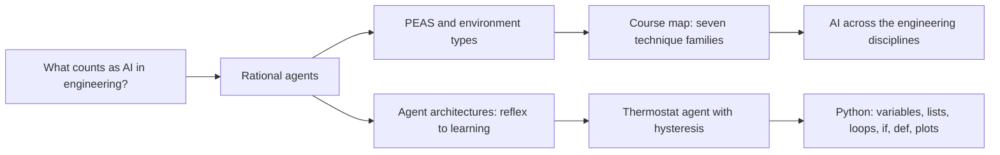
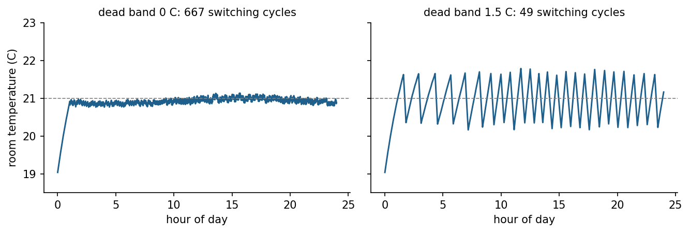
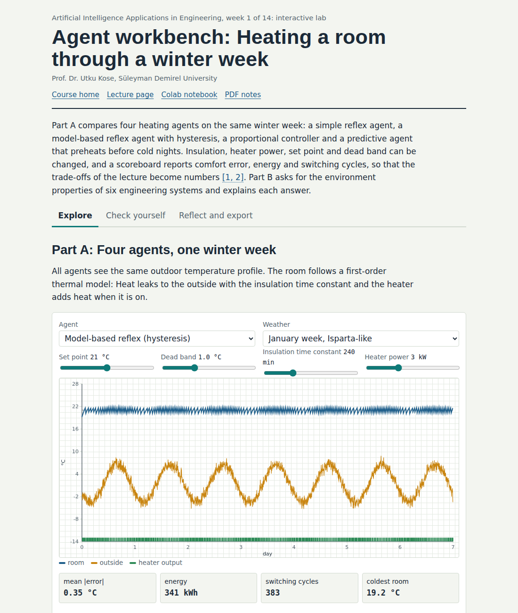
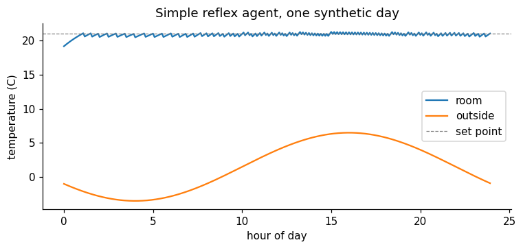
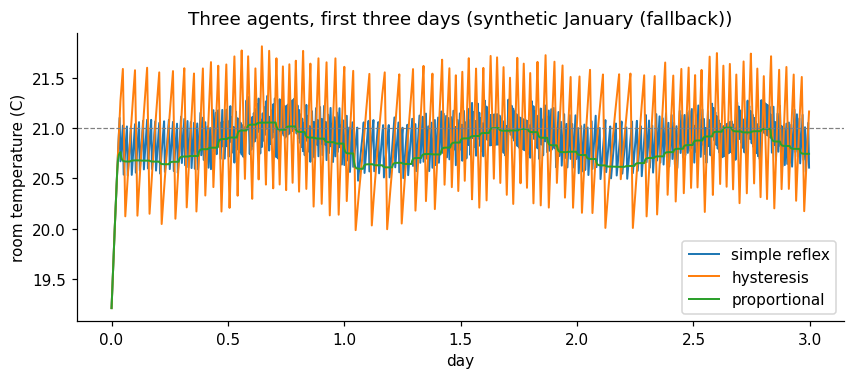

<div align="center">

# Week 01: Artificial Intelligence in Engineering: Agents and First Steps in Python

**Artificial Intelligence Applications in Engineering (MUH-920 Mühendislikte Yapay Zeka Uygulamaları)**  
Prof. Dr. Utku Kose, Süleyman Demirel University

[](https://colab.research.google.com/github/utkukose/ai-applications-in-engineering-NB-lecture/blob/main/weeks/week-01/NB01_first_agent.ipynb) [](https://utkukose.github.io/ai-applications-in-engineering-NB-lecture/weeks/week-01/lab.html) [](https://utkukose.github.io/ai-applications-in-engineering-NB-lecture/weeks/week-01/lecture.html) [](Week01_Lecture_Notes.pdf)

</div>

## Overview

Engineering has always delegated decisions to machines: A governor regulates the speed of a steam engine, a thermostat switches a boiler and an autopilot holds an altitude. Artificial intelligence extends this delegation to decisions that need perception, reasoning, search, learning or language [3, 4]. The week defines artificial intelligence through the idea of a rational agent, introduces the vocabulary used for the rest of the semester, and places the families of techniques covered in the course on one map. The practical work builds a first agent in Python: a heating controller that keeps a room in Isparta comfortable during a real January, driven by reanalysis weather data [51, 52].

**Estimated study time:** 8 to 10 hours.

## Learning outcomes

By the end of the week, students are expected to define artificial intelligence from the rational-agent perspective, to outline its history, to place machine learning, deep learning and intelligent optimisation within its family and relate it to neighbouring fields, to describe an engineering system with the PEAS scheme and classify its environment, to distinguish reflex, model-based, goal-based, utility-based and learning agents, to explain why hysteresis turns a simple reflex into an agent with memory, to name the main environments for Python programming, and to run, modify and evaluate a short Python simulation in Google Colab.

## Python in this week

The lecture ends with Python step 1: Values, variables and decisions. It covers values, variables and types, arithmetic, f-strings, comparisons and if statements, applied to the heating rule of the week's agent [48]. The hands-on part of the notebook opens with the same step as runnable cells and short exercises with immediate feedback, and its later sections mark further constructs as Python moves.

## Study path

| Step | Activity | Suggested time |
|---|---|---|
| 1 | Read the lecture with its animations on the [lecture page](https://utkukose.github.io/ai-applications-in-engineering-NB-lecture/weeks/week-01/lecture.html), or read the [PDF version](Week01_Lecture_Notes.pdf) | 2 hours |
| 2 | Explore the [interactive lab](https://utkukose.github.io/ai-applications-in-engineering-NB-lecture/weeks/week-01/lab.html) | 1 hour |
| 3 | Study the Python step at the end of the lecture, then run the same step at the start of the hands-on part of the [Colab notebook](https://colab.research.google.com/github/utkukose/ai-applications-in-engineering-NB-lecture/blob/main/weeks/week-01/NB01_first_agent.ipynb) | 1 hour |
| 4 | Work through the rest of the notebook, including its Python moves and exercises | 3 hours |
| 5 | Solve the discipline challenge of your department | 1 hour |
| 6 | Take the self-assessment in the lab (tab: Check yourself) | 20 minutes |
| 7 | Write the reflection, export the learning log and complete the weekly task | 1 hour |

## Week at a glance



## Lecture

### What engineers mean by artificial intelligence

In 1950, Alan Turing replaced the question of whether machines can think with a behavioural test: Can a machine answer questions in a way that an interrogator cannot tell apart from a person [1]? Five years later, the proposal for the Dartmouth summer project used the phrase artificial intelligence and stated the working conjecture of the new field: Every aspect of learning or any other feature of intelligence can in principle be described so precisely that a machine can be made to simulate it [2]. Both documents still shape the field, but neither gives an engineer a design criterion.

Russell and Norvig organise definitions of artificial intelligence along two axes: Whether the aim is to think or to act, and whether the standard is human performance or rationality [3]. Engineering practice mostly adopts the fourth combination, acting rationally. A rational agent selects, for every sequence of perceptions, the action that is expected to maximise a performance measure, given what it knows. This definition is useful because it can be tested. It asks what the system perceives, which actions it can take, and how success is measured, and these are questions that every engineering specification already answers.

Machine learning is one route to rational behaviour, not a synonym for artificial intelligence. Jordan and Mitchell describe machine learning as the study of systems that improve their performance on a task through experience [4]. A route planner that uses a hand-written heuristic, a fuzzy controller written from operator knowledge and a genetic algorithm that designs a truss are all artificial intelligence techniques without being learning systems in this sense. The course treats the whole toolbox, because engineering problems differ in how much data, knowledge and computing time they offer.

<details>
<summary><b>Check your understanding.</b> Which definition does engineering practice mostly adopt?</summary>

A. Thinking humanly: The system must reproduce human thought processes  
B. Acting humanly: The system must pass a Turing-style test  
C. Acting rationally: The system selects actions expected to maximise a performance measure  
D. Any system that contains a neural network

**Answer: C.** The rational-agent view turns intelligence into a testable design criterion: percepts, actions and a performance measure.

</details>

### A short history of artificial intelligence

The field took shape between 1943 and 1956. McCulloch and Pitts described the neuron as a logical switching element [5], Turing proposed his behavioural test [1], and the Dartmouth proposal of 1955 gave the field its name and a research programme for a summer workshop held in 1956 [2]. Samuel's checkers program, which improved by playing games against itself, introduced the term machine learning [6], and Rosenblatt's perceptron learned to classify patterns from examples [7].

Symbolic methods dominated the following two decades: Search guided by heuristics, such as the A* algorithm [8], logical reasoning and, from the 1970s, expert systems that stored the knowledge of specialists as rules [9]. Zadeh introduced fuzzy sets in 1965 [10], and Holland developed genetic algorithms [11]. Minsky and Papert showed what single-layer perceptrons cannot compute [12]. Expectations repeatedly ran ahead of results, and funding and interest fell sharply in the 1970s and again in the late 1980s, after the commercial boom of expert systems. These periods are known as AI winters [3].

From the mid-1980s, learning from data moved to the centre. Backpropagation made multilayer networks trainable [13], support vector machines offered learning with strong theoretical guarantees [14], and statistical learning matured into a coherent discipline [15]. Nature-inspired optimisation grew with particle swarms [16] and ant colonies [17]. In 1997 the chess computer Deep Blue defeated the world champion Garry Kasparov [18], and the long short-term memory network appeared, later a standard model for sequences [19].

Since 2012, deep learning has dominated the field. A deep convolutional network won the ImageNet recognition challenge of 2012 by a wide margin [20], made possible by large labelled datasets, graphics processors and better training methods [21]. AlphaGo, published in 2016, combined deep networks, tree search and reinforcement learning and became the first program to defeat a professional player at the full game of Go [22]. The transformer architecture of 2017 [23] led to large language models [24] and to language models trained to follow instructions with human feedback, the approach behind the chat assistants that spread from late 2022 [25]. Scientific and engineering applications followed, among them protein structure prediction [26] and medium-range weather forecasting [27]. The timeline below places these milestones side by side.

![Selected milestones of artificial intelligence that recur in this course [1, 2, 5, 8, 10, 11, 13, 16, 19, 20, 23, 26, 27].](figures/w01_fig1.png)

*Figure 1.1. Selected milestones of artificial intelligence that recur in this course [1, 2, 5, 8, 10, 11, 13, 16, 19, 20, 23, 26, 27].*

The history carries a lesson for engineers. Neural networks, search, fuzzy logic and evolutionary methods are all decades old; what changed over time was the availability of data, computing power and reliable software. A method that fails today for lack of data may succeed later, and a fashionable method may be the wrong tool for a problem with little data and much physical knowledge.

<details>
<summary><b>Check your understanding.</b> Neural networks were proposed in the 1940s and 1950s. Why did deep networks come to dominate only after 2012?</summary>

A. Their mathematical basis was discovered only in 2012  
B. Large labelled datasets, graphics processors and better training methods made deep networks practical  
C. Symbolic methods were abandoned after the AI winters  
D. Fuzzy logic removed the need for data

**Answer: B.** The core ideas were old. What changed was the availability of data, computing power and training techniques.

</details>

### The family of artificial intelligence

Artificial intelligence is an umbrella term for a family of methods, and the relations between its members are easiest to see as sets. Machine learning is a subset of artificial intelligence: It covers systems that improve their performance on a task through experience [4]. Deep learning is a subset of machine learning that uses neural networks with many layers to learn representations directly from raw data such as images, signals and text [21, 28]. Generative models and large language models form a further subset of deep learning [23, 24]. Reinforcement learning, which learns to act from rewards, belongs to machine learning and overlaps with deep learning wherever deep networks represent the policy or the value function [22, 29].

![The family of artificial intelligence drawn as sets. Every deep learning method is a machine learning method, and every machine learning method is an artificial intelligence method, but the reverse does not hold [3, 21, 30].](figures/w01_fig3.png)

*Figure 1.2. The family of artificial intelligence drawn as sets. Every deep learning method is a machine learning method, and every machine learning method is an artificial intelligence method, but the reverse does not hold [3, 21, 30].*

Several members of the family do not learn from data in this sense. Search and planning compute sequences of actions from a model of the problem [8], knowledge-based systems reason with rules written by experts [9], and fuzzy systems turn vague linguistic knowledge into numbers [10]. Intelligent optimisation, also called nature-inspired optimisation, searches large design spaces with populations of candidate solutions that are varied and selected. Evolutionary algorithms and swarm intelligence are its two main branches [11, 16, 17]. Together with neural networks and fuzzy systems, these methods are often grouped as computational intelligence [30]. The sets overlap where methods combine: Evolutionary algorithms tune the settings of learning models or evolve neural networks, neuro-fuzzy systems learn fuzzy rules from data, and fuzzy rule bases are themselves a kind of knowledge-based system.

The figure also corrects two common misreadings. Artificial intelligence is neither the same as deep learning nor the same as chat assistants, which occupy a small corner of the family. The weeks of this course move through the whole family, as the map of the course below shows.

<details>
<summary><b>Check your understanding.</b> Which statement about the family of artificial intelligence is correct?</summary>

A. Every artificial intelligence method learns from data  
B. Every deep learning method is also a machine learning method  
C. Particle swarm optimisation is a kind of deep learning  
D. Machine learning and artificial intelligence are two names for the same field

**Answer: B.** Deep learning is a subset of machine learning, which is a subset of artificial intelligence. Many methods of the family, such as search, rules and swarms, do not learn from data.

</details>

### Artificial intelligence and neighbouring fields

Artificial intelligence is a field of computer science, but its methods grew from, and feed back into, many other disciplines [3]. Statistics shares the problem of learning from data, and the two meet in statistical learning [15]. Mathematical optimisation and operations research formulate the design and scheduling problems that search and nature-inspired methods solve. Control engineering shares the question of how to act on a dynamic system, and reinforcement learning and fuzzy control lie in the overlap [29]. Neuroscience and psychology inspired neural networks from the first neuron model onwards [5, 7]. Linguistics meets artificial intelligence in natural language processing, signal and image processing meets it in speech recognition and computer vision, robotics in perception and motion planning, and data science in the handling of large and messy datasets.

![Artificial intelligence and its neighbouring fields. Each circle names a field and, below the name, the topics that it shares with artificial intelligence [3].](figures/w01_fig4.png)

*Figure 1.3. Artificial intelligence and its neighbouring fields. Each circle names a field and, below the name, the topics that it shares with artificial intelligence [3].*

For an engineer these overlaps are practical. A problem often has a well-tested solution in a neighbouring field, such as a classical controller, a regression model with confidence intervals or a linear program. A new artificial intelligence method is justified only when it does better on the performance measure that matters.

<details>
<summary><b>Check your understanding.</b> A team predicts the compressive strength of concrete from the mix proportions and reports confidence intervals for its predictions. In which overlap does this work lie?</summary>

A. Artificial intelligence and linguistics  
B. Artificial intelligence and statistics  
C. Artificial intelligence and robotics  
D. Artificial intelligence and neuroscience

**Answer: B.** Learning a predictive model from data and quantifying its uncertainty is the shared ground of machine learning and statistics.

</details>

### Agents, environments and performance measures

An agent perceives its environment through sensors and acts on it through actuators [3, 31]. The mapping from percept histories to actions is the agent function, and the program that implements it runs on some physical architecture. The PEAS scheme makes the design task explicit by listing the performance measure, the environment, the actuators and the sensors. The table below applies the scheme to four systems from different departments.

| System | Performance measure | Environment | Actuators | Sensors |
|---|---|---|---|---|
| Heating controller of a building | Comfort band held, energy used, number of switching cycles | Rooms, walls, outdoor weather, occupants | Boiler relay, valves | Room and outdoor thermometers |
| Autonomous haul truck in an open-pit mine | Tonnes moved per hour, zero collisions, fuel use | Haul roads, loaders, other vehicles, dust | Steering, throttle, brakes, dump bed | GNSS, lidar, radar, payload scale |
| Fabric inspection camera in a weaving mill | Defects found, false alarms, line speed kept | Moving fabric, lighting, loom vibration | Alarm, marking device, line stop | Line-scan camera, encoder |
| Earthquake early-warning agent | Warning time, missed events, false alerts | Seismic network, communication links | Alerts to trains, factories, phones | Seismometers, accelerometers |

The environment decides which techniques are feasible. It is fully observable when the sensors reveal the complete relevant state, and partially observable otherwise. It is deterministic when the next state follows from the current state and action, and stochastic when chance intervenes. It is episodic when each decision stands alone, as in inspecting one fabric image, and sequential when decisions affect the future, as in heating a building. It is static or dynamic, discrete or continuous, and it contains one agent or several [3]. A heating controller works in a partially observable, stochastic, sequential, dynamic and continuous environment: It cannot measure the heat stored in the walls, the weather is uncertain, and every switching decision changes the temperatures it will face later.

<details>
<summary><b>Check your understanding.</b> A camera classifies each fabric image as defective or not, and one decision does not influence the next image. How is this task environment best described?</summary>

A. Episodic  
B. Sequential  
C. Multi-agent  
D. Fully deterministic and continuous by definition

**Answer: A.** Each inspection is a separate episode. Heating a building is sequential, because each action changes future states.

</details>

### Agent architectures: From reflexes to learning

Russell and Norvig describe five agent designs of increasing capability [3]. A simple reflex agent maps the current percept to an action through condition-action rules, such as switching the heater on when the room is below the set point. A model-based reflex agent keeps an internal state that summarises what it cannot currently see. A goal-based agent considers future consequences of actions and chooses those that achieve a goal, which is the topic of search in Week 2. A utility-based agent compares outcomes with a numerical utility, for example trading comfort against energy cost. A learning agent improves any of these components from experience, which is the subject of Weeks 7 to 14.

Control engineering developed many of the same ideas under different names. Wiener's cybernetics treated the animal and the machine as feedback systems [32], and feedback control remains the most widespread form of automated decision making in engineering [33]. The thermostat illustrates the connection. A pure reflex rule switches the heater whenever the temperature crosses the set point, so noise and delays make the relay chatter on and off many times per hour. Adding a dead band, in which the heater turns on below the lower threshold and off above the upper threshold and otherwise keeps its previous state, gives the controller one bit of memory. The agent is no longer a function of the current percept alone: It is a model-based reflex agent, and the price for fewer switching cycles is a wider temperature swing.

> **Animation: Hysteresis in a heating agent.** The animation simulates one winter day. Narrow the dead band to zero and watch the number of switching cycles rise, then widen it and watch the temperature swing grow. Run it in the [web version of the lecture](https://utkukose.github.io/ai-applications-in-engineering-NB-lecture/weeks/week-01/lecture.html#anim-thermo).



*Figure 1.4. Room temperature under a simple reflex rule and a hysteresis rule on the same synthetic winter day. The dead band trades switching cycles against comfort.*

<details>
<summary><b>Check your understanding.</b> Why is a thermostat with a dead band a model-based reflex agent rather than a simple reflex agent?</summary>

A. It learns the thermal model of the room from data  
B. Its action depends on an internal state, the previous heater state, as well as on the current temperature  
C. It plans a sequence of future actions with search  
D. It uses a neural network to predict the weather

**Answer: B.** Inside the dead band the action is whatever it was before, so one bit of memory enters the decision.

</details>

### A map of the course: Families of techniques

The course is organised around the kinds of engineering questions that artificial intelligence techniques answer. Search and planning answer the question of which sequence of actions reaches a goal at least cost [8]. Knowledge-based systems encode expert rules and explain their conclusions [9]. Fuzzy logic represents vague linguistic knowledge, such as a slightly high temperature, and turns it into smooth control actions [10, 34]. Evolutionary and swarm algorithms search large design spaces when gradients are unavailable [11, 16]. Machine learning builds models from data for prediction, classification and anomaly detection [4]. Deep learning learns representations from raw signals and images [21]. Generative models and large language models produce text, code and designs [23], and reinforcement learning learns control policies by interaction [29].

| Weeks | Technique family | Typical engineering question |
|---|---|---|
| 1 to 2 | Agents, search and planning | Which route, sequence or plan reaches the goal at least cost? |
| 3 | Knowledge-based systems | Which diagnosis or class follows from expert rules and standards? |
| 4 | Fuzzy logic and fuzzy control | How can operator knowledge in words become a controller? |
| 5 to 6 | Evolutionary and swarm optimisation | Which design or tuning is best when the objective is a black box? |
| 7 to 9 | Machine learning | What will this material, machine or process do, and is it abnormal? |
| 10 to 12 | Deep learning for tables, images and sequences | What does this image, signal or time series show? |
| 13 | Language models and generative AI | How can text, code and knowledge bases support engineering work? |
| 14 | Learning to act, physics-informed learning, responsible AI | How can a system learn control, respect physics and remain accountable? |

<details>
<summary><b>Check your understanding.</b> A team must choose the order in which a drilling machine visits 200 holes on a circuit board. Which technique family fits the question best?</summary>

A. Fuzzy logic  
B. Search and optimisation  
C. Image classification with deep learning  
D. Knowledge-based diagnosis

**Answer: B.** The question asks for a best sequence, which is a search or combinatorial optimisation problem, treated in Weeks 2, 5 and 6.

</details>

### Artificial intelligence across the engineering disciplines

Recent results show how far the techniques of this course reach. AlphaFold predicts protein structures with accuracy close to experiment, a result that changed structural biology and drug design [26]. GraphCast, a graph neural network trained on reanalysis data, produces ten-day global weather forecasts that compete with the leading numerical models [27]. Deep reinforcement learning has controlled the magnetic coils that shape plasma in a tokamak [35], and graph networks have proposed hundreds of thousands of new stable inorganic crystals [36]. These systems combine the same building blocks that students meet here: data, models, optimisation, evaluation and domain knowledge.

Most engineering applications are less spectacular and more common. Mechanical engineers predict failures from vibration and temperature, civil engineers estimate concrete strength from mix proportions, food engineers grade grains from images, environmental engineers forecast emissions, and mining engineers anticipate seismic hazards in underground workings. The course uses public datasets from these fields, several of them produced in Türkiye, so that every department meets its own problems. Türkiye's National Artificial Intelligence Strategy names the training of a workforce able to apply artificial intelligence in all sectors as a strategic priority [37], which is the aim of an engineering course of this kind.

### How to study this course

Every week follows the same cycle of reading, exploring, building, checking and reflecting. The lecture page contains animations and knowledge checks, the lab turns one idea into a simulation, and the Colab notebook rebuilds the idea in Python with real or realistic data. Earlier work on intelligent support for self-learning in computer engineering courses showed the value of matching materials and pacing to the learner when face-to-face time is limited [38]. The course therefore teaches Python in fourteen steps, one at the end of every lecture, and marks every further piece of Python in the notebooks, so that students without programming experience can learn the language while solving engineering problems, and students with experience can move quickly to the challenges.

### Engineering judgement: When not to use artificial intelligence

A well-validated physical model, a standard or a simple rule often beats a learned model, because it extrapolates, it is explainable and it needs no data. Artificial intelligence earns its place when the physics is unknown or too expensive to simulate, when expert knowledge is vague, when the search space is too large for enumeration, or when perception from images, signals or text is required. Even then, the system must be tested against the performance measure, its failure modes must be understood, and a person must remain accountable for its use [39, 40]. Training large models also has an energy cost that belongs in the engineering trade-off [41]. Week 14 returns to these questions with safety, standards and regulation.

<details>
<summary><b>Check your understanding.</b> In which situation is a learned model least justified?</summary>

A. A validated closed-form model predicts the quantity accurately across the operating range  
B. Defects must be recognised in camera images  
C. The design space has millions of combinations and no gradient  
D. Operators describe a control strategy only in vague words

**Answer: A.** When a validated physical model already works, a data-driven model adds cost and risk without a clear benefit.

</details>

### Python, programming environments and Google Colab

Python is a general-purpose, high-level programming language created by Guido van Rossum in the early 1990s and developed today as open source software under the Python Software Foundation [42]. Its syntax is compact and readable, blocks are marked by indentation, and programs run without a separate compilation step. The main reason for its role in artificial intelligence is its ecosystem: The libraries used in this course, NumPy for arrays [43], pandas for tables [44], Matplotlib for figures [45], scikit-learn for machine learning [46] and PyTorch for deep learning [47], are all Python libraries. The official tutorial is the reference for the language itself [48].

Python code can be written and run in several environments. The interactive interpreter executes one line at a time and suits quick calculations. Scripts are text files with the extension .py that run from a terminal, which suits programs that run repeatedly or on servers. Integrated development environments such as Visual Studio Code, PyCharm and Spyder combine an editor, a debugger and project tools. Notebooks, such as Jupyter Notebook and JupyterLab, mix explanatory text, code, results and figures in one document, which makes them well suited to learning, exploration and reproducible reports [49]. Distributions such as Anaconda install Python together with the scientific libraries on a personal computer.

Google Colaboratory, Colab for short, is the environment of this course. It is a hosted Jupyter notebook service that runs in a web browser, needs no installation and gives free access to computing resources, including graphics processors, within usage limits [50]. The Open in Colab badge of every week opens the notebook directly from the course repository on GitHub. A notebook runs on a virtual machine in the cloud, the runtime, which comes with Python and the common libraries installed; further packages can be added with a cell such as `!pip install ucimlrepo`. The runtime is temporary: It stops after a period of inactivity or when it reaches a maximum lifetime [50], and files written to it disappear with it. Work is therefore kept with File > Save a copy in Drive, and a graphics processor is selected with Runtime > Change runtime type when a notebook trains larger networks.

![Working with the course notebooks in Google Colab [50].](figures/w01_fig5.png)

*Figure 1.5. Working with the course notebooks in Google Colab [50].*

A first session takes about fifteen minutes. Open the notebook of this week with its badge, sign in with a Google account and save a copy in Drive, so that changes are kept. Run the cells from the top with Shift+Enter and read each output before moving on. When a notebook stops behaving as expected, restarting the runtime from the Runtime menu and running all cells again from the top returns it to a clean state. The Python step at the end of this lecture starts the Python strand of the course, one step per week.

<details>
<summary><b>Check your understanding.</b> A student saves a results file in a Colab notebook, closes the browser and returns the next day. The file is gone. Why?</summary>

A. Colab deletes files that contain errors  
B. The runtime is a temporary virtual machine, and its files are lost when the session ends  
C. Colab can only save files in PDF format  
D. The cells were not run with Shift+Enter

**Answer: B.** Files on the runtime disappear with the virtual machine. Lasting work belongs in Google Drive or in a repository.

</details>

<!-- python-step -->

### Python step 1: Values, variables and decisions

#### Cells, values and variables

A notebook is a sequence of cells. Text cells explain, and code cells hold Python instructions that run when the cell is executed with Shift+Enter; the output appears directly below the cell [49]. The first building block of every program is the variable, a name that refers to a value. The equals sign assigns: `room_C = 18.4` stores the value 18.4 under the name `room_C`. It does not state an equation, so `count = count + 1` is a valid instruction that increases a counter. Names may contain letters, digits and underscores, cannot start with a digit and are case sensitive. Writing the unit into the name, as in `room_C` or `dt_min`, prevents many engineering mistakes, because Python itself does not track units.

```python
setpoint_C = 21.0        # desired room temperature in degrees Celsius
room_C = 18.4            # measured room temperature
outside_C = -3.5         # outside air temperature
heater_on = False        # state of the heater
print(type(setpoint_C), type(heater_on))
print("room:", room_C, "outside:", outside_C)
```

*Output*

```text
<class 'float'> <class 'bool'>
room: 18.4 outside: -3.5
```

Every value has a type. Numbers with a decimal point are floats, whole numbers are integers, text in quotation marks is a string, and `True` and `False` are booleans. The function `type` reports the type, and `print` shows its arguments separated by spaces. Text after a hash sign is a comment for human readers and is ignored by Python.

#### Arithmetic and one step of the room model

Python uses the usual operators `+`, `-`, `*` and `/`, with `**` for powers, `//` for division rounded down and `%` for the remainder. Multiplication and division bind more strongly than addition and subtraction, and parentheses override the order. The room of this week loses heat to the outside in proportion to the temperature difference and gains heat while the heater runs. With a time constant tau, a heating rate r and a time step dt, one step of the model reads T_next = T + (T_out - T) dt / tau + r dt u, where u is 1 when the heater is on and 0 otherwise.

```python
tau_min = 240            # time constant of the room in minutes
rate_C_per_min = 0.12    # warming rate while the heater runs
dt_min = 5               # length of one time step in minutes
u = 1                    # heater command: 1 for on, 0 for off
room_next = room_C + (outside_C - room_C) * dt_min / tau_min + rate_C_per_min * dt_min * u
print(room_next)
minutes = 290
print(minutes // 60, "hours and", minutes % 60, "minutes")
```

*Output*

```text
18.54375
4 hours and 50 minutes
```

The printed temperature may carry a small rounding residue in its last digits. Computers store decimal fractions in binary, so values such as 0.1 are close approximations. The differences lie far below any measurement precision, but they are the reason why floats should not be compared with `==`.

#### Text and f-strings

Results need clear labels and units. An f-string, a string with the letter f before the opening quotation mark, inserts the value of any expression written in braces. A format specification after a colon controls the display: `:.2f` shows two decimals, `:+.2f` also shows the sign, and `:.0%` shows a fraction as a percentage.

```python
print(f"Next temperature: {room_next:.2f} °C")
print(f"Change in one step: {room_next - room_C:+.2f} K")
print(f"Share of the hour with heating: {0.37:.0%}")
```

*Output*

```text
Next temperature: 18.54 °C
Change in one step: +0.14 K
Share of the hour with heating: 37%
```

#### Comparisons and decisions

Comparisons such as `<`, `<=`, `>`, `>=`, `==` (equal) and `!=` (not equal) produce booleans, and `and`, `or` and `not` combine them. Python also accepts chained comparisons such as `low_C <= room_C <= high_C`, which read like mathematical notation. An `if` statement runs its indented block only when its condition is true; `elif` adds further conditions, and `else` covers all remaining cases. The colon at the end of each header line and the indentation of four spaces are part of the syntax: Indentation decides which lines belong to a block. The thermostat rule of this week, with a band from 20.5 to 21.5 °C, becomes the following code.

```python
low_C, high_C = 20.5, 21.5
comfortable = low_C <= room_C <= high_C
print("comfortable:", comfortable)

if room_C < low_C:
    heater_on = True
elif room_C > high_C:
    heater_on = False
else:
    pass                 # inside the band: keep the previous state
print("heater on:", heater_on)
```

*Output*

```text
comfortable: False
heater on: True
```

The line `low_C, high_C = 20.5, 21.5` assigns two values at once. The statement `pass` does nothing. It marks the place where the previous state is deliberately kept, which is the hysteresis of the agent.

#### Repeating a step

A `for` loop repeats its indented block once for every value of a sequence. `range(12)` produces the integers 0 to 11, so the loop below simulates one hour in twelve steps of five minutes. Each pass first applies the rule and then updates the temperature, and the conditional expression `1 if heater_on else 0` turns the boolean into the heater command u. Week 2 treats loops in more depth.

```python
room = 18.4
heater_on = False
for step in range(12):   # 12 steps of 5 minutes: one hour
    if room < low_C:
        heater_on = True
    elif room > high_C:
        heater_on = False
    u = 1 if heater_on else 0
    room = room + (outside_C - room) * dt_min / tau_min + rate_C_per_min * dt_min * u
print(f"after one hour: {room:.2f} °C, heater on: {heater_on}")
```

*Output*

```text
after one hour: 19.94 °C, heater on: True
```

When Python cannot run a line, it stops and prints an error message whose last line names the problem. A `NameError` usually means that a variable is used before the cell that defines it has been run, and an `IndentationError` points to a block whose lines are not aligned. Reading the last line first saves a lot of time.

<details>
<summary><b>Check your understanding.</b> What does print(17 // 5, 17 % 5) display?</summary>

A. 3.4 0  
B. 3 2  
C. 2 3  
D. 3.4 2

**Answer: B.** Floor division gives the whole number of times 5 fits into 17, which is 3, and the remainder is 2.

</details>

<!-- /python-step -->

## Discipline challenges

Every department of the Faculty of Engineering and Natural Sciences meets agents in its own form. Choose the row of your department, or the closest one, and write the PEAS description and the environment properties of the system named there. Students from other programmes worldwide can use the closest discipline.

| Department | Challenge |
|---|---|
| Computer Engineering | A network intrusion detection agent that watches traffic and blocks suspicious connections. |
| Biology | An automated microscope that finds and counts dividing cells in time-lapse images. |
| Environmental Engineering | An aeration controller in a wastewater treatment plant that keeps dissolved oxygen in range. |
| Electrical and Electronics Engineering | A battery management system that balances cells and limits charging current. |
| Industrial Engineering | A scheduling agent that reassigns jobs when a machine breaks down. |
| Physics | An autonomous telescope scheduler that selects targets as clouds move across the sky. |
| Food Engineering | A fruit-drying controller that adjusts air temperature from product moisture. |
| Civil Engineering | A structural health monitoring system on a bridge that raises alarms from strain gauges. |
| Statistics | An automated quality-control agent that flags anomalous values in incoming survey data. |
| Geophysical Engineering | An earthquake early-warning agent that issues alerts from the first seconds of shaking. |
| Geological Engineering | A core-logging camera that labels rock types along drill cores. |
| Chemistry | A self-driving laboratory robot that chooses the next experiment from previous results. |
| Chemical Engineering | A distillation column controller that holds product purity during feed changes. |
| Mining Engineering | An autonomous haul truck operating on open-pit roads with loaders and other trucks. |
| Mechanical Engineering | A condition monitoring agent for a pump that schedules maintenance from vibration. |
| Mathematics | A solver-selection agent that picks a numerical method for each differential equation it receives. |
| Automotive Engineering | An adaptive cruise control that keeps a safe gap to the vehicle ahead. |
| Textile Engineering | A fabric inspection camera that marks defects on a running loom. |
| Earth Sciences Engineering | A landslide monitoring network that raises warnings from displacement and rainfall sensors. |

## Interactive lab

Part A compares four heating agents on the same winter week: a simple reflex agent, a model-based reflex agent with hysteresis, a proportional controller and a predictive agent that preheats before cold nights. Insulation, heater power, set point and dead band can be changed, and a scoreboard reports comfort error, energy and switching cycles, so that the trade-offs of the lecture become numbers [3, 33]. Part B asks for the environment properties of six engineering systems and explains each answer.

[Open the interactive lab](https://utkukose.github.io/ai-applications-in-engineering-NB-lecture/weeks/week-01/lab.html)



## Colab notebook

The notebook builds the heating agent step by step in plain Python. It first simulates one day with lists and loops, then downloads the hourly 2-metre air temperature for Isparta in January 2025 from the Open-Meteo archive of ERA5 reanalysis data [51, 52], and finally compares a simple reflex agent, a hysteresis agent and a proportional controller over the whole month. Three exercises check the Python and the engineering interpretation.

[](https://colab.research.google.com/github/utkukose/ai-applications-in-engineering-NB-lecture/blob/main/weeks/week-01/NB01_first_agent.ipynb)

Screenshots of the executed notebook:





## Self-assessment and reflection

The lab contains a 6-question self-assessment with instant feedback and a confidence rating for each answer. A confident but wrong answer marks the first topic to revisit. The reflection prompts below are also available in the lab, where answers are saved in the browser and can be exported as a learning log.

1. Describe one system from your department with the PEAS scheme. Which property of its environment makes it hardest to automate?
2. Where in your field would a validated physical model be preferable to an artificial intelligence technique, and why?
3. Which Python construct from this week felt least natural, and what small experiment in the notebook helped you understand it?

## Weekly task and submission

Write a short technical note of about 400 words that specifies an intelligent system from your own department with the PEAS scheme, classifies its environment with the six properties of the lecture, and names the agent architecture that fits it. Add the comparison table of the three thermostat agents from the notebook and one plot, and explain in two sentences which agent you would install and why. Cite at least three works from this week's references in square brackets [3, 31, 33].

The weekly task is optional and supports self-learning and a personal portfolio. During an active semester, it can be sent together with the exported learning log to utkukose@sdu.edu.tr or utkukose@gmail.com. Optional work carries no separate weight, but the instructor may take it into account as a discretionary adjustment of the midterm component of the grade.

## Research and report assignment (optional)

**Artificial intelligence in your discipline.** Select one engineering or science department from the discipline table of this week and review how artificial intelligence is used in it today. Classify at least eight published applications by the technique families of the course map, by the type of data they use and by their environment properties. Use one recent review from the course bibliography as a starting point, for example the reviews on structural engineering, manufacturing, Earth science or materials [53, 54, 55, 56].

This research assignment is optional and supports self-learning. When the related weeks are followed within the course during an active semester, the report can be sent to utkukose@sdu.edu.tr or utkukose@gmail.com. It carries no separate weight, but the instructor may take it into account as a discretionary adjustment of the midterm component of the grade. Unless the assignment states otherwise, a report has 1500 to 2500 words, follows the structure of an academic paper, cites at least six scholarly or official sources in square brackets and uses the template in `exams/REPORT_TEMPLATE.md`.

## References

[1] Turing, A. M. (1950). Computing machinery and intelligence. *Mind*, *59*(236), 433-460. <https://doi.org/10.1093/mind/LIX.236.433>

[2] McCarthy, J., Minsky, M. L., Rochester, N., & Shannon, C. E. (2006). A proposal for the Dartmouth summer research project on artificial intelligence, August 31, 1955. *AI Magazine*, *27*(4), 12-14. <https://doi.org/10.1609/aimag.v27i4.1904>

[3] Russell, S., & Norvig, P. (2021). *Artificial Intelligence: A Modern Approach* (4th ed.). Pearson.

[4] Jordan, M. I., & Mitchell, T. M. (2015). Machine learning: Trends, perspectives, and prospects. *Science*, *349*(6245), 255-260. <https://doi.org/10.1126/science.aaa8415>

[5] McCulloch, W. S., & Pitts, W. (1943). A logical calculus of the ideas immanent in nervous activity. *The Bulletin of Mathematical Biophysics*, *5*(4), 115-133. <https://doi.org/10.1007/BF02478259>

[6] Samuel, A. L. (1959). Some studies in machine learning using the game of checkers. *IBM Journal of Research and Development*, *3*(3), 210-229. <https://doi.org/10.1147/rd.33.0210>

[7] Rosenblatt, F. (1958). The perceptron: A probabilistic model for information storage and organization in the brain. *Psychological Review*, *65*(6), 386-408. <https://doi.org/10.1037/h0042519>

[8] Hart, P. E., Nilsson, N. J., & Raphael, B. (1968). A formal basis for the heuristic determination of minimum cost paths. *IEEE Transactions on Systems Science and Cybernetics*, *4*(2), 100-107. <https://doi.org/10.1109/TSSC.1968.300136>

[9] Buchanan, B. G., & Shortliffe, E. H. (Eds.) (1984). *Rule-Based Expert Systems: The MYCIN Experiments of the Stanford Heuristic Programming Project*. Addison-Wesley.

[10] Zadeh, L. A. (1965). Fuzzy sets. *Information and Control*, *8*(3), 338-353. <https://doi.org/10.1016/S0019-9958(65)90241-X>

[11] Holland, J. H. (1992). *Adaptation in Natural and Artificial Systems* (2nd ed.). MIT Press. First edition 1975, University of Michigan Press.

[12] Minsky, M., & Papert, S. (1969). *Perceptrons: An Introduction to Computational Geometry*. MIT Press.

[13] Rumelhart, D. E., Hinton, G. E., & Williams, R. J. (1986). Learning representations by back-propagating errors. *Nature*, *323*(6088), 533-536. <https://doi.org/10.1038/323533a0>

[14] Cortes, C., & Vapnik, V. (1995). Support-vector networks. *Machine Learning*, *20*(3), 273-297. <https://doi.org/10.1007/BF00994018>

[15] Hastie, T., Tibshirani, R., & Friedman, J. (2009). *The Elements of Statistical Learning: Data Mining, Inference, and Prediction* (2nd ed.). Springer. <https://doi.org/10.1007/978-0-387-84858-7>

[16] Kennedy, J., & Eberhart, R. (1995). Particle swarm optimization. In *Proceedings of ICNN'95, International Conference on Neural Networks*, Vol. 4 (pp. 1942-1948). IEEE. <https://doi.org/10.1109/ICNN.1995.488968>

[17] Dorigo, M., Maniezzo, V., & Colorni, A. (1996). Ant system: Optimization by a colony of cooperating agents. *IEEE Transactions on Systems, Man, and Cybernetics, Part B*, *26*(1), 29-41. <https://doi.org/10.1109/3477.484436>

[18] Campbell, M., Hoane, A. J., & Hsu, F.-h. (2002). Deep Blue. *Artificial Intelligence*, *134*(1-2), 57-83. <https://doi.org/10.1016/S0004-3702(01)00129-1>

[19] Hochreiter, S., & Schmidhuber, J. (1997). Long short-term memory. *Neural Computation*, *9*(8), 1735-1780. <https://doi.org/10.1162/neco.1997.9.8.1735>

[20] Krizhevsky, A., Sutskever, I., & Hinton, G. E. (2017). ImageNet classification with deep convolutional neural networks. *Communications of the ACM*, *60*(6), 84-90. <https://doi.org/10.1145/3065386>

[21] LeCun, Y., Bengio, Y., & Hinton, G. (2015). Deep learning. *Nature*, *521*(7553), 436-444. <https://doi.org/10.1038/nature14539>

[22] Silver, D., Huang, A., Maddison, C. J., et al. (2016). Mastering the game of Go with deep neural networks and tree search. *Nature*, *529*(7587), 484-489. <https://doi.org/10.1038/nature16961>

[23] Vaswani, A., Shazeer, N., Parmar, N., Uszkoreit, J., Jones, L., Gomez, A. N., Kaiser, Ł., & Polosukhin, I. (2017). Attention is all you need. In *Advances in Neural Information Processing Systems 30* (pp. 5998-6008). <https://arxiv.org/abs/1706.03762>

[24] Brown, T. B., Mann, B., Ryder, N., et al. (2020). Language models are few-shot learners. In *Advances in Neural Information Processing Systems 33* (pp. 1877-1901). <https://arxiv.org/abs/2005.14165>

[25] Ouyang, L., Wu, J., Jiang, X., et al. (2022). Training language models to follow instructions with human feedback. In *Advances in Neural Information Processing Systems 35* (pp. 27730-27744). <https://arxiv.org/abs/2203.02155>

[26] Jumper, J., Evans, R., Pritzel, A., et al. (2021). Highly accurate protein structure prediction with AlphaFold. *Nature*, *596*(7873), 583-589. <https://doi.org/10.1038/s41586-021-03819-2>

[27] Lam, R., Sanchez-Gonzalez, A., Willson, M., et al. (2023). Learning skillful medium-range global weather forecasting. *Science*, *382*(6677), 1416-1421. <https://doi.org/10.1126/science.adi2336>

[28] Goodfellow, I., Bengio, Y., & Courville, A. (2016). *Deep Learning*. MIT Press.

[29] Sutton, R. S., & Barto, A. G. (2018). *Reinforcement Learning: An Introduction* (2nd ed.). MIT Press.

[30] Engelbrecht, A. P. (2007). *Computational Intelligence: An Introduction* (2nd ed.). Wiley. <https://doi.org/10.1002/9780470512517>

[31] Wooldridge, M., & Jennings, N. R. (1995). Intelligent agents: Theory and practice. *The Knowledge Engineering Review*, *10*(2), 115-152. <https://doi.org/10.1017/S0269888900008122>

[32] Wiener, N. (1961). *Cybernetics: Or Control and Communication in the Animal and the Machine* (2nd ed.). MIT Press.

[33] Åström, K. J., & Murray, R. M. (2021). *Feedback Systems: An Introduction for Scientists and Engineers* (2nd ed.). Princeton University Press.

[34] Mamdani, E. H., & Assilian, S. (1975). An experiment in linguistic synthesis with a fuzzy logic controller. *International Journal of Man-Machine Studies*, *7*(1), 1-13. <https://doi.org/10.1016/S0020-7373(75)80002-2>

[35] Degrave, J., Felici, F., Buchli, J., et al. (2022). Magnetic control of tokamak plasmas through deep reinforcement learning. *Nature*, *602*(7897), 414-419. <https://doi.org/10.1038/s41586-021-04301-9>

[36] Merchant, A., Batzner, S., Schoenholz, S. S., et al. (2023). Scaling deep learning for materials discovery. *Nature*, *624*(7990), 80-85. <https://doi.org/10.1038/s41586-023-06735-9>

[37] Presidency of the Republic of Türkiye Digital Transformation Office, & Ministry of Industry and Technology (2021). *National Artificial Intelligence Strategy 2021-2025 (Ulusal Yapay Zekâ Stratejisi 2021-2025)*. Ankara. Action plan updated for 2024-2025. <https://www.cbddo.gov.tr/UYZS>

[38] Kose, U., & Arslan, A. (2017). Optimization of self-learning in computer engineering courses: An intelligent software system supported by artificial neural network and vortex optimization algorithm. *Computer Applications in Engineering Education*, *25*(1), 142-156. <https://doi.org/10.1002/cae.21787>

[39] Amodei, D., Olah, C., Steinhardt, J., Christiano, P., Schulman, J., & Mané, D. (2016). Concrete problems in AI safety. arXiv preprint arXiv:1606.06565. <https://arxiv.org/abs/1606.06565>

[40] Kose, U. (2018). Are we safe enough in the future of artificial intelligence? A discussion on machine ethics and artificial intelligence safety. *BRAIN. Broad Research in Artificial Intelligence and Neuroscience*, *9*(2), 184-197.

[41] Strubell, E., Ganesh, A., & McCallum, A. (2019). Energy and policy considerations for deep learning in NLP. In *Proceedings of the 57th Annual Meeting of the Association for Computational Linguistics* (pp. 3645-3650). <https://doi.org/10.18653/v1/P19-1355>

[42] Python Software Foundation (2026). *History and license (Python 3 documentation)*. <https://docs.python.org/3/license.html>

[43] Harris, C. R., Millman, K. J., van der Walt, S. J., et al. (2020). Array programming with NumPy. *Nature*, *585*(7825), 357-362. <https://doi.org/10.1038/s41586-020-2649-2>

[44] McKinney, W. (2010). Data structures for statistical computing in Python. In *Proceedings of the 9th Python in Science Conference* (pp. 56-61). <https://doi.org/10.25080/Majora-92bf1922-00a>

[45] Hunter, J. D. (2007). Matplotlib: A 2D graphics environment. *Computing in Science & Engineering*, *9*(3), 90-95. <https://doi.org/10.1109/MCSE.2007.55>

[46] Pedregosa, F., Varoquaux, G., Gramfort, A., et al. (2011). Scikit-learn: Machine learning in Python. *Journal of Machine Learning Research*, *12*, 2825-2830.

[47] Paszke, A., Gross, S., Massa, F., et al. (2019). PyTorch: An imperative style, high-performance deep learning library. In *Advances in Neural Information Processing Systems 32* (pp. 8024-8035). <https://arxiv.org/abs/1912.01703>

[48] Python Software Foundation (2026). *The Python Tutorial (Python 3 documentation)*. <https://docs.python.org/3/tutorial/>

[49] Kluyver, T., Ragan-Kelley, B., Pérez, F., et al. (2016). Jupyter Notebooks: A publishing format for reproducible computational workflows. In *Positioning and Power in Academic Publishing: Players, Agents and Agendas* (pp. 87-90). IOS Press. <https://doi.org/10.3233/978-1-61499-649-1-87>

[50] Google (2026). *Google Colaboratory: Frequently asked questions*. <https://research.google.com/colaboratory/faq.html>

[51] Open-Meteo (2026). *Open-Meteo free weather API: Historical Weather API and Elevation API (data licensed under CC BY 4.0)*. <https://open-meteo.com>

[52] Hersbach, H., Bell, B., Berrisford, P., et al. (2020). The ERA5 global reanalysis. *Quarterly Journal of the Royal Meteorological Society*, *146*(730), 1999-2049. <https://doi.org/10.1002/qj.3803>

[53] Salehi, H., & Burgueño, R. (2018). Emerging artificial intelligence methods in structural engineering. *Engineering Structures*, *171*, 170-189. <https://doi.org/10.1016/j.engstruct.2018.05.084>

[54] Wuest, T., Weimer, D., Irgens, C., & Thoben, K.-D. (2016). Machine learning in manufacturing: Advantages, challenges, and applications. *Production & Manufacturing Research*, *4*(1), 23-45. <https://doi.org/10.1080/21693277.2016.1192517>

[55] Bergen, K. J., Johnson, P. A., de Hoop, M. V., & Beroza, G. C. (2019). Machine learning for data-driven discovery in solid Earth geoscience. *Science*, *363*(6433), eaau0323. <https://doi.org/10.1126/science.aau0323>

[56] Butler, K. T., Davies, D. W., Cartwright, H., Isayev, O., & Walsh, A. (2018). Machine learning for molecular and materials science. *Nature*, *559*(7715), 547-555. <https://doi.org/10.1038/s41586-018-0337-2>

---

<sub>Artificial Intelligence Applications in Engineering. Prof. Dr. Utku Kose, Süleyman Demirel University. ORCID [0000-0002-9652-6415](https://orcid.org/0000-0002-9652-6415). Content licensed under CC BY 4.0, code under MIT. This course is updated in line with current developments in the field. Last update: September 2026.</sub>
