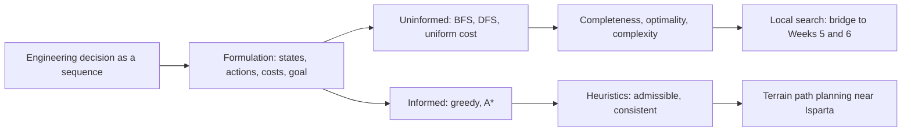
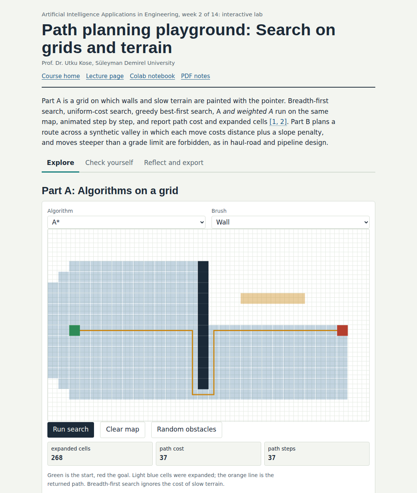
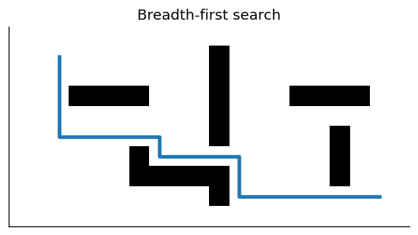
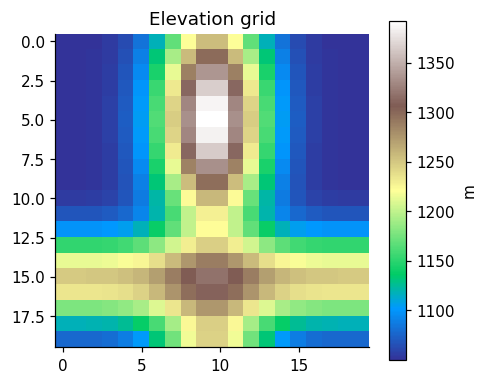

<div align="center">

# Week 02: Problem Solving by Search: Routes, Plans and Paths

**Artificial Intelligence Applications in Engineering (MUH-920 Mühendislikte Yapay Zeka Uygulamaları)**  
Prof. Dr. Utku Kose, Süleyman Demirel University

[](https://colab.research.google.com/github/utkukose/ai-applications-in-engineering-NB-lecture/blob/main/weeks/week-02/NB02_search_and_planning.ipynb) [](https://utkukose.github.io/ai-applications-in-engineering-NB-lecture/weeks/week-02/lab.html) [](https://utkukose.github.io/ai-applications-in-engineering-NB-lecture/weeks/week-02/lecture.html) [](Week02_Lecture_Notes.pdf)

</div>

## Overview

Many engineering decisions are sequences: the route of a truck, the order of drilling holes, the moves of a crane or the path of a pipeline across a valley. Search turns such decisions into the exploration of a state space and finds a sequence of actions that reaches a goal at least cost [1, 6]. This week formulates problems as state spaces, compares uninformed search with heuristic search, proves why A* returns optimal paths when its heuristic never overestimates, and applies the ideas to path planning for vehicles on real terrain near Isparta [2, 5, 9].

**Estimated study time:** 8 to 10 hours.

## Learning outcomes

By the end of the week, students are expected to formulate an engineering task as a search problem with states, actions, transition model, goal test and path cost, to trace breadth-first search, uniform-cost search and A* by hand, to judge whether a heuristic is admissible and consistent, to explain the effect of a heuristic on the number of expanded nodes, and to implement grid path planning with terrain costs in Python.

## Python in this week

The lecture ends with Python step 2: Lists, tuples and loops. It covers lists, tuples, for and while loops, sets and a first queue, applied to routes and grid maps like those searched in this week [12]. The hands-on part of the notebook opens with the same step as runnable cells and short exercises with immediate feedback, and its later sections mark further constructs as Python moves.

## Study path

| Step | Activity | Suggested time |
|---|---|---|
| 1 | Read the lecture with its animations on the [lecture page](https://utkukose.github.io/ai-applications-in-engineering-NB-lecture/weeks/week-02/lecture.html), or read the [PDF version](Week02_Lecture_Notes.pdf) | 2 hours |
| 2 | Explore the [interactive lab](https://utkukose.github.io/ai-applications-in-engineering-NB-lecture/weeks/week-02/lab.html) | 1 hour |
| 3 | Study the Python step at the end of the lecture, then run the same step at the start of the hands-on part of the [Colab notebook](https://colab.research.google.com/github/utkukose/ai-applications-in-engineering-NB-lecture/blob/main/weeks/week-02/NB02_search_and_planning.ipynb) | 1 hour |
| 4 | Work through the rest of the notebook, including its Python moves and exercises | 3 hours |
| 5 | Solve the discipline challenge of your department | 1 hour |
| 6 | Take the self-assessment in the lab (tab: Check yourself) | 20 minutes |
| 7 | Write the reflection, export the learning log and complete the weekly task | 1 hour |

## Week at a glance



## Lecture

### Problems as state spaces

A search problem has five parts [1]. The initial state describes where the agent starts. The actions available in a state say what the agent can do. The transition model gives the state that results from an action. The goal test decides whether a state solves the problem, and the path cost adds up the cost of the actions along a sequence. A solution is a sequence of actions from the initial state to a goal state, and an optimal solution has the lowest path cost among all solutions.

The formulation is an engineering decision in its own right. For a haul truck in an open-pit mine, a state can be a node of the road network, and the path cost can be travel time, fuel or tyre wear. For a mobile robot in a factory, the state can be a cell of an occupancy grid, which divides the floor into squares that are free or blocked [2]. For a crane that stacks containers, the state is the arrangement of all containers, and the number of states grows combinatorially. A good formulation keeps only the details that matter for the decision: A route planner for a truck does not need the colour of the truck, but it may need the slope of every road segment.

<details>
<summary><b>Check your understanding.</b> A planner chooses the order in which a laser cutter visits 60 contours on a steel sheet. What is a natural state in the formulation?</summary>

A. The colour of the steel sheet  
B. The set of contours already cut together with the current position of the cutting head  
C. The electrical power of the laser only  
D. The final cutting plan

**Answer: B.** The future cost depends on which contours remain and where the head is, so both belong in the state.

</details>

### Uninformed search: Breadth first, depth first and uniform cost

Uninformed strategies know nothing about the goal beyond the goal test. They differ only in the order in which they expand nodes of the search tree. Breadth-first search expands the shallowest node first by keeping the frontier in a first-in first-out queue. It finds the solution with the fewest actions, which is optimal when every action has the same cost. Depth-first search expands the deepest node first with a last-in first-out stack, needs little memory, but may wander along an infinite branch and does not guarantee the shortest solution. Iterative deepening repeats depth-limited search with growing limits and combines the memory use of depth-first search with the completeness of breadth-first search [3].

When actions have different costs, the fewest actions is not the cheapest path. Uniform-cost search expands the node with the lowest path cost so far, which is Dijkstra's algorithm on an explicit graph [4]. It is optimal for non-negative costs, because a node is expanded only when no cheaper route to it can exist.

The price of uninformed search is growth. With branching factor b and solution depth d, breadth-first search may generate on the order of b to the power d nodes. On a grid with four moves and a goal forty steps away, blind search explores almost every reachable cell within that radius. The number becomes unmanageable for combinatorial problems such as sequencing: Twenty jobs can be ordered in more than two quintillion ways.

![Growth of the number of nodes in a complete search tree with branching factor b. Uninformed search must be guided or limited when b or d is large [1].](figures/w02_fig1.png)

*Figure 2.1. Growth of the number of nodes in a complete search tree with branching factor b. Uninformed search must be guided or limited when b or d is large [1].*

<details>
<summary><b>Check your understanding.</b> Road segments of a network have different travel times. Which strategy returns the fastest route without extra knowledge about the goal?</summary>

A. Breadth-first search  
B. Depth-first search  
C. Uniform-cost search  
D. Random walk

**Answer: C.** Uniform-cost search, Dijkstra's algorithm, expands the node with the lowest accumulated cost, so it is optimal for non-negative costs.

</details>

### Informed search: Heuristics and A*

A heuristic function h(n) estimates the cost from node n to the nearest goal. Greedy best-first search expands the node with the smallest h and often reaches a goal quickly, but it can be misled into long detours. A* combines the cost already paid, g(n), with the estimate, and expands the node with the smallest f(n) = g(n) + h(n) [5].

Hart, Nilsson and Raphael showed that A* returns an optimal path if the heuristic is admissible, which means it never overestimates the true remaining cost [5]. The straight-line distance is admissible for road travel, because no road is shorter than a straight line. On a grid with four moves, the Manhattan distance, the sum of horizontal and vertical offsets, is admissible. A heuristic is consistent when its estimate never drops by more than the cost of one step. Consistency implies admissibility and guarantees that A* never needs to reopen a node [6].

Better heuristics save work. If one admissible heuristic is always at least as large as another, A* with the larger one expands no more nodes. The zero heuristic turns A* into uniform-cost search, and a perfect heuristic walks straight to the goal. Weighted A* multiplies the heuristic by a factor larger than one: It usually expands far fewer nodes and returns a path whose cost is at most that factor times the optimum, which is a common engineering compromise when planning must meet a deadline.

> **Animation: Breadth-first search and A* on the same map.** Both searches start at the green cell and look for the red cell. Blue cells have been expanded. Compare how many cells each algorithm expands before it finds a path of the same length. Run it in the [web version of the lecture](https://utkukose.github.io/ai-applications-in-engineering-NB-lecture/weeks/week-02/lecture.html#anim-grid).

![Expanded cells of breadth-first search and A* with the Manhattan heuristic on the same grid. Both return a shortest path, but A* expands far fewer cells [5].](figures/w02_fig2.png)

*Figure 2.2. Expanded cells of breadth-first search and A* with the Manhattan heuristic on the same grid. Both return a shortest path, but A* expands far fewer cells [5].*

<details>
<summary><b>Check your understanding.</b> Which heuristic is admissible for a robot that moves on a grid with four moves of cost 1?</summary>

A. Twice the Manhattan distance  
B. The Manhattan distance  
C. The number of obstacles on the map  
D. The square of the Euclidean distance

**Answer: B.** The Manhattan distance is the length of a path without obstacles, so it can never exceed the true remaining cost.

</details>

### Path planning for vehicles and machines

Path planning in engineering adds physical constraints to graph search. Occupancy grids and road graphs give the search space, while costs encode travel time, energy, risk or wear [2]. Vehicles cannot turn on the spot, so planners for cars and trucks search over positions and headings. Hybrid A* keeps continuous positions inside discrete cells and has been used to park and manoeuvre autonomous vehicles in unstructured environments such as parking lots [7]. Surveys of self-driving urban vehicles place such graph-search planners next to sampling-based and optimisation-based methods [8].

Terrain adds cost and feasibility. A haul road in a mine, a pipeline or a forest road must respect a maximum grade, and steep segments cost more fuel and time. A digital elevation model turns the terrain into a grid of heights, and the cost of moving between two cells can combine distance with a penalty on slope and a hard limit above which the move is forbidden. The notebook applies this idea to a real elevation grid near Isparta from the Copernicus GLO-90 model, served by the Open-Meteo Elevation API [9, 10].

### Beyond systematic search: Local search

Systematic search remembers the paths it explores. Local search keeps only a current solution and improves it by small changes, which suits problems where the path does not matter and only the final configuration counts, such as a layout or a schedule. Hill climbing accepts only improvements and stops at the first local optimum. Simulated annealing sometimes accepts worse solutions, with a probability that falls as a temperature parameter is lowered, and can therefore escape local optima [11]. Weeks 5 and 6 develop this line into evolutionary and swarm algorithms, which keep a population of candidate solutions instead of one.

<details>
<summary><b>Check your understanding.</b> Why can simulated annealing escape a local optimum where hill climbing stops?</summary>

A. It evaluates every possible solution  
B. It sometimes accepts a worse solution, with a probability that decreases over time  
C. It uses the gradient of the objective  
D. It always restarts from the best known solution

**Answer: B.** Occasional uphill moves in cost let the search leave the basin of a local optimum early in the run.

</details>

<!-- python-step -->

### Python step 2: Lists, tuples and loops

#### Lists

A list holds several values in a fixed order and is written in square brackets. Positions are counted from 0, so `heights_m[0]` is the first element, and negative positions count from the end. A slice such as `heights_m[2:5]` returns the elements at positions 2, 3 and 4: The start is included and the stop is excluded. Lists can grow with `append`, and `len`, `min`, `max` and `sum` work on any list of numbers. The list below holds the ground elevation of successive cells along a planned route.

```python
heights_m = [1012, 1018, 1031, 1047, 1040, 1066, 1080]
print(len(heights_m), heights_m[0], heights_m[-1])
print(heights_m[2:5])
heights_m.append(1093)
print(max(heights_m) - min(heights_m), "m between the lowest and the highest cell")
```

*Output*

```text
7 1012 1080
[1031, 1047, 1040]
81 m between the lowest and the highest cell
```

#### Loops over lists

A `for` loop can run over the elements of a list directly or over positions produced by `range`. The loop below adds up all rises between neighbouring cells, which gives the total climb that a vehicle must make. The operator `+=` adds to a variable in place. The function `enumerate` supplies position and value together, which is often clearer than indexing by hand.

```python
total_climb = 0
for i in range(1, len(heights_m)):
    rise = heights_m[i] - heights_m[i - 1]
    if rise > 0:
        total_climb += rise
print("total climb:", total_climb, "m")
for i, h in enumerate(heights_m[:3]):
    print("cell", i, "is at", h, "m")
```

*Output*

```text
total climb: 88 m
cell 0 is at 1012 m
cell 1 is at 1018 m
cell 2 is at 1031 m
```

#### Grids and tuples

A map for path planning can be written as a list of strings, one string per row, with `#` marking obstacles. `grid[r][c]` then reads the character in row r and column c. A cell is naturally described by a tuple `(row, column)`. Tuples are written with parentheses and, unlike lists, cannot be changed after creation, which suits fixed coordinates. Two nested loops visit every cell, and unpacking assigns the parts of a tuple to separate names.

```python
grid = ["S..#....",
        ".#.#.##.",
        ".#...#..",
        "...#...G"]
rows, cols = len(grid), len(grid[0])
for r in range(rows):
    for c in range(cols):
        if grid[r][c] == "S":
            start = (r, c)
        elif grid[r][c] == "G":
            goal = (r, c)
print("start", start, "goal", goal)
r, c = goal
print("the goal is in row", r, "and column", c)
```

*Output*

```text
start (0, 0) goal (3, 7)
the goal is in row 3 and column 7
```

The neighbours of a cell follow from four moves. A move is valid when it stays inside the map and does not enter an obstacle, and every valid neighbour is appended to a list.

```python
moves = [(-1, 0), (1, 0), (0, -1), (0, 1)]    # up, down, left, right
cell = (1, 2)
free_neighbours = []
for dr, dc in moves:
    nr, nc = cell[0] + dr, cell[1] + dc
    if 0 <= nr < rows and 0 <= nc < cols and grid[nr][nc] != "#":
        free_neighbours.append((nr, nc))
print(free_neighbours)
```

*Output*

```text
[(0, 2), (2, 2)]
```

#### While loops, sets and a queue

A `while` loop repeats as long as its condition holds, which suits searches whose length is not known in advance. Breadth-first search keeps a queue of cells to explore: New cells join at the back, and the next cell to expand leaves from the front. `collections.deque` provides such a queue with `append` and `popleft`. A set, written with braces, stores the cells already seen and answers membership questions such as `nxt not in visited` quickly. A dictionary `parent` records from which cell each cell was reached; Week 3 explains dictionaries in detail. The statement `break` leaves a loop early.

```python
from collections import deque

frontier = deque([start])
visited = {start}
parent = {start: None}
while frontier:                 # an empty queue counts as False
    cell = frontier.popleft()
    if cell == goal:
        break
    for dr, dc in moves:
        nxt = (cell[0] + dr, cell[1] + dc)
        inside = 0 <= nxt[0] < rows and 0 <= nxt[1] < cols
        if inside and grid[nxt[0]][nxt[1]] != "#" and nxt not in visited:
            visited.add(nxt)
            parent[nxt] = cell
            frontier.append(nxt)

path = []
while cell is not None:
    path.append(cell)
    cell = parent[cell]
path.reverse()
print(len(path) - 1, "moves:", path)
```

*Output*

```text
10 moves: [(0, 0), (0, 1), (0, 2), (1, 2), (2, 2), (2, 3), (2, 4), (3, 4), (3, 5), (3, 6), (3, 7)]
```

The second `while` loop walks back from the goal through the recorded parents until it reaches the start, whose parent is `None`, and `reverse` puts the path in travel order. The notebook of this week extends the same pattern with a priority queue for A*.

<details>
<summary><b>Check your understanding.</b> After heights = [5, 7, 9, 11], what does print(heights[1:3], heights[-1]) display?</summary>

A. [7, 9] 11  
B. [5, 7, 9] 11  
C. [7, 9, 11] 5  
D. [7, 9] 9

**Answer: A.** The slice includes position 1 and stops before position 3, and position -1 is the last element.

</details>

<!-- /python-step -->

## Discipline challenges

Each row names a search problem from one department. Write its formulation and propose a heuristic, then decide whether systematic search, weighted search or local search suits its size.

| Department | Challenge |
|---|---|
| Mining Engineering | Haul-road routing between a loading point and the crusher with a maximum grade and a fuel cost per metre of climb. |
| Civil Engineering | Corridor selection for a road or pipeline across a digital elevation model with slope and land-use costs. |
| Industrial Engineering | Order of picking items in a warehouse aisle system to minimise walking distance. |
| Electrical and Electronics Engineering | Routing a cable harness or a printed-circuit trace around keep-out zones. |
| Mechanical Engineering | Collision-free path of a robot arm tool point between two fixtures. |
| Automotive Engineering | Parking manoeuvre planning with position and heading states, as in hybrid A*. |
| Computer Engineering | Shortest route of packets in a network with link delays as costs. |
| Geological Engineering and Earth Sciences Engineering | Field survey route that visits outcrops on steep terrain with limited walking time. |
| Chemistry and Chemical Engineering | Reaction route from a starting compound to a target through known transformations with yields as costs. |
| Mathematics | Proof that consistency implies admissibility, and a counterexample in which an inadmissible heuristic misleads A*. |

## Interactive lab

Part A is a grid on which walls and slow terrain are painted with the pointer. Breadth-first search, uniform-cost search, greedy best-first search, A* and weighted A* run on the same map, animated step by step, and report path cost and expanded cells [4, 5]. Part B plans a route across a synthetic valley in which each move costs distance plus a slope penalty, and moves steeper than a grade limit are forbidden, as in haul-road and pipeline design.

[Open the interactive lab](https://utkukose.github.io/ai-applications-in-engineering-NB-lecture/weeks/week-02/lab.html)



## Colab notebook

The notebook implements breadth-first search, uniform-cost search and A* from scratch on occupancy grids, counts expanded cells for different heuristics, and then plans a route across real terrain near Isparta. The elevation grid comes from the Copernicus GLO-90 digital elevation model through the Open-Meteo Elevation API [9, 10], and the cost of each move combines distance, a slope penalty and a grade limit.

[](https://colab.research.google.com/github/utkukose/ai-applications-in-engineering-NB-lecture/blob/main/weeks/week-02/NB02_search_and_planning.ipynb)

Screenshots of the executed notebook:





## Self-assessment and reflection

The lab contains a 6-question self-assessment with instant feedback and a confidence rating for each answer. A confident but wrong answer marks the first topic to revisit. The reflection prompts below are also available in the lab, where answers are saved in the browser and can be exported as a learning log.

1. Name one decision in your field that is a sequence of actions. What would the states, actions and path cost be?
2. When would an engineer accept a slightly longer path in exchange for a much faster planner, as with weighted A*?
3. Which Python data structure from this week (tuple, dictionary, set, deque, heap) do you expect to use again, and for what?

## Weekly task and submission

Formulate one search problem from your department with states, actions, transition model, goal test and path cost, and justify an admissible heuristic for it in about 400 words. Then run the terrain planner of the notebook with two different slope penalties and report how path length, total climb and expanded cells change. Cite at least three works from this week's references [1, 2, 5].

The weekly task is optional and supports self-learning and a personal portfolio. During an active semester, it can be sent together with the exported learning log to utkukose@sdu.edu.tr or utkukose@gmail.com. Optional work carries no separate weight, but the instructor may take it into account as a discretionary adjustment of the midterm component of the grade.

## Research and report assignment (optional)

**Path planning in practice.** Review how path planning is done in one application area: autonomous haul trucks in mining, pipeline or road route selection on digital elevation models, or motion planning for automated vehicles. Compare graph-search planners with sampling-based or optimisation-based planners and discuss the constraints of the vehicle and the terrain [2, 7, 8].

This research assignment is optional and supports self-learning. When the related weeks are followed within the course during an active semester, the report can be sent to utkukose@sdu.edu.tr or utkukose@gmail.com. It carries no separate weight, but the instructor may take it into account as a discretionary adjustment of the midterm component of the grade. Unless the assignment states otherwise, a report has 1500 to 2500 words, follows the structure of an academic paper, cites at least six scholarly or official sources in square brackets and uses the template in `exams/REPORT_TEMPLATE.md`.

## References

[1] Russell, S., & Norvig, P. (2021). *Artificial Intelligence: A Modern Approach* (4th ed.). Pearson.

[2] LaValle, S. M. (2006). *Planning Algorithms*. Cambridge University Press. <https://doi.org/10.1017/CBO9780511546877>

[3] Korf, R. E. (1985). Depth-first iterative-deepening: An optimal admissible tree search. *Artificial Intelligence*, *27*(1), 97-109. <https://doi.org/10.1016/0004-3702(85)90084-0>

[4] Dijkstra, E. W. (1959). A note on two problems in connexion with graphs. *Numerische Mathematik*, *1*, 269-271. <https://doi.org/10.1007/BF01386390>

[5] Hart, P. E., Nilsson, N. J., & Raphael, B. (1968). A formal basis for the heuristic determination of minimum cost paths. *IEEE Transactions on Systems Science and Cybernetics*, *4*(2), 100-107. <https://doi.org/10.1109/TSSC.1968.300136>

[6] Pearl, J. (1984). *Heuristics: Intelligent Search Strategies for Computer Problem Solving*. Addison-Wesley.

[7] Dolgov, D., Thrun, S., Montemerlo, M., & Diebel, J. (2010). Path planning for autonomous vehicles in unknown semi-structured environments. *The International Journal of Robotics Research*, *29*(5), 485-501. <https://doi.org/10.1177/0278364909359210>

[8] Paden, B., Čáp, M., Yong, S. Z., Yershov, D., & Frazzoli, E. (2016). A survey of motion planning and control techniques for self-driving urban vehicles. *IEEE Transactions on Intelligent Vehicles*, *1*(1), 33-55. <https://doi.org/10.1109/TIV.2016.2578706>

[9] European Space Agency (2021). *Copernicus Global Digital Elevation Model (GLO-90)*. <https://doi.org/10.5270/ESA-c5d3d65>

[10] Open-Meteo (2026). *Open-Meteo free weather API: Historical Weather API and Elevation API (data licensed under CC BY 4.0)*. <https://open-meteo.com>

[11] Kirkpatrick, S., Gelatt, C. D., & Vecchi, M. P. (1983). Optimization by simulated annealing. *Science*, *220*(4598), 671-680. <https://doi.org/10.1126/science.220.4598.671>

[12] Python Software Foundation (2026). *The Python Tutorial (Python 3 documentation)*. <https://docs.python.org/3/tutorial/>

---

<sub>Artificial Intelligence Applications in Engineering. Prof. Dr. Utku Kose, Süleyman Demirel University. ORCID [0000-0002-9652-6415](https://orcid.org/0000-0002-9652-6415). Content licensed under CC BY 4.0, code under MIT. This course is updated in line with current developments in the field. Last update: September 2026.</sub>
