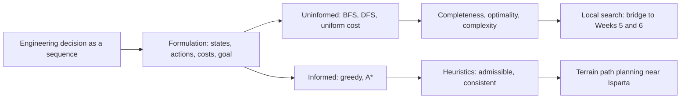

# Week 02: Problem Solving by Search: Routes, Plans and Paths

**Artificial Intelligence Applications in Engineering (MUH-920 Mühendislikte Yapay Zeka Uygulamaları)** Prof. Dr. Utku Kose, Süleyman Demirel University

   

[Week 1](../week-01/README.md) | [All weeks](../../README.md#weekly-schedule) | [Week 3](../week-03/README.md)

## Overview

Many engineering decisions are sequences: the route of a truck, the order of drilling holes, the moves of a crane or the path of a pipeline across a valley. Search turns such decisions into the exploration of a state space and finds a sequence of actions that reaches a goal at least cost [1, 2]. This week formulates problems as state spaces, compares uninformed search with heuristic search, proves why A* returns optimal paths when its heuristic never overestimates, and applies the ideas to path planning for vehicles on real terrain near Isparta [3, 4, 5].

**Estimated study time:** 8 to 10 hours.

## Learning outcomes

By the end of the week, students are expected to formulate an engineering task as a search problem with states, actions, transition model, goal test and path cost, to trace breadth-first search, uniform-cost search and A* by hand, to judge whether a heuristic is admissible and consistent, to explain the effect of a heuristic on the number of expanded nodes, and to implement grid path planning with terrain costs in Python.

## Week at a glance

## Materials of the week

| Material | What it contains | Link |
|---|---|---|
| Lecture page | Five sections with four knowledge checks, an animation, a figure and six review cards | [Open the lecture page](https://utkukose.github.io/ai-applications-in-engineering-NB-lecture/weeks/week-02/lecture.html) |
| Lecture notes | The printable version of the week: the lecture with Python step 2 and the outputs of its code, followed by the discipline challenges and the tasks | [Open the PDF](Week02_Lecture_Notes.pdf) |
| Interactive lab | *Path planning playground: Search on grids and terrain*, with a self-assessment of six questions, three reflection prompts and an exportable learning log | [Open the lab](https://utkukose.github.io/ai-applications-in-engineering-NB-lecture/weeks/week-02/lab.html) |
| Colab notebook | Python step 2: Lists, tuples and loops, followed by five hands-on sections with exercises and immediate feedback | [Open in Colab](https://colab.research.google.com/github/utkukose/ai-applications-in-engineering-NB-lecture/blob/main/weeks/week-02/NB02_search_and_planning.ipynb), [view on GitHub](NB02_search_and_planning.ipynb) |

## Contents

| Lecture page | Colab notebook |
|---|---|
| [Problems as state spaces](https://utkukose.github.io/ai-applications-in-engineering-NB-lecture/weeks/week-02/lecture.html#problems-as-state-spaces) | [Python step 2: Lists, tuples and loops](https://colab.research.google.com/github/utkukose/ai-applications-in-engineering-NB-lecture/blob/main/weeks/week-02/NB02_search_and_planning.ipynb#scrollTo=python-step) |
| [Uninformed search: Breadth first, depth first and uniform cost](https://utkukose.github.io/ai-applications-in-engineering-NB-lecture/weeks/week-02/lecture.html#uninformed-search-breadth-first-depth-first-and-uniform-cost) | [1. A factory floor as an occupancy grid](https://colab.research.google.com/github/utkukose/ai-applications-in-engineering-NB-lecture/blob/main/weeks/week-02/NB02_search_and_planning.ipynb#scrollTo=section-1) |
| [Informed search: Heuristics and A*](https://utkukose.github.io/ai-applications-in-engineering-NB-lecture/weeks/week-02/lecture.html#informed-search-heuristics-and-a) | [2. Neighbours and breadth-first search](https://colab.research.google.com/github/utkukose/ai-applications-in-engineering-NB-lecture/blob/main/weeks/week-02/NB02_search_and_planning.ipynb#scrollTo=section-2) |
| [Path planning for vehicles and machines](https://utkukose.github.io/ai-applications-in-engineering-NB-lecture/weeks/week-02/lecture.html#path-planning-for-vehicles-and-machines) | [3. A* with a priority queue](https://colab.research.google.com/github/utkukose/ai-applications-in-engineering-NB-lecture/blob/main/weeks/week-02/NB02_search_and_planning.ipynb#scrollTo=section-3) |
| [Beyond systematic search: Local search](https://utkukose.github.io/ai-applications-in-engineering-NB-lecture/weeks/week-02/lecture.html#beyond-systematic-search-local-search) | [4. Real terrain near Isparta](https://colab.research.google.com/github/utkukose/ai-applications-in-engineering-NB-lecture/blob/main/weeks/week-02/NB02_search_and_planning.ipynb#scrollTo=section-4) |
| [Review cards](https://utkukose.github.io/ai-applications-in-engineering-NB-lecture/weeks/week-02/lecture.html#review-cards) | [5. Terrain-aware A*](https://colab.research.google.com/github/utkukose/ai-applications-in-engineering-NB-lecture/blob/main/weeks/week-02/NB02_search_and_planning.ipynb#scrollTo=section-5) |

## Study path

| Step | Activity | Suggested time |
|---|---|---|
| 1 | Read the [lecture page](https://utkukose.github.io/ai-applications-in-engineering-NB-lecture/weeks/week-02/lecture.html) and answer its knowledge checks, or read the [PDF notes](Week02_Lecture_Notes.pdf) | 2 hours |
| 2 | Explore the simulation of the [interactive lab](https://utkukose.github.io/ai-applications-in-engineering-NB-lecture/weeks/week-02/lab.html#explore) | 1 hour |
| 3 | Work through [Python step 2](https://colab.research.google.com/github/utkukose/ai-applications-in-engineering-NB-lecture/blob/main/weeks/week-02/NB02_search_and_planning.ipynb#scrollTo=python-step) at the start of the Colab notebook | 1 hour |
| 4 | Continue with the hands-on sections of the [notebook](https://colab.research.google.com/github/utkukose/ai-applications-in-engineering-NB-lecture/blob/main/weeks/week-02/NB02_search_and_planning.ipynb) and their exercises | 3 hours |
| 5 | Solve the [discipline challenge](#discipline-challenges) of your department | 1 hour |
| 6 | Take the [self-assessment](https://utkukose.github.io/ai-applications-in-engineering-NB-lecture/weeks/week-02/lab.html#check) in the lab | 20 minutes |
| 7 | Answer the [reflection prompts](https://utkukose.github.io/ai-applications-in-engineering-NB-lecture/weeks/week-02/lab.html#reflect), export the learning log and complete the [weekly task](#weekly-task) | 1 hour |

## Preview

<table><tr><td colspan="2"> Interactive lab: Path planning playground: Search on grids and terrain</td></tr><tr><td width="50%"></td><td width="50%"></td></tr><tr><td colspan="2">Outputs of the executed Colab notebook</td></tr></table>

## Discipline challenges

Each row names a search problem from one department. Write its formulation and propose a heuristic, then decide whether systematic search, weighted search or local search suits its size.

| Department | Challenge |
|---|---|
| Mining Engineering | Haul-road routing between a loading point and the crusher with a maximum grade and a fuel cost per metre of climb. |
| Civil Engineering | Corridor selection for a road or pipeline across a digital elevation model with slope and land-use costs. |
| Industrial Engineering | Order of picking items in a warehouse aisle system to minimise walking distance. |
| Electrical and Electronics Engineering | Routing a cable harness or a printed-circuit trace around keep-out zones. |
| Mechanical Engineering | Collision-free path of a robot arm tool point between two fixtures. |
| Automotive Engineering | Parking manoeuvre planning with position and heading states, as in hybrid A*. |
| Computer Engineering | Shortest route of packets in a network with link delays as costs. |
| Geological Engineering and Earth Sciences Engineering | Field survey route that visits outcrops on steep terrain with limited walking time. |
| Chemistry and Chemical Engineering | Reaction route from a starting compound to a target through known transformations with yields as costs. |
| Mathematics | Proof that consistency implies admissibility, and a counterexample in which an inadmissible heuristic misleads A*. |

## Weekly task

Formulate one search problem from your department with states, actions, transition model, goal test and path cost, and justify an admissible heuristic for it in about 400 words. Then run the terrain planner of the notebook with two different slope penalties and report how path length, total climb and expanded cells change. Cite at least three works from this week's references [1, 3, 4].

## Research and report assignment (optional)

**Path planning in practice.** Review how path planning is done in one application area: autonomous haul trucks in mining, pipeline or road route selection on digital elevation models, or motion planning for automated vehicles. Compare graph-search planners with sampling-based or optimisation-based planners and discuss the constraints of the vehicle and the terrain [3, 6, 7].

Both assignments are optional. During an active semester, the weekly task can be sent together with the exported learning log, and the research report on its own, to utkukose@sdu.edu.tr or utkukose@gmail.com. They carry no separate weight, but the instructor may take them into account as a discretionary adjustment of the midterm component of the grade. The [assessment section of the syllabus](../../SYLLABUS.md#assessment) gives the details, and research reports follow the [report template](../../exams/REPORT_TEMPLATE.md).

## References

[1] Russell, S., & Norvig, P. (2021). *Artificial Intelligence: A Modern Approach* (4th ed.). Pearson.

[2] Pearl, J. (1984). *Heuristics: Intelligent Search Strategies for Computer Problem Solving*. Addison-Wesley.

[3] LaValle, S. M. (2006). *Planning Algorithms*. Cambridge University Press. <https://doi.org/10.1017/CBO9780511546877>

[4] Hart, P. E., Nilsson, N. J., & Raphael, B. (1968). A formal basis for the heuristic determination of minimum cost paths. *IEEE Transactions on Systems Science and Cybernetics*, *4*(2), 100-107. <https://doi.org/10.1109/TSSC.1968.300136>

[5] European Space Agency (2021). *Copernicus Global Digital Elevation Model (GLO-90)*. <https://doi.org/10.5270/ESA-c5d3d65>

[6] Dolgov, D., Thrun, S., Montemerlo, M., & Diebel, J. (2010). Path planning for autonomous vehicles in unknown semi-structured environments. *The International Journal of Robotics Research*, *29*(5), 485-501. <https://doi.org/10.1177/0278364909359210>

[7] Paden, B., Čáp, M., Yong, S. Z., Yershov, D., & Frazzoli, E. (2016). A survey of motion planning and control techniques for self-driving urban vehicles. *IEEE Transactions on Intelligent Vehicles*, *1*(1), 33-55. <https://doi.org/10.1109/TIV.2016.2578706>

---

Artificial Intelligence Applications in Engineering. Prof. Dr. Utku Kose, Süleyman Demirel University. ORCID [0000-0002-9652-6415](https://orcid.org/0000-0002-9652-6415). Content licensed under CC BY 4.0, code under MIT. This course is updated in line with current developments in the field. Last update: October 2026.
