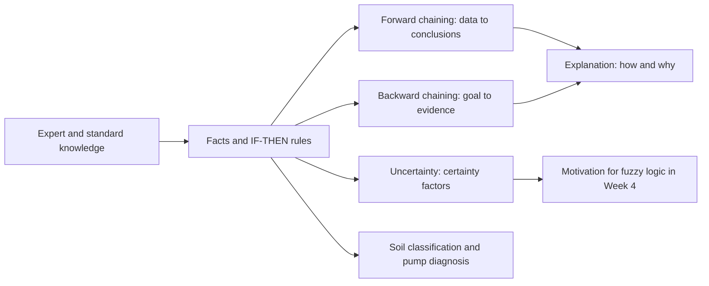
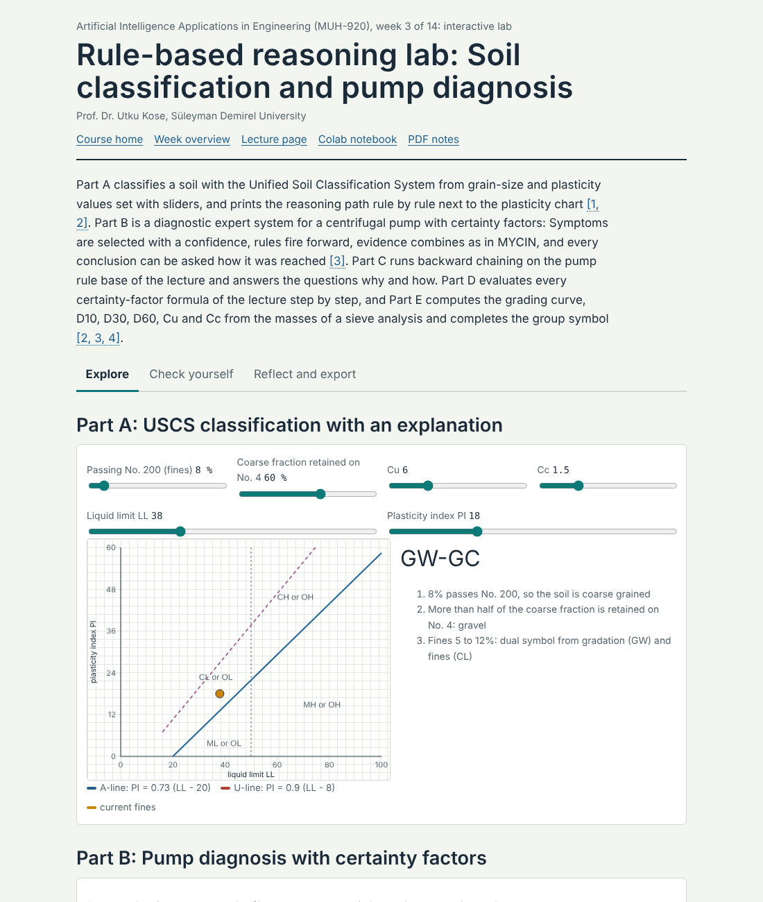
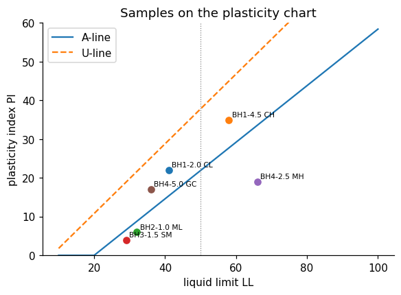

# Week 03: Knowledge, Rules and Expert Systems

**Artificial Intelligence Applications in Engineering (MUH-920 Mühendislikte Yapay Zeka Uygulamaları)** Prof. Dr. Utku Kose, Süleyman Demirel University

   

[Week 2](../week-02/README.md) | [All weeks](../../README.md#weekly-schedule) | [Week 4](../week-04/README.md)

## Overview

Before machine learning dominated the field, artificial intelligence reached industry through expert systems: programs that store the knowledge of specialists as rules and draw conclusions with an inference engine [1, 2]. DENDRAL inferred molecular structures, MYCIN recommended antibiotics and R1 configured computer orders for a manufacturer [3, 4, 5]. Engineering is full of explicit knowledge in the same form: standards, codes, classification systems and diagnostic procedures. This week builds a small rule engine, applies it to the Unified Soil Classification System and to pump diagnosis, and discusses why transparent rules remain valuable next to learned models [6, 7].

**Estimated study time:** 8 to 10 hours.

## Learning outcomes

By the end of the week, students are expected to represent engineering knowledge as facts and IF-THEN rules, to trace forward and backward chaining by hand, to explain how an expert system justifies its conclusions, to combine certainty factors, to encode a standard classification procedure as a rule base, and to name the strengths and limits of knowledge-based systems.

## Week at a glance

## Materials of the week

| Material | What it contains | Link |
|---|---|---|
| Lecture page | Six sections with formulas, seven worked examples, four knowledge checks, an animation, a figure and six review cards | [Open the lecture page](https://utkukose.github.io/ai-applications-in-engineering-NB-lecture/weeks/week-03/lecture.html) |
| Lecture notes | The printable version of the week: the lecture with its formulas and worked examples, Python step 3 and the outputs of its code, followed by the discipline challenges and the tasks | [Open the PDF](Week03_Lecture_Notes.pdf) |
| Interactive lab | *Rule-based reasoning lab: Soil classification and pump diagnosis*, with five interactive parts, a self-assessment of six questions, three reflection prompts and an exportable learning log | [Open the lab](https://utkukose.github.io/ai-applications-in-engineering-NB-lecture/weeks/week-03/lab.html) |
| Colab notebook | Python step 3: Dictionaries and functions, followed by six hands-on sections with exercises and immediate feedback | [Open in Colab](https://colab.research.google.com/github/utkukose/ai-applications-in-engineering-NB-lecture/blob/main/weeks/week-03/NB03_rule_based_systems.ipynb), [view on GitHub](NB03_rule_based_systems.ipynb) |

## Contents

| Lecture page | Colab notebook |
|---|---|
| [Knowledge-based systems](https://utkukose.github.io/ai-applications-in-engineering-NB-lecture/weeks/week-03/lecture.html#knowledge-based-systems) | [Python step 3: Dictionaries and functions](https://colab.research.google.com/github/utkukose/ai-applications-in-engineering-NB-lecture/blob/main/weeks/week-03/NB03_rule_based_systems.ipynb#scrollTo=python-step) |
| [Facts, rules and logic](https://utkukose.github.io/ai-applications-in-engineering-NB-lecture/weeks/week-03/lecture.html#facts-rules-and-logic) | [1. A knowledge base as a list of dictionaries](https://colab.research.google.com/github/utkukose/ai-applications-in-engineering-NB-lecture/blob/main/weeks/week-03/NB03_rule_based_systems.ipynb#scrollTo=section-1) |
| [Forward and backward chaining](https://utkukose.github.io/ai-applications-in-engineering-NB-lecture/weeks/week-03/lecture.html#forward-and-backward-chaining) | [2. Forward chaining with a trace](https://colab.research.google.com/github/utkukose/ai-applications-in-engineering-NB-lecture/blob/main/weeks/week-03/NB03_rule_based_systems.ipynb#scrollTo=section-2) |
| [Explanation and uncertainty](https://utkukose.github.io/ai-applications-in-engineering-NB-lecture/weeks/week-03/lecture.html#explanation-and-uncertainty) | [3. Backward chaining with recursion](https://colab.research.google.com/github/utkukose/ai-applications-in-engineering-NB-lecture/blob/main/weeks/week-03/NB03_rule_based_systems.ipynb#scrollTo=section-3) |
| [Engineering standards as rule bases: The Unified Soil Classification System](https://utkukose.github.io/ai-applications-in-engineering-NB-lecture/weeks/week-03/lecture.html#engineering-standards-as-rule-bases-the-unified-soil-classification-system) | [4. Certainty factors](https://colab.research.google.com/github/utkukose/ai-applications-in-engineering-NB-lecture/blob/main/weeks/week-03/NB03_rule_based_systems.ipynb#scrollTo=section-4) |
| [Strengths and limits](https://utkukose.github.io/ai-applications-in-engineering-NB-lecture/weeks/week-03/lecture.html#strengths-and-limits) | [5. The Unified Soil Classification System as rules](https://colab.research.google.com/github/utkukose/ai-applications-in-engineering-NB-lecture/blob/main/weeks/week-03/NB03_rule_based_systems.ipynb#scrollTo=section-5) |
| [Review cards](https://utkukose.github.io/ai-applications-in-engineering-NB-lecture/weeks/week-03/lecture.html#review-cards) | [6. Classifying a table of laboratory results](https://colab.research.google.com/github/utkukose/ai-applications-in-engineering-NB-lecture/blob/main/weeks/week-03/NB03_rule_based_systems.ipynb#scrollTo=section-6) |

## Study path

| Step | Activity | Suggested time |
|---|---|---|
| 1 | Read the [lecture page](https://utkukose.github.io/ai-applications-in-engineering-NB-lecture/weeks/week-03/lecture.html) and answer its knowledge checks, or read the [PDF notes](Week03_Lecture_Notes.pdf) | 2 hours |
| 2 | Explore the simulation of the [interactive lab](https://utkukose.github.io/ai-applications-in-engineering-NB-lecture/weeks/week-03/lab.html#explore) | 1 hour |
| 3 | Work through [Python step 3](https://colab.research.google.com/github/utkukose/ai-applications-in-engineering-NB-lecture/blob/main/weeks/week-03/NB03_rule_based_systems.ipynb#scrollTo=python-step) at the start of the Colab notebook | 1 hour |
| 4 | Continue with the hands-on sections of the [notebook](https://colab.research.google.com/github/utkukose/ai-applications-in-engineering-NB-lecture/blob/main/weeks/week-03/NB03_rule_based_systems.ipynb) and their exercises | 3 hours |
| 5 | Solve the [discipline challenge](#discipline-challenges) of your department | 1 hour |
| 6 | Take the [self-assessment](https://utkukose.github.io/ai-applications-in-engineering-NB-lecture/weeks/week-03/lab.html#check) in the lab | 20 minutes |
| 7 | Answer the [reflection prompts](https://utkukose.github.io/ai-applications-in-engineering-NB-lecture/weeks/week-03/lab.html#reflect), export the learning log and complete the [weekly task](#weekly-task) | 1 hour |

## Preview

<table><tr><td colspan="2"> Interactive lab: Rule-based reasoning lab: Soil classification and pump diagnosis</td></tr><tr><td width="100%" colspan="2"></td></tr><tr><td colspan="2">Output of the executed Colab notebook</td></tr></table>

## Discipline challenges

Standards and diagnostic procedures exist in every department. Pick the row closest to your field and write the rules; start with five and test them with the engine of the notebook.

| Department | Challenge |
|---|---|
| Civil Engineering | Full USCS classification including dual symbols, and a check of whether a soil is suitable as a road subgrade. |
| Geological Engineering | Rock mass description rules, for example classes from joint spacing and weathering grade. |
| Mechanical Engineering | Pump or fan fault diagnosis from vibration spectrum features, extending the rule base of the lecture. |
| Electrical and Electronics Engineering | Transformer condition rules from dissolved-gas ratios, written as a decision table. |
| Environmental Engineering | Discharge compliance checks of treated wastewater against permit limits. |
| Food Engineering | Hazard analysis rules that assign critical control points in a production line. |
| Chemistry | Rules that assign a functional group from infrared absorption bands. |
| Mining Engineering | Ventilation alarm rules that combine methane concentration, airflow and trends. |
| Computer Engineering | Firewall or access-control policy evaluation with rule conflicts and priorities. |
| Industrial Engineering | Dispatching rules for a job shop, compared on a small scenario. |
| Textile Engineering | Defect-cause rules that link fabric faults to loom settings. |

## Weekly task

Choose a classification procedure, a design check or a diagnostic guideline from your department and implement at least eight rules in the notebook's rule engine. Test it on five cases, show the forward-chaining trace for one of them, and write about 400 words on what the rules cover, where they are brittle and how a domain expert could review them. Cite at least three works from this week's references [1, 4, 8].

## Research and report assignment (optional)

**Expert systems in engineering practice.** Review the history and present use of rule-based systems in one engineering domain, such as process control alarms, building code checking, geotechnical classification or maintenance diagnostics. Discuss knowledge acquisition, verification and the combination of rules with machine learning [1, 2, 5].

Both assignments are optional. During an active semester, the weekly task can be sent together with the exported learning log, and the research report on its own, to utkukose@sdu.edu.tr or utkukose@gmail.com. They carry no separate weight, but the instructor may take them into account as a discretionary adjustment of the midterm component of the grade. The [assessment section of the syllabus](../../SYLLABUS.md#assessment) gives the details, and research reports use the [Word report template](../../exams/REPORT_TEMPLATE.docx).

## References

[1] Giarratano, J. C., & Riley, G. D. (2005). *Expert Systems: Principles and Programming* (4th ed.). Thomson Course Technology.

[2] Hayes-Roth, F., Waterman, D. A., & Lenat, D. B. (Eds.) (1983). *Building Expert Systems*. Addison-Wesley.

[3] Lindsay, R. K., Buchanan, B. G., Feigenbaum, E. A., & Lederberg, J. (1993). DENDRAL: A case study of the first expert system for scientific hypothesis formation. *Artificial Intelligence*, *61*(2), 209-261. <https://doi.org/10.1016/0004-3702(93)90068-M>

[4] Buchanan, B. G., & Shortliffe, E. H. (Eds.) (1984). *Rule-Based Expert Systems: The MYCIN Experiments of the Stanford Heuristic Programming Project*. Addison-Wesley.

[5] McDermott, J. (1982). R1: A rule-based configurer of computer systems. *Artificial Intelligence*, *19*(1), 39-88. <https://doi.org/10.1016/0004-3702(82)90021-2>

[6] Casagrande, A. (1948). Classification and identification of soils. *Transactions of the American Society of Civil Engineers*, *113*, 901-930.

[7] ASTM International (2017). *ASTM D2487-17: Standard Practice for Classification of Soils for Engineering Purposes (Unified Soil Classification System)*. ASTM International.

[8] Forgy, C. L. (1982). Rete: A fast algorithm for the many pattern/many object pattern match problem. *Artificial Intelligence*, *19*(1), 17-37. <https://doi.org/10.1016/0004-3702(82)90020-0>

---

Artificial Intelligence Applications in Engineering. Prof. Dr. Utku Kose, Süleyman Demirel University. ORCID [0000-0002-9652-6415](https://orcid.org/0000-0002-9652-6415). Content licensed under CC BY 4.0, code under MIT. This course is updated in line with current developments in the field. Last update: October 2026.
