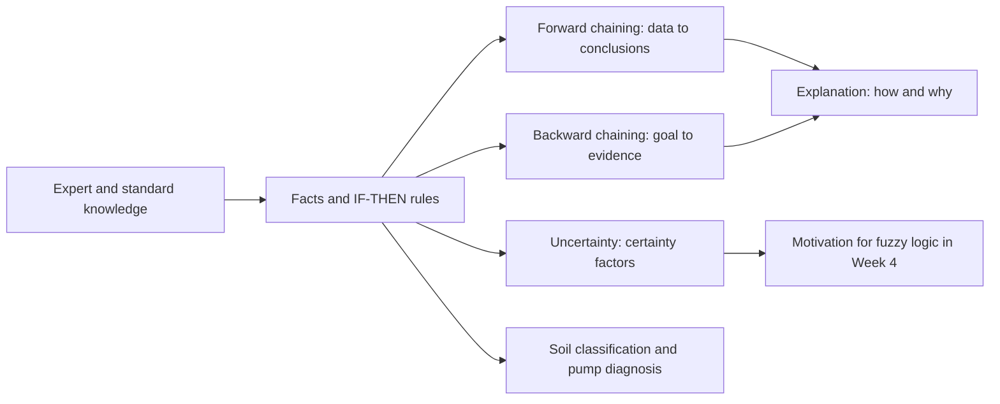
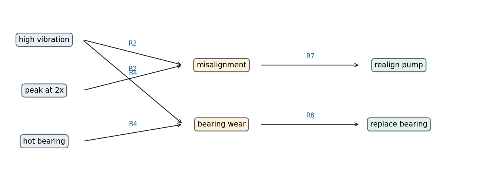

<div align="center">

# Week 03: Knowledge, Rules and Expert Systems

**Artificial Intelligence Applications in Engineering (MUH-920 Mühendislikte Yapay Zeka Uygulamaları)**  
Prof. Dr. Utku Kose, Süleyman Demirel University

[](https://colab.research.google.com/github/utkukose/ai-applications-in-engineering-NB-lecture/blob/main/weeks/week-03/NB03_rule_based_systems.ipynb) [](https://utkukose.github.io/ai-applications-in-engineering-NB-lecture/weeks/week-03/lab.html) [](https://utkukose.github.io/ai-applications-in-engineering-NB-lecture/weeks/week-03/lecture.html) [](Week03_Lecture_Notes.pdf)

</div>

## Overview

Before machine learning dominated the field, artificial intelligence reached industry through expert systems: programs that store the knowledge of specialists as rules and draw conclusions with an inference engine [1, 5]. DENDRAL inferred molecular structures, MYCIN recommended antibiotics and R1 configured computer orders for a manufacturer [2, 3, 4]. Engineering is full of explicit knowledge in the same form: standards, codes, classification systems and diagnostic procedures. This week builds a small rule engine, applies it to the Unified Soil Classification System and to pump diagnosis, and discusses why transparent rules remain valuable next to learned models [9, 10].

**Estimated study time:** 8 to 10 hours.

## Learning outcomes

By the end of the week, students are expected to represent engineering knowledge as facts and IF-THEN rules, to trace forward and backward chaining by hand, to explain how an expert system justifies its conclusions, to combine certainty factors, to encode a standard classification procedure as a rule base, and to name the strengths and limits of knowledge-based systems.

## Python in this week

The lecture ends with Python step 3: Dictionaries and functions. It covers dictionaries, functions with parameters, default values, return values and docstrings, and rules stored as data, applied to soil classification and pump diagnosis [11]. The hands-on part of the notebook opens with the same step as runnable cells and short exercises with immediate feedback, and its later sections mark further constructs as Python moves.

## Study path

| Step | Activity | Suggested time |
|---|---|---|
| 1 | Read the lecture with its animations on the [lecture page](https://utkukose.github.io/ai-applications-in-engineering-NB-lecture/weeks/week-03/lecture.html), or read the [PDF version](Week03_Lecture_Notes.pdf) | 2 hours |
| 2 | Explore the [interactive lab](https://utkukose.github.io/ai-applications-in-engineering-NB-lecture/weeks/week-03/lab.html) | 1 hour |
| 3 | Study the Python step at the end of the lecture, then run the same step at the start of the hands-on part of the [Colab notebook](https://colab.research.google.com/github/utkukose/ai-applications-in-engineering-NB-lecture/blob/main/weeks/week-03/NB03_rule_based_systems.ipynb) | 1 hour |
| 4 | Work through the rest of the notebook, including its Python moves and exercises | 3 hours |
| 5 | Solve the discipline challenge of your department | 1 hour |
| 6 | Take the self-assessment in the lab (tab: Check yourself) | 20 minutes |
| 7 | Write the reflection, export the learning log and complete the weekly task | 1 hour |

## Week at a glance



## Lecture

### Knowledge-based systems

A knowledge-based system separates what is known from how it is used. The knowledge base holds facts about the current case and general rules of the domain. The inference engine applies the rules to the facts to derive new facts, and an explanation facility reports which rules led to a conclusion [1]. Because the rules are separate from the engine, experts can read, review and extend the knowledge without changing the program.

Three systems defined the approach. DENDRAL, started at Stanford in the 1960s, generated candidate molecular structures from mass spectrometry data and pruned them with chemical rules; its developers later called it the first expert system for scientific hypothesis formation [2]. MYCIN diagnosed bacterial infections and recommended therapy with about 450 rules, and its evaluation showed performance comparable to specialists [3]. R1, later called XCON, configured computer systems for Digital Equipment Corporation and was among the first expert systems used in daily industrial operation [4]. Building such systems revealed the knowledge acquisition bottleneck: Experts find it hard to state their knowledge as complete and consistent rules, and the rule base needs continuous maintenance as products and practices change [5].

<details>
<summary><b>Check your understanding.</b> What is the main architectural idea of a knowledge-based system?</summary>

A. Knowledge is learned automatically from data without experts  
B. Domain knowledge is stored separately from the inference engine that applies it  
C. All decisions are made by a neural network  
D. The program is rewritten for every new case

**Answer: B.** Separating the knowledge base from the inference engine lets experts inspect and extend rules without changing the engine.

</details>

### Facts, rules and logic

Propositional logic gives the simplest representation. A fact is a statement that is true or false, such as "the fines content is above 50 percent". A rule states that a conclusion follows when its conditions hold: IF high vibration AND a peak at twice the running speed THEN misalignment is suspected. Rules whose conditions are conjunctions of facts and whose conclusion is a single fact are called Horn clauses, and for them inference is both simple and efficient [6]. The basic inference step is modus ponens: From "A" and "IF A THEN B", conclude "B".

Richer representations exist. First-order logic introduces objects, relations and quantifiers, so that one rule can speak about every pump in a plant. Frames and object-oriented representations group attributes of a concept, and decision tables list combinations of conditions with their actions, a format that engineers know from codes and standards. Whatever the representation, the knowledge must be complete for the intended cases, consistent so that rules do not contradict each other, and specific enough that the engine can test it.

### Forward and backward chaining

Forward chaining is data driven. The engine repeatedly searches for rules whose conditions are all satisfied by known facts, adds their conclusions to the facts, and stops when no rule adds anything new. It suits monitoring and classification, where measurements arrive and the question is what follows from them. Backward chaining is goal driven. The engine starts from a hypothesis, finds rules that conclude it, and tries to establish their conditions, recursively, until it reaches known facts or must ask the user. It suits diagnosis, where the system checks a suspected fault and asks only the questions that matter for it [1, 6].

When several rules can fire at once, a conflict resolution strategy chooses among them, for example by rule priority, by specificity or by the recency of the facts involved. Large rule bases need efficient matching: The Rete algorithm compiles rule conditions into a network that remembers partial matches, so that each new fact is compared only with the conditions it can affect [7].

> **Animation: Forward chaining in a pump diagnosis rule base.** Select the observed symptoms and step through the inference. Each step fires one rule whose conditions are satisfied and adds its conclusion to the facts. Run it in the [web version of the lecture](https://utkukose.github.io/ai-applications-in-engineering-NB-lecture/weeks/week-03/lecture.html#anim-chain).



*Figure 3.1. A small forward-chaining trace for pump diagnosis. Observations enter at the left, rules fire in sequence and conclusions lead to maintenance actions.*

<details>
<summary><b>Check your understanding.</b> A maintenance engineer suspects cavitation and wants the system to ask only the questions relevant to that suspicion. Which inference strategy fits?</summary>

A. Forward chaining over all rules  
B. Backward chaining from the hypothesis  
C. Random rule selection  
D. Breadth-first search over sensor readings

**Answer: B.** Backward chaining starts from the goal and seeks only the evidence needed to confirm or reject it.

</details>

### Explanation and uncertainty

An expert system can answer two questions that most learned models cannot answer directly. The question how is answered by the chain of rules that produced a conclusion. The question why, asked when the system requests information, is answered by the rule that it is trying to establish. In safety-relevant engineering work, such traceable reasoning supports review, audit and certification.

Real knowledge is uncertain. MYCIN attached a certainty factor between minus one and one to rules and facts [3]. A conclusion receives the certainty of its rule multiplied by the smallest certainty of its conditions, and two rules supporting the same positive conclusion combine as CF = CF1 + CF2 (1 - CF1), so that evidence accumulates but never exceeds one. Certainty factors were a practical engineering compromise rather than a probability theory, and their difficulties motivated both probabilistic reasoning and fuzzy logic. Vague conditions such as "slightly high temperature" cannot be captured by crisp thresholds at all: A reading of 69.9 degrees and one of 70.1 degrees would fire different rules. Week 4 addresses this with fuzzy sets [8].

<details>
<summary><b>Check your understanding.</b> Two independent rules support the conclusion &quot;bearing wear&quot; with certainty factors 0.6 and 0.5. What is the combined certainty factor?</summary>

A. 0.5  
B. 0.8  
C. 1.1  
D. 0.3

**Answer: B.** 0.6 + 0.5 x (1 - 0.6) = 0.8. Supporting evidence accumulates but never exceeds one.

</details>

### Engineering standards as rule bases: The Unified Soil Classification System

Many engineering standards are rule bases written for people. The Unified Soil Classification System, based on Casagrande's airfield classification and standardised as ASTM D2487, assigns a group symbol to a soil from its grain-size distribution and its Atterberg limits [9, 10]. The rules proceed in stages. A soil is fine grained when at least half of it passes the No. 200 sieve (0.075 mm), and coarse grained otherwise. A coarse soil is a gravel when more than half of its coarse fraction is retained on the No. 4 sieve (4.75 mm), and a sand otherwise. A clean gravel with less than 5 percent fines is well graded (GW) when its coefficient of uniformity is at least 4 and its coefficient of curvature lies between 1 and 3, and poorly graded (GP) otherwise; for sands the uniformity limit is 6. Gravels and sands with more than 12 percent fines are silty (GM, SM) or clayey (GC, SC) depending on the plasticity of the fines, and those with 5 to 12 percent fines receive dual symbols such as GW-GM.

Fine-grained soils are placed on Casagrande's plasticity chart, which plots the plasticity index PI against the liquid limit LL. The A-line, PI = 0.73 (LL - 20), separates clays above it from silts below it. Soils with LL below 50 are lean clays (CL) when PI is above 7 and on or above the A-line, silts (ML) when PI is below 4 or the point lies below the A-line, and silty clays (CL-ML) in the band of PI from 4 to 7 above the A-line. Soils with LL of 50 or more are fat clays (CH) above the A-line and elastic silts (MH) below it [10]. The notebook turns these rules into a function, and the lab shows the reasoning path for any combination of test results.

![Casagrande's plasticity chart with the A-line and U-line used by the Unified Soil Classification System for fine-grained soils [9, 10].](figures/w03_fig1.png)

*Figure 3.2. Casagrande's plasticity chart with the A-line and U-line used by the Unified Soil Classification System for fine-grained soils [9, 10].*

<details>
<summary><b>Check your understanding.</b> A fine-grained soil has LL = 38 and PI = 18. The A-line value at LL = 38 is 0.73 x 18 = 13.1. What is its group symbol?</summary>

A. ML  
B. CL  
C. CH  
D. MH

**Answer: B.** LL is below 50, PI is above 7 and the point lies above the A-line, so the soil is a lean clay, CL.

</details>

### Strengths and limits

Knowledge-based systems are transparent, can be verified rule by rule, need no training data, and encode requirements that must hold exactly, such as the limits of a standard. They are brittle outside the cases their authors anticipated, they are expensive to acquire and maintain, and they cannot perceive raw signals or images. Modern practice therefore combines them with learning: A convolutional network may detect a crack, and a rule base derived from a code decides whether the crack width requires repair. Such hybrid systems return in later weeks, for example when a language model retrieves passages from standards in Week 13.

<!-- python-step -->

### Python step 3: Dictionaries and functions

#### Dictionaries

A dictionary maps keys to values, like a small table with named entries. It is written with braces and colons, and values are read and written with square brackets and the key. The method `get` returns a default instead of an error when a key is missing, and `items` yields pairs of key and value for a loop. A laboratory result for a soil sample fits naturally into a dictionary.

```python
sample = {"id": "BH2-3.5m", "fines_pct": 62.0, "LL": 48.0, "PL": 22.0}
print(sample["LL"], sample.get("organic", False))
sample["PI"] = sample["LL"] - sample["PL"]      # adds a new key
for key, value in sample.items():
    print(key, "=", value)
```

*Output*

```text
48.0 False
id = BH2-3.5m
fines_pct = 62.0
LL = 48.0
PL = 22.0
PI = 26.0
```

Dictionaries can hold other containers, for example a list of samples, or a dictionary of samples keyed by borehole and depth. They are also the everyday format of records read from files and web services.

#### Functions

A function packages a calculation under a name so that it can be reused and tested. The keyword `def` starts the definition, the names in parentheses are parameters, and `return` sends the result back to the caller. The string on the first line of the body, the docstring, documents what the function does. Variables created inside a function are local and disappear when it returns. The A-line of the plasticity chart and a simplified group decision for fine-grained soils make two short functions [10].

```python
def a_line(ll):
    """Plasticity index on the A-line of the plasticity chart for liquid limit ll."""
    return 0.73 * (ll - 20)

def fine_soil_group(ll, pi):
    """Group symbol of an inorganic fine-grained soil (simplified)."""
    clay = pi > a_line(ll) and pi > 7
    if ll < 50:
        return "CL" if clay else "ML"
    return "CH" if clay else "MH"

print(round(a_line(48), 2))
print(fine_soil_group(48, 26), fine_soil_group(ll=62, pi=18))
```

*Output*

```text
20.44
CL MH
```

The second call names its arguments, which makes it easier to read and independent of the order of the parameters. The full standard adds further cases, such as a dual symbol for low plasticity near the A-line and separate groups for organic soils; the simplified function shows the pattern, not the complete procedure. Parameters can also have default values, which a caller may omit.

```python
def plasticity_check(pl, ll, margin=0.0):
    """True when the liquid limit exceeds the plastic limit by more than the margin."""
    return ll - pl > margin

print(plasticity_check(22, 48), plasticity_check(22, 48, margin=30))
```

*Output*

```text
True False
```

#### Rules as data

Expert systems keep their knowledge as data, separate from the code that reasons with it. A list of dictionaries represents a small rule base for pump diagnosis, and a set holds the observed facts. The built-in function `all` returns `True` when every item of a sequence is true, so `all(c in facts for c in rule["if"])` asks whether every condition of a rule is among the facts. Repeating the pass until no rule adds a new fact is forward chaining, the inference method of this week.

```python
rules = [
    {"name": "R1", "if": ["low suction pressure", "crackling noise"], "then": "cavitation"},
    {"name": "R2", "if": ["high vibration", "peak at running speed"], "then": "imbalance"},
    {"name": "R3", "if": ["cavitation"], "then": "check suction line and NPSH margin"},
]
facts = {"low suction pressure", "crackling noise", "high vibration"}

changed = True
while changed:
    changed = False
    for rule in rules:
        if all(c in facts for c in rule["if"]) and rule["then"] not in facts:
            facts.add(rule["then"])
            print(rule["name"], "fired:", rule["then"])
            changed = True
```

*Output*

```text
R1 fired: cavitation
R3 fired: check suction line and NPSH margin
```

Rule R2 does not fire, because one of its conditions is missing. Adding knowledge requires no change to the reasoning code, only a new dictionary in the list, which is the main practical advantage of keeping rules as data.

<details>
<summary><b>Check your understanding.</b> After def area(b, h=0.5): return b * h, what is the value of area(2) + area(2, h=1)?</summary>

A. 3.0  
B. 2.0  
C. 4.0  
D. An error, because h is missing in the first call

**Answer: A.** The first call uses the default h = 0.5 and returns 1.0, and the second passes h = 1 and returns 2.

</details>

<!-- /python-step -->

## Discipline challenges

Standards and diagnostic procedures exist in every department. Pick the row closest to your field and write the rules; start with five and test them with the engine of the notebook.

| Department | Challenge |
|---|---|
| Civil Engineering | Full USCS classification including dual symbols, and a check of whether a soil is suitable as a road subgrade. |
| Geological Engineering | Rock mass description rules, for example classes from joint spacing and weathering grade. |
| Mechanical Engineering | Pump or fan fault diagnosis from vibration spectrum features, extending the rule base of the lecture. |
| Electrical and Electronics Engineering | Transformer condition rules from dissolved-gas ratios, written as a decision table. |
| Environmental Engineering | Discharge compliance checks of treated wastewater against permit limits. |
| Food Engineering | Hazard analysis rules that assign critical control points in a production line. |
| Chemistry | Rules that assign a functional group from infrared absorption bands. |
| Mining Engineering | Ventilation alarm rules that combine methane concentration, airflow and trends. |
| Computer Engineering | Firewall or access-control policy evaluation with rule conflicts and priorities. |
| Industrial Engineering | Dispatching rules for a job shop, compared on a small scenario. |
| Textile Engineering | Defect-cause rules that link fabric faults to loom settings. |

## Interactive lab

Part A classifies a soil with the Unified Soil Classification System from grain-size and plasticity values set with sliders, and prints the reasoning path rule by rule next to the plasticity chart [9, 10]. Part B is a diagnostic expert system for a centrifugal pump with certainty factors: Symptoms are selected with a confidence, rules fire forward, evidence combines as in MYCIN, and every conclusion can be asked how it was reached [3].

[Open the interactive lab](https://utkukose.github.io/ai-applications-in-engineering-NB-lecture/weeks/week-03/lab.html)


## Colab notebook

The notebook writes a forward-chaining and a backward-chaining engine in a few dozen lines, adds certainty factors and an explanation facility, and then encodes the Unified Soil Classification System for coarse and fine soils [9, 10]. A table of laboratory results is classified automatically and plotted on the plasticity chart, and the exercises extend the rule base.

[](https://colab.research.google.com/github/utkukose/ai-applications-in-engineering-NB-lecture/blob/main/weeks/week-03/NB03_rule_based_systems.ipynb)

Screenshots of the executed notebook:


## Self-assessment and reflection

The lab contains a 6-question self-assessment with instant feedback and a confidence rating for each answer. A confident but wrong answer marks the first topic to revisit. The reflection prompts below are also available in the lab, where answers are saved in the browser and can be exported as a learning log.

1. Which standard, code or procedure in your field could be turned into a rule base? What would be hard to formalise?
2. When would you trust a transparent rule base more than a more accurate but opaque learned model?
3. Which comprehension or set operation from this week made the rule engine shorter, and could you write it as an ordinary loop as well?

## Weekly task and submission

Choose a classification procedure, a design check or a diagnostic guideline from your department and implement at least eight rules in the notebook's rule engine. Test it on five cases, show the forward-chaining trace for one of them, and write about 400 words on what the rules cover, where they are brittle and how a domain expert could review them. Cite at least three works from this week's references [1, 3, 7].

The weekly task is optional and supports self-learning and a personal portfolio. During an active semester, it can be sent together with the exported learning log to utkukose@sdu.edu.tr or utkukose@gmail.com. Optional work carries no separate weight, but the instructor may take it into account as a discretionary adjustment of the midterm component of the grade.

## Research and report assignment (optional)

**Expert systems in engineering practice.** Review the history and present use of rule-based systems in one engineering domain, such as process control alarms, building code checking, geotechnical classification or maintenance diagnostics. Discuss knowledge acquisition, verification and the combination of rules with machine learning [1, 4, 5].

This research assignment is optional and supports self-learning. When the related weeks are followed within the course during an active semester, the report can be sent to utkukose@sdu.edu.tr or utkukose@gmail.com. It carries no separate weight, but the instructor may take it into account as a discretionary adjustment of the midterm component of the grade. Unless the assignment states otherwise, a report has 1500 to 2500 words, follows the structure of an academic paper, cites at least six scholarly or official sources in square brackets and uses the template in `exams/REPORT_TEMPLATE.md`.

## References

[1] Giarratano, J. C., & Riley, G. D. (2005). *Expert Systems: Principles and Programming* (4th ed.). Thomson Course Technology.

[2] Lindsay, R. K., Buchanan, B. G., Feigenbaum, E. A., & Lederberg, J. (1993). DENDRAL: A case study of the first expert system for scientific hypothesis formation. *Artificial Intelligence*, *61*(2), 209-261. <https://doi.org/10.1016/0004-3702(93)90068-M>

[3] Buchanan, B. G., & Shortliffe, E. H. (Eds.) (1984). *Rule-Based Expert Systems: The MYCIN Experiments of the Stanford Heuristic Programming Project*. Addison-Wesley.

[4] McDermott, J. (1982). R1: A rule-based configurer of computer systems. *Artificial Intelligence*, *19*(1), 39-88. <https://doi.org/10.1016/0004-3702(82)90021-2>

[5] Hayes-Roth, F., Waterman, D. A., & Lenat, D. B. (Eds.) (1983). *Building Expert Systems*. Addison-Wesley.

[6] Russell, S., & Norvig, P. (2021). *Artificial Intelligence: A Modern Approach* (4th ed.). Pearson.

[7] Forgy, C. L. (1982). Rete: A fast algorithm for the many pattern/many object pattern match problem. *Artificial Intelligence*, *19*(1), 17-37. <https://doi.org/10.1016/0004-3702(82)90020-0>

[8] Zadeh, L. A. (1965). Fuzzy sets. *Information and Control*, *8*(3), 338-353. <https://doi.org/10.1016/S0019-9958(65)90241-X>

[9] Casagrande, A. (1948). Classification and identification of soils. *Transactions of the American Society of Civil Engineers*, *113*, 901-930.

[10] ASTM International (2017). *ASTM D2487-17: Standard Practice for Classification of Soils for Engineering Purposes (Unified Soil Classification System)*. ASTM International.

[11] Python Software Foundation (2026). *The Python Tutorial (Python 3 documentation)*. <https://docs.python.org/3/tutorial/>

---

<sub>Artificial Intelligence Applications in Engineering. Prof. Dr. Utku Kose, Süleyman Demirel University. ORCID [0000-0002-9652-6415](https://orcid.org/0000-0002-9652-6415). Content licensed under CC BY 4.0, code under MIT. This course is updated in line with current developments in the field. Last update: September 2026.</sub>
