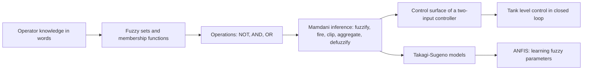
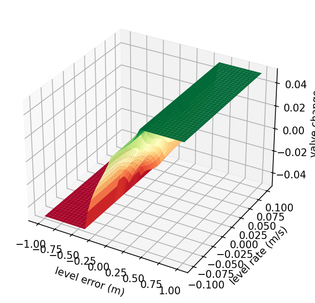

<div align="center">

# Week 04: Fuzzy Logic and Fuzzy Control

**Artificial Intelligence Applications in Engineering (MUH-920 Mühendislikte Yapay Zeka Uygulamaları)**  
Prof. Dr. Utku Kose, Süleyman Demirel University

[](https://colab.research.google.com/github/utkukose/ai-applications-in-engineering-NB-lecture/blob/main/weeks/week-04/NB04_fuzzy_control.ipynb) [](https://utkukose.github.io/ai-applications-in-engineering-NB-lecture/weeks/week-04/lab.html) [](https://utkukose.github.io/ai-applications-in-engineering-NB-lecture/weeks/week-04/lecture.html) [](Week04_Lecture_Notes.pdf)

</div>

## Overview

Operators describe processes in words: The level is a bit low and falling slowly, so open the valve a little. Fuzzy logic turns such statements into computation. Zadeh introduced fuzzy sets, whose members belong to a degree between zero and one [1], and linguistic variables that take words as values [2]. Mamdani and Assilian used them to control a steam engine with rules taken from operators [3], and within a decade fuzzy controllers ran cement kilns and a subway line [8, 9]. This week builds a fuzzy inference system from scratch, uses it to control the level of a tank, compares Mamdani and Takagi-Sugeno models, and shows how adaptive neuro-fuzzy systems learn their parameters from data [5, 6].

**Estimated study time:** 9 to 11 hours.

## Learning outcomes

By the end of the week, students are expected to define fuzzy sets with triangular, trapezoidal and Gaussian membership functions, to apply fuzzy complement, intersection and union, to carry out Mamdani inference by hand from fuzzification to centroid defuzzification, to design a rule table for a two-input controller and interpret its control surface, to distinguish Mamdani from Takagi-Sugeno models, and to implement and simulate a fuzzy controller in Python, both from scratch and with scikit-fuzzy.

## Python in this week

The lecture ends with Python step 4: NumPy arrays and first plots. It covers NumPy arrays, element-wise arithmetic, functions on arrays, boolean masks and Matplotlib plots, applied to membership functions and defuzzification [11, 12]. The hands-on part of the notebook opens with the same step as runnable cells and short exercises with immediate feedback, and its later sections mark further constructs as Python moves.

## Study path

| Step | Activity | Suggested time |
|---|---|---|
| 1 | Read the lecture with its animations on the [lecture page](https://utkukose.github.io/ai-applications-in-engineering-NB-lecture/weeks/week-04/lecture.html), or read the [PDF version](Week04_Lecture_Notes.pdf) | 2 hours |
| 2 | Explore the [interactive lab](https://utkukose.github.io/ai-applications-in-engineering-NB-lecture/weeks/week-04/lab.html) | 1 hour |
| 3 | Study the Python step at the end of the lecture, then run the same step at the start of the hands-on part of the [Colab notebook](https://colab.research.google.com/github/utkukose/ai-applications-in-engineering-NB-lecture/blob/main/weeks/week-04/NB04_fuzzy_control.ipynb) | 1 hour |
| 4 | Work through the rest of the notebook, including its Python moves and exercises | 3 hours |
| 5 | Solve the discipline challenge of your department | 1 hour |
| 6 | Take the self-assessment in the lab (tab: Check yourself) | 20 minutes |
| 7 | Write the reflection, export the learning log and complete the weekly task | 1 hour |

## Week at a glance



## Lecture

### Vagueness and fuzzy sets

Week 3 ended with a weakness of crisp rules: A threshold of 70 degrees makes a reading of 69.9 normal and a reading of 70.1 overheated. Engineers rarely think in such steps. A temperature is more or less high, a load is fairly heavy, a surface is quite rough. Zadeh proposed fuzzy sets to represent such graded concepts [1]. A fuzzy set A on a universe of discourse X is defined by a membership function that assigns every element x a degree between 0 and 1. A room at 23 degrees may belong to the set of warm rooms with degree 0.6 and to the set of comfortable rooms with degree 0.4.

Vagueness is not probability. A membership degree of 0.6 does not say that the room is warm with probability 0.6. It says that 23 degrees fits the concept "warm" to degree 0.6, and there is nothing random about it. Probability describes uncertainty about whether an event happens; fuzzy membership describes how well a precisely known value fits an imprecise concept. The two can be combined, but they answer different questions.

Common membership functions are triangular, defined by a left foot, a peak and a right foot; trapezoidal, with a flat top; and Gaussian, with a centre and a width. The support of a fuzzy set is where its membership is positive, the core is where it equals one, and an alpha-cut is the crisp set of elements whose membership is at least alpha. A linguistic variable, such as tank level, takes linguistic values, such as low, okay and high, each represented by a fuzzy set on the same universe [2].

![A crisp set and fuzzy sets for the concept "warm room". The fuzzy sets overlap, so a temperature can belong partly to two neighbouring concepts [1].](figures/w04_fig1.png)

*Figure 4.1. A crisp set and fuzzy sets for the concept "warm room". The fuzzy sets overlap, so a temperature can belong partly to two neighbouring concepts [1].*

<details>
<summary><b>Check your understanding.</b> A water temperature of 58 degrees has membership 0.7 in the fuzzy set &quot;hot&quot;. What does this mean?</summary>

A. The water is hot with probability 0.7  
B. 58 degrees fits the concept "hot" to degree 0.7  
C. 70 percent of the water is hot  
D. The measurement has an error of 0.7 degrees

**Answer: B.** Membership measures compatibility with a vague concept, not the probability of a random event.

</details>

### Operations on fuzzy sets

The classical set operations generalise. The complement NOT A has membership 1 minus the membership of A. The intersection A AND B is usually computed with the minimum of the two memberships, and the union A OR B with the maximum [1]. Other choices are possible: The product is also a valid intersection, called a t-norm, and the probabilistic sum a + b - ab is a valid union, called an s-norm. The choice changes the smoothness of the resulting controller but not the principle. Some classical laws fail on purpose: A AND NOT A need not be empty, because a temperature can be somewhat warm and somewhat not warm at the same time.

### Mamdani inference

A fuzzy rule has linguistic conditions and a linguistic conclusion: IF level error is low AND level rate is none THEN valve change is open fast. Mamdani inference evaluates a rule base in five steps [3, 4]. First, fuzzification computes the membership of each crisp input in each of its fuzzy sets. Second, each rule receives a firing strength, the minimum of the memberships in its conditions. Third, implication clips the output fuzzy set of each rule at its firing strength. Fourth, aggregation combines the clipped sets of all rules with the maximum. Fifth, defuzzification turns the aggregated fuzzy set into one crisp output, most often with the centroid, the centre of gravity of the area under the aggregated membership function.

> **Animation: Inside a Mamdani controller.** Move the two inputs of a tank level controller. The bars show fuzzification, the clipped shapes show the rules that fire, and the vertical line marks the centroid that becomes the valve command. Run it in the [web version of the lecture](https://utkukose.github.io/ai-applications-in-engineering-NB-lecture/weeks/week-04/lecture.html#anim-mamdani).



*Figure 4.2. Control surface of the five-rule tank controller of the notebook. The fuzzy controller is a smooth nonlinear map from level error and level rate to valve change.*

The controller defined by a rule base is a nonlinear function from inputs to output, and its control surface can be drawn for two inputs. Overlapping membership functions make the surface smooth; more sets and rules add detail. A rule table, with one input along the rows and the other along the columns, is the usual design tool: Every cell holds the conclusion for one combination of linguistic values, and gaps in the table leave parts of the input space without any action. Symmetry of the table usually leads to symmetric behaviour of the loop.

<details>
<summary><b>Check your understanding.</b> Two rules fire with strengths 0.3 and 0.8 and conclude &quot;open slow&quot; and &quot;open fast&quot;. What happens in Mamdani inference before defuzzification?</summary>

A. Only the stronger rule is kept  
B. Each output set is clipped at its rule strength and the clipped sets are combined with the maximum  
C. The strengths are added to 1.1 and the output is saturated  
D. The inputs are fuzzified again with new membership functions

**Answer: B.** Implication clips each consequent at its firing strength and aggregation takes the pointwise maximum of the clipped sets.

</details>

### Takagi-Sugeno models and learning fuzzy systems

Takagi and Sugeno replaced the fuzzy conclusion by a function of the inputs: IF x is A AND y is B THEN z = p x + q y + r [5]. The output is the average of the rule outputs weighted by their firing strengths, so no defuzzification of a shape is needed. A zero-order Sugeno model has constant conclusions and behaves much like a Mamdani model with narrow output sets; a first-order model blends local linear models, which makes it attractive for modelling and for gain scheduling of controllers.

Because the Sugeno output is a differentiable function of its parameters, the parameters can be learned from data. ANFIS represents a Sugeno system as a five-layer adaptive network and trains the premise parameters with gradient descent and the linear consequent parameters with least squares [6]. Metaheuristic training is an alternative when gradients are unreliable: In one study, ANFIS supported by the vortex optimisation algorithm forecast chaotic electroencephalogram time series [7]. Such neuro-fuzzy systems link this week to the optimisation of Weeks 5 and 6 and to the neural networks of Week 10.

<details>
<summary><b>Check your understanding.</b> What distinguishes a first-order Takagi-Sugeno rule from a Mamdani rule?</summary>

A. Its conditions are crisp  
B. Its conclusion is a linear function of the inputs instead of a fuzzy set  
C. It cannot be combined with other rules  
D. It uses the maximum instead of the minimum for AND

**Answer: B.** The consequent z = p x + q y + r is a local linear model; the rule outputs are averaged with the firing strengths as weights.

</details>

### Fuzzy control in engineering

The first industrial success was the control of a cement kiln in Denmark, where operators' rules for burning zone temperature and oxygen were encoded as fuzzy rules [8]. The Sendai subway in Japan used predictive fuzzy control for automatic train operation, which improved riding comfort and stopping accuracy [9]. Fuzzy controllers later appeared in washing machines, cameras, heating systems, water treatment dosing and vehicle subsystems, and textbooks collect applications across civil, mechanical, chemical and electrical engineering [10].

Fuzzy control is most useful when a good mathematical model is missing but operator experience exists, when the process is nonlinear, and when smooth, explainable behaviour matters. It does not remove the need for analysis: Stability, robustness to disturbances and the effect of measurement noise must still be checked, for example by simulation over the operating range, as in the notebook. When a reliable model exists, classical or model-based control is often the better engineering choice.

<!-- python-step -->

### Python step 4: NumPy arrays and first plots

#### From lists to arrays

Engineering calculations usually apply one formula to many values. NumPy provides the array, a grid of numbers of one type on which arithmetic works element by element [11]. Multiplying an array by 10 multiplies every element, whereas multiplying a list by 10 would repeat the list ten times. Arrays have a `shape`, the number of elements along each axis, and a `dtype`, the type of their elements. `np.linspace(a, b, n)` creates n evenly spaced values from a to b, which is the usual way to sample a variable such as a tank level.

```python
import numpy as np

levels_cm = np.array([12.0, 35.5, 50.0, 71.2, 94.0])
print(levels_cm * 10)                 # millimetres, element by element
print(levels_cm.shape, levels_cm.dtype, levels_cm.mean())
x = np.linspace(0, 100, 11)           # 11 evenly spaced points from 0 to 100
print(x)
```

*Output*

```text
[120. 355. 500. 712. 940.]
(5,) float64 52.54
[  0.  10.  20.  30.  40.  50.  60.  70.  80.  90. 100.]
```

#### Functions that work on arrays

A function written with array operations accepts a single number as well as a whole array. The triangular membership function of fuzzy logic rises linearly from a foot a to a peak b and falls to a second foot c. `np.minimum` and `np.maximum` compare element by element, which expresses the whole shape in one line.

```python
def tri(x, a, b, c):
    """Triangular membership function with feet a and c and peak b."""
    return np.maximum(np.minimum((x - a) / (b - a), (c - x) / (c - b)), 0.0)

print(tri(35.0, 0, 25, 50))
print(np.round(tri(x, 0, 25, 50), 2))
```

*Output*

```text
0.6
[0.  0.4 0.8 0.8 0.4 0.  0.  0.  0.  0.  0. ]
```

#### Aggregation and boolean masks

Functions such as `np.sum`, `np.max` and `np.argmax` reduce an array to a single value or position. Comparisons produce boolean arrays, called masks, which count values when summed and select values when used as an index. The centroid of a fuzzy set, the defuzzification method of the Mamdani controller, is a weighted mean: The sum of x times membership is divided by the sum of membership. The example clips the output set "open" of a valve at a rule strength of 0.6.

```python
valve = np.linspace(0, 100, 201)          # valve opening in percent
open_set = tri(valve, 40, 70, 100)        # output set "open"
clipped = np.minimum(open_set, 0.6)       # a rule with strength 0.6 clips the set
centroid = np.sum(valve * clipped) / np.sum(clipped)
print(f"centroid: {centroid:.1f} % opening")
print("points above 0.5:", np.sum(clipped > 0.5))
print("openings with membership above 0.5:", valve[clipped > 0.5][[0, -1]])
```

*Output*

```text
centroid: 70.0 % opening
points above 0.5: 59
openings with membership above 0.5: [55.5 84.5]
```

The last line uses the mask as an index to keep only the matching openings, and then selects the first and the last of them.

#### Plots

Matplotlib draws figures from arrays [12]. `plt.plot(x, y)` connects points with lines, the `label` argument names each curve for the legend, and axis labels with units belong on every engineering plot. The code below draws the three level sets of the tank controller; the notebook shows the figure.

```python
import matplotlib.pyplot as plt

level = np.linspace(0, 100, 201)
plt.figure(figsize=(6, 2.8))
plt.plot(level, tri(level, -50, 0, 50), label="low")
plt.plot(level, tri(level, 0, 50, 100), label="medium")
plt.plot(level, tri(level, 50, 100, 150), label="high")
plt.xlabel("tank level (cm)")
plt.ylabel("membership")
plt.legend()
plt.show()
```

Feet placed outside the range, such as -50 and 150, make the outer sets start or end at full membership at the edges of the range, which is how a controller treats a tank that is empty or full.

<details>
<summary><b>Check your understanding.</b> After a = np.array([1.0, 2.0, 3.0]), what is a * 2 + 1?</summary>

A. array([3., 5., 7.])  
B. [1.0, 2.0, 3.0, 1.0, 2.0, 3.0, 1]  
C. An error  
D. 15.0

**Answer: A.** Arithmetic on arrays acts element by element. With a list, * 2 would repeat the list, and adding 1 would raise an error.

</details>

<!-- /python-step -->

## Discipline challenges

Fuzzy logic suits quantities that experts judge with words. Choose a row, define linguistic variables with membership functions, write a rule table, and test the result on a few cases.

| Department | Challenge |
|---|---|
| Environmental Engineering | Coagulant dosing from raw-water turbidity and pH, or an air quality index from several pollutants. |
| Food Engineering | Drying control from product moisture and air temperature, or sensory quality grading from colour and texture scores. |
| Civil Engineering | Condition rating of a bridge element from crack width, corrosion and deflection. |
| Mining Engineering | Ground stability assessment from joint spacing, water inflow and blasting vibration. |
| Electrical and Electronics Engineering | Battery charging current from temperature and state of charge. |
| Mechanical Engineering and Automotive Engineering | Wheel slip control or engine cooling fan control from temperature and its rate. |
| Chemical Engineering | Reactor temperature control with a two-input fuzzy PI structure. |
| Industrial Engineering | Supplier selection with fuzzy scores for price, quality and delivery. |
| Textile Engineering | Fabric hand evaluation from bending, friction and compression measurements. |
| Earth Sciences Engineering and Geophysical Engineering | Landslide susceptibility from slope, lithology and rainfall classes. |
| Mathematics and Statistics | Compare t-norms and s-norms and prove which classical set laws fail for min and max. |

## Interactive lab

The lab controls the level of a tank with a two-input fuzzy controller. The rule table is editable cell by cell, the control surface updates immediately, and a closed-loop simulation compares the fuzzy controller with an on-off controller while the set point changes [3, 4]. A second part lets the width of the membership functions be varied to show how overlap shapes the surface.

[Open the interactive lab](https://utkukose.github.io/ai-applications-in-engineering-NB-lecture/weeks/week-04/lab.html)


## Colab notebook

The notebook implements membership functions, fuzzy operations and Mamdani inference with NumPy, shows every inference step for one input, draws the control surface, and simulates the controller on a nonlinear tank model against an on-off controller. It then rebuilds the same controller with scikit-fuzzy [13], compares it with a zero-order Sugeno version, and closes with exercises on membership functions, centroids and rule design.

[](https://colab.research.google.com/github/utkukose/ai-applications-in-engineering-NB-lecture/blob/main/weeks/week-04/NB04_fuzzy_control.ipynb)

Screenshots of the executed notebook:


## Self-assessment and reflection

The lab contains a 6-question self-assessment with instant feedback and a confidence rating for each answer. A confident but wrong answer marks the first topic to revisit. The reflection prompts below are also available in the lab, where answers are saved in the browser and can be exported as a learning log.

1. Which quantity in your field is naturally described with vague words by practitioners? Sketch three membership functions for it.
2. The tank controller in the notebook has five rules. What would you change first if the level overshot the set point, and why?
3. How did vectorised NumPy code change the way you wrote the membership functions compared with the loops of Week 1?

## Weekly task and submission

Design a fuzzy controller or a fuzzy assessment model for a problem of your department with at least two inputs, three sets per input and a complete rule table. Implement it with the from-scratch code or with scikit-fuzzy, plot its control surface, and test it on a simple simulation or on at least ten cases. Report the design choices and the behaviour in about 500 words and cite at least three works from this week's references [3, 4, 10].

The weekly task is optional and supports self-learning and a personal portfolio. During an active semester, it can be sent together with the exported learning log to utkukose@sdu.edu.tr or utkukose@gmail.com. Optional work carries no separate weight, but the instructor may take it into account as a discretionary adjustment of the midterm component of the grade.

## Research and report assignment (optional)

**Fuzzy systems in engineering decision making.** Review fuzzy control or fuzzy decision support in one domain, such as water treatment, building energy, traffic, mining safety or food quality. Compare Mamdani, Takagi-Sugeno and adaptive neuro-fuzzy approaches and discuss how the membership functions and rules were obtained, from experts, from data or by optimisation [5, 6, 7].

This research assignment is optional and supports self-learning. When the related weeks are followed within the course during an active semester, the report can be sent to utkukose@sdu.edu.tr or utkukose@gmail.com. It carries no separate weight, but the instructor may take it into account as a discretionary adjustment of the midterm component of the grade. Unless the assignment states otherwise, a report has 1500 to 2500 words, follows the structure of an academic paper, cites at least six scholarly or official sources in square brackets and uses the template in `exams/REPORT_TEMPLATE.md`.

## References

[1] Zadeh, L. A. (1965). Fuzzy sets. *Information and Control*, *8*(3), 338-353. <https://doi.org/10.1016/S0019-9958(65)90241-X>

[2] Zadeh, L. A. (1973). Outline of a new approach to the analysis of complex systems and decision processes. *IEEE Transactions on Systems, Man, and Cybernetics*, *SMC-3*(1), 28-44. <https://doi.org/10.1109/TSMC.1973.5408575>

[3] Mamdani, E. H., & Assilian, S. (1975). An experiment in linguistic synthesis with a fuzzy logic controller. *International Journal of Man-Machine Studies*, *7*(1), 1-13. <https://doi.org/10.1016/S0020-7373(75)80002-2>

[4] Lee, C. C. (1990). Fuzzy logic in control systems: Fuzzy logic controller, Part I. *IEEE Transactions on Systems, Man, and Cybernetics*, *20*(2), 404-418. <https://doi.org/10.1109/21.52551>

[5] Takagi, T., & Sugeno, M. (1985). Fuzzy identification of systems and its applications to modeling and control. *IEEE Transactions on Systems, Man, and Cybernetics*, *SMC-15*(1), 116-132. <https://doi.org/10.1109/TSMC.1985.6313399>

[6] Jang, J.-S. R. (1993). ANFIS: Adaptive-network-based fuzzy inference system. *IEEE Transactions on Systems, Man, and Cybernetics*, *23*(3), 665-685. <https://doi.org/10.1109/21.256541>

[7] Kose, U., & Arslan, A. (2017). Forecasting chaotic time series via ANFIS supported by vortex optimization algorithm: Applications on electroencephalogram time series. *Arabian Journal for Science and Engineering*, *42*(8), 3103-3114. <https://doi.org/10.1007/s13369-016-2279-z>

[8] Holmblad, L. P., & Østergaard, J.-J. (1982). Control of a cement kiln by fuzzy logic. In *Fuzzy Information and Decision Processes (M. M. Gupta & E. Sanchez, Eds.)* (pp. 389-399). North-Holland.

[9] Yasunobu, S., & Miyamoto, S. (1985). Automatic train operation system by predictive fuzzy control. In *Industrial Applications of Fuzzy Control (M. Sugeno, Ed.)* (pp. 1-18). North-Holland.

[10] Ross, T. J. (2017). *Fuzzy Logic with Engineering Applications* (4th ed.). Wiley.

[11] Harris, C. R., Millman, K. J., van der Walt, S. J., et al. (2020). Array programming with NumPy. *Nature*, *585*(7825), 357-362. <https://doi.org/10.1038/s41586-020-2649-2>

[12] Hunter, J. D. (2007). Matplotlib: A 2D graphics environment. *Computing in Science & Engineering*, *9*(3), 90-95. <https://doi.org/10.1109/MCSE.2007.55>

[13] The scikit-fuzzy developers (2026). *scikit-fuzzy: Fuzzy logic toolkit for SciPy [Python package]*. <https://github.com/scikit-fuzzy/scikit-fuzzy>

---

<sub>Artificial Intelligence Applications in Engineering. Prof. Dr. Utku Kose, Süleyman Demirel University. ORCID [0000-0002-9652-6415](https://orcid.org/0000-0002-9652-6415). Content licensed under CC BY 4.0, code under MIT. This course is updated in line with current developments in the field. Last update: September 2026.</sub>
