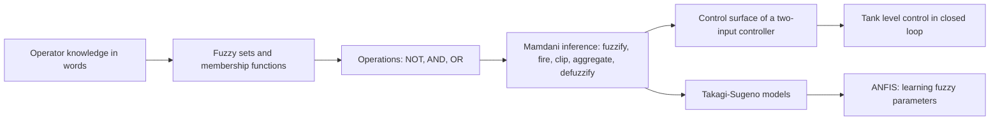
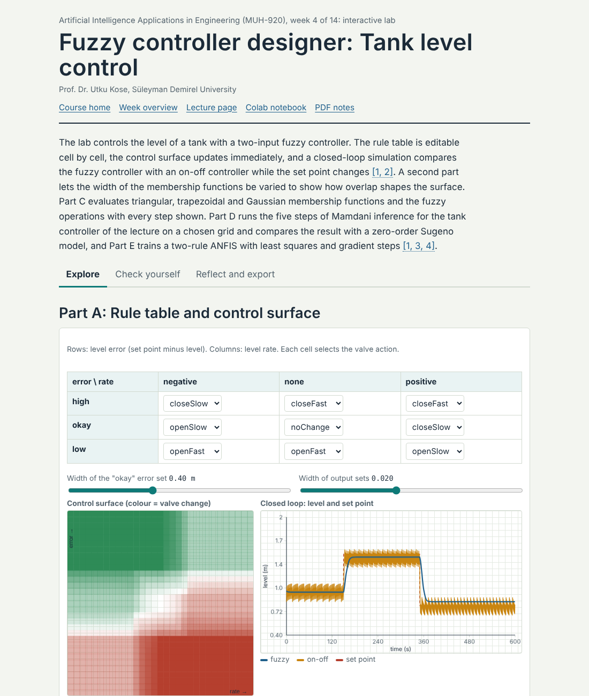
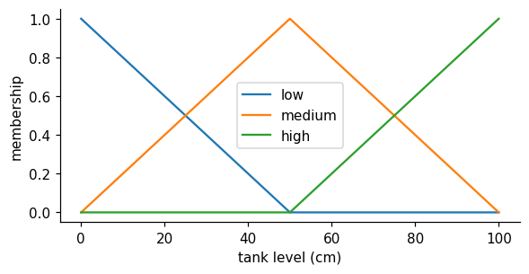
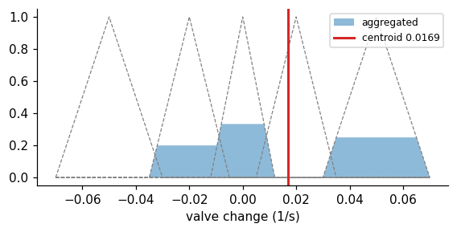

# Week 04: Fuzzy Logic and Fuzzy Control

**Artificial Intelligence Applications in Engineering (MUH-920 Mühendislikte Yapay Zeka Uygulamaları)** Prof. Dr. Utku Kose, Süleyman Demirel University

   

[Week 3](../week-03/README.md) | [All weeks](../../README.md#weekly-schedule) | [Week 5](../week-05/README.md)

## Overview

Operators describe processes in words: The level is a bit low and falling slowly, so open the valve a little. Fuzzy logic turns such statements into computation. Zadeh introduced fuzzy sets, whose members belong to a degree between zero and one [1], and linguistic variables that take words as values [2]. Mamdani and Assilian used them to control a steam engine with rules taken from operators [3], and within a decade fuzzy controllers ran cement kilns and a subway line [4, 5]. This week builds a fuzzy inference system from scratch, uses it to control the level of a tank, compares Mamdani and Takagi-Sugeno models, and shows how adaptive neuro-fuzzy systems learn their parameters from data [6, 7].

**Estimated study time:** 9 to 11 hours.

## Learning outcomes

By the end of the week, students are expected to define fuzzy sets with triangular, trapezoidal and Gaussian membership functions, to apply fuzzy complement, intersection and union, to carry out Mamdani inference by hand from fuzzification to centroid defuzzification, to design a rule table for a two-input controller and interpret its control surface, to distinguish Mamdani from Takagi-Sugeno models, and to implement and simulate a fuzzy controller in Python, both from scratch and with scikit-fuzzy.

## Week at a glance

## Materials of the week

| Material | What it contains | Link |
|---|---|---|
| Lecture page | Five sections with formulas, six worked examples, three knowledge checks, an animation, a figure and six review cards | [Open the lecture page](https://utkukose.github.io/ai-applications-in-engineering-NB-lecture/weeks/week-04/lecture.html) |
| Lecture notes | The printable version of the week: the lecture with its formulas and worked examples, Python step 4 and the outputs of its code, followed by the discipline challenges and the tasks | [Open the PDF](Week04_Lecture_Notes.pdf) |
| Interactive lab | *Fuzzy controller designer: Tank level control*, with four interactive parts, a self-assessment of six questions, three reflection prompts and an exportable learning log | [Open the lab](https://utkukose.github.io/ai-applications-in-engineering-NB-lecture/weeks/week-04/lab.html) |
| Colab notebook | Python step 4: NumPy arrays and first plots, followed by six hands-on sections with exercises and immediate feedback | [Open in Colab](https://colab.research.google.com/github/utkukose/ai-applications-in-engineering-NB-lecture/blob/main/weeks/week-04/NB04_fuzzy_control.ipynb), [view on GitHub](NB04_fuzzy_control.ipynb) |

## Contents

| Lecture page | Colab notebook |
|---|---|
| [Vagueness and fuzzy sets](https://utkukose.github.io/ai-applications-in-engineering-NB-lecture/weeks/week-04/lecture.html#vagueness-and-fuzzy-sets) | [Python step 4: NumPy arrays and first plots](https://colab.research.google.com/github/utkukose/ai-applications-in-engineering-NB-lecture/blob/main/weeks/week-04/NB04_fuzzy_control.ipynb#scrollTo=python-step) |
| [Operations on fuzzy sets](https://utkukose.github.io/ai-applications-in-engineering-NB-lecture/weeks/week-04/lecture.html#operations-on-fuzzy-sets) | [1. Membership functions with NumPy](https://colab.research.google.com/github/utkukose/ai-applications-in-engineering-NB-lecture/blob/main/weeks/week-04/NB04_fuzzy_control.ipynb#scrollTo=section-1) |
| [Mamdani inference](https://utkukose.github.io/ai-applications-in-engineering-NB-lecture/weeks/week-04/lecture.html#mamdani-inference) | [2. A tank level controller, step by step](https://colab.research.google.com/github/utkukose/ai-applications-in-engineering-NB-lecture/blob/main/weeks/week-04/NB04_fuzzy_control.ipynb#scrollTo=section-2) |
| [Takagi-Sugeno models and learning fuzzy systems](https://utkukose.github.io/ai-applications-in-engineering-NB-lecture/weeks/week-04/lecture.html#takagi-sugeno-models-and-learning-fuzzy-systems) | [3. The control surface](https://colab.research.google.com/github/utkukose/ai-applications-in-engineering-NB-lecture/blob/main/weeks/week-04/NB04_fuzzy_control.ipynb#scrollTo=section-3) |
| [Fuzzy control in engineering](https://utkukose.github.io/ai-applications-in-engineering-NB-lecture/weeks/week-04/lecture.html#fuzzy-control-in-engineering) | [4. Closed-loop simulation](https://colab.research.google.com/github/utkukose/ai-applications-in-engineering-NB-lecture/blob/main/weeks/week-04/NB04_fuzzy_control.ipynb#scrollTo=section-4) |
| [Review cards](https://utkukose.github.io/ai-applications-in-engineering-NB-lecture/weeks/week-04/lecture.html#review-cards) | [5. The same controller with scikit-fuzzy](https://colab.research.google.com/github/utkukose/ai-applications-in-engineering-NB-lecture/blob/main/weeks/week-04/NB04_fuzzy_control.ipynb#scrollTo=section-5) |
|  | [6. A zero-order Sugeno version](https://colab.research.google.com/github/utkukose/ai-applications-in-engineering-NB-lecture/blob/main/weeks/week-04/NB04_fuzzy_control.ipynb#scrollTo=section-6) |

## Study path

| Step | Activity | Suggested time |
|---|---|---|
| 1 | Read the [lecture page](https://utkukose.github.io/ai-applications-in-engineering-NB-lecture/weeks/week-04/lecture.html) and answer its knowledge checks, or read the [PDF notes](Week04_Lecture_Notes.pdf) | 2 hours |
| 2 | Explore the simulation of the [interactive lab](https://utkukose.github.io/ai-applications-in-engineering-NB-lecture/weeks/week-04/lab.html#explore) | 1 hour |
| 3 | Work through [Python step 4](https://colab.research.google.com/github/utkukose/ai-applications-in-engineering-NB-lecture/blob/main/weeks/week-04/NB04_fuzzy_control.ipynb#scrollTo=python-step) at the start of the Colab notebook | 1 hour |
| 4 | Continue with the hands-on sections of the [notebook](https://colab.research.google.com/github/utkukose/ai-applications-in-engineering-NB-lecture/blob/main/weeks/week-04/NB04_fuzzy_control.ipynb) and their exercises | 3 hours |
| 5 | Solve the [discipline challenge](#discipline-challenges) of your department | 1 hour |
| 6 | Take the [self-assessment](https://utkukose.github.io/ai-applications-in-engineering-NB-lecture/weeks/week-04/lab.html#check) in the lab | 20 minutes |
| 7 | Answer the [reflection prompts](https://utkukose.github.io/ai-applications-in-engineering-NB-lecture/weeks/week-04/lab.html#reflect), export the learning log and complete the [weekly task](#weekly-task) | 1 hour |

## Preview

<table><tr><td colspan="2"> Interactive lab: Fuzzy controller designer: Tank level control</td></tr><tr><td width="50%"></td><td width="50%"></td></tr><tr><td colspan="2">Outputs of the executed Colab notebook</td></tr></table>

## Discipline challenges

Fuzzy logic suits quantities that experts judge with words. Choose a row, define linguistic variables with membership functions, write a rule table, and test the result on a few cases.

| Department | Challenge |
|---|---|
| Environmental Engineering | Coagulant dosing from raw-water turbidity and pH, or an air quality index from several pollutants. |
| Food Engineering | Drying control from product moisture and air temperature, or sensory quality grading from colour and texture scores. |
| Civil Engineering | Condition rating of a bridge element from crack width, corrosion and deflection. |
| Mining Engineering | Ground stability assessment from joint spacing, water inflow and blasting vibration. |
| Electrical and Electronics Engineering | Battery charging current from temperature and state of charge. |
| Mechanical Engineering and Automotive Engineering | Wheel slip control or engine cooling fan control from temperature and its rate. |
| Chemical Engineering | Reactor temperature control with a two-input fuzzy PI structure. |
| Industrial Engineering | Supplier selection with fuzzy scores for price, quality and delivery. |
| Textile Engineering | Fabric hand evaluation from bending, friction and compression measurements. |
| Earth Sciences Engineering and Geophysical Engineering | Landslide susceptibility from slope, lithology and rainfall classes. |
| Mathematics and Statistics | Compare t-norms and s-norms and prove which classical set laws fail for min and max. |

## Weekly task

Design a fuzzy controller or a fuzzy assessment model for a problem of your department with at least two inputs, three sets per input and a complete rule table. Implement it with the from-scratch code or with scikit-fuzzy, plot its control surface, and test it on a simple simulation or on at least ten cases. Report the design choices and the behaviour in about 500 words and cite at least three works from this week's references [3, 8, 9].

## Research and report assignment (optional)

**Fuzzy systems in engineering decision making.** Review fuzzy control or fuzzy decision support in one domain, such as water treatment, building energy, traffic, mining safety or food quality. Compare Mamdani, Takagi-Sugeno and adaptive neuro-fuzzy approaches and discuss how the membership functions and rules were obtained, from experts, from data or by optimisation [6, 7, 10].

Both assignments are optional. During an active semester, the weekly task can be sent together with the exported learning log, and the research report on its own, to utkukose@sdu.edu.tr or utkukose@gmail.com. They carry no separate weight, but the instructor may take them into account as a discretionary adjustment of the midterm component of the grade. The [assessment section of the syllabus](../../SYLLABUS.md#assessment) gives the details, and research reports use the [Word report template](../../exams/REPORT_TEMPLATE.docx).

## References

[1] Zadeh, L. A. (1965). Fuzzy sets. *Information and Control*, *8*(3), 338-353. <https://doi.org/10.1016/S0019-9958(65)90241-X>

[2] Zadeh, L. A. (1973). Outline of a new approach to the analysis of complex systems and decision processes. *IEEE Transactions on Systems, Man, and Cybernetics*, *SMC-3*(1), 28-44. <https://doi.org/10.1109/TSMC.1973.5408575>

[3] Mamdani, E. H., & Assilian, S. (1975). An experiment in linguistic synthesis with a fuzzy logic controller. *International Journal of Man-Machine Studies*, *7*(1), 1-13. <https://doi.org/10.1016/S0020-7373(75)80002-2>

[4] Holmblad, L. P., & Østergaard, J.-J. (1982). Control of a cement kiln by fuzzy logic. In *Fuzzy Information and Decision Processes (M. M. Gupta & E. Sanchez, Eds.)* (pp. 389-399). North-Holland.

[5] Yasunobu, S., & Miyamoto, S. (1985). Automatic train operation system by predictive fuzzy control. In *Industrial Applications of Fuzzy Control (M. Sugeno, Ed.)* (pp. 1-18). North-Holland.

[6] Takagi, T., & Sugeno, M. (1985). Fuzzy identification of systems and its applications to modeling and control. *IEEE Transactions on Systems, Man, and Cybernetics*, *SMC-15*(1), 116-132. <https://doi.org/10.1109/TSMC.1985.6313399>

[7] Jang, J.-S. R. (1993). ANFIS: Adaptive-network-based fuzzy inference system. *IEEE Transactions on Systems, Man, and Cybernetics*, *23*(3), 665-685. <https://doi.org/10.1109/21.256541>

[8] Lee, C. C. (1990). Fuzzy logic in control systems: Fuzzy logic controller, Part I. *IEEE Transactions on Systems, Man, and Cybernetics*, *20*(2), 404-418. <https://doi.org/10.1109/21.52551>

[9] Ross, T. J. (2017). *Fuzzy Logic with Engineering Applications* (4th ed.). Wiley.

[10] Kose, U., & Arslan, A. (2017). Forecasting chaotic time series via ANFIS supported by vortex optimization algorithm: Applications on electroencephalogram time series. *Arabian Journal for Science and Engineering*, *42*(8), 3103-3114. <https://doi.org/10.1007/s13369-016-2279-z>

---

Artificial Intelligence Applications in Engineering. Prof. Dr. Utku Kose, Süleyman Demirel University. ORCID [0000-0002-9652-6415](https://orcid.org/0000-0002-9652-6415). Content licensed under CC BY 4.0, code under MIT. This course is updated in line with current developments in the field. Last update: October 2026.
