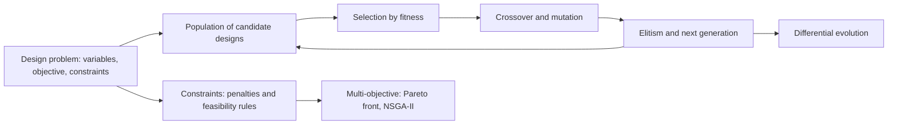

# Week 05: Evolutionary Computation for Engineering Design

**Artificial Intelligence Applications in Engineering (MUH-920 Mühendislikte Yapay Zeka Uygulamaları)** Prof. Dr. Utku Kose, Süleyman Demirel University

   

[Week 4](../week-04/README.md) | [All weeks](../../README.md#weekly-schedule) | [Week 6](../week-06/README.md)

## Overview

Design problems rarely come with gradients. The objective may be the output of a finite element model, a circuit simulator or a production line model; variables may be integers; and the landscape may have many local optima. Evolutionary algorithms search such spaces with a population of candidate designs that is improved by selection, recombination and mutation [1, 2, 3]. This week develops genetic algorithms and differential evolution, handles engineering constraints, and introduces multi-objective optimisation with Pareto fronts [4, 5, 6]. The running example is the minimum-mass design of a steel cantilever beam, whose optimum can also be found by hand, so that every algorithm can be checked against the truth.

**Estimated study time:** 9 to 11 hours.

## Learning outcomes

By the end of the week, students are expected to formulate a design problem with variables, objective and constraints, to explain selection, crossover, mutation and elitism in a genetic algorithm, to implement a real-coded genetic algorithm and use differential evolution from SciPy, to handle constraints with penalties and feasibility rules, to interpret convergence curves over several random seeds, and to construct and read a Pareto front of two conflicting objectives.

## Week at a glance

## Materials of the week

| Material | What it contains | Link |
|---|---|---|
| Lecture page | Six sections with formulas, seven worked examples, four knowledge checks, an animation, a figure and six review cards | [Open the lecture page](https://utkukose.github.io/ai-applications-in-engineering-NB-lecture/weeks/week-05/lecture.html) |
| Lecture notes | The printable version of the week: the lecture with its formulas and worked examples, Python step 5 and the outputs of its code, followed by the discipline challenges and the tasks | [Open the PDF](Week05_Lecture_Notes.pdf) |
| Interactive lab | *Evolution lab: Genetic algorithms, differential evolution and Pareto fronts*, with six interactive parts, a self-assessment of six questions, three reflection prompts and an exportable learning log | [Open the lab](https://utkukose.github.io/ai-applications-in-engineering-NB-lecture/weeks/week-05/lab.html) |
| Colab notebook | Python step 5: Random numbers, arrays and genetic operators, followed by six hands-on sections with exercises and immediate feedback | [Open in Colab](https://colab.research.google.com/github/utkukose/ai-applications-in-engineering-NB-lecture/blob/main/weeks/week-05/NB05_evolutionary_design.ipynb), [view on GitHub](NB05_evolutionary_design.ipynb) |

## Contents

| Lecture page | Colab notebook |
|---|---|
| [Optimisation problems in engineering design](https://utkukose.github.io/ai-applications-in-engineering-NB-lecture/weeks/week-05/lecture.html#optimisation-problems-in-engineering-design) | [Python step 5: Random numbers, arrays and genetic operators](https://colab.research.google.com/github/utkukose/ai-applications-in-engineering-NB-lecture/blob/main/weeks/week-05/NB05_evolutionary_design.ipynb#scrollTo=python-step) |
| [Genetic algorithms](https://utkukose.github.io/ai-applications-in-engineering-NB-lecture/weeks/week-05/lecture.html#genetic-algorithms) | [1. The design problem](https://colab.research.google.com/github/utkukose/ai-applications-in-engineering-NB-lecture/blob/main/weeks/week-05/NB05_evolutionary_design.ipynb#scrollTo=section-1) |
| [Differential evolution and other real-valued methods](https://utkukose.github.io/ai-applications-in-engineering-NB-lecture/weeks/week-05/lecture.html#differential-evolution-and-other-real-valued-methods) | [2. The design space](https://colab.research.google.com/github/utkukose/ai-applications-in-engineering-NB-lecture/blob/main/weeks/week-05/NB05_evolutionary_design.ipynb#scrollTo=section-2) |
| [Constraints](https://utkukose.github.io/ai-applications-in-engineering-NB-lecture/weeks/week-05/lecture.html#constraints) | [3. A real-coded genetic algorithm](https://colab.research.google.com/github/utkukose/ai-applications-in-engineering-NB-lecture/blob/main/weeks/week-05/NB05_evolutionary_design.ipynb#scrollTo=section-3) |
| [Multiple objectives and Pareto optimality](https://utkukose.github.io/ai-applications-in-engineering-NB-lecture/weeks/week-05/lecture.html#multiple-objectives-and-pareto-optimality) | [4. One run proves little: ten seeds](https://colab.research.google.com/github/utkukose/ai-applications-in-engineering-NB-lecture/blob/main/weeks/week-05/NB05_evolutionary_design.ipynb#scrollTo=section-4) |
| [Evolution at work](https://utkukose.github.io/ai-applications-in-engineering-NB-lecture/weeks/week-05/lecture.html#evolution-at-work) | [5. Differential evolution in SciPy](https://colab.research.google.com/github/utkukose/ai-applications-in-engineering-NB-lecture/blob/main/weeks/week-05/NB05_evolutionary_design.ipynb#scrollTo=section-5) |
| [Review cards](https://utkukose.github.io/ai-applications-in-engineering-NB-lecture/weeks/week-05/lecture.html#review-cards) | [6. Two objectives: mass and deflection](https://colab.research.google.com/github/utkukose/ai-applications-in-engineering-NB-lecture/blob/main/weeks/week-05/NB05_evolutionary_design.ipynb#scrollTo=section-6) |

## Study path

| Step | Activity | Suggested time |
|---|---|---|
| 1 | Read the [lecture page](https://utkukose.github.io/ai-applications-in-engineering-NB-lecture/weeks/week-05/lecture.html) and answer its knowledge checks, or read the [PDF notes](Week05_Lecture_Notes.pdf) | 2 hours |
| 2 | Explore the simulation of the [interactive lab](https://utkukose.github.io/ai-applications-in-engineering-NB-lecture/weeks/week-05/lab.html#explore) | 1 hour |
| 3 | Work through [Python step 5](https://colab.research.google.com/github/utkukose/ai-applications-in-engineering-NB-lecture/blob/main/weeks/week-05/NB05_evolutionary_design.ipynb#scrollTo=python-step) at the start of the Colab notebook | 1 hour |
| 4 | Continue with the hands-on sections of the [notebook](https://colab.research.google.com/github/utkukose/ai-applications-in-engineering-NB-lecture/blob/main/weeks/week-05/NB05_evolutionary_design.ipynb) and their exercises | 3 hours |
| 5 | Solve the [discipline challenge](#discipline-challenges) of your department | 1 hour |
| 6 | Take the [self-assessment](https://utkukose.github.io/ai-applications-in-engineering-NB-lecture/weeks/week-05/lab.html#check) in the lab | 20 minutes |
| 7 | Answer the [reflection prompts](https://utkukose.github.io/ai-applications-in-engineering-NB-lecture/weeks/week-05/lab.html#reflect), export the learning log and complete the [weekly task](#weekly-task) | 1 hour |

## Preview

<table><tr><td colspan="2"> Interactive lab: Evolution lab: Genetic algorithms, differential evolution and Pareto fronts</td></tr><tr><td width="50%"></td><td width="50%"></td></tr><tr><td colspan="2">Outputs of the executed Colab notebook</td></tr></table>

## Discipline challenges

Evolutionary algorithms need only a way to evaluate a design. Choose a row, write the objective and constraints as a Python function, and let the algorithms search.

| Department | Challenge |
|---|---|
| Civil Engineering | Minimum-cost reinforced concrete beam section with strength and serviceability constraints. |
| Mechanical Engineering | Spring or shaft design with stress, deflection and fatigue constraints. |
| Electrical and Electronics Engineering | Placement of capacitor banks in a distribution feeder to reduce losses. |
| Industrial Engineering | Job sequencing on a machine to minimise total tardiness, with a permutation chromosome. |
| Chemical Engineering | Operating temperature and residence time of a reactor that maximise yield under a safety limit. |
| Food Engineering | Blend of ingredients that meets nutritional targets at minimum cost. |
| Environmental Engineering | Location and capacity of monitoring stations or treatment units under a budget. |
| Mining Engineering | Blast pattern parameters that balance fragmentation and vibration. |
| Textile Engineering | Yarn blend proportions for target strength and cost. |
| Automotive Engineering | Gear ratios that trade acceleration against fuel consumption, as a two-objective problem. |
| Physics and Mathematics | Fitting parameters of a nonlinear model to data with a multimodal error surface, compared with gradient methods. |

## Weekly task

Formulate a design problem of your department with at least two variables and two constraints, solve it with the genetic algorithm of the notebook and with SciPy's differential evolution over at least five seeds each, and report the best, median and worst results with convergence curves. If the problem has two natural objectives, construct a Pareto front. Discuss the results in about 500 words and cite at least three works from this week's references [2, 4, 5].

## Research and report assignment (optional)

**Evolutionary design in engineering.** Review evolutionary or other population-based optimisation in one engineering field, such as structural optimisation, antenna and circuit design, process optimisation or scheduling. Discuss how constraints and multiple objectives were handled, how results were validated, and how the no free lunch theorems apply to the claims made [6, 7, 8].

Both assignments are optional. During an active semester, the weekly task can be sent together with the exported learning log, and the research report on its own, to utkukose@sdu.edu.tr or utkukose@gmail.com. They carry no separate weight, but the instructor may take them into account as a discretionary adjustment of the midterm component of the grade. The [assessment section of the syllabus](../../SYLLABUS.md#assessment) gives the details, and research reports use the [Word report template](../../exams/REPORT_TEMPLATE.docx).

## References

[1] Holland, J. H. (1992). *Adaptation in Natural and Artificial Systems* (2nd ed.). MIT Press. First edition 1975, University of Michigan Press.

[2] Goldberg, D. E. (1989). *Genetic Algorithms in Search, Optimization, and Machine Learning*. Addison-Wesley.

[3] Eiben, A. E., & Smith, J. E. (2015). *Introduction to Evolutionary Computing* (2nd ed.). Springer. <https://doi.org/10.1007/978-3-662-44874-8>

[4] Storn, R., & Price, K. (1997). Differential evolution: A simple and efficient heuristic for global optimization over continuous spaces. *Journal of Global Optimization*, *11*(4), 341-359. <https://doi.org/10.1023/A:1008202821328>

[5] Deb, K. (2000). An efficient constraint handling method for genetic algorithms. *Computer Methods in Applied Mechanics and Engineering*, *186*(2-4), 311-338. <https://doi.org/10.1016/S0045-7825(99)00389-8>

[6] Deb, K., Pratap, A., Agarwal, S., & Meyarivan, T. (2002). A fast and elitist multiobjective genetic algorithm: NSGA-II. *IEEE Transactions on Evolutionary Computation*, *6*(2), 182-197. <https://doi.org/10.1109/4235.996017>

[7] Wolpert, D. H., & Macready, W. G. (1997). No free lunch theorems for optimization. *IEEE Transactions on Evolutionary Computation*, *1*(1), 67-82. <https://doi.org/10.1109/4235.585893>

[8] Hornby, G. S., Lohn, J. D., & Linden, D. S. (2011). Computer-automated evolution of an X-band antenna for NASA's Space Technology 5 mission. *Evolutionary Computation*, *19*(1), 1-23. <https://doi.org/10.1162/EVCO_a_00005>

---

Artificial Intelligence Applications in Engineering. Prof. Dr. Utku Kose, Süleyman Demirel University. ORCID [0000-0002-9652-6415](https://orcid.org/0000-0002-9652-6415). Content licensed under CC BY 4.0, code under MIT. This course is updated in line with current developments in the field. Last update: October 2026.
