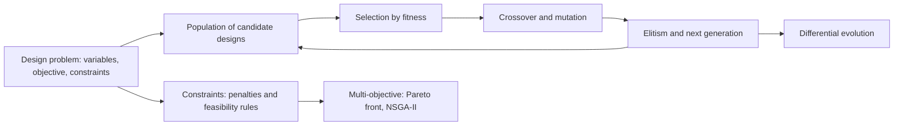
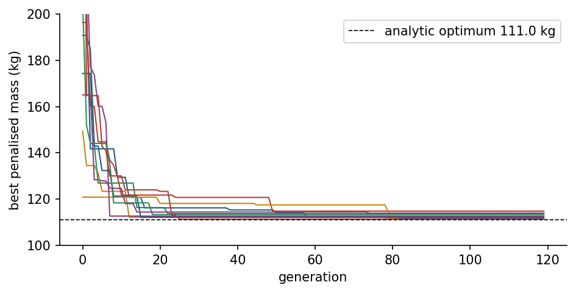
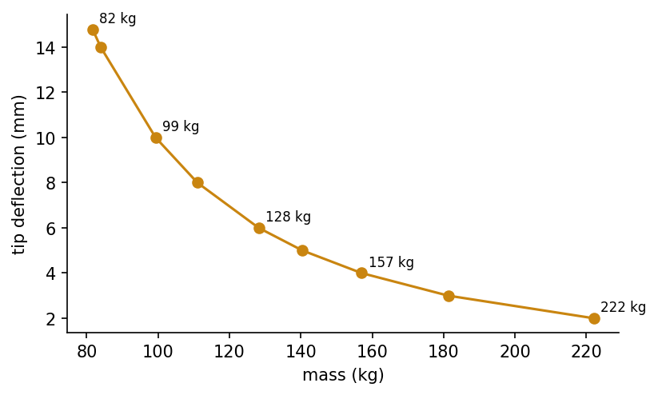
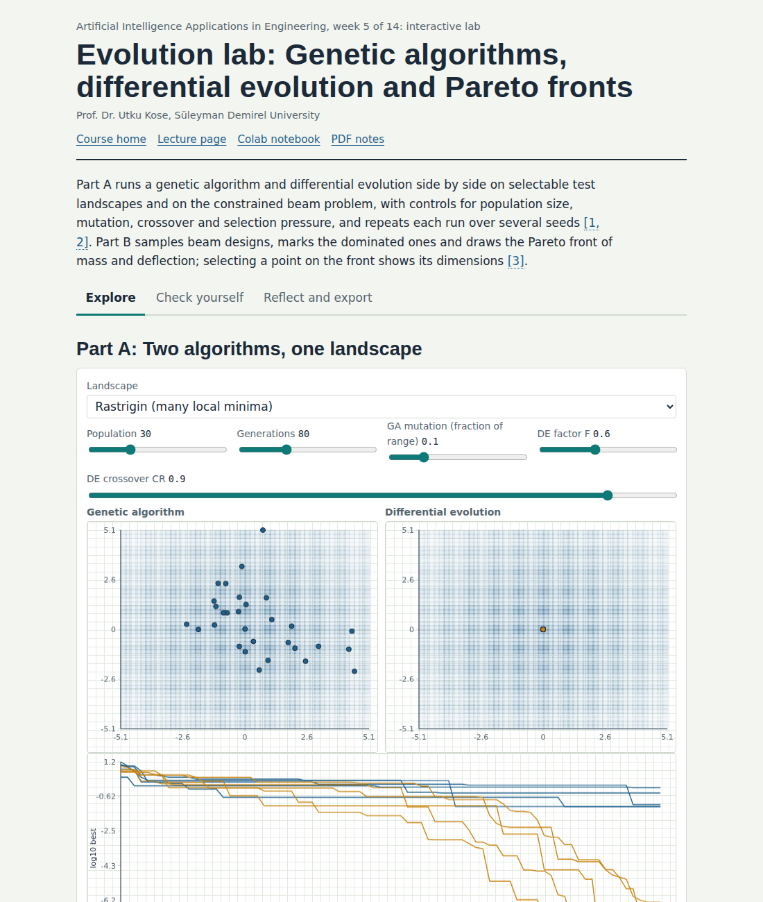
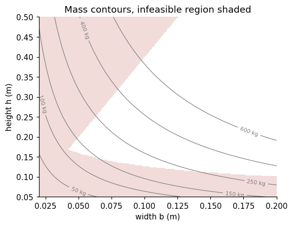
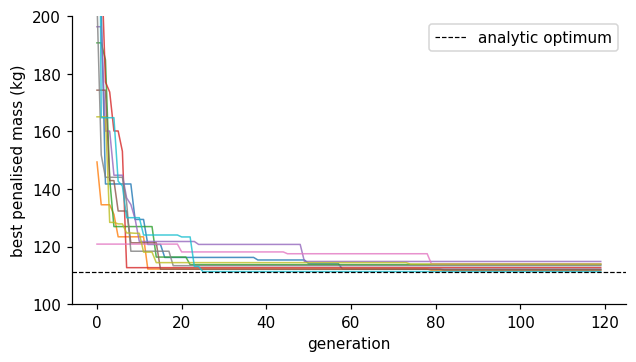

<div align="center">

# Week 05: Evolutionary Computation for Engineering Design

**Artificial Intelligence Applications in Engineering (MUH-920 Mühendislikte Yapay Zeka Uygulamaları)**  
Prof. Dr. Utku Kose, Süleyman Demirel University

[](https://colab.research.google.com/github/utkukose/ai-applications-in-engineering-NB-lecture/blob/main/weeks/week-05/NB05_evolutionary_design.ipynb) [](https://utkukose.github.io/ai-applications-in-engineering-NB-lecture/weeks/week-05/lab.html) [](https://utkukose.github.io/ai-applications-in-engineering-NB-lecture/weeks/week-05/lecture.html) [](Week05_Lecture_Notes.pdf)

</div>

## Overview

Design problems rarely come with gradients. The objective may be the output of a finite element model, a circuit simulator or a production line model; variables may be integers; and the landscape may have many local optima. Evolutionary algorithms search such spaces with a population of candidate designs that is improved by selection, recombination and mutation [2, 3, 4]. This week develops genetic algorithms and differential evolution, handles engineering constraints, and introduces multi-objective optimisation with Pareto fronts [5, 9, 11]. The running example is the minimum-mass design of a steel cantilever beam, whose optimum can also be found by hand, so that every algorithm can be checked against the truth.

**Estimated study time:** 9 to 11 hours.

## Learning outcomes

By the end of the week, students are expected to formulate a design problem with variables, objective and constraints, to explain selection, crossover, mutation and elitism in a genetic algorithm, to implement a real-coded genetic algorithm and use differential evolution from SciPy, to handle constraints with penalties and feasibility rules, to interpret convergence curves over several random seeds, and to construct and read a Pareto front of two conflicting objectives.

## Python in this week

The lecture ends with Python step 5: Random numbers, arrays and genetic operators. It covers reproducible random numbers, two-dimensional arrays, sorting and boolean selection, list comprehensions and lambda functions, and crossover, mutation and elitism in a short genetic algorithm, applied to a population of beam designs [2, 13]. The hands-on part of the notebook opens with the same step as runnable cells and short exercises with immediate feedback, and its later sections mark further constructs as Python moves.

## Study path

| Step | Activity | Suggested time |
|---|---|---|
| 1 | Read the lecture with its animations on the [lecture page](https://utkukose.github.io/ai-applications-in-engineering-NB-lecture/weeks/week-05/lecture.html), or read the [PDF version](Week05_Lecture_Notes.pdf) | 2 hours |
| 2 | Explore the [interactive lab](https://utkukose.github.io/ai-applications-in-engineering-NB-lecture/weeks/week-05/lab.html) | 1 hour |
| 3 | Study the Python step at the end of the lecture, then run the same step at the start of the hands-on part of the [Colab notebook](https://colab.research.google.com/github/utkukose/ai-applications-in-engineering-NB-lecture/blob/main/weeks/week-05/NB05_evolutionary_design.ipynb) | 1 hour |
| 4 | Work through the rest of the notebook, including its Python moves and exercises | 3 hours |
| 5 | Solve the discipline challenge of your department | 1 hour |
| 6 | Take the self-assessment in the lab (tab: Check yourself) | 20 minutes |
| 7 | Write the reflection, export the learning log and complete the weekly task | 1 hour |

## Week at a glance



## Lecture

### Optimisation problems in engineering design

An optimisation problem has design variables, an objective to minimise or maximise, and constraints that a design must satisfy. For a beam, the variables may be the width and height of the cross-section, the objective its mass, and the constraints limits on stress and deflection. Many engineering objectives are black boxes: They are evaluated by a simulation, have no usable gradient, are noisy, or mix continuous and integer variables. Landscapes with many local optima defeat gradient methods that start from a single point.

Population-based metaheuristics address these difficulties by sampling many designs at once and moving the population towards better regions. They make few assumptions about the problem, which is their strength and their limit: The no free lunch theorems show that, averaged over all possible problems, no search algorithm outperforms any other [1]. An algorithm performs well only when its search behaviour matches the structure of the problem, so engineering knowledge about variables, scales and constraints remains decisive.

<details>
<summary><b>Check your understanding.</b> Why are gradient-based methods often unsuitable for the design objectives targeted by evolutionary algorithms?</summary>

A. Gradients are always zero in engineering problems  
B. The objective may be a black-box simulation with integer variables, noise and many local optima  
C. Evolutionary algorithms always find the global optimum  
D. Gradient methods cannot handle more than two variables

**Answer: B.** Black-box objectives, discrete variables and multimodality make gradients unavailable or misleading.

</details>

### Genetic algorithms

Holland described adaptation in natural and artificial systems as the evolution of a population under selection and recombination [2], and Goldberg popularised genetic algorithms as practical search and optimisation tools [3]. A genetic algorithm encodes a design as a chromosome, which may be a bit string, a vector of real numbers or a permutation. A fitness function scores each chromosome. Selection chooses parents with a preference for fitter individuals: In tournament selection, a few individuals are drawn at random and the best of them becomes a parent. Crossover combines two parents into offspring, for example by exchanging parts of their chromosomes or by blending their real values. Mutation makes small random changes that keep diversity in the population. Elitism copies the best individuals unchanged into the next generation, so that the best design found is never lost.

The balance between exploration and exploitation governs performance. Strong selection pressure and small mutations converge quickly but risk premature convergence to a local optimum; weak pressure and large mutations explore widely but converge slowly. Population size, tournament size, crossover and mutation rates are therefore design parameters of the algorithm itself, and their effect must be judged over several independent runs, because a single run of a stochastic algorithm proves little [4].

> **Animation: A genetic algorithm on a multimodal landscape.** Each dot is a candidate design on a landscape with many local minima. Press play and watch selection concentrate the population while mutation keeps exploring. Increase the mutation strength to see exploration win over exploitation. Run it in the [web version of the lecture](https://utkukose.github.io/ai-applications-in-engineering-NB-lecture/weeks/week-05/lecture.html#anim-ga).



*Figure 5.1. Best objective value over generations for ten independent runs of a real-coded genetic algorithm on the beam design problem. The spread between runs is part of the result.*

<details>
<summary><b>Check your understanding.</b> What is the role of elitism in a genetic algorithm?</summary>

A. It increases the mutation rate for the best individuals  
B. It copies the best individuals unchanged to the next generation so the best design is never lost  
C. It removes the best individuals to preserve diversity  
D. It selects parents uniformly at random

**Answer: B.** Without elitism, crossover and mutation can destroy the best design found so far.

</details>

### Differential evolution and other real-valued methods

Differential evolution, proposed by Storn and Price, is a simple and effective method for continuous variables [5]. For each member of the population it builds a mutant vector by adding a scaled difference of two random members to a third, v = a + F (b - c), mixes the mutant with the current member by crossover with rate CR, and keeps the trial vector only if it is at least as good. Because the differences between population members shrink as the population converges, the step size adapts automatically to the scale of the landscape. SciPy provides a mature implementation with bounds and constraints [6].

Evolution strategies adapt a distribution of mutations instead. The covariance matrix adaptation evolution strategy, CMA-ES, learns the shape of promising regions and is among the most reliable methods for difficult continuous problems of moderate dimension [7]. Simulated annealing, met in Week 2, is a single-solution relative of these methods [8].

### Constraints

Engineering designs must be feasible. A penalty function adds to the objective a term that grows with the amount of constraint violation, which turns a constrained problem into an unconstrained one; the difficulty is choosing the weight of the penalty. Deb's feasibility rules avoid weights altogether: A feasible design always beats an infeasible one, two feasible designs are compared by objective, and two infeasible designs are compared by their total violation [9]. Repair operators that move an infeasible design back into the feasible region are useful when the constraint structure is known, and variable bounds are usually enforced directly.

For the cantilever beam of the notebook, a tip load P acts on a rectangular section of width b and height h. The maximum bending stress is 6 P L / (b h squared) and the tip deflection is 4 P L cubed / (E b h cubed) [10]. Minimising mass subject to limits on stress, deflection and the ratio h / b produces an optimum on the boundary of the feasible region, where the deflection limit and the ratio limit are both active. This optimum can be derived by hand, which makes the problem a good benchmark for the algorithms.

<details>
<summary><b>Check your understanding.</b> Under Deb&#x27;s feasibility rules, how are two infeasible designs compared?</summary>

A. By their objective values  
B. By their total constraint violation  
C. Randomly  
D. They are both discarded

**Answer: B.** Among infeasible designs, the one closer to feasibility wins, which guides the search towards the feasible region [9].

</details>

### Multiple objectives and Pareto optimality

Real designs trade off several objectives: mass against stiffness, cost against reliability, efficiency against noise. A design dominates another if it is no worse in every objective and better in at least one. The designs that no other design dominates form the Pareto set, and their objective values form the Pareto front. The engineer, not the algorithm, chooses a design from the front by weighing the objectives. NSGA-II finds approximations of the front in one run by ranking the population into non-dominated fronts and preserving spread with a crowding distance [11]. Simpler methods repeat single-objective optimisation, for example minimising mass for a sequence of deflection limits, which is how the notebook builds its front.



*Figure 5.2. Pareto front of beam designs that trade mass against tip deflection, obtained by minimising mass for a sequence of deflection limits.*

### Evolution at work

Evolutionary computation has produced designs that engineers would hardly have proposed by hand. An X-band antenna evolved at NASA for the Space Technology 5 mission met demanding requirements and flew in space in 2006 [12]. Structural shapes, truss topologies, electrical machines, chemical process conditions and production schedules are routinely optimised with genetic algorithms, differential evolution and their relatives [4]. Week 6 continues with swarm intelligence, which replaces biological evolution by the collective behaviour of birds, ants and bees.

<details>
<summary><b>Check your understanding.</b> Design A has mass 100 kg and deflection 6 mm. Design B has mass 110 kg and deflection 6 mm. Which statement holds?</summary>

A. B dominates A  
B. A dominates B  
C. Neither dominates the other  
D. Both are infeasible

**Answer: B.** A is better in mass and equal in deflection, so it dominates B.

</details>

<!-- python-step -->

### Python step 5: Random numbers, arrays and genetic operators

#### Reproducible randomness

Evolutionary algorithms draw random numbers at every step, so repeated runs give different results. A random number generator created with `np.random.default_rng(seed)` produces the same sequence every time it starts from the same seed. Fixed seeds make experiments repeatable, and comparing algorithms over several seeds shows how much of a difference is due to chance.

```python
import numpy as np

gen = np.random.default_rng(42)
print(gen.uniform(0.1, 0.5, size=3))      # three numbers between 0.1 and 0.5
print(gen.integers(1, 7, size=5))         # five dice rolls from 1 to 6
again = np.random.default_rng(42)
print(again.uniform(0.1, 0.5, size=3))    # the same three numbers as the first line
```

*Output*

```text
[0.40958242 0.27555138 0.44343917]
[1 5 2 1 4]
[0.40958242 0.27555138 0.44343917]
```

#### A population as a two-dimensional array

A population of candidate designs fits in a two-dimensional array: Each row is one design, and each column is one design variable. For a rectangular steel beam, the columns hold the width b and the height h of the section. `pop[:, 0]` selects the first column of all rows, and formulas written with arrays evaluate the whole population at once. The beam below spans 5 m and carries a bending moment of 25 kN m, and the bending stress of a rectangular section is 6 M / (b h^2).

```python
L_m, M_Nm, rho, allow_Pa = 5.0, 25e3, 7850.0, 150e6
pop = gen.uniform([0.02, 0.05], [0.20, 0.40], size=(8, 2))   # columns: b and h in metres
b, h = pop[:, 0], pop[:, 1]
mass = rho * b * h * L_m                   # kg
stress = 6 * M_Nm / (b * h ** 2)           # Pa
feasible = stress <= allow_Pa
print(pop.shape, feasible)
print(np.round(mass, 1))
```

*Output*

```text
(8, 2) [ True  True  True  True  True False  True  True]
[2003.6  350.9 1274.6 1802.7  507.5  340.2 1797.9 1069. ]
```

`25e3` is scientific notation for 25000. The bounds are given per column, so the generator draws widths between 0.02 and 0.20 m and heights between 0.05 and 0.40 m.

#### Sorting and selection

`np.argsort` returns the positions that would sort an array from the smallest to the largest value. Indexing an array with these positions reorders its rows, and slicing keeps the best few. Infeasible designs receive a penalty that grows with the violation of the stress limit, a common way to handle constraints in evolutionary search.

```python
violation = np.maximum(stress / allow_Pa - 1, 0)    # 0 for feasible designs
fitness = mass * (1 + 10 * violation)               # penalised mass
order = np.argsort(fitness)                         # positions from best to worst
best3 = pop[order[:3]]
print(order)
print(np.round(best3, 3))
```

*Output*

```text
[1 4 7 2 6 3 0 5]
[[0.043 0.208]
 [0.1   0.13 ]
 [0.156 0.174]]
```

#### Comprehensions and lambda functions

A list comprehension builds a list in one line, in the form `[expression for item in sequence if condition]`, and replaces a loop that appends to a list. A lambda is a short function without a name, often used as a sorting key. `min` with the `key` argument returns the item whose key is smallest.

```python
labels = [f"b={bb:.2f} h={hh:.2f}" for bb, hh in pop[:3]]
print(labels)
light = [i for i in range(len(pop)) if mass[i] < 500]
print("designs lighter than 500 kg:", light)
area = lambda bb, hh: bb * hh
print(np.round(min(pop, key=lambda d: area(d[0], d[1])), 3))
```

*Output*

```text
['b=0.16 h=0.33', 'b=0.04 h=0.21', 'b=0.09 h=0.37']
designs lighter than 500 kg: [1, 5]
[0.12  0.072]
```

#### Crossover, mutation and one generation

Selection alone only reorders existing designs. Genetic algorithms create new ones with two operators [2]. Crossover mixes two parents: For real-valued variables, arithmetic crossover takes a weighted mean, child = alpha parent1 + (1 - alpha) parent2, with a random weight alpha between 0 and 1. Mutation adds a small random change to each variable, and `np.clip` pulls values that leave the allowed range back to the nearest bound.

```python
low, high = np.array([0.02, 0.05]), np.array([0.20, 0.40])
p1, p2 = pop[order[0]], pop[order[1]]                  # the two best designs as parents
alpha = gen.uniform(0, 1)
child = alpha * p1 + (1 - alpha) * p2                  # arithmetic crossover
child = child + gen.normal(0, [0.005, 0.01])           # Gaussian mutation, one scale per variable
child = np.clip(child, low, high)                      # stay inside the bounds
print(np.round(p1, 3), np.round(p2, 3), "->", np.round(child, 3))
```

*Output*

```text
[0.043 0.208] [0.1  0.13] -> [0.044 0.201]
```

A function that returns the penalised mass of a whole population lets the operators run in a loop. The loop below evolves 20 designs for 60 generations. The best five designs survive unchanged, which is called elitism and guarantees that the best design found so far is never lost, and fifteen children of randomly chosen parents from the better half fill the rest of the population. `np.vstack` stacks the survivors and the children into the next population.

```python
def penalised_mass(P):
    """Penalised mass in kg of every design (row) of P."""
    m = rho * P[:, 0] * P[:, 1] * L_m
    s = 6 * M_Nm / (P[:, 0] * P[:, 1] ** 2)
    return m * (1 + 10 * np.maximum(s / allow_Pa - 1, 0))

evo = np.random.default_rng(1)
P = evo.uniform(low, high, size=(20, 2))
for g in range(60):
    P = P[np.argsort(penalised_mass(P))]                # best design first
    kids = []
    for _ in range(15):
        a, b_ = P[evo.choice(10, size=2, replace=False)]
        w = evo.uniform(0, 1)
        kids.append(np.clip(w * a + (1 - w) * b_ + evo.normal(0, [0.002, 0.005]), low, high))
    P = np.vstack([P[:5], kids])                        # elitism: the best five survive unchanged
    if g % 20 == 0:
        print(f"generation {g:2d}: best penalised mass {penalised_mass(P).min():.1f} kg")
best = P[np.argmin(penalised_mass(P))]
print(f"best design: b = {best[0]:.3f} m, h = {best[1]:.3f} m, mass {penalised_mass(best[None, :])[0]:.1f} kg")
```

*Output*

```text
generation  0: best penalised mass 250.2 kg
generation 20: best penalised mass 175.6 kg
generation 40: best penalised mass 175.6 kg
best design: b = 0.020 m, h = 0.224 m, mass 175.6 kg
```

A hand calculation gives the lightest feasible section of this problem: The width sits at its lower bound of 0.02 m, and the height just satisfies the stress limit, h = 0.224 m, for a mass of 175.5 kg. The genetic algorithm approaches this design from random starting points without any derivative, which is what makes it useful when no formula for the optimum exists.

<details>
<summary><b>Check your understanding.</b> What does [x ** 2 for x in range(4) if x % 2 == 0] produce?</summary>

A. [0, 4]  
B. [0, 1, 4, 9]  
C. [4]  
D. [1, 9]

**Answer: A.** range(4) yields 0, 1, 2 and 3. Only 0 and 2 are even, and their squares are 0 and 4.

</details>

<!-- /python-step -->

## Discipline challenges

Evolutionary algorithms need only a way to evaluate a design. Choose a row, write the objective and constraints as a Python function, and let the algorithms search.

| Department | Challenge |
|---|---|
| Civil Engineering | Minimum-cost reinforced concrete beam section with strength and serviceability constraints. |
| Mechanical Engineering | Spring or shaft design with stress, deflection and fatigue constraints. |
| Electrical and Electronics Engineering | Placement of capacitor banks in a distribution feeder to reduce losses. |
| Industrial Engineering | Job sequencing on a machine to minimise total tardiness, with a permutation chromosome. |
| Chemical Engineering | Operating temperature and residence time of a reactor that maximise yield under a safety limit. |
| Food Engineering | Blend of ingredients that meets nutritional targets at minimum cost. |
| Environmental Engineering | Location and capacity of monitoring stations or treatment units under a budget. |
| Mining Engineering | Blast pattern parameters that balance fragmentation and vibration. |
| Textile Engineering | Yarn blend proportions for target strength and cost. |
| Automotive Engineering | Gear ratios that trade acceleration against fuel consumption, as a two-objective problem. |
| Physics and Mathematics | Fitting parameters of a nonlinear model to data with a multimodal error surface, compared with gradient methods. |

## Interactive lab

Part A runs a genetic algorithm and differential evolution side by side on selectable test landscapes and on the constrained beam problem, with controls for population size, mutation, crossover and selection pressure, and repeats each run over several seeds [3, 5]. Part B samples beam designs, marks the dominated ones and draws the Pareto front of mass and deflection; selecting a point on the front shows its dimensions [11].

[Open the interactive lab](https://utkukose.github.io/ai-applications-in-engineering-NB-lecture/weeks/week-05/lab.html)



## Colab notebook

The notebook defines the beam design problem from the formulas of mechanics of materials [10], derives its optimum by hand, and then solves it with a real-coded genetic algorithm written from scratch and with SciPy's differential evolution [6]. It compares penalty handling with Deb's feasibility rules, studies convergence over ten seeds and builds a Pareto front of mass against deflection by repeated constrained optimisation.

[](https://colab.research.google.com/github/utkukose/ai-applications-in-engineering-NB-lecture/blob/main/weeks/week-05/NB05_evolutionary_design.ipynb)

Screenshots of the executed notebook:





## Self-assessment and reflection

The lab contains a 6-question self-assessment with instant feedback and a confidence rating for each answer. A confident but wrong answer marks the first topic to revisit. The reflection prompts below are also available in the lab, where answers are saved in the browser and can be exported as a learning log.

1. Which design problem in your department has a black-box objective? What would one evaluation cost in time?
2. Your genetic algorithm found a design 2 percent heavier than the analytic optimum in one run. What else do you need to know before judging it?
3. Which NumPy operation replaced the most loop code this week, and how did you check that it did what you intended?

## Weekly task and submission

Formulate a design problem of your department with at least two variables and two constraints, solve it with the genetic algorithm of the notebook and with SciPy's differential evolution over at least five seeds each, and report the best, median and worst results with convergence curves. If the problem has two natural objectives, construct a Pareto front. Discuss the results in about 500 words and cite at least three works from this week's references [3, 5, 9].

The weekly task is optional and supports self-learning and a personal portfolio. During an active semester, it can be sent together with the exported learning log to utkukose@sdu.edu.tr or utkukose@gmail.com. Optional work carries no separate weight, but the instructor may take it into account as a discretionary adjustment of the midterm component of the grade.

## Research and report assignment (optional)

**Evolutionary design in engineering.** Review evolutionary or other population-based optimisation in one engineering field, such as structural optimisation, antenna and circuit design, process optimisation or scheduling. Discuss how constraints and multiple objectives were handled, how results were validated, and how the no free lunch theorems apply to the claims made [1, 11, 12].

This research assignment is optional and supports self-learning. When the related weeks are followed within the course during an active semester, the report can be sent to utkukose@sdu.edu.tr or utkukose@gmail.com. It carries no separate weight, but the instructor may take it into account as a discretionary adjustment of the midterm component of the grade. Unless the assignment states otherwise, a report has 1500 to 2500 words, follows the structure of an academic paper, cites at least six scholarly or official sources in square brackets and uses the template in `exams/REPORT_TEMPLATE.md`.

## References

[1] Wolpert, D. H., & Macready, W. G. (1997). No free lunch theorems for optimization. *IEEE Transactions on Evolutionary Computation*, *1*(1), 67-82. <https://doi.org/10.1109/4235.585893>

[2] Holland, J. H. (1992). *Adaptation in Natural and Artificial Systems* (2nd ed.). MIT Press. First edition 1975, University of Michigan Press.

[3] Goldberg, D. E. (1989). *Genetic Algorithms in Search, Optimization, and Machine Learning*. Addison-Wesley.

[4] Eiben, A. E., & Smith, J. E. (2015). *Introduction to Evolutionary Computing* (2nd ed.). Springer. <https://doi.org/10.1007/978-3-662-44874-8>

[5] Storn, R., & Price, K. (1997). Differential evolution: A simple and efficient heuristic for global optimization over continuous spaces. *Journal of Global Optimization*, *11*(4), 341-359. <https://doi.org/10.1023/A:1008202821328>

[6] Virtanen, P., Gommers, R., Oliphant, T. E., et al. (2020). SciPy 1.0: Fundamental algorithms for scientific computing in Python. *Nature Methods*, *17*(3), 261-272. <https://doi.org/10.1038/s41592-019-0686-2>

[7] Hansen, N., & Ostermeier, A. (2001). Completely derandomized self-adaptation in evolution strategies. *Evolutionary Computation*, *9*(2), 159-195. <https://doi.org/10.1162/106365601750190398>

[8] Kirkpatrick, S., Gelatt, C. D., & Vecchi, M. P. (1983). Optimization by simulated annealing. *Science*, *220*(4598), 671-680. <https://doi.org/10.1126/science.220.4598.671>

[9] Deb, K. (2000). An efficient constraint handling method for genetic algorithms. *Computer Methods in Applied Mechanics and Engineering*, *186*(2-4), 311-338. <https://doi.org/10.1016/S0045-7825(99)00389-8>

[10] Gere, J. M., & Goodno, B. J. (2013). *Mechanics of Materials* (8th ed.). Cengage Learning.

[11] Deb, K., Pratap, A., Agarwal, S., & Meyarivan, T. (2002). A fast and elitist multiobjective genetic algorithm: NSGA-II. *IEEE Transactions on Evolutionary Computation*, *6*(2), 182-197. <https://doi.org/10.1109/4235.996017>

[12] Hornby, G. S., Lohn, J. D., & Linden, D. S. (2011). Computer-automated evolution of an X-band antenna for NASA's Space Technology 5 mission. *Evolutionary Computation*, *19*(1), 1-23. <https://doi.org/10.1162/EVCO_a_00005>

[13] Harris, C. R., Millman, K. J., van der Walt, S. J., et al. (2020). Array programming with NumPy. *Nature*, *585*(7825), 357-362. <https://doi.org/10.1038/s41586-020-2649-2>

---

<sub>Artificial Intelligence Applications in Engineering. Prof. Dr. Utku Kose, Süleyman Demirel University. ORCID [0000-0002-9652-6415](https://orcid.org/0000-0002-9652-6415). Content licensed under CC BY 4.0, code under MIT. This course is updated in line with current developments in the field. Last update: September 2026.</sub>
