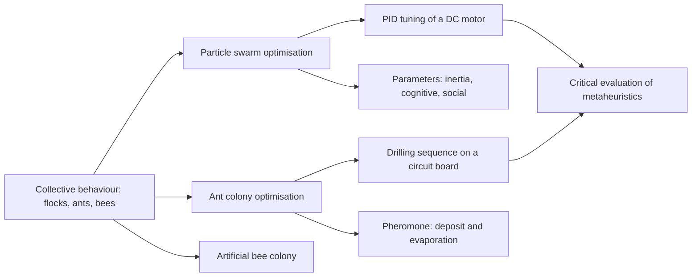
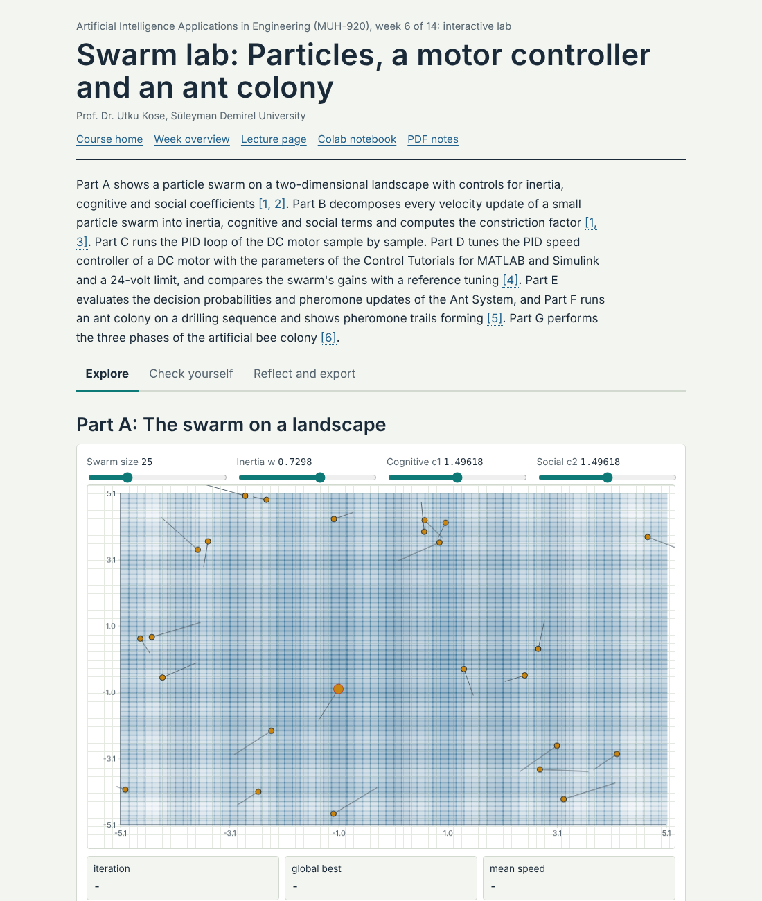
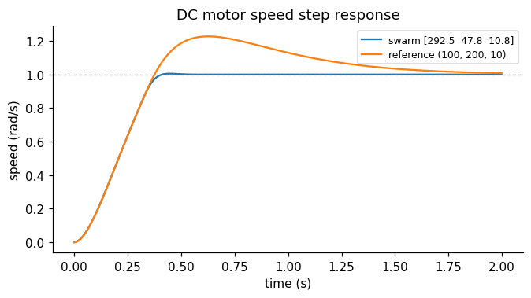
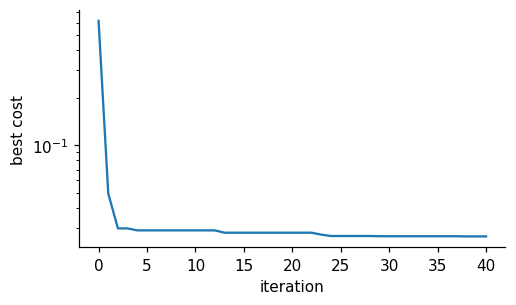

# Week 06: Swarm Intelligence: Particles, Ants and Bees

**Artificial Intelligence Applications in Engineering (MUH-920 Mühendislikte Yapay Zeka Uygulamaları)** Prof. Dr. Utku Kose, Süleyman Demirel University

   

[Week 5](../week-05/README.md) | [All weeks](../../README.md#weekly-schedule) | [Week 7](../week-07/README.md)

## Overview

Flocks, ant colonies and bee hives solve problems that no individual could solve alone, using simple local rules and indirect communication. Swarm intelligence turns these mechanisms into optimisation algorithms [1]. Particle swarm optimisation moves candidate solutions through a continuous space under the pull of their own best and the swarm's best positions [2], ant colony optimisation builds tours with pheromone trails [3, 4], and the artificial bee colony algorithm divides the search among employed, onlooker and scout bees [5]. This week tunes a PID speed controller of a DC motor with a particle swarm, plans a drilling sequence for a circuit board with ants, and asks how to judge the many nature-inspired algorithms critically [6].

**Estimated study time:** 9 to 11 hours.

> **Midterm project.** The midterm project is released this week and is due at the end of Week 7. It applies search, knowledge-based and fuzzy systems, and evolutionary and swarm optimisation to a problem of the student's department, and it counts 40 percent of the course grade. The [project page](https://github.com/utkukose/ai-applications-in-engineering-NB-lecture/blob/main/exams/midterm/README.md) describes the three options, the starter notebooks, the deliverables and the evaluation criteria.

## Learning outcomes

By the end of the week, students are expected to explain the velocity and position update of particle swarm optimisation and the role of inertia, cognitive and social coefficients, to implement a particle swarm as a Python class, to formulate controller tuning as an optimisation problem with a time-domain cost, to explain how pheromone deposit and evaporation guide ant colony optimisation, to apply it to a sequencing problem, and to evaluate claims about new metaheuristics with sound experimental practice.

## Week at a glance

## Materials of the week

| Material | What it contains | Link |
|---|---|---|
| Lecture page | Five sections with formulas, six worked examples, four knowledge checks, an animation and six review cards | [Open the lecture page](https://utkukose.github.io/ai-applications-in-engineering-NB-lecture/weeks/week-06/lecture.html) |
| Lecture notes | The printable version of the week: the lecture with its formulas and worked examples, Python step 6 and the outputs of its code, followed by the discipline challenges and the tasks | [Open the PDF](Week06_Lecture_Notes.pdf) |
| Interactive lab | *Swarm lab: Particles, a motor controller and an ant colony*, with seven interactive parts, a self-assessment of six questions, three reflection prompts and an exportable learning log | [Open the lab](https://utkukose.github.io/ai-applications-in-engineering-NB-lecture/weeks/week-06/lab.html) |
| Colab notebook | Python step 6: Classes, objects and probabilistic choice, followed by five hands-on sections with exercises and immediate feedback | [Open in Colab](https://colab.research.google.com/github/utkukose/ai-applications-in-engineering-NB-lecture/blob/main/weeks/week-06/NB06_swarm_intelligence.ipynb), [view on GitHub](NB06_swarm_intelligence.ipynb) |

## Contents

| Lecture page | Colab notebook |
|---|---|
| [Collective behaviour as computation](https://utkukose.github.io/ai-applications-in-engineering-NB-lecture/weeks/week-06/lecture.html#collective-behaviour-as-computation) | [Python step 6: Classes, objects and probabilistic choice](https://colab.research.google.com/github/utkukose/ai-applications-in-engineering-NB-lecture/blob/main/weeks/week-06/NB06_swarm_intelligence.ipynb#scrollTo=python-step) |
| [Particle swarm optimisation](https://utkukose.github.io/ai-applications-in-engineering-NB-lecture/weeks/week-06/lecture.html#particle-swarm-optimisation) | [1. One velocity update by hand](https://colab.research.google.com/github/utkukose/ai-applications-in-engineering-NB-lecture/blob/main/weeks/week-06/NB06_swarm_intelligence.ipynb#scrollTo=section-1) |
| [Tuning a PID controller with a swarm](https://utkukose.github.io/ai-applications-in-engineering-NB-lecture/weeks/week-06/lecture.html#tuning-a-pid-controller-with-a-swarm) | [2. A particle swarm as a class](https://colab.research.google.com/github/utkukose/ai-applications-in-engineering-NB-lecture/blob/main/weeks/week-06/NB06_swarm_intelligence.ipynb#scrollTo=section-2) |
| [Ant colony optimisation](https://utkukose.github.io/ai-applications-in-engineering-NB-lecture/weeks/week-06/lecture.html#ant-colony-optimisation) | [3. The DC motor speed loop](https://colab.research.google.com/github/utkukose/ai-applications-in-engineering-NB-lecture/blob/main/weeks/week-06/NB06_swarm_intelligence.ipynb#scrollTo=section-3) |
| [Artificial bee colony and the metaphor question](https://utkukose.github.io/ai-applications-in-engineering-NB-lecture/weeks/week-06/lecture.html#artificial-bee-colony-and-the-metaphor-question) | [4. Tuning with the swarm](https://colab.research.google.com/github/utkukose/ai-applications-in-engineering-NB-lecture/blob/main/weeks/week-06/NB06_swarm_intelligence.ipynb#scrollTo=section-4) |
| [Review cards](https://utkukose.github.io/ai-applications-in-engineering-NB-lecture/weeks/week-06/lecture.html#review-cards) | [5. An ant colony for a drilling sequence](https://colab.research.google.com/github/utkukose/ai-applications-in-engineering-NB-lecture/blob/main/weeks/week-06/NB06_swarm_intelligence.ipynb#scrollTo=section-5) |

The links of the notebook column open the notebook at the chosen part. Most parts use the setup cell and the results of the parts above them: Runtime > Run before (Ctrl+F8) in Colab runs those cells first. If they have not run in the current session, the first code cell of the part stops with a message.

## Study path

| Step | Activity | Suggested time |
|---|---|---|
| 1 | Read the [lecture page](https://utkukose.github.io/ai-applications-in-engineering-NB-lecture/weeks/week-06/lecture.html) and answer its knowledge checks, or read the [PDF notes](Week06_Lecture_Notes.pdf) | 2 hours |
| 2 | Explore the simulation of the [interactive lab](https://utkukose.github.io/ai-applications-in-engineering-NB-lecture/weeks/week-06/lab.html#explore) | 1 hour |
| 3 | Work through [Python step 6](https://colab.research.google.com/github/utkukose/ai-applications-in-engineering-NB-lecture/blob/main/weeks/week-06/NB06_swarm_intelligence.ipynb#scrollTo=python-step) at the start of the Colab notebook, after running its setup cell | 1 hour |
| 4 | Continue with the hands-on sections of the [notebook](https://colab.research.google.com/github/utkukose/ai-applications-in-engineering-NB-lecture/blob/main/weeks/week-06/NB06_swarm_intelligence.ipynb) and their exercises | 3 hours |
| 5 | Solve the [discipline challenge](#discipline-challenges) of your department | 1 hour |
| 6 | Take the [self-assessment](https://utkukose.github.io/ai-applications-in-engineering-NB-lecture/weeks/week-06/lab.html#check) in the lab | 20 minutes |
| 7 | Answer the [reflection prompts](https://utkukose.github.io/ai-applications-in-engineering-NB-lecture/weeks/week-06/lab.html#reflect), export the learning log and complete the [weekly task](#weekly-task) | 1 hour |

## Preview

<table><tr><td colspan="2"> Interactive lab: Swarm lab: Particles, a motor controller and an ant colony</td></tr><tr><td width="50%"></td><td width="50%"></td></tr><tr><td colspan="2">Outputs of the executed Colab notebook</td></tr></table>

## Discipline challenges

Swarms tune continuous parameters and ants build sequences. Choose a row, write the cost function, and compare the swarm with a simple baseline.

| Department | Challenge |
|---|---|
| Electrical and Electronics Engineering | PID tuning of a DC motor or of a buck converter output voltage loop, as in the notebook. |
| Mechanical Engineering and Automotive Engineering | Suspension damping and stiffness that trade comfort against road holding. |
| Industrial Engineering | Vehicle routing for deliveries from a depot with ant colony optimisation. |
| Computer Engineering | Routing in a communication network or task allocation among cores with ants. |
| Civil Engineering | Size optimisation of a planar truss with stress constraints using PSO. |
| Environmental Engineering | Calibration of a river water-quality model to measured oxygen profiles. |
| Mining Engineering | Sequencing of blast holes or of stope extraction with ants. |
| Geophysical Engineering | Inversion of a layered-earth resistivity model from sounding curves with PSO. |
| Chemical Engineering and Chemistry | Estimation of kinetic parameters of a reaction from concentration curves. |
| Textile Engineering | Cutting-order planning and marker layout sequencing. |
| Biology and Statistics | Parameter estimation of a population growth model, compared with least squares. |

## Weekly task

Apply particle swarm optimisation or ant colony optimisation to a problem from your department. For a continuous problem, compare PSO with differential evolution from Week 5 under the same evaluation budget over ten seeds. For a sequencing problem, compare the ant colony with the nearest-neighbour heuristic. Report the setup, a convergence plot and a statistical summary in about 500 words, citing at least three works from this week's references [2, 3, 6].

## Research and report assignment (optional)

**Swarm intelligence in engineering practice.** Review applications of particle swarm, ant colony or bee colony algorithms in one field, such as power systems, structural design, logistics or controller tuning. Assess the quality of the experimental comparisons in the reviewed papers against the criteria of Sörensen and against the no free lunch theorems [6, 7, 8].

Both assignments are optional. During an active semester, the weekly task can be sent together with the exported learning log, and the research report on its own, to utkukose@sdu.edu.tr or utkukose@gmail.com. They carry no separate weight, but the instructor may take them into account as a discretionary adjustment of the midterm component of the grade. The [assessment section of the syllabus](../../SYLLABUS.md#assessment) gives the details, and research reports use the [Word report template](../../exams/REPORT_TEMPLATE.docx).

## References

[1] Bonabeau, E., Dorigo, M., & Theraulaz, G. (1999). *Swarm Intelligence: From Natural to Artificial Systems*. Oxford University Press.

[2] Kennedy, J., & Eberhart, R. (1995). Particle swarm optimization. In *Proceedings of ICNN'95, International Conference on Neural Networks*, Vol. 4 (pp. 1942-1948). IEEE. <https://doi.org/10.1109/ICNN.1995.488968>

[3] Dorigo, M., Maniezzo, V., & Colorni, A. (1996). Ant system: Optimization by a colony of cooperating agents. *IEEE Transactions on Systems, Man, and Cybernetics, Part B*, *26*(1), 29-41. <https://doi.org/10.1109/3477.484436>

[4] Dorigo, M., & Stützle, T. (2004). *Ant Colony Optimization*. MIT Press.

[5] Karaboga, D., & Basturk, B. (2007). A powerful and efficient algorithm for numerical function optimization: Artificial bee colony (ABC) algorithm. *Journal of Global Optimization*, *39*(3), 459-471. <https://doi.org/10.1007/s10898-007-9149-x>

[6] Sörensen, K. (2015). Metaheuristics: The metaphor exposed. *International Transactions in Operational Research*, *22*(1), 3-18. <https://doi.org/10.1111/itor.12001>

[7] Gaing, Z.-L. (2004). A particle swarm optimization approach for optimum design of PID controller in AVR system. *IEEE Transactions on Energy Conversion*, *19*(2), 384-391. <https://doi.org/10.1109/TEC.2003.821821>

[8] Wolpert, D. H., & Macready, W. G. (1997). No free lunch theorems for optimization. *IEEE Transactions on Evolutionary Computation*, *1*(1), 67-82. <https://doi.org/10.1109/4235.585893>

---

Artificial Intelligence Applications in Engineering. Prof. Dr. Utku Kose, Süleyman Demirel University. ORCID [0000-0002-9652-6415](https://orcid.org/0000-0002-9652-6415). Content licensed under CC BY 4.0, code under MIT. This course is updated in line with current developments in the field. Last update: October 2026.
