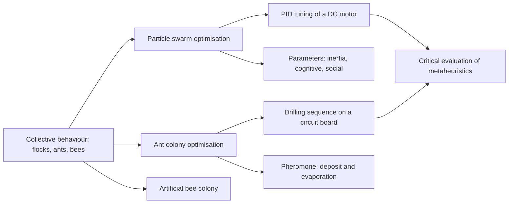

<div align="center">

# Week 06: Swarm Intelligence: Particles, Ants and Bees

**Artificial Intelligence Applications in Engineering (MUH-920 Mühendislikte Yapay Zeka Uygulamaları)**  
Prof. Dr. Utku Kose, Süleyman Demirel University

[](https://colab.research.google.com/github/utkukose/ai-applications-in-engineering-NB-lecture/blob/main/weeks/week-06/NB06_swarm_intelligence.ipynb) [](https://utkukose.github.io/ai-applications-in-engineering-NB-lecture/weeks/week-06/lab.html) [](https://utkukose.github.io/ai-applications-in-engineering-NB-lecture/weeks/week-06/lecture.html) [](Week06_Lecture_Notes.pdf)

</div>

## Overview

Flocks, ant colonies and bee hives solve problems that no individual could solve alone, using simple local rules and indirect communication. Swarm intelligence turns these mechanisms into optimisation algorithms [2]. Particle swarm optimisation moves candidate solutions through a continuous space under the pull of their own best and the swarm's best positions [3], ant colony optimisation builds tours with pheromone trails [9, 11], and the artificial bee colony algorithm divides the search among employed, onlooker and scout bees [13]. This week tunes a PID speed controller of a DC motor with a particle swarm, plans a drilling sequence for a circuit board with ants, and asks how to judge the many nature-inspired algorithms critically [15].

**Estimated study time:** 9 to 11 hours.

> **Midterm project.** The midterm project is released this week and is due at the end of Week 7. It applies search, knowledge-based and fuzzy systems, and evolutionary and swarm optimisation to a problem of the student's department, and it counts 40 percent of the course grade. The [project page](https://github.com/utkukose/ai-applications-in-engineering-NB-lecture/blob/main/exams/midterm/README.md) describes the three options, the starter notebooks, the deliverables and the evaluation criteria.

## Learning outcomes

By the end of the week, students are expected to explain the velocity and position update of particle swarm optimisation and the role of inertia, cognitive and social coefficients, to implement a particle swarm as a Python class, to formulate controller tuning as an optimisation problem with a time-domain cost, to explain how pheromone deposit and evaporation guide ant colony optimisation, to apply it to a sequencing problem, and to evaluate claims about new metaheuristics with sound experimental practice.

## Python in this week

The lecture ends with Python step 6: Classes, objects and probabilistic choice. It covers classes, objects, attributes and methods for a DC motor model and the particles of a swarm, and the probabilistic choice and pheromone update of ant colony optimisation with NumPy [9, 17]. The hands-on part of the notebook opens with the same step as runnable cells and short exercises with immediate feedback, and its later sections mark further constructs as Python moves.

## Study path

| Step | Activity | Suggested time |
|---|---|---|
| 1 | Read the lecture with its animations on the [lecture page](https://utkukose.github.io/ai-applications-in-engineering-NB-lecture/weeks/week-06/lecture.html), or read the [PDF version](Week06_Lecture_Notes.pdf) | 2 hours |
| 2 | Explore the [interactive lab](https://utkukose.github.io/ai-applications-in-engineering-NB-lecture/weeks/week-06/lab.html) | 1 hour |
| 3 | Study the Python step at the end of the lecture, then run the same step at the start of the hands-on part of the [Colab notebook](https://colab.research.google.com/github/utkukose/ai-applications-in-engineering-NB-lecture/blob/main/weeks/week-06/NB06_swarm_intelligence.ipynb) | 1 hour |
| 4 | Work through the rest of the notebook, including its Python moves and exercises | 3 hours |
| 5 | Solve the discipline challenge of your department | 1 hour |
| 6 | Take the self-assessment in the lab (tab: Check yourself) | 20 minutes |
| 7 | Write the reflection, export the learning log and complete the weekly task | 1 hour |

## Week at a glance



## Lecture

### Collective behaviour as computation

A flock of birds turns as one body although no bird leads it. Reynolds reproduced this with three local rules for each simulated bird: avoid crowding neighbours, align with their heading, and move towards their centre [1]. Ant colonies find short paths between nest and food without a map, because ants deposit pheromone and prefer trails with more of it; shorter trails are completed faster and accumulate pheromone sooner. Honeybee colonies allocate foragers to flower patches in proportion to their quality through the waggle dance. These systems share decentralised control, simple agents, local interaction and emergent global behaviour, which Bonabeau, Dorigo and Theraulaz summarised as swarm intelligence [2].

> **Animation: Three rules make a flock.** Each arrow follows only its neighbours. Set separation, alignment and cohesion and watch order emerge or dissolve. With alignment at zero, the flock never forms a common heading. Run it in the [web version of the lecture](https://utkukose.github.io/ai-applications-in-engineering-NB-lecture/weeks/week-06/lecture.html#anim-boids).

![Particle swarm optimisation on a landscape with many local minima: positions of the swarm after 0, 10 and 40 iterations. The swarm first explores and then contracts around the best region [3].](figures/w06_fig1.png)

*Figure 6.1. Particle swarm optimisation on a landscape with many local minima: positions of the swarm after 0, 10 and 40 iterations. The swarm first explores and then contracts around the best region [3].*

### Particle swarm optimisation

Kennedy and Eberhart introduced particle swarm optimisation in 1995, inspired by bird flocking and social behaviour [3]. Each particle i has a position x, which is a candidate solution, and a velocity v. It remembers the best position p it has visited, and the swarm shares the best position g found by any particle. In every iteration, the velocity is updated as v = w v + c1 r1 (p - x) + c2 r2 (g - x), and the position as x = x + v, where r1 and r2 are random numbers between 0 and 1 drawn for each dimension.

The three terms have clear meanings. The inertia weight w keeps part of the previous motion; Shi and Eberhart introduced it to balance global and local search, with values around 0.4 to 0.9 [4]. The cognitive term, weighted by c1, pulls a particle back towards its own best experience. The social term, weighted by c2, pulls it towards the best experience of the swarm. Clerc and Kennedy analysed the dynamics and derived a constriction factor that guarantees convergence; the widely used setting w = 0.7298 with c1 = c2 = 1.49618 follows from it [5]. Particle swarms are easy to implement, need no gradients, and work well on continuous problems of moderate dimension, but like every metaheuristic they can stagnate in a local optimum.

<details>
<summary><b>Check your understanding.</b> In the velocity update, what does the social term c2 r2 (g - x) do?</summary>

A. It slows every particle down  
B. It pulls the particle towards the best position found by the whole swarm  
C. It pulls the particle towards its own best position  
D. It adds random noise independent of any position

**Answer: B.** g is the global best position shared by the swarm, so this term transmits the swarm's experience to each particle.

</details>

### Tuning a PID controller with a swarm

The proportional-integral-derivative controller is the workhorse of industrial control. Its three gains shape the response: The proportional gain speeds up the reaction, the integral gain removes steady-state error, and the derivative gain damps oscillation [6]. Tuning them by hand is tedious, and classical rules assume simple process models. Controller tuning can instead be formulated as optimisation: Choose the gains that minimise a cost computed from a simulated step response, such as the integral of the time-weighted absolute error (ITAE), with penalties for overshoot and limits on the actuator. Particle swarms have been used in this way for automatic voltage regulators and many other loops [7].

The notebook applies the method to the speed control of a DC motor, using the standard model and parameters of the Control Tutorials for MATLAB and Simulink [8]. The armature voltage is limited to 24 volts, which makes the problem nonlinear, and the swarm evaluates all particles in one vectorised simulation. The cost function is part of the design: A cost that rewards speed alone drives the gains to their bounds, and adding a penalty on overshoot or control effort changes the optimum. The optimiser serves the engineer's definition of good behaviour; it cannot supply that definition.

<details>
<summary><b>Check your understanding.</b> A swarm tunes a PID controller by minimising only the settling time, and the result shows violent oscillation of the actuator. What is the most likely cause?</summary>

A. The swarm has too many particles  
B. The cost function does not penalise control effort or oscillation, so the optimiser exploits this  
C. PID controllers cannot be tuned by optimisation  
D. The inertia weight is exactly 0.7298

**Answer: B.** An optimiser minimises exactly what the cost states; unpenalised behaviour is free for it to exploit.

</details>

### Ant colony optimisation

Dorigo, Maniezzo and Colorni turned the pheromone mechanism into the Ant System for the travelling salesman problem [9]. Each artificial ant builds a complete tour city by city. From city i, it chooses the next unvisited city j with a probability proportional to the pheromone on edge (i, j) raised to a power alpha, times a heuristic desirability, usually the inverse distance, raised to a power beta. After all ants have finished, pheromone evaporates on every edge by a factor rho, and each ant deposits pheromone on the edges of its tour in inverse proportion to the tour length. Short tours therefore reinforce their edges, while evaporation forgets poor early choices.

The Ant Colony System added a stronger exploitation rule and local pheromone updates and was competitive on benchmark instances [10]; the monograph by Dorigo and Stützle presents the family and its applications to routing, scheduling and assignment [11]. Drilling holes in a printed circuit board is a classical travelling salesman application: The drill head must visit every hole once, and the travel time between holes is wasted production time. Benchmark libraries such as TSPLIB include instances that come from drilling problems [12].

<details>
<summary><b>Check your understanding.</b> What is the purpose of pheromone evaporation in ant colony optimisation?</summary>

A. It makes all tours equally likely forever  
B. It gradually removes pheromone from edges that are not reinforced, so poor early choices are forgotten  
C. It increases the length of short tours  
D. It fixes the start city

**Answer: B.** Without evaporation, early random choices would accumulate pheromone and lock the colony into poor tours.

</details>

### Artificial bee colony and the metaphor question

Karaboga and Basturk's artificial bee colony algorithm assigns roles to solutions [13]. Employed bees search around their food sources, onlooker bees choose sources in proportion to their quality and search around them, and scout bees replace sources that have not improved for a number of trials with random new ones. The scout phase gives the algorithm a built-in restart mechanism. Many further algorithms followed, inspired by fireflies, bats, wolves, whales and others, including the ant lion optimiser used to train neural networks for chaotic signal prediction in earlier work [14].

Sörensen argued that the flood of metaphor-based algorithms often hides old ideas behind new vocabulary and weak experiments [15]. The no free lunch theorems add that no algorithm can be best on all problems [16]. Engineers should therefore judge a metaheuristic by its search mechanism rather than its metaphor, compare it with established methods on the problem at hand, report results over many independent runs with statistics, and count function evaluations, not iterations, because a single evaluation of an engineering simulation may take minutes.

<details>
<summary><b>Check your understanding.</b> A paper claims that a new animal-inspired algorithm beats PSO, based on one run per method with different numbers of function evaluations. What is the main weakness?</summary>

A. The metaphor is not biological enough  
B. One run and unequal evaluation budgets do not support a fair comparison of stochastic algorithms  
C. PSO cannot be compared with other algorithms  
D. The paper should have used a larger swarm only for the new algorithm

**Answer: B.** Fair comparisons need equal budgets, many independent runs and statistical summaries.

</details>

<!-- python-step -->

### Python step 6: Classes, objects and probabilistic choice

#### Why classes

Simulation code keeps state that changes over time, such as the speed and the current of a motor, together with the functions that change it. A class bundles both: Attributes store the state, and methods are functions that act on it. The class is the blueprint, and every object created from it has its own attributes. The special method `__init__` runs when an object is created and sets its initial state, and the first parameter of every method, `self`, refers to the object itself.

The DC motor of this week has the parameters of the speed example of the Control Tutorials for MATLAB and Simulink [8]. Its speed w and current i obey J dw/dt = K i - b w and L di/dt = V - R i - K w, which the method `step` integrates over small time steps.

```python
class DCMotor:
    """Armature-controlled DC motor with the parameters of the CTMS speed example."""

    def __init__(self, J=0.01, b=0.1, K=0.01, R=1.0, L=0.5):
        self.J, self.b, self.K, self.R, self.L = J, b, K, R, L
        self.speed = 0.0        # rad/s
        self.current = 0.0      # A

    def step(self, voltage, dt=0.001):
        """Advance the motor by dt seconds with the explicit Euler method."""
        acc = (self.K * self.current - self.b * self.speed) / self.J
        di = (voltage - self.R * self.current - self.K * self.speed) / self.L
        self.speed += acc * dt
        self.current += di * dt
        return self.speed

motor = DCMotor()
for _ in range(3000):           # three seconds in steps of 1 ms
    motor.step(1.0)
print(f"speed after 3 s at 1 V: {motor.speed:.4f} rad/s")
```

*Output*

```text
speed after 3 s at 1 V: 0.0996 rad/s
```

The underscore `_` is the conventional name for a loop variable that is not used. The speed approaches K V / (b R + K^2), about 0.1 rad/s for 1 V, which the steady-state analysis of the tutorial also gives.

#### Many objects from one class

Objects created from the same class are independent. A motor with a lighter rotor does not share its speed with a motor with a heavier one, and each object keeps its own attributes. This independence makes classes practical for swarms, fleets of vehicles and banks of sensors.

```python
light = DCMotor(J=0.005)
heavy = DCMotor(J=0.05)
for _ in range(200):            # 0.2 s
    light.step(1.0)
    heavy.step(1.0)
print(f"light rotor: {light.speed:.4f} rad/s, heavy rotor: {heavy.speed:.4f} rad/s")
```

*Output*

```text
light rotor: 0.0257 rad/s, heavy rotor: 0.0061 rad/s
```

#### A particle of the swarm

Particle swarm optimisation moves each particle with a velocity that combines its previous velocity, a pull towards its own best position and a pull towards the best position of the swarm. A class keeps the position, the velocity and the personal best of a particle together, and NumPy arrays let the same code work in any number of dimensions. The method `copy` creates an independent array: Without it, the personal best and the current position would be two names for the same array, and changing one in place would also change the other.

```python
import numpy as np

class Particle:
    """One particle of a swarm with position, velocity and personal best."""

    def __init__(self, position, velocity):
        self.x = np.array(position, dtype=float)
        self.v = np.array(velocity, dtype=float)
        self.best_x = self.x.copy()

    def move(self, swarm_best, w=0.7, c1=1.5, c2=1.5, r1=0.5, r2=0.5):
        """Update velocity and position; r1 and r2 stand in for random numbers."""
        self.v = w * self.v + c1 * r1 * (self.best_x - self.x) + c2 * r2 * (swarm_best - self.x)
        self.x = self.x + self.v

p = Particle([2.0, -1.0], [0.1, 0.0])
p.move(swarm_best=np.array([0.0, 0.0]))
print(p.x, p.v)
```

*Output*

```text
[ 0.57 -0.25] [-1.43  0.75]
```

The notebook of this week builds a complete swarm on the same pattern, with new random numbers at every step.

#### Probabilistic choice in an ant colony

Ant colony optimisation builds solutions step by step [9]. At every step an ant chooses among the possible next moves with probabilities proportional to tau^alpha eta^beta, where tau is the pheromone on a move and eta its heuristic desirability, usually one over the distance. The generator method `choice` draws from such a discrete distribution when the probabilities are passed as `p`, and `np.bincount` counts how often each move was chosen.

```python
tau = np.ones(4)                                # pheromone on four candidate edges
dist = np.array([4.0, 2.0, 5.0, 3.0])           # edge lengths in km
alpha, beta = 1.0, 2.0
weight = tau ** alpha * (1 / dist) ** beta
prob = weight / weight.sum()
print(prob.round(3))
colony = np.random.default_rng(5)
choices = colony.choice(4, size=1000, p=prob)   # the choices of 1000 ants
print(np.bincount(choices, minlength=4))
```

*Output*

```text
[0.135 0.539 0.086 0.24 ]
[148 532  78 242]
```

After the ants have moved, pheromone evaporates at a rate rho, and every ant deposits pheromone on its choice, more on shorter edges. Repeated over many iterations, this positive feedback concentrates the colony on short routes, while evaporation keeps it from settling too early on a poor one.

```python
rho = 0.5
deposit = np.bincount(choices, minlength=4) / dist / len(choices)   # 1/length per ant, scaled by the colony size
tau = (1 - rho) * tau + deposit
print(tau.round(3))
```

*Output*

```text
[0.537 0.766 0.516 0.581]
```

<details>
<summary><b>Check your understanding.</b> A class Counter sets self.n = 0 in __init__ and has a method add that runs self.n += 1. After a = Counter(), b = Counter(), a.add(), a.add() and b.add(), what are a.n and b.n?</summary>

A. 2 and 1  
B. 3 and 3  
C. 1 and 1  
D. 2 and 2

**Answer: A.** Each object keeps its own attributes, so the calls on a do not change b.

</details>

<!-- /python-step -->

## Discipline challenges

Swarms tune continuous parameters and ants build sequences. Choose a row, write the cost function, and compare the swarm with a simple baseline.

| Department | Challenge |
|---|---|
| Electrical and Electronics Engineering | PID tuning of a DC motor or of a buck converter output voltage loop, as in the notebook. |
| Mechanical Engineering and Automotive Engineering | Suspension damping and stiffness that trade comfort against road holding. |
| Industrial Engineering | Vehicle routing for deliveries from a depot with ant colony optimisation. |
| Computer Engineering | Routing in a communication network or task allocation among cores with ants. |
| Civil Engineering | Size optimisation of a planar truss with stress constraints using PSO. |
| Environmental Engineering | Calibration of a river water-quality model to measured oxygen profiles. |
| Mining Engineering | Sequencing of blast holes or of stope extraction with ants. |
| Geophysical Engineering | Inversion of a layered-earth resistivity model from sounding curves with PSO. |
| Chemical Engineering and Chemistry | Estimation of kinetic parameters of a reaction from concentration curves. |
| Textile Engineering | Cutting-order planning and marker layout sequencing. |
| Biology and Statistics | Parameter estimation of a population growth model, compared with least squares. |

## Interactive lab

Part A shows a particle swarm on a two-dimensional landscape with controls for inertia, cognitive and social coefficients [3, 4]. Part B tunes the PID speed controller of a DC motor with the parameters of the Control Tutorials for MATLAB and Simulink and a 24-volt limit, and compares the swarm's gains with a reference tuning [8]. Part C runs an ant colony on a drilling sequence and shows pheromone trails forming [9].

[Open the interactive lab](https://utkukose.github.io/ai-applications-in-engineering-NB-lecture/weeks/week-06/lab.html)


## Colab notebook

The notebook writes particle swarm optimisation as a Python class, tests it on a benchmark landscape, and then tunes the PID speed controller of a DC motor with the parameters of the Control Tutorials for MATLAB and Simulink [8], simulating all particles at once. It compares the swarm's gains with a reference tuning, shows how the cost function shapes the result, and closes with an ant colony that sequences the holes of a circuit board, compared with the nearest-neighbour heuristic [9].

[](https://colab.research.google.com/github/utkukose/ai-applications-in-engineering-NB-lecture/blob/main/weeks/week-06/NB06_swarm_intelligence.ipynb)

Screenshots of the executed notebook:


## Self-assessment and reflection

The lab contains a 6-question self-assessment with instant feedback and a confidence rating for each answer. A confident but wrong answer marks the first topic to revisit. The reflection prompts below are also available in the lab, where answers are saved in the browser and can be exported as a learning log.

1. Which parameter of your own field is tuned today by trial and error and could be tuned by a swarm? What would the cost function be?
2. The PID cost function in the notebook contains an overshoot penalty. How did changing it change the gains, and what does that say about who is responsible for the result?
3. How did writing the swarm as a class help you, compared with the functions of earlier weeks?

## Weekly task and submission

Apply particle swarm optimisation or ant colony optimisation to a problem from your department. For a continuous problem, compare PSO with differential evolution from Week 5 under the same evaluation budget over ten seeds. For a sequencing problem, compare the ant colony with the nearest-neighbour heuristic. Report the setup, a convergence plot and a statistical summary in about 500 words, citing at least three works from this week's references [3, 9, 15].

The weekly task is optional and supports self-learning and a personal portfolio. During an active semester, it can be sent together with the exported learning log to utkukose@sdu.edu.tr or utkukose@gmail.com. Optional work carries no separate weight, but the instructor may take it into account as a discretionary adjustment of the midterm component of the grade.

## Research and report assignment (optional)

**Swarm intelligence in engineering practice.** Review applications of particle swarm, ant colony or bee colony algorithms in one field, such as power systems, structural design, logistics or controller tuning. Assess the quality of the experimental comparisons in the reviewed papers against the criteria of Sörensen and against the no free lunch theorems [7, 15, 16].

This research assignment is optional and supports self-learning. When the related weeks are followed within the course during an active semester, the report can be sent to utkukose@sdu.edu.tr or utkukose@gmail.com. It carries no separate weight, but the instructor may take it into account as a discretionary adjustment of the midterm component of the grade. Unless the assignment states otherwise, a report has 1500 to 2500 words, follows the structure of an academic paper, cites at least six scholarly or official sources in square brackets and uses the template in `exams/REPORT_TEMPLATE.md`.

## References

[1] Reynolds, C. W. (1987). Flocks, herds and schools: A distributed behavioral model. *ACM SIGGRAPH Computer Graphics*, *21*(4), 25-34. <https://doi.org/10.1145/37402.37406>

[2] Bonabeau, E., Dorigo, M., & Theraulaz, G. (1999). *Swarm Intelligence: From Natural to Artificial Systems*. Oxford University Press.

[3] Kennedy, J., & Eberhart, R. (1995). Particle swarm optimization. In *Proceedings of ICNN'95, International Conference on Neural Networks*, Vol. 4 (pp. 1942-1948). IEEE. <https://doi.org/10.1109/ICNN.1995.488968>

[4] Shi, Y., & Eberhart, R. (1998). A modified particle swarm optimizer. In *1998 IEEE International Conference on Evolutionary Computation Proceedings* (pp. 69-73). IEEE. <https://doi.org/10.1109/ICEC.1998.699146>

[5] Clerc, M., & Kennedy, J. (2002). The particle swarm: Explosion, stability, and convergence in a multidimensional complex space. *IEEE Transactions on Evolutionary Computation*, *6*(1), 58-73. <https://doi.org/10.1109/4235.985692>

[6] Åström, K. J., & Hägglund, T. (1995). *PID Controllers: Theory, Design, and Tuning* (2nd ed.). Instrument Society of America.

[7] Gaing, Z.-L. (2004). A particle swarm optimization approach for optimum design of PID controller in AVR system. *IEEE Transactions on Energy Conversion*, *19*(2), 384-391. <https://doi.org/10.1109/TEC.2003.821821>

[8] University of Michigan, Carnegie Mellon University, & University of Detroit Mercy (2026). *Control Tutorials for MATLAB and Simulink: DC motor speed, system modeling*. <https://ctms.engin.umich.edu>

[9] Dorigo, M., Maniezzo, V., & Colorni, A. (1996). Ant system: Optimization by a colony of cooperating agents. *IEEE Transactions on Systems, Man, and Cybernetics, Part B*, *26*(1), 29-41. <https://doi.org/10.1109/3477.484436>

[10] Dorigo, M., & Gambardella, L. M. (1997). Ant colony system: A cooperative learning approach to the traveling salesman problem. *IEEE Transactions on Evolutionary Computation*, *1*(1), 53-66. <https://doi.org/10.1109/4235.585892>

[11] Dorigo, M., & Stützle, T. (2004). *Ant Colony Optimization*. MIT Press.

[12] Reinelt, G. (1991). TSPLIB: A traveling salesman problem library. *ORSA Journal on Computing*, *3*(4), 376-384. <https://doi.org/10.1287/ijoc.3.4.376>

[13] Karaboga, D., & Basturk, B. (2007). A powerful and efficient algorithm for numerical function optimization: Artificial bee colony (ABC) algorithm. *Journal of Global Optimization*, *39*(3), 459-471. <https://doi.org/10.1007/s10898-007-9149-x>

[14] Kose, U. (2018). An ant-lion optimizer-trained artificial neural network system for chaotic electroencephalogram (EEG) prediction. *Applied Sciences*, *8*(9), 1613. <https://doi.org/10.3390/app8091613>

[15] Sörensen, K. (2015). Metaheuristics: The metaphor exposed. *International Transactions in Operational Research*, *22*(1), 3-18. <https://doi.org/10.1111/itor.12001>

[16] Wolpert, D. H., & Macready, W. G. (1997). No free lunch theorems for optimization. *IEEE Transactions on Evolutionary Computation*, *1*(1), 67-82. <https://doi.org/10.1109/4235.585893>

[17] Python Software Foundation (2026). *The Python Tutorial (Python 3 documentation)*. <https://docs.python.org/3/tutorial/>

---

<sub>Artificial Intelligence Applications in Engineering. Prof. Dr. Utku Kose, Süleyman Demirel University. ORCID [0000-0002-9652-6415](https://orcid.org/0000-0002-9652-6415). Content licensed under CC BY 4.0, code under MIT. This course is updated in line with current developments in the field. Last update: September 2026.</sub>
