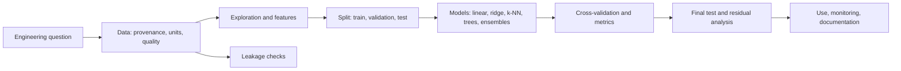
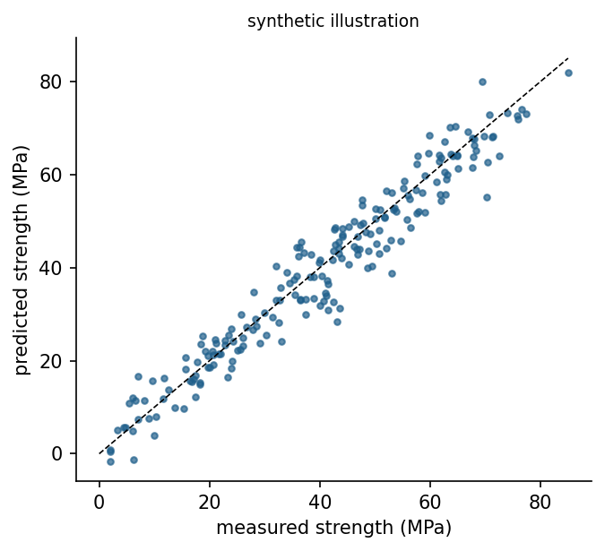

<div align="center">

# Week 07: Learning from Data: The Machine Learning Workflow and Regression

**Artificial Intelligence Applications in Engineering (MUH-920 Mühendislikte Yapay Zeka Uygulamaları)**  
Prof. Dr. Utku Kose, Süleyman Demirel University

[](https://colab.research.google.com/github/utkukose/ai-applications-in-engineering-NB-lecture/blob/main/weeks/week-07/NB07_ml_workflow_regression.ipynb) [](https://utkukose.github.io/ai-applications-in-engineering-NB-lecture/weeks/week-07/lab.html) [](https://utkukose.github.io/ai-applications-in-engineering-NB-lecture/weeks/week-07/lecture.html) [](Week07_Lecture_Notes.pdf)

</div>

## Overview

The first half of the course encoded knowledge by hand: search heuristics, rules, membership functions and cost functions. Machine learning takes the opposite route and estimates a model from examples [1]. This week introduces the workflow that every data-driven engineering project follows, from the question and the data to validation and deployment [3], and applies it to regression: predicting a continuous quantity. The core case predicts the compressive strength of concrete from its mix and age, a problem studied with neural networks by Yeh [15, 18] and rooted in Abrams' water-cement rule [14]. A switch in the notebook repeats the whole pipeline on datasets from power plants, buildings, aerodynamics, gas turbines, superconductors and garment production.

**Estimated study time:** 9 to 11 hours.

> **Midterm project.** The midterm project is due at the end of this week. The [project page](https://github.com/utkukose/ai-applications-in-engineering-NB-lecture/blob/main/exams/midterm/README.md) lists the deliverables and the evaluation criteria, and the report follows the common template.

## Learning outcomes

By the end of the week, students are expected to describe the stages of a machine learning project, to load, inspect and clean a tabular dataset with pandas, to split data into training, validation and test sets and use cross-validation, to fit and compare linear, regularised, nearest-neighbour and tree-based regressors with scikit-learn, to report MAE, RMSE and the coefficient of determination, to read parity and residual plots, and to recognise data leakage.

## Python in this week

The lecture ends with Python step 7: Tables with pandas and honest evaluation with scikit-learn. It covers pandas DataFrames for building, selecting, filtering, reading and summarising tables, the fit and predict pattern of scikit-learn, and error measures, baselines and cross-validation with a pipeline, applied to concrete mixes [13, 17]. The hands-on part of the notebook opens with the same step as runnable cells and short exercises with immediate feedback, and its later sections mark further constructs as Python moves.

## Study path

| Step | Activity | Suggested time |
|---|---|---|
| 1 | Read the lecture with its animations on the [lecture page](https://utkukose.github.io/ai-applications-in-engineering-NB-lecture/weeks/week-07/lecture.html), or read the [PDF version](Week07_Lecture_Notes.pdf) | 2 hours |
| 2 | Explore the [interactive lab](https://utkukose.github.io/ai-applications-in-engineering-NB-lecture/weeks/week-07/lab.html) | 1 hour |
| 3 | Study the Python step at the end of the lecture, then run the same step at the start of the hands-on part of the [Colab notebook](https://colab.research.google.com/github/utkukose/ai-applications-in-engineering-NB-lecture/blob/main/weeks/week-07/NB07_ml_workflow_regression.ipynb) | 1 hour |
| 4 | Work through the rest of the notebook, including its Python moves and exercises | 3 hours |
| 5 | Solve the discipline challenge of your department | 1 hour |
| 6 | Take the self-assessment in the lab (tab: Check yourself) | 20 minutes |
| 7 | Write the reflection, export the learning log and complete the weekly task | 1 hour |

## Week at a glance



## Lecture

### From rules to data

A rule-based system encodes what experts know. A machine learning system estimates a function from examples of inputs and outputs, so that it can predict outputs for new inputs [1]. In supervised learning, every example carries the correct answer: a measured strength, a failure label, a power output. In unsupervised learning, the examples carry no answers and the task is to find structure, such as groups or unusual points, which is the topic of Week 9. In reinforcement learning, an agent learns from rewards obtained by acting, which Week 14 treats. Regression is supervised learning with a continuous target, and classification, the topic of Week 8, predicts a category.

Breiman described two cultures in statistical modelling [2]. The data modelling culture assumes a stochastic model of how the data were generated and estimates its parameters; the algorithmic culture treats the mechanism as unknown and judges models by their predictive accuracy on new data. Engineering needs both views. A fitted coefficient of a physical law can be interpreted and extrapolated with care, while a random forest may predict better inside the range of the data but says little outside it.

### The workflow of a data-driven project

The CRISP-DM process model, developed with industrial partners, describes six phases: business understanding, data understanding, data preparation, modelling, evaluation and deployment [3]. The phases form a loop rather than a line, because evaluation often sends the team back to the data. In engineering terms, the first phase fixes the decision that the model will support and the accuracy it needs; the second checks where the data came from, which units they use and which conditions they cover; the third handles missing values, outliers and derived features; and the last phases test the model honestly and document its limits.

Data are evidence and deserve the same care as a laboratory measurement. A dataset records a particular population of mixes, machines or buildings under particular conditions. A model trained on it inherits these limits, and predictions outside the covered range are extrapolations that no validation score protects.

<details>
<summary><b>Check your understanding.</b> In which phase of CRISP-DM does a team decide what decision the model will support and how accurate it must be?</summary>

A. Business understanding  
B. Data preparation  
C. Modelling  
D. Deployment

**Answer: A.** The first phase translates the engineering objective into a data mining goal with success criteria [3].

</details>

### Honest evaluation: Splits and cross-validation

A model that is judged on the data it was trained on looks better than it is. The standard protection is to hold out data. A test set is set aside at the start and used once, at the end, to estimate performance on new data. Model choices, such as the degree of a polynomial or the depth of a tree, are made with a validation set or with k-fold cross-validation on the training data: The training data are divided into k parts, each part serves once as validation data while the other parts train the model, and the k scores are averaged. Kohavi's study recommended ten-fold stratified cross-validation for model selection on real-world data [4].

Model complexity trades bias against variance [5, 6]. A model that is too simple misses real structure and has high error on training and new data alike. A model that is too flexible fits the noise of the training data, so its training error is low but its error on new data rises. The best complexity lies between, and only data that the model has not seen can locate it.

> **Animation: Underfitting and overfitting.** Polynomials of growing degree are fitted to noisy samples of a smooth curve. Watch the training error fall steadily while the error on new data first falls and then rises. Run it in the [web version of the lecture](https://utkukose.github.io/ai-applications-in-engineering-NB-lecture/weeks/week-07/lecture.html#anim-biasvar).

![Training and test error of polynomial regression against model complexity. The gap between the curves widens as the model starts to fit noise [5].](figures/w07_fig1.png)

*Figure 7.1. Training and test error of polynomial regression against model complexity. The gap between the curves widens as the model starts to fit noise [5].*

<details>
<summary><b>Check your understanding.</b> A regression tree reaches a training R-squared of 0.99 and a cross-validated R-squared of 0.61. What is the most likely diagnosis?</summary>

A. Underfitting  
B. Overfitting  
C. Data leakage into the validation folds  
D. A perfectly calibrated model

**Answer: B.** A large gap between training and validation performance is the signature of variance, that is, overfitting.

</details>

### Models for regression

Linear regression fits a weighted sum of the inputs by least squares. It is fast, interpretable and a mandatory baseline. Scaling the inputs does not change its predictions but matters for regularised variants. Ridge regression adds a penalty on the squared size of the coefficients, which stabilises the fit when inputs are correlated [7], and the lasso penalises absolute values, which drives some coefficients exactly to zero and selects features [8].

Nonlinear relationships need more flexible models. The k-nearest-neighbour method predicts the average target of the k most similar training examples [9]. A regression tree splits the input space into boxes with a constant prediction in each box [10]. A random forest averages many trees grown on bootstrap samples with random subsets of features, which reduces variance substantially [11]. Gradient boosting adds shallow trees one after another, each correcting the errors of the current ensemble, and implementations such as XGBoost made it a leading method for tabular data [12]. scikit-learn exposes all of these through the same `fit` and `predict` interface [13].

### Measuring errors

The mean absolute error (MAE) averages the absolute differences between predictions and measurements and keeps the units of the target. The root mean squared error (RMSE) penalises large errors more strongly. The coefficient of determination R-squared compares the model with the constant prediction of the mean: A value of 1 means perfect predictions and 0 means no better than the mean. Numbers alone hide patterns, so a parity plot of predicted against measured values and residual plots against each input belong to every report. A residual trend against age, for example, reveals that the model misses the strength gain of concrete over time.

For concrete, the physics offers guidance. Abrams found that strength falls as the water-cement ratio rises [14], and strength grows with age at a decreasing rate. Yeh showed that neural networks trained on mix proportions and age predict the strength of high-performance concrete better than regression on the traditional ratio alone [15]. A derived feature such as the water-binder ratio can help simple models and makes the model easier to interpret.



*Figure 7.2. Parity plot of a gradient boosting model on held-out data of the synthetic concrete stand-in used by the notebook when the UCI data cannot be downloaded. Points on the diagonal are perfect predictions.*

<details>
<summary><b>Check your understanding.</b> A strength model has an MAE of 4.1 MPa and an R-squared of 0.88. Which statement is correct?</summary>

A. On average, predictions deviate from measurements by 4.1 MPa in absolute terms  
B. 88 percent of the predictions are exactly right  
C. The model explains 4.1 percent of the variance  
D. The RMSE must also be 4.1 MPa

**Answer: A.** MAE is the mean absolute deviation in the units of the target; R-squared compares squared errors with those of the mean prediction.

</details>

### Data leakage

Leakage occurs when information that would not be available at prediction time enters the training data [16]. Typical engineering forms are a feature computed from the target, such as a strength class assigned after testing; a measurement taken after the event to be predicted, such as the repair cost of a failure that the model should anticipate; duplicated specimens that appear in both training and test sets; and preprocessing, such as scaling, fitted on the whole dataset before splitting. Leakage produces excellent validation scores and useless models. The defence is to ask for every feature when and how it becomes known in practice, to split before any fitting, and to wrap preprocessing and model into one pipeline.

<details>
<summary><b>Check your understanding.</b> A dataset for predicting pump failure contains the column &quot;hours until repair was completed&quot;. What is the problem?</summary>

A. The column has the wrong units  
B. The column is known only after the failure, so using it leaks the target  
C. The column must be scaled first  
D. Tree models cannot use time columns

**Answer: B.** Information recorded after the event cannot be available when the prediction is needed [16].

</details>

<!-- python-step -->

### Python step 7: Tables with pandas and honest evaluation with scikit-learn

#### Tables as DataFrames

Most engineering data arrive as tables, with one row per specimen, test or time and one column per variable. The pandas library represents such a table as a DataFrame [17]. A DataFrame can be built from a dictionary of columns, and `shape`, `head` and `describe` give a first view. The values below are invented for practice and only loosely follow the behaviour of real concrete; the notebook uses the measured Concrete Compressive Strength dataset [18].

```python
import pandas as pd

mixes = pd.DataFrame({
    "cement_kg": [380, 300, 450, 320, 400, 280, 350, 420],
    "water_kg": [175, 180, 160, 190, 170, 185, 165, 150],
    "age_days": [28, 28, 28, 7, 90, 28, 7, 28],
    "strength_MPa": [44.1, 33.9, 55.2, 21.3, 52.6, 29.8, 30.4, 58.7],
})
print(mixes.shape)
print(mixes.head(3))
```

*Output*

```text
(8, 4)
   cement_kg  water_kg  age_days  strength_MPa
0        380       175        28          44.1
1        300       180        28          33.9
2        450       160        28          55.2
```

#### Selecting, computing and filtering

A column is selected with its name in square brackets and returns a Series, a single labelled column. A list of names selects several columns. New columns come from arithmetic on existing ones, such as the water-cement ratio, the main factor of concrete strength. A condition on a column produces a boolean Series, and using it as an index keeps the matching rows. Conditions combine with `&` for and and `|` for or, each condition in its own parentheses.

```python
mixes["wc_ratio"] = mixes["water_kg"] / mixes["cement_kg"]
at28 = mixes[mixes["age_days"] == 28]
print(at28[["wc_ratio", "strength_MPa"]].round(3))
strong = mixes[(mixes["age_days"] == 28) & (mixes["strength_MPa"] > 40)]
print(len(strong), "mixes above 40 MPa at 28 days")
print(mixes.sort_values("wc_ratio")[["cement_kg", "wc_ratio"]].head(2))
```

*Output*

```text
   wc_ratio  strength_MPa
0     0.461          44.1
1     0.600          33.9
2     0.356          55.2
5     0.661          29.8
7     0.357          58.7
3 mixes above 40 MPa at 28 days
   cement_kg  wc_ratio
2        450  0.355556
7        420  0.357143
```

#### Reading files and missing values

`pd.read_csv` reads comma-separated files from a path or a web address. Empty fields become `NaN`, the marker of a missing value. `isna().sum()` counts the missing values of each column, and `dropna` removes incomplete rows. Whether removing, filling or modelling missing values is appropriate depends on why they are missing. The example reads a short text as if it were a file.

```python
import io

csv_text = """cement_kg,water_kg,age_days,strength_MPa
380,175,28,44.1
300,,28,33.9
450,160,28,
"""
table = pd.read_csv(io.StringIO(csv_text))
print(table.isna().sum())
print(table.dropna())
```

*Output*

```text
cement_kg       0
water_kg        1
age_days        0
strength_MPa    1
dtype: int64
   cement_kg  water_kg  age_days  strength_MPa
0        380     175.0        28          44.1
```

#### The scikit-learn pattern

scikit-learn gives all its models the same interface [13]. A model object is created with its settings, `fit` learns from the inputs X and the targets y, and `predict` applies the model to new inputs. `train_test_split` holds back part of the data for testing, and `random_state` makes the split repeatable. With eight invented rows, the numbers below practise the syntax only; the workflow of this week explains how models are validated properly.

```python
from sklearn.linear_model import LinearRegression
from sklearn.model_selection import train_test_split

X = mixes[["wc_ratio", "age_days"]]
y = mixes["strength_MPa"]
X_train, X_test, y_train, y_test = train_test_split(X, y, test_size=0.25, random_state=0)
model = LinearRegression().fit(X_train, y_train)
print(model.coef_.round(2), round(float(model.intercept_), 2))
print(model.predict(X_test).round(1), y_test.to_numpy())
```

*Output*

```text
[-98.57   0.11] 87.01
[41.3 55.1] [30.4 55.2]
```

#### Measuring errors

A model is judged by its errors on data it has not seen. The mean absolute error (MAE) averages the size of the errors in the unit of the target, here MPa, and the root mean squared error (RMSE) weights large errors more strongly. Both take one line of NumPy, and `sklearn.metrics` provides the same measures. A baseline that always predicts the mean strength of the training mixes shows whether the model has learned anything at all.

```python
import numpy as np
from sklearn.metrics import mean_absolute_error, mean_squared_error

pred_test = model.predict(X_test)
err = y_test.to_numpy() - pred_test
print("MAE by hand:", round(float(np.mean(np.abs(err))), 2), "MPa")
print("MAE with scikit-learn:", round(float(mean_absolute_error(y_test, pred_test)), 2), "MPa")
print("RMSE:", round(float(np.sqrt(mean_squared_error(y_test, pred_test))), 2), "MPa")
baseline = np.full(len(y_test), y_train.mean())
print("MAE of the mean baseline:", round(float(mean_absolute_error(y_test, baseline)), 2), "MPa")
```

*Output*

```text
MAE by hand: 5.5 MPa
MAE with scikit-learn: 5.5 MPa
RMSE: 7.73 MPa
MAE of the mean baseline: 12.4 MPa
```

#### Cross-validation and pipelines

A single split depends on which rows happen to land in the test set. K-fold cross-validation divides the data into k parts, trains k times and tests each time on a different part, which gives k error estimates instead of one. Preprocessing such as scaling must be learned from the training folds only; otherwise information from the test fold leaks into the model. A pipeline chains the preprocessing and the model, so that `cross_val_score` refits both inside every fold.

```python
from sklearn.model_selection import KFold, cross_val_score
from sklearn.pipeline import make_pipeline
from sklearn.preprocessing import StandardScaler

folds = KFold(n_splits=4, shuffle=True, random_state=0)
pipe = make_pipeline(StandardScaler(), LinearRegression())
scores = -cross_val_score(pipe, X, y, cv=folds, scoring="neg_mean_absolute_error")
print(scores.round(2), "mean MAE:", round(float(scores.mean()), 2), "MPa")
```

*Output*

```text
[ 5.5   6.71  4.21 19.97] mean MAE: 9.1 MPa
```

scikit-learn treats larger scores as better, so it reports errors with a negative sign, and the minus in front turns them back into MAE values. With eight invented rows, the numbers serve to practise the pattern, which the notebook of this week applies to the full dataset.

<details>
<summary><b>Check your understanding.</b> A DataFrame df has the columns age and f. Which expression keeps the rows with age 28 and f above 40?</summary>

A. df[df["age"] == 28 and df["f"] > 40]  
B. df[(df["age"] == 28) & (df["f"] > 40)]  
C. df["age" == 28]  
D. df.keep(age=28, f=40)

**Answer: B.** pandas combines conditions element by element with & and |, and each condition needs its own parentheses. The keyword and cannot combine two Series.

</details>

<!-- /python-step -->

## Discipline challenges

The notebook's switch loads a regression dataset for several fields with one line. Pick the row of your department and run the whole pipeline on it, or bring your own public data.

| Department | Challenge |
|---|---|
| Civil Engineering | Concrete compressive strength from mix proportions and age, UCI 165 [18]. |
| Mechanical Engineering and Electrical and Electronics Engineering | Net electrical output of a combined cycle power plant from ambient conditions, UCI 294 [20]. |
| Civil Engineering and Physics | Heating load of residential buildings from shape parameters, UCI 242 [19]. |
| Automotive Engineering and Mechanical Engineering | Airfoil self-noise from frequency, angle of attack and flow speed, UCI 291 [22]. |
| Environmental Engineering and Chemical Engineering | NOx emissions of a gas turbine from ambient and process variables, UCI 551 [23]. |
| Physics, Chemistry and Mathematics | Critical temperature of superconductors from composition features, UCI 464 [21]. |
| Industrial Engineering and Textile Engineering | Actual productivity of garment production teams, UCI 597 [24]. |
| Food Engineering and Chemistry | Wine quality score from physicochemical measurements as a regression target, UCI 186 [25]. |
| Statistics | Compare ordinary least squares, ridge and lasso paths on the concrete data and interpret shrinkage [7, 8]. |
| Geology, Geophysics, Mining and Earth Sciences Engineering | Predict a well-log property (for example PE) from the other logs of the SEG facies data used in Week 9 [26]. |

## Interactive lab

Part A generates strength data from a known law, shaped after Abrams' water-cement rule [14], adds noise, and lets polynomial, nearest-neighbour and tree regressors fit it; training error, error on new data and a five-fold validation curve show where overfitting starts [5]. Part B is a leakage detective with six candidate features from engineering projects [16].

[Open the interactive lab](https://utkukose.github.io/ai-applications-in-engineering-NB-lecture/weeks/week-07/lab.html)


## Colab notebook

The notebook loads the UCI concrete compressive strength data [18], explores it with pandas, derives the water-binder ratio, and compares a mean baseline, linear and ridge regression, k-nearest neighbours, a regression tree, a random forest and gradient boosting with five-fold cross-validation [13]. The best model is tested once on held-out data with parity and residual plots, a deliberate leakage experiment shows how scores inflate, and a one-line switch reruns everything on the dataset of another department.

[](https://colab.research.google.com/github/utkukose/ai-applications-in-engineering-NB-lecture/blob/main/weeks/week-07/NB07_ml_workflow_regression.ipynb)

Screenshots of the executed notebook:


## Self-assessment and reflection

The lab contains a 6-question self-assessment with instant feedback and a confidence rating for each answer. A confident but wrong answer marks the first topic to revisit. The reflection prompts below are also available in the lab, where answers are saved in the browser and can be exported as a learning log.

1. Which quantity in your department would you like to predict from data, and what data would honestly be available at prediction time?
2. Look at the residual plots of your model. Which pattern would make you distrust a good R-squared?
3. What did pandas make easier compared with the lists of the first weeks, and what still feels unfamiliar?

## Weekly task and submission

Use the discipline switch of the notebook, or a public dataset from DATASETS.md, to build a regression model for a quantity from your department. Report the data source and its limits, the split, at least four models compared with cross-validation, the final test result, a parity plot and one residual plot, and a paragraph on possible leakage, in about 500 words. Cite at least three works from this week's references [3, 4, 16].

The weekly task is optional and supports self-learning and a personal portfolio. During an active semester, it can be sent together with the exported learning log to utkukose@sdu.edu.tr or utkukose@gmail.com. Optional work carries no separate weight, but the instructor may take it into account as a discretionary adjustment of the midterm component of the grade.

## Research and report assignment (optional)

**Machine learning for an engineering property.** Review how machine learning predicts one engineering property, for example concrete strength, building energy demand, power plant output or material critical temperature. Compare the data sources, input features, models and validation schemes of at least six studies and discuss what physical knowledge the best models use [15, 19, 20, 21].

This research assignment is optional and supports self-learning. When the related weeks are followed within the course during an active semester, the report can be sent to utkukose@sdu.edu.tr or utkukose@gmail.com. It carries no separate weight, but the instructor may take it into account as a discretionary adjustment of the midterm component of the grade. Unless the assignment states otherwise, a report has 1500 to 2500 words, follows the structure of an academic paper, cites at least six scholarly or official sources in square brackets and uses the template in `exams/REPORT_TEMPLATE.md`.

## References

[1] Jordan, M. I., & Mitchell, T. M. (2015). Machine learning: Trends, perspectives, and prospects. *Science*, *349*(6245), 255-260. <https://doi.org/10.1126/science.aaa8415>

[2] Breiman, L. (2001). Statistical modeling: The two cultures. *Statistical Science*, *16*(3), 199-231. <https://doi.org/10.1214/ss/1009213726>

[3] Wirth, R., & Hipp, J. (2000). CRISP-DM: Towards a standard process model for data mining. In *Proceedings of the 4th International Conference on the Practical Applications of Knowledge Discovery and Data Mining* (pp. 29-39).

[4] Kohavi, R. (1995). A study of cross-validation and bootstrap for accuracy estimation and model selection. In *Proceedings of the 14th International Joint Conference on Artificial Intelligence* (pp. 1137-1143).

[5] Hastie, T., Tibshirani, R., & Friedman, J. (2009). *The Elements of Statistical Learning: Data Mining, Inference, and Prediction* (2nd ed.). Springer. <https://doi.org/10.1007/978-0-387-84858-7>

[6] James, G., Witten, D., Hastie, T., & Tibshirani, R. (2021). *An Introduction to Statistical Learning* (2nd ed.). Springer. <https://doi.org/10.1007/978-1-0716-1418-1>

[7] Hoerl, A. E., & Kennard, R. W. (1970). Ridge regression: Biased estimation for nonorthogonal problems. *Technometrics*, *12*(1), 55-67. <https://doi.org/10.1080/00401706.1970.10488634>

[8] Tibshirani, R. (1996). Regression shrinkage and selection via the lasso. *Journal of the Royal Statistical Society: Series B (Methodological)*, *58*(1), 267-288. <https://doi.org/10.1111/j.2517-6161.1996.tb02080.x>

[9] Cover, T., & Hart, P. (1967). Nearest neighbor pattern classification. *IEEE Transactions on Information Theory*, *13*(1), 21-27. <https://doi.org/10.1109/TIT.1967.1053964>

[10] Breiman, L., Friedman, J. H., Olshen, R. A., & Stone, C. J. (1984). *Classification and Regression Trees*. Wadsworth.

[11] Breiman, L. (2001). Random forests. *Machine Learning*, *45*(1), 5-32. <https://doi.org/10.1023/A:1010933404324>

[12] Chen, T., & Guestrin, C. (2016). XGBoost: A scalable tree boosting system. In *Proceedings of the 22nd ACM SIGKDD International Conference on Knowledge Discovery and Data Mining* (pp. 785-794). <https://doi.org/10.1145/2939672.2939785>

[13] Pedregosa, F., Varoquaux, G., Gramfort, A., et al. (2011). Scikit-learn: Machine learning in Python. *Journal of Machine Learning Research*, *12*, 2825-2830.

[14] Abrams, D. A. (1918). *Design of Concrete Mixtures (Bulletin 1)*. Structural Materials Research Laboratory, Lewis Institute, Chicago.

[15] Yeh, I.-C. (1998). Modeling of strength of high-performance concrete using artificial neural networks. *Cement and Concrete Research*, *28*(12), 1797-1808. <https://doi.org/10.1016/S0008-8846(98)00165-3>

[16] Kaufman, S., Rosset, S., Perlich, C., & Stitelman, O. (2012). Leakage in data mining: Formulation, detection, and avoidance. *ACM Transactions on Knowledge Discovery from Data*, *6*(4), 15. <https://doi.org/10.1145/2382577.2382579>

[17] McKinney, W. (2010). Data structures for statistical computing in Python. In *Proceedings of the 9th Python in Science Conference* (pp. 56-61). <https://doi.org/10.25080/Majora-92bf1922-00a>

[18] Yeh, I.-C. (1998). *Concrete Compressive Strength [Dataset]. UCI Machine Learning Repository, ID 165*. <https://doi.org/10.24432/C5PK67>

[19] Tsanas, A., & Xifara, A. (2012). Accurate quantitative estimation of energy performance of residential buildings using statistical machine learning tools. *Energy and Buildings*, *49*, 560-567. <https://doi.org/10.1016/j.enbuild.2012.03.003>

[20] Tüfekci, P. (2014). Prediction of full load electrical power output of a base load operated combined cycle power plant using machine learning methods. *International Journal of Electrical Power & Energy Systems*, *60*, 126-140. <https://doi.org/10.1016/j.ijepes.2014.02.027>

[21] Hamidieh, K. (2018). A data-driven statistical model for predicting the critical temperature of a superconductor. *Computational Materials Science*, *154*, 346-354. <https://doi.org/10.1016/j.commatsci.2018.07.052>

[22] Brooks, T. F., Pope, D. S., & Marcolini, M. A. (1989). *Airfoil Self-Noise and Prediction (NASA Reference Publication 1218)*. NASA.

[23] Kaya, H., Tüfekci, P., & Uzun, E. (2019). Predicting CO and NOx emissions from gas turbines: Novel data and a benchmark PEMS. *Turkish Journal of Electrical Engineering and Computer Sciences*, *27*(6), 4783-4796. <https://doi.org/10.3906/elk-1807-87>

[24] Imran, A. A., Rahim, M. S., & Ahmed, T. (2020). *Productivity Prediction of Garment Employees [Dataset]. UCI Machine Learning Repository, ID 597*. <https://archive.ics.uci.edu/dataset/597>

[25] Cortez, P., Cerdeira, A., Almeida, F., Matos, T., & Reis, J. (2009). Modeling wine preferences by data mining from physicochemical properties. *Decision Support Systems*, *47*(4), 547-553. <https://doi.org/10.1016/j.dss.2009.05.016>

[26] Hall, B. (2016). Facies classification using machine learning. *The Leading Edge*, *35*(10), 906-909. <https://doi.org/10.1190/tle35100906.1>

---

<sub>Artificial Intelligence Applications in Engineering. Prof. Dr. Utku Kose, Süleyman Demirel University. ORCID [0000-0002-9652-6415](https://orcid.org/0000-0002-9652-6415). Content licensed under CC BY 4.0, code under MIT. This course is updated in line with current developments in the field. Last update: September 2026.</sub>
