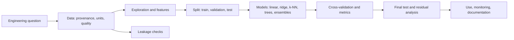
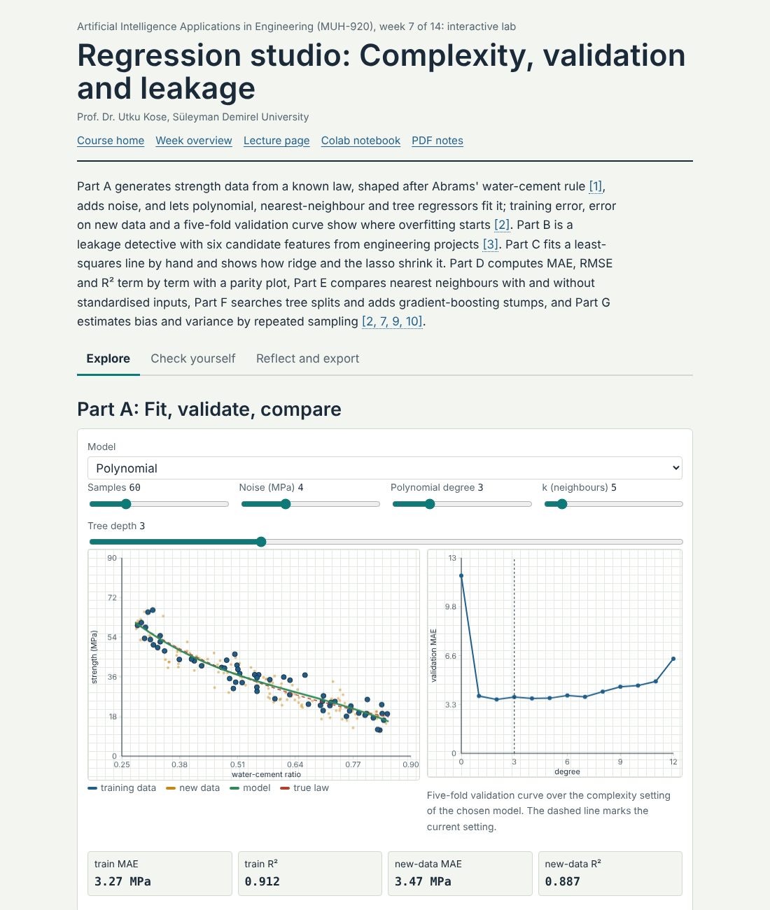
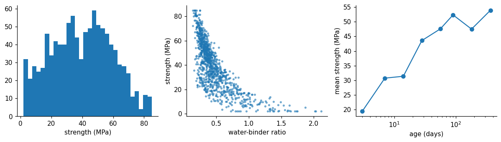
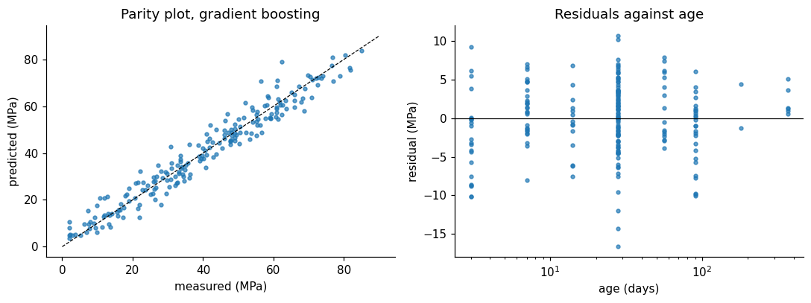

# Week 07: Learning from Data: The Machine Learning Workflow and Regression

**Artificial Intelligence Applications in Engineering (MUH-920 Mühendislikte Yapay Zeka Uygulamaları)** Prof. Dr. Utku Kose, Süleyman Demirel University

   

[Week 6](../week-06/README.md) | [All weeks](../../README.md#weekly-schedule) | [Week 8](../week-08/README.md)

## Overview

The first half of the course encoded knowledge by hand: search heuristics, rules, membership functions and cost functions. Machine learning takes the opposite route and estimates a model from examples [1]. This week introduces the workflow that every data-driven engineering project follows, from the question and the data to validation and deployment [2], and applies it to regression: predicting a continuous quantity. The core case predicts the compressive strength of concrete from its mix and age, a problem studied with neural networks by Yeh [3, 4] and rooted in Abrams' water-cement rule [5]. A switch in the notebook repeats the whole pipeline on datasets from power plants, buildings, aerodynamics, gas turbines, superconductors and garment production.

**Estimated study time:** 9 to 11 hours.

> **Midterm project.** The midterm project is due at the end of this week. The [project page](https://github.com/utkukose/ai-applications-in-engineering-NB-lecture/blob/main/exams/midterm/README.md) lists the deliverables and the evaluation criteria, and the report follows the common template.

## Learning outcomes

By the end of the week, students are expected to describe the stages of a machine learning project, to load, inspect and clean a tabular dataset with pandas, to split data into training, validation and test sets and use cross-validation, to fit and compare linear, regularised, nearest-neighbour and tree-based regressors with scikit-learn, to report MAE, RMSE and the coefficient of determination, to read parity and residual plots, and to recognise data leakage.

## Week at a glance

## Materials of the week

| Material | What it contains | Link |
|---|---|---|
| Lecture page | Six sections with formulas, nine worked examples, four knowledge checks, an animation, a figure and six review cards | [Open the lecture page](https://utkukose.github.io/ai-applications-in-engineering-NB-lecture/weeks/week-07/lecture.html) |
| Lecture notes | The printable version of the week: the lecture with its formulas and worked examples, Python step 7 and the outputs of its code, followed by the discipline challenges and the tasks | [Open the PDF](Week07_Lecture_Notes.pdf) |
| Interactive lab | *Regression studio: Complexity, validation and leakage*, with seven interactive parts, a self-assessment of six questions, three reflection prompts and an exportable learning log | [Open the lab](https://utkukose.github.io/ai-applications-in-engineering-NB-lecture/weeks/week-07/lab.html) |
| Colab notebook | Python step 7: Tables with pandas and honest evaluation with scikit-learn, followed by six hands-on sections with exercises and immediate feedback | [Open in Colab](https://colab.research.google.com/github/utkukose/ai-applications-in-engineering-NB-lecture/blob/main/weeks/week-07/NB07_ml_workflow_regression.ipynb), [view on GitHub](NB07_ml_workflow_regression.ipynb) |

## Contents

| Lecture page | Colab notebook |
|---|---|
| [From rules to data](https://utkukose.github.io/ai-applications-in-engineering-NB-lecture/weeks/week-07/lecture.html#from-rules-to-data) | [Python step 7: Tables with pandas and honest evaluation with scikit-learn](https://colab.research.google.com/github/utkukose/ai-applications-in-engineering-NB-lecture/blob/main/weeks/week-07/NB07_ml_workflow_regression.ipynb#scrollTo=python-step) |
| [The workflow of a data-driven project](https://utkukose.github.io/ai-applications-in-engineering-NB-lecture/weeks/week-07/lecture.html#the-workflow-of-a-data-driven-project) | [1. The concrete dataset](https://colab.research.google.com/github/utkukose/ai-applications-in-engineering-NB-lecture/blob/main/weeks/week-07/NB07_ml_workflow_regression.ipynb#scrollTo=section-1) |
| [Honest evaluation: Splits and cross-validation](https://utkukose.github.io/ai-applications-in-engineering-NB-lecture/weeks/week-07/lecture.html#honest-evaluation-splits-and-cross-validation) | [2. Exploration and a physically motivated feature](https://colab.research.google.com/github/utkukose/ai-applications-in-engineering-NB-lecture/blob/main/weeks/week-07/NB07_ml_workflow_regression.ipynb#scrollTo=section-2) |
| [Models for regression](https://utkukose.github.io/ai-applications-in-engineering-NB-lecture/weeks/week-07/lecture.html#models-for-regression) | [3. Split first, then compare models with cross-validation](https://colab.research.google.com/github/utkukose/ai-applications-in-engineering-NB-lecture/blob/main/weeks/week-07/NB07_ml_workflow_regression.ipynb#scrollTo=section-3) |
| [Measuring errors](https://utkukose.github.io/ai-applications-in-engineering-NB-lecture/weeks/week-07/lecture.html#measuring-errors) | [4. One final test, with plots](https://colab.research.google.com/github/utkukose/ai-applications-in-engineering-NB-lecture/blob/main/weeks/week-07/NB07_ml_workflow_regression.ipynb#scrollTo=section-4) |
| [Data leakage](https://utkukose.github.io/ai-applications-in-engineering-NB-lecture/weeks/week-07/lecture.html#data-leakage) | [5. A leakage experiment](https://colab.research.google.com/github/utkukose/ai-applications-in-engineering-NB-lecture/blob/main/weeks/week-07/NB07_ml_workflow_regression.ipynb#scrollTo=section-5) |
| [Review cards](https://utkukose.github.io/ai-applications-in-engineering-NB-lecture/weeks/week-07/lecture.html#review-cards) | [6. The discipline switch](https://colab.research.google.com/github/utkukose/ai-applications-in-engineering-NB-lecture/blob/main/weeks/week-07/NB07_ml_workflow_regression.ipynb#scrollTo=section-6) |

## Study path

| Step | Activity | Suggested time |
|---|---|---|
| 1 | Read the [lecture page](https://utkukose.github.io/ai-applications-in-engineering-NB-lecture/weeks/week-07/lecture.html) and answer its knowledge checks, or read the [PDF notes](Week07_Lecture_Notes.pdf) | 2 hours |
| 2 | Explore the simulation of the [interactive lab](https://utkukose.github.io/ai-applications-in-engineering-NB-lecture/weeks/week-07/lab.html#explore) | 1 hour |
| 3 | Work through [Python step 7](https://colab.research.google.com/github/utkukose/ai-applications-in-engineering-NB-lecture/blob/main/weeks/week-07/NB07_ml_workflow_regression.ipynb#scrollTo=python-step) at the start of the Colab notebook | 1 hour |
| 4 | Continue with the hands-on sections of the [notebook](https://colab.research.google.com/github/utkukose/ai-applications-in-engineering-NB-lecture/blob/main/weeks/week-07/NB07_ml_workflow_regression.ipynb) and their exercises | 3 hours |
| 5 | Solve the [discipline challenge](#discipline-challenges) of your department | 1 hour |
| 6 | Take the [self-assessment](https://utkukose.github.io/ai-applications-in-engineering-NB-lecture/weeks/week-07/lab.html#check) in the lab | 20 minutes |
| 7 | Answer the [reflection prompts](https://utkukose.github.io/ai-applications-in-engineering-NB-lecture/weeks/week-07/lab.html#reflect), export the learning log and complete the [weekly task](#weekly-task) | 1 hour |

## Preview

<table><tr><td colspan="2"> Interactive lab: Regression studio: Complexity, validation and leakage</td></tr><tr><td width="50%"></td><td width="50%"></td></tr><tr><td colspan="2">Outputs of the executed Colab notebook</td></tr></table>

## Discipline challenges

The notebook's switch loads a regression dataset for several fields with one line. Pick the row of your department and run the whole pipeline on it, or bring your own public data.

| Department | Challenge |
|---|---|
| Civil Engineering | Concrete compressive strength from mix proportions and age, UCI 165 [4]. |
| Mechanical Engineering and Electrical and Electronics Engineering | Net electrical output of a combined cycle power plant from ambient conditions, UCI 294 [6]. |
| Civil Engineering and Physics | Heating load of residential buildings from shape parameters, UCI 242 [7]. |
| Automotive Engineering and Mechanical Engineering | Airfoil self-noise from frequency, angle of attack and flow speed, UCI 291 [8]. |
| Environmental Engineering and Chemical Engineering | NOx emissions of a gas turbine from ambient and process variables, UCI 551 [9]. |
| Physics, Chemistry and Mathematics | Critical temperature of superconductors from composition features, UCI 464 [10]. |
| Industrial Engineering and Textile Engineering | Actual productivity of garment production teams, UCI 597 [11]. |
| Food Engineering and Chemistry | Wine quality score from physicochemical measurements as a regression target, UCI 186 [12]. |
| Statistics | Compare ordinary least squares, ridge and lasso paths on the concrete data and interpret shrinkage [13, 14]. |
| Geology, Geophysics, Mining and Earth Sciences Engineering | Predict a well-log property (for example PE) from the other logs of the SEG facies data used in Week 9 [15]. |

## Weekly task

Use the discipline switch of the notebook, or a public dataset from DATASETS.md, to build a regression model for a quantity from your department. Report the data source and its limits, the split, at least four models compared with cross-validation, the final test result, a parity plot and one residual plot, and a paragraph on possible leakage, in about 500 words. Cite at least three works from this week's references [2, 16, 17].

## Research and report assignment (optional)

**Machine learning for an engineering property.** Review how machine learning predicts one engineering property, for example concrete strength, building energy demand, power plant output or material critical temperature. Compare the data sources, input features, models and validation schemes of at least six studies and discuss what physical knowledge the best models use [3, 6, 7, 10].

Both assignments are optional. During an active semester, the weekly task can be sent together with the exported learning log, and the research report on its own, to utkukose@sdu.edu.tr or utkukose@gmail.com. They carry no separate weight, but the instructor may take them into account as a discretionary adjustment of the midterm component of the grade. The [assessment section of the syllabus](../../SYLLABUS.md#assessment) gives the details, and research reports use the [Word report template](../../exams/REPORT_TEMPLATE.docx).

## References

[1] Jordan, M. I., & Mitchell, T. M. (2015). Machine learning: Trends, perspectives, and prospects. *Science*, *349*(6245), 255-260. <https://doi.org/10.1126/science.aaa8415>

[2] Wirth, R., & Hipp, J. (2000). CRISP-DM: Towards a standard process model for data mining. In *Proceedings of the 4th International Conference on the Practical Applications of Knowledge Discovery and Data Mining* (pp. 29-39).

[3] Yeh, I.-C. (1998). Modeling of strength of high-performance concrete using artificial neural networks. *Cement and Concrete Research*, *28*(12), 1797-1808. <https://doi.org/10.1016/S0008-8846(98)00165-3>

[4] Yeh, I.-C. (1998). *Concrete Compressive Strength [Dataset]. UCI Machine Learning Repository, ID 165*. <https://doi.org/10.24432/C5PK67>

[5] Abrams, D. A. (1918). *Design of Concrete Mixtures (Bulletin 1)*. Structural Materials Research Laboratory, Lewis Institute, Chicago.

[6] Tüfekci, P. (2014). Prediction of full load electrical power output of a base load operated combined cycle power plant using machine learning methods. *International Journal of Electrical Power & Energy Systems*, *60*, 126-140. <https://doi.org/10.1016/j.ijepes.2014.02.027>

[7] Tsanas, A., & Xifara, A. (2012). Accurate quantitative estimation of energy performance of residential buildings using statistical machine learning tools. *Energy and Buildings*, *49*, 560-567. <https://doi.org/10.1016/j.enbuild.2012.03.003>

[8] Brooks, T. F., Pope, D. S., & Marcolini, M. A. (1989). *Airfoil Self-Noise and Prediction (NASA Reference Publication 1218)*. NASA.

[9] Kaya, H., Tüfekci, P., & Uzun, E. (2019). Predicting CO and NOx emissions from gas turbines: Novel data and a benchmark PEMS. *Turkish Journal of Electrical Engineering and Computer Sciences*, *27*(6), 4783-4796. <https://doi.org/10.3906/elk-1807-87>

[10] Hamidieh, K. (2018). A data-driven statistical model for predicting the critical temperature of a superconductor. *Computational Materials Science*, *154*, 346-354. <https://doi.org/10.1016/j.commatsci.2018.07.052>

[11] Imran, A. A., Rahim, M. S., & Ahmed, T. (2020). *Productivity Prediction of Garment Employees [Dataset]. UCI Machine Learning Repository, ID 597*. <https://archive.ics.uci.edu/dataset/597>

[12] Cortez, P., Cerdeira, A., Almeida, F., Matos, T., & Reis, J. (2009). Modeling wine preferences by data mining from physicochemical properties. *Decision Support Systems*, *47*(4), 547-553. <https://doi.org/10.1016/j.dss.2009.05.016>

[13] Hoerl, A. E., & Kennard, R. W. (1970). Ridge regression: Biased estimation for nonorthogonal problems. *Technometrics*, *12*(1), 55-67. <https://doi.org/10.1080/00401706.1970.10488634>

[14] Tibshirani, R. (1996). Regression shrinkage and selection via the lasso. *Journal of the Royal Statistical Society: Series B (Methodological)*, *58*(1), 267-288. <https://doi.org/10.1111/j.2517-6161.1996.tb02080.x>

[15] Hall, B. (2016). Facies classification using machine learning. *The Leading Edge*, *35*(10), 906-909. <https://doi.org/10.1190/tle35100906.1>

[16] Kohavi, R. (1995). A study of cross-validation and bootstrap for accuracy estimation and model selection. In *Proceedings of the 14th International Joint Conference on Artificial Intelligence* (pp. 1137-1143).

[17] Kaufman, S., Rosset, S., Perlich, C., & Stitelman, O. (2012). Leakage in data mining: Formulation, detection, and avoidance. *ACM Transactions on Knowledge Discovery from Data*, *6*(4), 15. <https://doi.org/10.1145/2382577.2382579>

---

Artificial Intelligence Applications in Engineering. Prof. Dr. Utku Kose, Süleyman Demirel University. ORCID [0000-0002-9652-6415](https://orcid.org/0000-0002-9652-6415). Content licensed under CC BY 4.0, code under MIT. This course is updated in line with current developments in the field. Last update: October 2026.
