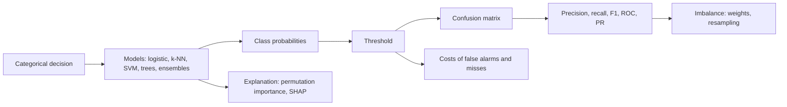
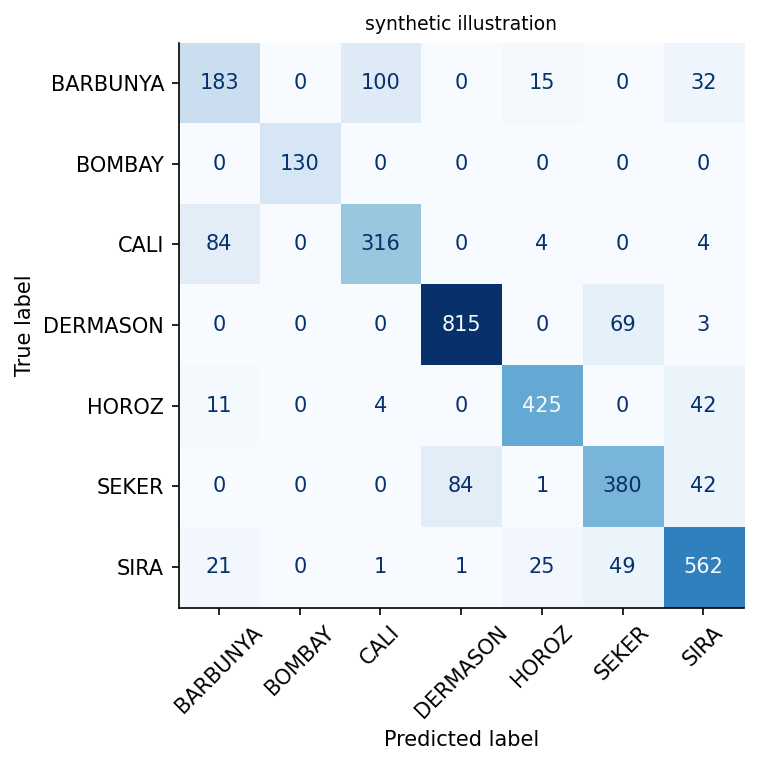
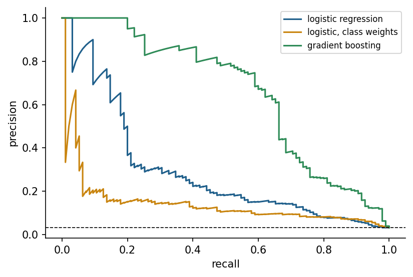

<div align="center">

# Week 08: Classification and Evaluation: Defects, Failures and Grades

**Artificial Intelligence Applications in Engineering (MUH-920 Mühendislikte Yapay Zeka Uygulamaları)**  
Prof. Dr. Utku Kose, Süleyman Demirel University

[](https://colab.research.google.com/github/utkukose/ai-applications-in-engineering-NB-lecture/blob/main/weeks/week-08/NB08_classification_evaluation.ipynb) [](https://utkukose.github.io/ai-applications-in-engineering-NB-lecture/weeks/week-08/lab.html) [](https://utkukose.github.io/ai-applications-in-engineering-NB-lecture/weeks/week-08/lecture.html) [](Week08_Lecture_Notes.pdf)

</div>

## Overview

Many engineering decisions are categorical: accept or reject a part, which fault mode is developing, which variety a grain belongs to, whether a rock burst is likely. Classification learns such decisions from labelled examples. This week compares logistic regression, nearest neighbours, support vector machines and tree ensembles [3, 6], and spends as much time on evaluation as on models: confusion matrices, precision and recall, ROC and precision-recall curves, thresholds chosen by costs, and the treatment of rare failures [8, 9, 10]. The core cases are the dry bean dataset, produced with computer vision in Türkiye [14, 17], and the AI4I predictive maintenance dataset [12, 15].

**Estimated study time:** 9 to 11 hours.

## Learning outcomes

By the end of the week, students are expected to train and compare multiclass classifiers with scikit-learn pipelines and stratified splits, to compute and interpret a confusion matrix, precision, recall, F1 and their macro averages, to draw and read ROC and precision-recall curves, to choose a decision threshold from engineering costs, to handle class imbalance with class weights or resampling, and to explain a model's behaviour with permutation importance.

## Python in this week

The lecture ends with Python step 8: Grouping, counting and evaluation functions. It covers counting and grouping with pandas, boolean logic on columns, functions that return several values, and results collected in tables, applied to a machine failure log [18]. The hands-on part of the notebook opens with the same step as runnable cells and short exercises with immediate feedback, and its later sections mark further constructs as Python moves.

## Study path

| Step | Activity | Suggested time |
|---|---|---|
| 1 | Read the lecture with its animations on the [lecture page](https://utkukose.github.io/ai-applications-in-engineering-NB-lecture/weeks/week-08/lecture.html), or read the [PDF version](Week08_Lecture_Notes.pdf) | 2 hours |
| 2 | Explore the [interactive lab](https://utkukose.github.io/ai-applications-in-engineering-NB-lecture/weeks/week-08/lab.html) | 1 hour |
| 3 | Study the Python step at the end of the lecture, then run the same step at the start of the hands-on part of the [Colab notebook](https://colab.research.google.com/github/utkukose/ai-applications-in-engineering-NB-lecture/blob/main/weeks/week-08/NB08_classification_evaluation.ipynb) | 1 hour |
| 4 | Work through the rest of the notebook, including its Python moves and exercises | 3 hours |
| 5 | Solve the discipline challenge of your department | 1 hour |
| 6 | Take the self-assessment in the lab (tab: Check yourself) | 20 minutes |
| 7 | Write the reflection, export the learning log and complete the weekly task | 1 hour |

## Week at a glance



## Lecture

### Classification problems in engineering

A classifier assigns an input to one of several classes. Quality inspection separates good from defective parts, condition monitoring distinguishes fault modes, food engineering grades products, and geology assigns facies to depth intervals of a well. A classifier divides the input space into regions separated by decision boundaries. Most modern classifiers do more than name a class: They estimate a probability or a score for each class, and a decision rule, usually a threshold, turns the score into an action. Separating the model from the decision is essential in engineering, because the costs of different mistakes are rarely equal.

### Models for classification

Logistic regression models the log-odds of a class as a linear function of the inputs, so its decision boundary is a straight line or a plane, and its coefficients show the direction in which each input pushes the decision [1]. The k-nearest-neighbour classifier takes a vote among the most similar training examples [2]. Support vector machines find the boundary with the largest margin between classes and use kernels to draw curved boundaries in the original space [3]. Decision trees ask a sequence of threshold questions and are easy to read [4, 5]; random forests and gradient boosting combine many trees and are among the strongest methods for tabular engineering data [6, 7].

> **Animation: Decision boundaries of three classifiers.** The same two-class data are separated by logistic regression, k nearest neighbours and a decision tree. Change k and the depth and watch the boundary move between too rigid and too wiggly. Run it in the [web version of the lecture](https://utkukose.github.io/ai-applications-in-engineering-NB-lecture/weeks/week-08/lecture.html#anim-boundary).



*Figure 8.1. Confusion matrix of a random forest on the synthetic stand-in of the dry bean data. Most errors occur between classes with similar shapes.*

<details>
<summary><b>Check your understanding.</b> Which classifier draws a linear decision boundary in the original input space?</summary>

A. Logistic regression without feature transformations  
B. k nearest neighbours with k = 1  
C. A random forest  
D. A support vector machine with a radial basis function kernel

**Answer: A.** Logistic regression models the log-odds linearly, so the boundary where the probability equals the threshold is a hyperplane.

</details>

### The confusion matrix and its metrics

For a binary problem with a positive class, such as "failure", the confusion matrix counts true positives (TP), false positives (FP), false negatives (FN) and true negatives (TN). Accuracy, the share of correct decisions, is misleading when classes are imbalanced: If 3 percent of machines fail, a model that always predicts "no failure" is 97 percent accurate and useless. Precision, TP / (TP + FP), is the share of alarms that are real. Recall, TP / (TP + FN), is the share of real failures that are caught. The F1 score is their harmonic mean. For several classes, the metrics are computed per class and averaged, either equally for every class (macro average) or weighted by class size (weighted average); the macro average reveals poor performance on small classes.

<details>
<summary><b>Check your understanding.</b> A model raises 50 alarms, of which 40 are real failures, and misses 10 failures. What are its precision and recall?</summary>

A. Precision 0.8 and recall 0.8  
B. Precision 0.8 and recall 0.4  
C. Precision 0.4 and recall 0.8  
D. Precision 1.0 and recall 0.8

**Answer: A.** Precision is 40 / 50 = 0.8 and recall is 40 / (40 + 10) = 0.8.

</details>

### Curves, thresholds and costs

Varying the threshold traces curves. The ROC curve plots the true positive rate against the false positive rate, and the area under it (AUC) equals the probability that a random positive example receives a higher score than a random negative one [8]. When positives are rare, the precision-recall curve is more informative, because the false positive rate can look small while alarms are still mostly false [9].

The threshold should come from the application. If a missed bearing failure costs twenty times more than an unnecessary inspection, the expected cost for each threshold on validation data can be computed, and the threshold with the lowest cost chosen. The default of 0.5 is only correct when both errors cost the same and the probabilities are well calibrated.

<details>
<summary><b>Check your understanding.</b> Positives are 1 percent of the data. Which curve is recommended to compare classifiers?</summary>

A. The ROC curve only  
B. The precision-recall curve  
C. The training loss curve  
D. The learning rate curve

**Answer: B.** With rare positives, precision reveals how many alarms are false, which the false positive rate hides [9].

</details>

### Imbalanced data

Rare events are the rule in engineering: failures, defects, accidents, rock bursts. Several remedies exist. Stratified splits keep the class proportions equal in training and test data. Class weights make errors on the rare class more expensive during training. Resampling duplicates rare examples or removes common ones, and SMOTE creates synthetic minority examples by interpolating between neighbouring minority samples [10]. None of these remedies creates information; the most effective step is often better features, more minority data or a problem definition that matches the decision.



*Figure 8.2. Precision-recall curves of three classifiers for rare machine failures on the synthetic stand-in of the AI4I data. The dashed line marks the share of failures, the precision of random guessing.*

### Explaining classifiers

Engineers need to know why a model decides. Permutation importance measures how much a performance metric drops when the values of one feature are shuffled, which breaks its link to the target. SHAP values distribute a single prediction among the features according to a game-theoretic rule and are widely used for tree ensembles [11]. In predictive maintenance, explanations connect model output to physical mechanisms such as heat dissipation or tool wear [12]. Newer methods study the geometry of a model's decision function, for example GEMEX, which the instructor developed as an open Python package [13]. Explanations are models of models and can mislead, so they should be checked against domain knowledge and, where possible, against deliberately constructed test cases.

<details>
<summary><b>Check your understanding.</b> Shuffling the values of &quot;torque&quot; in the test data lowers the F1 score of a failure classifier from 0.82 to 0.41. What does this indicate?</summary>

A. Torque is unimportant for the model  
B. The model relies strongly on torque for its decisions  
C. Torque causes failures in every case  
D. The test data are leaked

**Answer: B.** A large drop after permutation shows that the model uses the feature; it does not prove a causal mechanism.

</details>

<!-- python-step -->

### Python step 8: Grouping, counting and evaluation functions

#### Counting and grouping

Classification data raise two questions at once: How many examples does each class have, and how do the classes differ? `value_counts` counts the occurrences of each value in a column. `groupby` splits a table by the values of one column, applies a summary to each group and combines the results. The practice log below lists invented machine records with the product type, the tool wear, the torque and whether a failure occurred.

```python
import numpy as np
import pandas as pd

log = pd.DataFrame({
    "type": ["L", "M", "H", "L", "L", "M", "H", "L", "M", "L", "H", "M"],
    "tool_wear_min": [12, 180, 205, 221, 64, 230, 15, 199, 98, 240, 150, 30],
    "torque_Nm": [38.2, 45.1, 61.0, 52.3, 40.0, 58.4, 33.5, 49.9, 41.2, 63.8, 60.5, 36.1],
    "failure": [0, 0, 1, 1, 0, 1, 0, 1, 0, 1, 0, 0],
})
print(log["type"].value_counts())
print(log.groupby("type")["failure"].mean().round(2))
print(log.groupby("failure")[["tool_wear_min", "torque_Nm"]].mean().round(1))
```

*Output*

```text
type
L    5
M    4
H    3
Name: count, dtype: int64
type
H    0.33
L    0.60
M    0.25
Name: failure, dtype: float64
         tool_wear_min  torque_Nm
failure                          
0                 78.4       42.1
1                219.0       57.1
```

#### A rule as a classifier

A simple rule predicts a failure when the tool wear exceeds 200 minutes or the torque exceeds 60 N m. The combined condition produces a boolean Series, and `astype(int)` turns it into zeros and ones. `pd.crosstab` counts the combinations of actual and predicted classes, which is the confusion matrix of this week.

```python
pred = ((log["tool_wear_min"] > 200) | (log["torque_Nm"] > 60)).astype(int)
actual = log["failure"]
print(pd.crosstab(actual, pred, rownames=["actual"], colnames=["predicted"]))
```

*Output*

```text
predicted  0  1
actual         
0          6  1
1          1  4
```

#### Functions that return several values

A function can return several values separated by commas. Python packs them into a tuple, and the caller unpacks them into separate names. The function below counts true positives, false positives, false negatives and true negatives. A loop over several wear limits collects one dictionary per limit in a list, and `pd.DataFrame` turns the list into a table of results, a pattern that also serves to compare models, settings or datasets.

```python
def confusion(y_true, y_pred):
    """Return the counts (tp, fp, fn, tn) for labels coded as 0 and 1."""
    y_true, y_pred = np.asarray(y_true), np.asarray(y_pred)
    tp = int(np.sum((y_true == 1) & (y_pred == 1)))
    fp = int(np.sum((y_true == 0) & (y_pred == 1)))
    fn = int(np.sum((y_true == 1) & (y_pred == 0)))
    tn = int(np.sum((y_true == 0) & (y_pred == 0)))
    return tp, fp, fn, tn

tp, fp, fn, tn = confusion(actual, pred)
print("tp, fp, fn, tn =", (tp, fp, fn, tn))
rows = []
for limit in [150, 200, 220]:
    tp, fp, fn, tn = confusion(actual, log["tool_wear_min"] > limit)
    rows.append({"wear limit": limit, "precision": tp / max(tp + fp, 1), "recall": tp / max(tp + fn, 1)})
print(pd.DataFrame(rows).round(2))
```

*Output*

```text
tp, fp, fn, tn = (4, 1, 1, 6)
   wear limit  precision  recall
0         150       0.83     1.0
1         200       1.00     0.8
2         220       1.00     0.6
```

The expression `max(tp + fp, 1)` avoids a division by zero when a rule predicts no failure at all.

<details>
<summary><b>Check your understanding.</b> A function ends with return tp, fp, fn, tn. Which line stores its four results under separate names?</summary>

A. tp, fp, fn, tn = confusion(y, p)  
B. tp = fp = fn = tn = confusion(y, p)  
C. [tp] = confusion(y, p)  
D. confusion(y, p).unpack()

**Answer: A.** The function returns a tuple of four values, and a tuple unpacks into as many names as it has elements.

</details>

<!-- /python-step -->

## Discipline challenges

The switch in the notebook loads a classification dataset for several fields. Pick the row of your department and repeat the evaluation, paying attention to class balance and error costs.

| Department | Challenge |
|---|---|
| Food Engineering and Biology | Dry bean varieties from shape features, UCI 602 [17], or rice varieties, UCI 545 [19]. |
| Mechanical Engineering and Industrial Engineering | Machine failure in the AI4I 2020 predictive maintenance data, UCI 601 [15]. |
| Mechanical Engineering and Textile Engineering | Fault types of steel plates from geometric and luminosity features, UCI 198 [20]. |
| Mining Engineering and Geophysical Engineering | Hazardous seismic bumps in a coal mine, UCI 266 [16, 21]. |
| Physics | Gamma-ray showers versus hadron background in the MAGIC telescope, UCI 159 [22]. |
| Chemistry and Environmental Engineering | Ready biodegradability of chemicals from molecular descriptors, UCI 254 [23]. |
| Electrical and Electronics Engineering | Stability of a simulated decentralised smart grid, UCI 471, without the leaking stability margin [24]. |
| Chemical Engineering and Food Engineering | Good versus ordinary wine from physicochemical tests, UCI 186 [25]. |
| Geological Engineering and Earth Sciences Engineering | Lithofacies from well logs, the SEG facies data of Week 9 [26]. |
| Computer Engineering and Statistics | Compare macro and weighted averages and calibration on any multiclass dataset; discuss when each is appropriate. |

## Interactive lab

Part A generates classifier scores for failures and normal cases with adjustable separation and imbalance. A threshold slider updates the confusion matrix, precision, recall, F1 and the expected cost, and the ROC and precision-recall curves show the current operating point [8, 9]. Part B asks for metrics computed from confusion matrices of engineering scenarios.

[Open the interactive lab](https://utkukose.github.io/ai-applications-in-engineering-NB-lecture/weeks/week-08/lab.html)


## Colab notebook

The notebook classifies seven dry bean varieties from sixteen shape features [14] with logistic regression, k-nearest neighbours, a support vector machine, a random forest and gradient boosting, and studies the confusion matrix and permutation importance of the best model. It then turns to rare machine failures in the AI4I data [15]: the accuracy paradox, class weights, ROC and precision-recall curves, and a threshold chosen from the costs of misses and false alarms. A switch reruns the multiclass comparison on the dataset of another department.

[](https://colab.research.google.com/github/utkukose/ai-applications-in-engineering-NB-lecture/blob/main/weeks/week-08/NB08_classification_evaluation.ipynb)

Screenshots of the executed notebook:


## Self-assessment and reflection

The lab contains a 6-question self-assessment with instant feedback and a confidence rating for each answer. A confident but wrong answer marks the first topic to revisit. The reflection prompts below are also available in the lab, where answers are saved in the browser and can be exported as a learning log.

1. Which classification decision in your field has unequal error costs? Estimate the ratio of the costs of a miss and a false alarm.
2. Which class of the dry bean data was hardest to recognise, and what does the confusion matrix suggest about the reason?
3. How would you explain the difference between precision and recall to a colleague in production, without formulas?

## Weekly task and submission

Choose a classification dataset from the discipline switch or from DATASETS.md, train at least three classifiers with a stratified split, and report the confusion matrix, per-class precision and recall, the macro F1 and a ROC or precision-recall curve. If the classes are imbalanced, choose a threshold from explicitly stated costs and justify them. Explain the most important features with permutation importance and discuss whether they make physical sense, in about 500 words, citing at least three works from this week's references [8, 9, 12].

The weekly task is optional and supports self-learning and a personal portfolio. During an active semester, it can be sent together with the exported learning log to utkukose@sdu.edu.tr or utkukose@gmail.com. Optional work carries no separate weight, but the instructor may take it into account as a discretionary adjustment of the midterm component of the grade.

## Research and report assignment (optional)

**Evaluating classifiers for rare engineering events.** Review how studies on predictive maintenance, defect detection or hazard prediction evaluate classifiers when events are rare. Compare the metrics, resampling strategies and threshold choices, and assess whether the reported results support the claimed industrial value [9, 10, 12, 16].

This research assignment is optional and supports self-learning. When the related weeks are followed within the course during an active semester, the report can be sent to utkukose@sdu.edu.tr or utkukose@gmail.com. It carries no separate weight, but the instructor may take it into account as a discretionary adjustment of the midterm component of the grade. Unless the assignment states otherwise, a report has 1500 to 2500 words, follows the structure of an academic paper, cites at least six scholarly or official sources in square brackets and uses the template in `exams/REPORT_TEMPLATE.md`.

## References

[1] Hastie, T., Tibshirani, R., & Friedman, J. (2009). *The Elements of Statistical Learning: Data Mining, Inference, and Prediction* (2nd ed.). Springer. <https://doi.org/10.1007/978-0-387-84858-7>

[2] Cover, T., & Hart, P. (1967). Nearest neighbor pattern classification. *IEEE Transactions on Information Theory*, *13*(1), 21-27. <https://doi.org/10.1109/TIT.1967.1053964>

[3] Cortes, C., & Vapnik, V. (1995). Support-vector networks. *Machine Learning*, *20*(3), 273-297. <https://doi.org/10.1007/BF00994018>

[4] Breiman, L., Friedman, J. H., Olshen, R. A., & Stone, C. J. (1984). *Classification and Regression Trees*. Wadsworth.

[5] Quinlan, J. R. (1986). Induction of decision trees. *Machine Learning*, *1*(1), 81-106. <https://doi.org/10.1007/BF00116251>

[6] Breiman, L. (2001). Random forests. *Machine Learning*, *45*(1), 5-32. <https://doi.org/10.1023/A:1010933404324>

[7] Chen, T., & Guestrin, C. (2016). XGBoost: A scalable tree boosting system. In *Proceedings of the 22nd ACM SIGKDD International Conference on Knowledge Discovery and Data Mining* (pp. 785-794). <https://doi.org/10.1145/2939672.2939785>

[8] Fawcett, T. (2006). An introduction to ROC analysis. *Pattern Recognition Letters*, *27*(8), 861-874. <https://doi.org/10.1016/j.patrec.2005.10.010>

[9] Saito, T., & Rehmsmeier, M. (2015). The precision-recall plot is more informative than the ROC plot when evaluating binary classifiers on imbalanced datasets. *PLOS ONE*, *10*(3), e0118432. <https://doi.org/10.1371/journal.pone.0118432>

[10] Chawla, N. V., Bowyer, K. W., Hall, L. O., & Kegelmeyer, W. P. (2002). SMOTE: Synthetic minority over-sampling technique. *Journal of Artificial Intelligence Research*, *16*, 321-357. <https://doi.org/10.1613/jair.953>

[11] Lundberg, S. M., & Lee, S.-I. (2017). A unified approach to interpreting model predictions. In *Advances in Neural Information Processing Systems 30* (pp. 4765-4774). <https://arxiv.org/abs/1705.07874>

[12] Matzka, S. (2020). Explainable artificial intelligence for predictive maintenance applications. In *2020 Third International Conference on Artificial Intelligence for Industries (AI4I)* (pp. 69-74). IEEE. <https://doi.org/10.1109/AI4I49448.2020.00023>

[13] Kose, U. (2026). *GEMEX: Geodesic Entropic Manifold Explainability (Version 1.2.2) [Python package]*. Python Package Index. <https://pypi.org/project/gemex/>

[14] Koklu, M., & Ozkan, I. A. (2020). *Dry Bean [Dataset]. UCI Machine Learning Repository, ID 602*. <https://doi.org/10.24432/C50S4B>

[15] Matzka, S. (2020). *AI4I 2020 Predictive Maintenance Dataset [Dataset]. UCI Machine Learning Repository, ID 601*. <https://doi.org/10.24432/C5HS5C>

[16] Sikora, M., & Wróbel, Ł. (2010). Application of rule induction algorithms for analysis of data collected by seismic hazard monitoring systems in coal mines. *Archives of Mining Sciences*, *55*(1), 91-114.

[17] Koklu, M., & Ozkan, I. A. (2020). Multiclass classification of dry beans using computer vision and machine learning techniques. *Computers and Electronics in Agriculture*, *174*, 105507. <https://doi.org/10.1016/j.compag.2020.105507>

[18] McKinney, W. (2010). Data structures for statistical computing in Python. In *Proceedings of the 9th Python in Science Conference* (pp. 56-61). <https://doi.org/10.25080/Majora-92bf1922-00a>

[19] Cinar, I., & Koklu, M. (2019). Classification of rice varieties using artificial intelligence methods. *International Journal of Intelligent Systems and Applications in Engineering*, *7*(3), 188-194. <https://doi.org/10.18201/ijisae.2019355381>

[20] Buscema, M., Terzi, S., & Tastle, W. (2010). *Steel Plates Faults [Dataset]. UCI Machine Learning Repository, ID 198*. <https://doi.org/10.24432/C5J88N>

[21] Sikora, M., & Wróbel, Ł. (2010). *seismic-bumps [Dataset]. UCI Machine Learning Repository, ID 266*. <https://doi.org/10.24432/C5W902>

[22] Bock, R. (2004). *MAGIC Gamma Telescope [Dataset]. UCI Machine Learning Repository, ID 159*. <https://doi.org/10.24432/C52C8B>

[23] Mansouri, K., Ringsted, T., Ballabio, D., Todeschini, R., & Consonni, V. (2013). *QSAR biodegradation [Dataset]. UCI Machine Learning Repository, ID 254*. <https://doi.org/10.24432/C5H60M>

[24] Arzamasov, V. (2018). *Electrical Grid Stability Simulated Data [Dataset]. UCI Machine Learning Repository, ID 471*. <https://doi.org/10.24432/C5PG66>

[25] Cortez, P., Cerdeira, A., Almeida, F., Matos, T., & Reis, J. (2009). Modeling wine preferences by data mining from physicochemical properties. *Decision Support Systems*, *47*(4), 547-553. <https://doi.org/10.1016/j.dss.2009.05.016>

[26] Hall, B. (2016). Facies classification using machine learning. *The Leading Edge*, *35*(10), 906-909. <https://doi.org/10.1190/tle35100906.1>

---

<sub>Artificial Intelligence Applications in Engineering. Prof. Dr. Utku Kose, Süleyman Demirel University. ORCID [0000-0002-9652-6415](https://orcid.org/0000-0002-9652-6415). Content licensed under CC BY 4.0, code under MIT. This course is updated in line with current developments in the field. Last update: September 2026.</sub>
