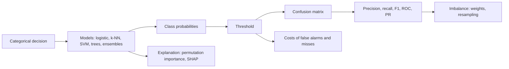
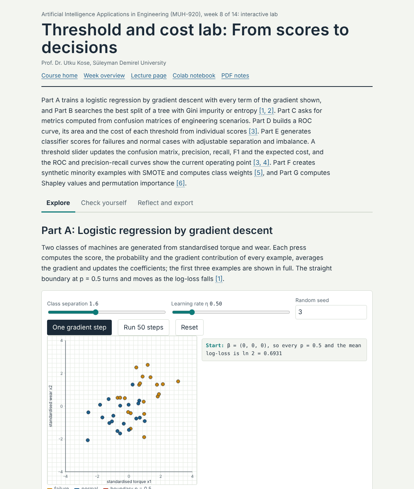
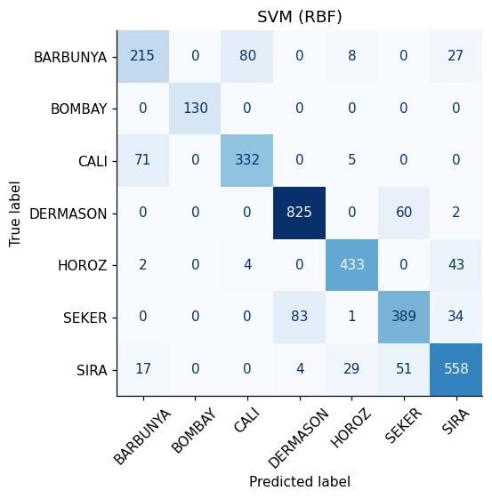
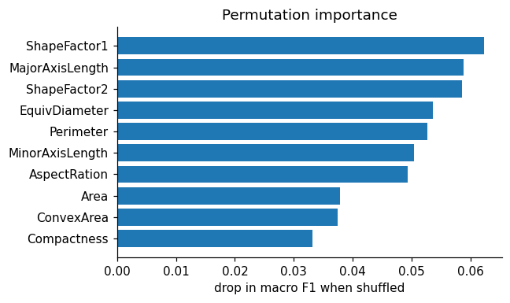

# Week 08: Classification and Evaluation: Defects, Failures and Grades

**Artificial Intelligence Applications in Engineering (MUH-920 Mühendislikte Yapay Zeka Uygulamaları)** Prof. Dr. Utku Kose, Süleyman Demirel University

   

[Week 7](../week-07/README.md) | [All weeks](../../README.md#weekly-schedule) | [Week 9](../week-09/README.md)

## Overview

Many engineering decisions are categorical: accept or reject a part, which fault mode is developing, which variety a grain belongs to, whether a rock burst is likely. Classification learns such decisions from labelled examples. This week compares logistic regression, nearest neighbours, support vector machines and tree ensembles [1, 2], and spends as much time on evaluation as on models: confusion matrices, precision and recall, ROC and precision-recall curves, thresholds chosen by costs, and the treatment of rare failures [3, 4, 5]. The core cases are the dry bean dataset, produced with computer vision in Türkiye [6, 7], and the AI4I predictive maintenance dataset [8, 9].

**Estimated study time:** 9 to 11 hours.

## Learning outcomes

By the end of the week, students are expected to train and compare multiclass classifiers with scikit-learn pipelines and stratified splits, to compute and interpret a confusion matrix, precision, recall, F1 and their macro averages, to draw and read ROC and precision-recall curves, to choose a decision threshold from engineering costs, to handle class imbalance with class weights or resampling, and to explain a model's behaviour with permutation importance.

## Week at a glance

## Materials of the week

| Material | What it contains | Link |
|---|---|---|
| Lecture page | Six sections with formulas, nine worked examples, four knowledge checks, an animation, a figure and six review cards | [Open the lecture page](https://utkukose.github.io/ai-applications-in-engineering-NB-lecture/weeks/week-08/lecture.html) |
| Lecture notes | The printable version of the week: the lecture with its formulas and worked examples, Python step 8 and the outputs of its code, followed by the discipline challenges and the tasks | [Open the PDF](Week08_Lecture_Notes.pdf) |
| Interactive lab | *Threshold and cost lab: From scores to decisions*, with seven interactive parts, a self-assessment of six questions, three reflection prompts and an exportable learning log | [Open the lab](https://utkukose.github.io/ai-applications-in-engineering-NB-lecture/weeks/week-08/lab.html) |
| Colab notebook | Python step 8: Grouping, counting and evaluation functions, followed by six hands-on sections with exercises and immediate feedback | [Open in Colab](https://colab.research.google.com/github/utkukose/ai-applications-in-engineering-NB-lecture/blob/main/weeks/week-08/NB08_classification_evaluation.ipynb), [view on GitHub](NB08_classification_evaluation.ipynb) |

## Contents

| Lecture page | Colab notebook |
|---|---|
| [Classification problems in engineering](https://utkukose.github.io/ai-applications-in-engineering-NB-lecture/weeks/week-08/lecture.html#classification-problems-in-engineering) | [Python step 8: Grouping, counting and evaluation functions](https://colab.research.google.com/github/utkukose/ai-applications-in-engineering-NB-lecture/blob/main/weeks/week-08/NB08_classification_evaluation.ipynb#scrollTo=python-step) |
| [Models for classification](https://utkukose.github.io/ai-applications-in-engineering-NB-lecture/weeks/week-08/lecture.html#models-for-classification) | [1. Dry beans from computer vision](https://colab.research.google.com/github/utkukose/ai-applications-in-engineering-NB-lecture/blob/main/weeks/week-08/NB08_classification_evaluation.ipynb#scrollTo=section-1) |
| [The confusion matrix and its metrics](https://utkukose.github.io/ai-applications-in-engineering-NB-lecture/weeks/week-08/lecture.html#the-confusion-matrix-and-its-metrics) | [2. The confusion matrix of the best model](https://colab.research.google.com/github/utkukose/ai-applications-in-engineering-NB-lecture/blob/main/weeks/week-08/NB08_classification_evaluation.ipynb#scrollTo=section-2) |
| [Curves, thresholds and costs](https://utkukose.github.io/ai-applications-in-engineering-NB-lecture/weeks/week-08/lecture.html#curves-thresholds-and-costs) | [3. Which features does the model use?](https://colab.research.google.com/github/utkukose/ai-applications-in-engineering-NB-lecture/blob/main/weeks/week-08/NB08_classification_evaluation.ipynb#scrollTo=section-3) |
| [Imbalanced data](https://utkukose.github.io/ai-applications-in-engineering-NB-lecture/weeks/week-08/lecture.html#imbalanced-data) | [4. Rare failures: the AI4I predictive maintenance data](https://colab.research.google.com/github/utkukose/ai-applications-in-engineering-NB-lecture/blob/main/weeks/week-08/NB08_classification_evaluation.ipynb#scrollTo=section-4) |
| [Explaining classifiers](https://utkukose.github.io/ai-applications-in-engineering-NB-lecture/weeks/week-08/lecture.html#explaining-classifiers) | [5. A threshold from costs](https://colab.research.google.com/github/utkukose/ai-applications-in-engineering-NB-lecture/blob/main/weeks/week-08/NB08_classification_evaluation.ipynb#scrollTo=section-5) |
| [Review cards](https://utkukose.github.io/ai-applications-in-engineering-NB-lecture/weeks/week-08/lecture.html#review-cards) | [6. The discipline switch](https://colab.research.google.com/github/utkukose/ai-applications-in-engineering-NB-lecture/blob/main/weeks/week-08/NB08_classification_evaluation.ipynb#scrollTo=section-6) |

The links of the notebook column open the notebook at the chosen part. Most parts use the setup cell and the results of the parts above them: Runtime > Run before (Ctrl+F8) in Colab runs those cells first. If they have not run in the current session, the first code cell of the part stops with a message.

## Study path

| Step | Activity | Suggested time |
|---|---|---|
| 1 | Read the [lecture page](https://utkukose.github.io/ai-applications-in-engineering-NB-lecture/weeks/week-08/lecture.html) and answer its knowledge checks, or read the [PDF notes](Week08_Lecture_Notes.pdf) | 2 hours |
| 2 | Explore the simulation of the [interactive lab](https://utkukose.github.io/ai-applications-in-engineering-NB-lecture/weeks/week-08/lab.html#explore) | 1 hour |
| 3 | Work through [Python step 8](https://colab.research.google.com/github/utkukose/ai-applications-in-engineering-NB-lecture/blob/main/weeks/week-08/NB08_classification_evaluation.ipynb#scrollTo=python-step) at the start of the Colab notebook, after running its setup cell | 1 hour |
| 4 | Continue with the hands-on sections of the [notebook](https://colab.research.google.com/github/utkukose/ai-applications-in-engineering-NB-lecture/blob/main/weeks/week-08/NB08_classification_evaluation.ipynb) and their exercises | 3 hours |
| 5 | Solve the [discipline challenge](#discipline-challenges) of your department | 1 hour |
| 6 | Take the [self-assessment](https://utkukose.github.io/ai-applications-in-engineering-NB-lecture/weeks/week-08/lab.html#check) in the lab | 20 minutes |
| 7 | Answer the [reflection prompts](https://utkukose.github.io/ai-applications-in-engineering-NB-lecture/weeks/week-08/lab.html#reflect), export the learning log and complete the [weekly task](#weekly-task) | 1 hour |

## Preview

<table><tr><td colspan="2"> Interactive lab: Threshold and cost lab: From scores to decisions</td></tr><tr><td width="50%"></td><td width="50%"></td></tr><tr><td colspan="2">Outputs of the executed Colab notebook</td></tr></table>

## Discipline challenges

The switch in the notebook loads a classification dataset for several fields. Pick the row of your department and repeat the evaluation, paying attention to class balance and error costs.

| Department | Challenge |
|---|---|
| Food Engineering and Biology | Dry bean varieties from shape features, UCI 602 [7], or rice varieties, UCI 545 [10]. |
| Mechanical Engineering and Industrial Engineering | Machine failure in the AI4I 2020 predictive maintenance data, UCI 601 [9]. |
| Mechanical Engineering and Textile Engineering | Fault types of steel plates from geometric and luminosity features, UCI 198 [11]. |
| Mining Engineering and Geophysical Engineering | Hazardous seismic bumps in a coal mine, UCI 266 [12, 13]. |
| Physics | Gamma-ray showers versus hadron background in the MAGIC telescope, UCI 159 [14]. |
| Chemistry and Environmental Engineering | Ready biodegradability of chemicals from molecular descriptors, UCI 254 [15]. |
| Electrical and Electronics Engineering | Stability of a simulated decentralised smart grid, UCI 471, without the leaking stability margin [16]. |
| Chemical Engineering and Food Engineering | Good versus ordinary wine from physicochemical tests, UCI 186 [17]. |
| Geological Engineering and Earth Sciences Engineering | Lithofacies from well logs, the SEG facies data of Week 9 [18]. |
| Computer Engineering and Statistics | Compare macro and weighted averages and calibration on any multiclass dataset; discuss when each is appropriate. |

## Weekly task

Choose a classification dataset from the discipline switch or from DATASETS.md, train at least three classifiers with a stratified split, and report the confusion matrix, per-class precision and recall, the macro F1 and a ROC or precision-recall curve. If the classes are imbalanced, choose a threshold from explicitly stated costs and justify them. Explain the most important features with permutation importance and discuss whether they make physical sense, in about 500 words, citing at least three works from this week's references [3, 4, 8].

## Research and report assignment (optional)

**Evaluating classifiers for rare engineering events.** Review how studies on predictive maintenance, defect detection or hazard prediction evaluate classifiers when events are rare. Compare the metrics, resampling strategies and threshold choices, and assess whether the reported results support the claimed industrial value [4, 5, 8, 12].

Both assignments are optional. During an active semester, the weekly task can be sent together with the exported learning log, and the research report on its own, to utkukose@sdu.edu.tr or utkukose@gmail.com. They carry no separate weight, but the instructor may take them into account as a discretionary adjustment of the midterm component of the grade. The [assessment section of the syllabus](../../SYLLABUS.md#assessment) gives the details, and research reports use the [Word report template](../../exams/REPORT_TEMPLATE.docx).

## References

[1] Cortes, C., & Vapnik, V. (1995). Support-vector networks. *Machine Learning*, *20*(3), 273-297. <https://doi.org/10.1007/BF00994018>

[2] Breiman, L. (2001). Random forests. *Machine Learning*, *45*(1), 5-32. <https://doi.org/10.1023/A:1010933404324>

[3] Fawcett, T. (2006). An introduction to ROC analysis. *Pattern Recognition Letters*, *27*(8), 861-874. <https://doi.org/10.1016/j.patrec.2005.10.010>

[4] Saito, T., & Rehmsmeier, M. (2015). The precision-recall plot is more informative than the ROC plot when evaluating binary classifiers on imbalanced datasets. *PLOS ONE*, *10*(3), e0118432. <https://doi.org/10.1371/journal.pone.0118432>

[5] Chawla, N. V., Bowyer, K. W., Hall, L. O., & Kegelmeyer, W. P. (2002). SMOTE: Synthetic minority over-sampling technique. *Journal of Artificial Intelligence Research*, *16*, 321-357. <https://doi.org/10.1613/jair.953>

[6] Koklu, M., & Ozkan, I. A. (2020). *Dry Bean [Dataset]. UCI Machine Learning Repository, ID 602*. <https://doi.org/10.24432/C50S4B>

[7] Koklu, M., & Ozkan, I. A. (2020). Multiclass classification of dry beans using computer vision and machine learning techniques. *Computers and Electronics in Agriculture*, *174*, 105507. <https://doi.org/10.1016/j.compag.2020.105507>

[8] Matzka, S. (2020). Explainable artificial intelligence for predictive maintenance applications. In *2020 Third International Conference on Artificial Intelligence for Industries (AI4I)* (pp. 69-74). IEEE. <https://doi.org/10.1109/AI4I49448.2020.00023>

[9] Matzka, S. (2020). *AI4I 2020 Predictive Maintenance Dataset [Dataset]. UCI Machine Learning Repository, ID 601*. <https://doi.org/10.24432/C5HS5C>

[10] Cinar, I., & Koklu, M. (2019). Classification of rice varieties using artificial intelligence methods. *International Journal of Intelligent Systems and Applications in Engineering*, *7*(3), 188-194. <https://doi.org/10.18201/ijisae.2019355381>

[11] Buscema, M., Terzi, S., & Tastle, W. (2010). *Steel Plates Faults [Dataset]. UCI Machine Learning Repository, ID 198*. <https://doi.org/10.24432/C5J88N>

[12] Sikora, M., & Wróbel, Ł. (2010). Application of rule induction algorithms for analysis of data collected by seismic hazard monitoring systems in coal mines. *Archives of Mining Sciences*, *55*(1), 91-114.

[13] Sikora, M., & Wróbel, Ł. (2010). *seismic-bumps [Dataset]. UCI Machine Learning Repository, ID 266*. <https://doi.org/10.24432/C5W902>

[14] Bock, R. (2004). *MAGIC Gamma Telescope [Dataset]. UCI Machine Learning Repository, ID 159*. <https://doi.org/10.24432/C52C8B>

[15] Mansouri, K., Ringsted, T., Ballabio, D., Todeschini, R., & Consonni, V. (2013). *QSAR biodegradation [Dataset]. UCI Machine Learning Repository, ID 254*. <https://doi.org/10.24432/C5H60M>

[16] Arzamasov, V. (2018). *Electrical Grid Stability Simulated Data [Dataset]. UCI Machine Learning Repository, ID 471*. <https://doi.org/10.24432/C5PG66>

[17] Cortez, P., Cerdeira, A., Almeida, F., Matos, T., & Reis, J. (2009). Modeling wine preferences by data mining from physicochemical properties. *Decision Support Systems*, *47*(4), 547-553. <https://doi.org/10.1016/j.dss.2009.05.016>

[18] Hall, B. (2016). Facies classification using machine learning. *The Leading Edge*, *35*(10), 906-909. <https://doi.org/10.1190/tle35100906.1>

---

Artificial Intelligence Applications in Engineering. Prof. Dr. Utku Kose, Süleyman Demirel University. ORCID [0000-0002-9652-6415](https://orcid.org/0000-0002-9652-6415). Content licensed under CC BY 4.0, code under MIT. This course is updated in line with current developments in the field. Last update: October 2026.
