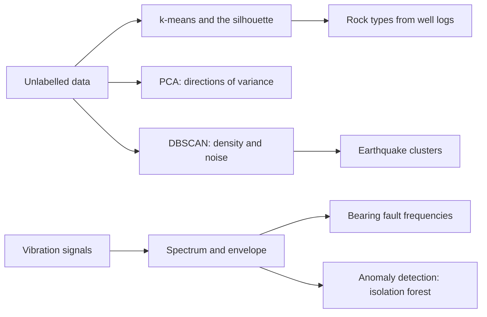
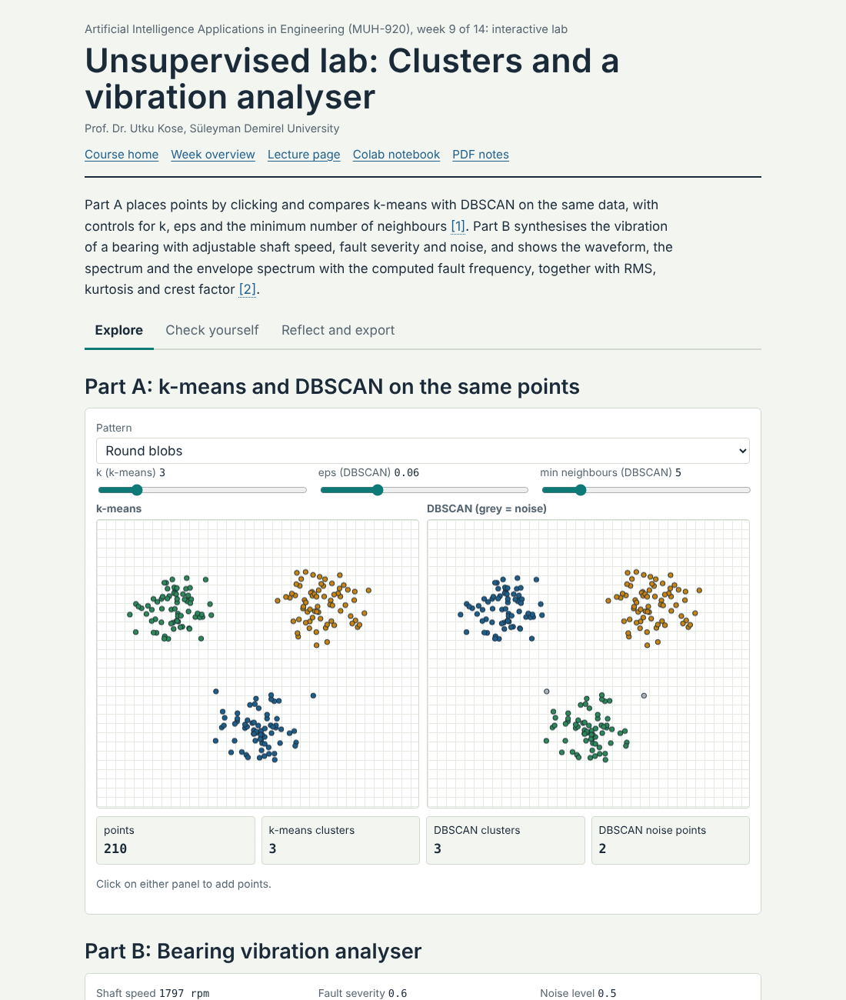
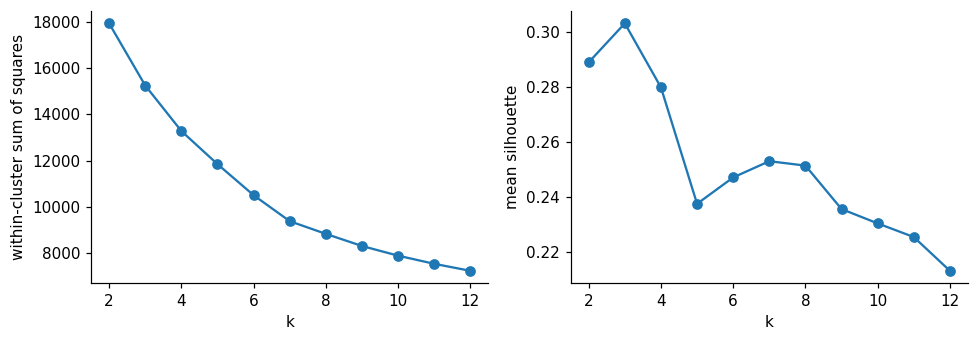
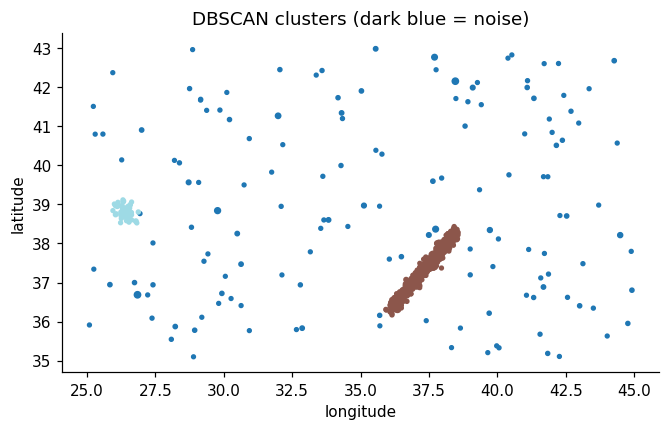

# Week 09: Patterns without Labels: Clustering, Signals and Anomaly Detection

**Artificial Intelligence Applications in Engineering (MUH-920 Mühendislikte Yapay Zeka Uygulamaları)** Prof. Dr. Utku Kose, Süleyman Demirel University

   

[Week 8](../week-08/README.md) | [All weeks](../../README.md#weekly-schedule) | [Week 10](../week-10/README.md)

## Overview

Sensors, logs and catalogues produce far more data than anyone can label. Unsupervised learning finds structure in such data: groups of similar records, a few directions that carry most of the variation, and points that do not fit [1, 2]. This week clusters well logs into rock types without using the geologists' labels [3], groups earthquakes by density in the catalogue of the U.S. Geological Survey [4, 5], and moves to signals: The Fourier transform and envelope analysis reveal bearing faults in vibration data, and an isolation forest learns what normal vibration looks like [6, 7, 8].

**Estimated study time:** 9 to 11 hours.

## Learning outcomes

By the end of the week, students are expected to apply k-means with proper scaling and choose the number of clusters with the silhouette score, to interpret principal components and their explained variance, to use DBSCAN for clusters of arbitrary shape and noise, to compute and read the spectrum of a sampled signal, to compute bearing fault frequencies and condition indicators such as RMS, kurtosis and crest factor, and to train and judge an anomaly detector on data from normal operation.

## Week at a glance

## Materials of the week

| Material | What it contains | Link |
|---|---|---|
| Lecture page | Six sections with four knowledge checks, an animation, a figure and six review cards | [Open the lecture page](https://utkukose.github.io/ai-applications-in-engineering-NB-lecture/weeks/week-09/lecture.html) |
| Lecture notes | The printable version of the week: the lecture with Python step 9 and the outputs of its code, followed by the discipline challenges and the tasks | [Open the PDF](Week09_Lecture_Notes.pdf) |
| Interactive lab | *Unsupervised lab: Clusters and a vibration analyser*, with a self-assessment of six questions, three reflection prompts and an exportable learning log | [Open the lab](https://utkukose.github.io/ai-applications-in-engineering-NB-lecture/weeks/week-09/lab.html) |
| Colab notebook | Python step 9: Signals, features and clustering with NumPy, followed by six hands-on sections with exercises and immediate feedback | [Open in Colab](https://colab.research.google.com/github/utkukose/ai-applications-in-engineering-NB-lecture/blob/main/weeks/week-09/NB09_unsupervised_signals_anomalies.ipynb), [view on GitHub](NB09_unsupervised_signals_anomalies.ipynb) |

## Contents

| Lecture page | Colab notebook |
|---|---|
| [Learning without labels](https://utkukose.github.io/ai-applications-in-engineering-NB-lecture/weeks/week-09/lecture.html#learning-without-labels) | [Python step 9: Signals, features and clustering with NumPy](https://colab.research.google.com/github/utkukose/ai-applications-in-engineering-NB-lecture/blob/main/weeks/week-09/NB09_unsupervised_signals_anomalies.ipynb#scrollTo=python-step) |
| [k-means and the choice of k](https://utkukose.github.io/ai-applications-in-engineering-NB-lecture/weeks/week-09/lecture.html#k-means-and-the-choice-of-k) | [1. Well logs from the SEG 2016 machine learning contest](https://colab.research.google.com/github/utkukose/ai-applications-in-engineering-NB-lecture/blob/main/weeks/week-09/NB09_unsupervised_signals_anomalies.ipynb#scrollTo=section-1) |
| [Principal component analysis](https://utkukose.github.io/ai-applications-in-engineering-NB-lecture/weeks/week-09/lecture.html#principal-component-analysis) | [2. Principal components](https://colab.research.google.com/github/utkukose/ai-applications-in-engineering-NB-lecture/blob/main/weeks/week-09/NB09_unsupervised_signals_anomalies.ipynb#scrollTo=section-2) |
| [Density-based clustering](https://utkukose.github.io/ai-applications-in-engineering-NB-lecture/weeks/week-09/lecture.html#density-based-clustering) | [3. k-means and the number of clusters](https://colab.research.google.com/github/utkukose/ai-applications-in-engineering-NB-lecture/blob/main/weeks/week-09/NB09_unsupervised_signals_anomalies.ipynb#scrollTo=section-3) |
| [Signals in the frequency domain](https://utkukose.github.io/ai-applications-in-engineering-NB-lecture/weeks/week-09/lecture.html#signals-in-the-frequency-domain) | [4. Earthquakes around Türkiye in 2023](https://colab.research.google.com/github/utkukose/ai-applications-in-engineering-NB-lecture/blob/main/weeks/week-09/NB09_unsupervised_signals_anomalies.ipynb#scrollTo=section-4) |
| [Anomaly detection](https://utkukose.github.io/ai-applications-in-engineering-NB-lecture/weeks/week-09/lecture.html#anomaly-detection) | [5. Bearing vibration: spectrum and envelope](https://colab.research.google.com/github/utkukose/ai-applications-in-engineering-NB-lecture/blob/main/weeks/week-09/NB09_unsupervised_signals_anomalies.ipynb#scrollTo=section-5) |
| [Review cards](https://utkukose.github.io/ai-applications-in-engineering-NB-lecture/weeks/week-09/lecture.html#review-cards) | [6. An anomaly detector trained on healthy data](https://colab.research.google.com/github/utkukose/ai-applications-in-engineering-NB-lecture/blob/main/weeks/week-09/NB09_unsupervised_signals_anomalies.ipynb#scrollTo=section-6) |

## Study path

| Step | Activity | Suggested time |
|---|---|---|
| 1 | Read the [lecture page](https://utkukose.github.io/ai-applications-in-engineering-NB-lecture/weeks/week-09/lecture.html) and answer its knowledge checks, or read the [PDF notes](Week09_Lecture_Notes.pdf) | 2 hours |
| 2 | Explore the simulation of the [interactive lab](https://utkukose.github.io/ai-applications-in-engineering-NB-lecture/weeks/week-09/lab.html#explore) | 1 hour |
| 3 | Work through [Python step 9](https://colab.research.google.com/github/utkukose/ai-applications-in-engineering-NB-lecture/blob/main/weeks/week-09/NB09_unsupervised_signals_anomalies.ipynb#scrollTo=python-step) at the start of the Colab notebook | 1 hour |
| 4 | Continue with the hands-on sections of the [notebook](https://colab.research.google.com/github/utkukose/ai-applications-in-engineering-NB-lecture/blob/main/weeks/week-09/NB09_unsupervised_signals_anomalies.ipynb) and their exercises | 3 hours |
| 5 | Solve the [discipline challenge](#discipline-challenges) of your department | 1 hour |
| 6 | Take the [self-assessment](https://utkukose.github.io/ai-applications-in-engineering-NB-lecture/weeks/week-09/lab.html#check) in the lab | 20 minutes |
| 7 | Answer the [reflection prompts](https://utkukose.github.io/ai-applications-in-engineering-NB-lecture/weeks/week-09/lab.html#reflect), export the learning log and complete the [weekly task](#weekly-task) | 1 hour |

## Preview

<table><tr><td colspan="2"> Interactive lab: Unsupervised lab: Clusters and a vibration analyser</td></tr><tr><td width="50%"></td><td width="50%"></td></tr><tr><td colspan="2">Outputs of the executed Colab notebook</td></tr></table>

## Discipline challenges

Unlabelled data are everywhere. Choose a row, apply the method named there, and ask an expert, or the literature, whether the structure found makes sense.

| Department | Challenge |
|---|---|
| Geological Engineering and Earth Sciences Engineering | Cluster the SEG well logs with and without the PE log and compare the clusters with the facies [3]. |
| Geophysical Engineering | DBSCAN on the USGS catalogue for a region and period of your choice; compare clusters with known fault zones [5, 9]. |
| Mechanical Engineering and Automotive Engineering | Envelope analysis and kurtosis for bearing signals; test the detector at a new shaft speed [7]. |
| Electrical and Electronics Engineering | Load profiles of buildings or feeders clustered into daily patterns with k-means. |
| Civil Engineering | Anomaly detection on strain or acceleration records of a structure after removing temperature effects. |
| Environmental Engineering | Clusters of air-quality stations by their pollutant time profiles; anomalies as sensor faults or pollution events. |
| Mining Engineering | Clusters of seismic events in a mine and their relation to excavation fronts, with the seismic-bumps data as a start [10]. |
| Food Engineering and Biology | PCA of spectroscopic or compositional measurements to separate product origins. |
| Chemistry and Chemical Engineering | PCA-based monitoring of a batch process: reconstruction error as an alarm. |
| Physics and Statistics | Compare k-means, a Gaussian mixture and DBSCAN on simulated data with known structure; discuss what each assumes. |

## Weekly task

Apply clustering or anomaly detection to data from your department, either from the notebook or from a public source in DATASETS.md. Justify the scaling, the method and its parameters, show one figure that an expert of your field could check, and state what the result would need before it could support a decision. Write about 500 words and cite at least three works from this week's references [2, 4, 11].

## Research and report assignment (optional)

**Unsupervised learning in monitoring.** Review unsupervised or semi-supervised methods for monitoring in one domain, such as machine condition monitoring, seismology, structural health monitoring or process control. Compare how normal behaviour is defined, how thresholds are set, how results are validated without labels and how changes of operating conditions are handled [2, 9, 12].

Both assignments are optional. During an active semester, the weekly task can be sent together with the exported learning log, and the research report on its own, to utkukose@sdu.edu.tr or utkukose@gmail.com. They carry no separate weight, but the instructor may take them into account as a discretionary adjustment of the midterm component of the grade. The [assessment section of the syllabus](../../SYLLABUS.md#assessment) gives the details, and research reports follow the [report template](../../exams/REPORT_TEMPLATE.md).

## References

[1] Hastie, T., Tibshirani, R., & Friedman, J. (2009). *The Elements of Statistical Learning: Data Mining, Inference, and Prediction* (2nd ed.). Springer. <https://doi.org/10.1007/978-0-387-84858-7>

[2] Chandola, V., Banerjee, A., & Kumar, V. (2009). Anomaly detection: A survey. *ACM Computing Surveys*, *41*(3), 15. <https://doi.org/10.1145/1541880.1541882>

[3] Hall, B. (2016). Facies classification using machine learning. *The Leading Edge*, *35*(10), 906-909. <https://doi.org/10.1190/tle35100906.1>

[4] Ester, M., Kriegel, H.-P., Sander, J., & Xu, X. (1996). A density-based algorithm for discovering clusters in large spatial databases with noise. In *Proceedings of the Second International Conference on Knowledge Discovery and Data Mining (KDD-96)* (pp. 226-231). AAAI Press.

[5] U.S. Geological Survey (2026). *Earthquake Catalog API (FDSN Event Web Service)*. <https://earthquake.usgs.gov/fdsnws/event/1/>

[6] Cooley, J. W., & Tukey, J. W. (1965). An algorithm for the machine calculation of complex Fourier series. *Mathematics of Computation*, *19*(90), 297-301. <https://doi.org/10.1090/S0025-5718-1965-0178586-1>

[7] Randall, R. B., & Antoni, J. (2011). Rolling element bearing diagnostics: A tutorial. *Mechanical Systems and Signal Processing*, *25*(2), 485-520. <https://doi.org/10.1016/j.ymssp.2010.07.017>

[8] Liu, F. T., Ting, K. M., & Zhou, Z.-H. (2008). Isolation forest. In *2008 Eighth IEEE International Conference on Data Mining* (pp. 413-422). <https://doi.org/10.1109/ICDM.2008.17>

[9] Kong, Q., Trugman, D. T., Ross, Z. E., Bianco, M. J., Meade, B. J., & Gerstoft, P. (2019). Machine learning in seismology: Turning data into insights. *Seismological Research Letters*, *90*(1), 3-14. <https://doi.org/10.1785/0220180259>

[10] Sikora, M., & Wróbel, Ł. (2010). Application of rule induction algorithms for analysis of data collected by seismic hazard monitoring systems in coal mines. *Archives of Mining Sciences*, *55*(1), 91-114.

[11] Rousseeuw, P. J. (1987). Silhouettes: A graphical aid to the interpretation and validation of cluster analysis. *Journal of Computational and Applied Mathematics*, *20*, 53-65. <https://doi.org/10.1016/0377-0427(87)90125-7>

[12] Lei, Y., Yang, B., Jiang, X., Jia, F., Li, N., & Nandi, A. K. (2020). Applications of machine learning to machine fault diagnosis: A review and roadmap. *Mechanical Systems and Signal Processing*, *138*, 106587. <https://doi.org/10.1016/j.ymssp.2019.106587>

---

Artificial Intelligence Applications in Engineering. Prof. Dr. Utku Kose, Süleyman Demirel University. ORCID [0000-0002-9652-6415](https://orcid.org/0000-0002-9652-6415). Content licensed under CC BY 4.0, code under MIT. This course is updated in line with current developments in the field. Last update: October 2026.
