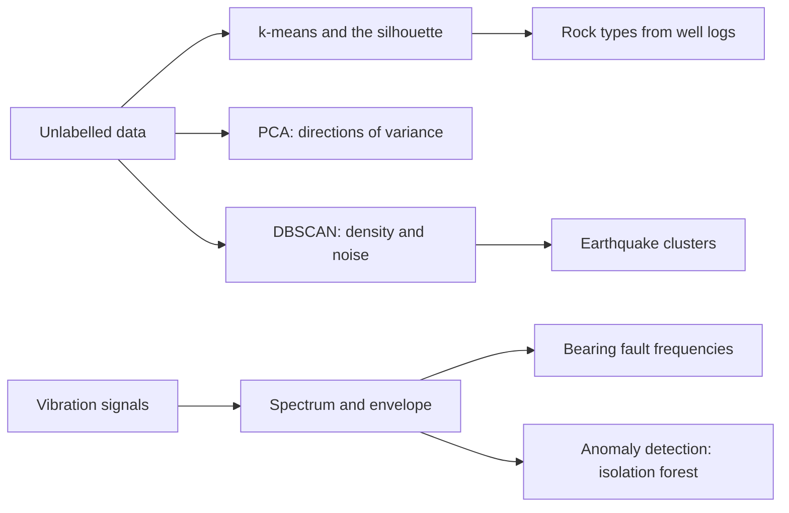

<div align="center">

# Week 09: Patterns without Labels: Clustering, Signals and Anomaly Detection

**Artificial Intelligence Applications in Engineering (MUH-920 Mühendislikte Yapay Zeka Uygulamaları)**  
Prof. Dr. Utku Kose, Süleyman Demirel University

[](https://colab.research.google.com/github/utkukose/ai-applications-in-engineering-NB-lecture/blob/main/weeks/week-09/NB09_unsupervised_signals_anomalies.ipynb) [](https://utkukose.github.io/ai-applications-in-engineering-NB-lecture/weeks/week-09/lab.html) [](https://utkukose.github.io/ai-applications-in-engineering-NB-lecture/weeks/week-09/lecture.html) [](Week09_Lecture_Notes.pdf)

</div>

## Overview

Sensors, logs and catalogues produce far more data than anyone can label. Unsupervised learning finds structure in such data: groups of similar records, a few directions that carry most of the variation, and points that do not fit [1, 2]. This week clusters well logs into rock types without using the geologists' labels [7], groups earthquakes by density in the catalogue of the U.S. Geological Survey [10, 16], and moves to signals: The Fourier transform and envelope analysis reveal bearing faults in vibration data, and an isolation forest learns what normal vibration looks like [11, 12, 14].

**Estimated study time:** 9 to 11 hours.

## Learning outcomes

By the end of the week, students are expected to apply k-means with proper scaling and choose the number of clusters with the silhouette score, to interpret principal components and their explained variance, to use DBSCAN for clusters of arbitrary shape and noise, to compute and read the spectrum of a sampled signal, to compute bearing fault frequencies and condition indicators such as RMS, kurtosis and crest factor, and to train and judge an anomaly detector on data from normal operation.

## Python in this week

The lecture ends with Python step 9: Signals, features and clustering with NumPy. It covers time vectors and sampled signals, signal statistics, windows and the axis argument, spectra with the fast Fourier transform, and k-means clustering and a z-score anomaly flag written with broadcasting, applied to machine vibration [18]. The hands-on part of the notebook opens with the same step as runnable cells and short exercises with immediate feedback, and its later sections mark further constructs as Python moves.

## Study path

| Step | Activity | Suggested time |
|---|---|---|
| 1 | Read the lecture with its animations on the [lecture page](https://utkukose.github.io/ai-applications-in-engineering-NB-lecture/weeks/week-09/lecture.html), or read the [PDF version](Week09_Lecture_Notes.pdf) | 2 hours |
| 2 | Explore the [interactive lab](https://utkukose.github.io/ai-applications-in-engineering-NB-lecture/weeks/week-09/lab.html) | 1 hour |
| 3 | Study the Python step at the end of the lecture, then run the same step at the start of the hands-on part of the [Colab notebook](https://colab.research.google.com/github/utkukose/ai-applications-in-engineering-NB-lecture/blob/main/weeks/week-09/NB09_unsupervised_signals_anomalies.ipynb) | 1 hour |
| 4 | Work through the rest of the notebook, including its Python moves and exercises | 3 hours |
| 5 | Solve the discipline challenge of your department | 1 hour |
| 6 | Take the self-assessment in the lab (tab: Check yourself) | 20 minutes |
| 7 | Write the reflection, export the learning log and complete the weekly task | 1 hour |

## Week at a glance



## Lecture

### Learning without labels

Supervised learning needs a label for every example. In engineering, labels are expensive: A geologist must interpret each metre of a well, a technician must confirm each fault, and many rare events have never been observed. Unsupervised learning works with the inputs alone. Clustering groups similar records, dimensionality reduction summarises many correlated variables with a few, and anomaly detection flags records that differ from the bulk of the data [1, 2]. The results are hypotheses that domain experts must interpret: A cluster is not a rock type, and an anomaly is not a fault, until someone checks.

### k-means and the choice of k

k-means represents each cluster by a centre and alternates two steps: assign every point to its nearest centre, then move every centre to the mean of its points. Each step lowers the sum of squared distances, so the procedure converges, although only to a local optimum [3, 4]. The k-means++ initialisation spreads the initial centres out and improves both speed and quality [5]. Because k-means uses Euclidean distance, inputs with large numerical ranges dominate unless they are scaled; gamma-ray counts in API units would otherwise swamp a photoelectric factor.

The number of clusters is a modelling choice. The within-cluster sum of squares always falls as k grows, so the elbow of its curve is only a rough guide. The silhouette of a point compares its mean distance to its own cluster with that to the nearest other cluster, and the average silhouette over all points is highest for well-separated, compact clusters [6]. Neither criterion knows the physics; well logs may form five clear clusters although geologists distinguish nine facies.

> **Animation: The two steps of k-means.** Press Step to alternate between assigning points to the nearest centre and moving each centre to the mean of its points. Try several restarts: Different initial centres can end in different solutions. Run it in the [web version of the lecture](https://utkukose.github.io/ai-applications-in-engineering-NB-lecture/weeks/week-09/lecture.html#anim-kmeans).

![Well-log samples of the SEG facies data projected on the first two principal components, coloured by the geologists' facies (left) and by k-means clusters found without labels (right) [7].](figures/w09_fig1.png)

*Figure 9.1. Well-log samples of the SEG facies data projected on the first two principal components, coloured by the geologists' facies (left) and by k-means clusters found without labels (right) [7].*

<details>
<summary><b>Check your understanding.</b> Why must the inputs usually be standardised before k-means?</summary>

A. k-means cannot handle negative numbers  
B. Euclidean distances are dominated by variables with large numerical ranges  
C. Standardisation fixes the number of clusters  
D. k-means only works with values between 0 and 1

**Answer: B.** Without scaling, a variable measured in large units decides the distances and hence the clusters.

</details>

### Principal component analysis

Principal component analysis finds orthogonal directions along which the data vary most [8, 9]. The first component is the direction of largest variance, the second the largest remaining variance orthogonal to the first, and so on. The explained variance ratio of each component shows how much information a projection keeps, and the loadings show how each original variable contributes. In well logging, the first components often combine porosity and density logs, which respond to the same rock properties. PCA serves visualisation, compression, noise reduction and the detection of anomalies as points that the leading components reconstruct poorly.

### Density-based clustering

Clusters in engineering data are not always round. Earthquakes line up along faults, defects form streaks on a web of fabric, and traffic accidents gather along roads. DBSCAN defines clusters as regions of high density: A point with at least a minimum number of neighbours within a radius eps is a core point, clusters grow by connecting core points that are neighbours, and points that belong to no cluster are labelled noise [10]. DBSCAN finds clusters of arbitrary shape and does not need the number of clusters, but eps and the minimum number of points must fit the density of the data. For epicentres, distances should be measured on the sphere, for example with the haversine formula, rather than in degrees.

<details>
<summary><b>Check your understanding.</b> Aftershocks form an elongated band along a fault, surrounded by scattered background events. Which method suits this pattern best?</summary>

A. k-means with k = 2  
B. DBSCAN  
C. PCA with one component  
D. Linear regression

**Answer: B.** DBSCAN follows dense regions of any shape and labels sparse background events as noise [10].

</details>

### Signals in the frequency domain

Many engineering sensors produce time series sampled at a fixed rate: accelerometers on machines, microphones, current transducers, seismometers. The discrete Fourier transform expresses a sampled signal as a sum of sinusoids, and the fast Fourier transform computes it efficiently [11]. The sampling rate fs limits the highest frequency that can be represented to fs / 2, the Nyquist frequency, and a record of duration T resolves frequencies that differ by 1 / T. Rotating machines produce peaks at the shaft frequency and its harmonics, and faults add their own frequencies.

A rolling-element bearing with a damaged outer race produces an impact every time a rolling element passes the damage. The ball pass frequency of the outer race is BPFO = (n / 2) fr (1 - (d / D) cos phi), with n rolling elements of diameter d, pitch diameter D, contact angle phi and shaft frequency fr. The impacts excite structural resonances at high frequency, so the fault frequency often appears not in the raw spectrum but in the spectrum of the signal's envelope, obtained after demodulation. Envelope analysis is the benchmark technique of bearing diagnostics [12], and the Case Western Reserve University data are the standard test set for it [13]. Simple condition indicators complement spectra: the root mean square (RMS) measures vibration energy, kurtosis measures impulsiveness, and the crest factor compares the peak with the RMS.

<details>
<summary><b>Check your understanding.</b> A bearing has 9 balls, d / D = 0.2034, contact angle zero, and the shaft turns at 30 Hz. What is the BPFO?</summary>

A. 30 Hz  
B. About 107.5 Hz  
C. About 135 Hz  
D. About 162.5 Hz

**Answer: B.** BPFO = 4.5 x 30 x (1 - 0.2034), which is about 107.5 Hz.

</details>

### Anomaly detection

An anomaly detector learns what normal data look like and scores how unusual a new record is [2]. Statistical rules flag values far from the mean in units of standard deviation. Reconstruction-based methods flag records that a PCA model or an autoencoder reconstructs poorly. Isolation forests grow random trees that split the data at random thresholds; anomalies are isolated after few splits, so the average path length to isolate a point becomes its score [14]. In condition monitoring, detectors are usually trained on data from normal operation, because faults are rare and diverse. The alarm threshold, as in Week 8, depends on the costs of false alarms and missed faults, and a detector must be re-examined when operating conditions change, since a new load or speed can look like an anomaly [15].

![Spectrum and envelope spectrum of a synthetic vibration signal from a bearing with an outer-race defect. The fault frequency and its harmonics stand out only in the envelope spectrum [12].](figures/w09_fig2.png)

*Figure 9.2. Spectrum and envelope spectrum of a synthetic vibration signal from a bearing with an outer-race defect. The fault frequency and its harmonics stand out only in the envelope spectrum [12].*

<details>
<summary><b>Check your understanding.</b> An isolation forest was trained on vibration features from a pump at 50 percent load. After the load is raised to 90 percent, alarms rise sharply although the pump is healthy. What is the most likely explanation?</summary>

A. Isolation forests cannot handle more than one feature  
B. The new operating condition lies outside the normal data used for training  
C. The FFT is wrong at high load  
D. Kurtosis cannot be computed at high load

**Answer: B.** The detector has learned normal behaviour for one condition; data from other conditions look unusual even without a fault.

</details>

<!-- python-step -->

### Python step 9: Signals, features and clustering with NumPy

#### Sampling a signal

A vibration sensor records values at a fixed sampling rate, for example 2000 samples per second. The time stamps follow from `np.arange(n) / rate`, and a sinusoid of frequency f is `np.sin(2 * np.pi * f * t)`. The practice signal below adds a component at the running speed of a shaft, a weaker component near a bearing defect frequency and random noise.

```python
import numpy as np

rate_hz = 2000                                    # samples per second
time_s = np.arange(2000) / rate_hz                # one second of time stamps
shaft = 0.8 * np.sin(2 * np.pi * 25 * time_s)     # 25 Hz running speed
fault = 0.3 * np.sin(2 * np.pi * 107 * time_s)    # component near a defect frequency
noise = 0.2 * np.random.default_rng(3).normal(size=time_s.size)
vib = shaft + fault + noise
print(time_s.size, time_s[:3], round(float(vib.std()), 3))
```

*Output*

```text
2000 [0.     0.0005 0.001 ] 0.644
```

#### Statistics of a signal

Condition monitoring starts with simple statistics. The root mean square (RMS) measures the energy of a signal, the peak is its largest absolute value, and the crest factor, the peak divided by the RMS, rises when short impacts appear, which is typical of developing bearing damage.

```python
rms = np.sqrt(np.mean(vib ** 2))
peak = np.max(np.abs(vib))
print(f"RMS {rms:.3f}, peak {peak:.3f}, crest factor {peak / rms:.2f}")
```

*Output*

```text
RMS 0.644, peak 1.525, crest factor 2.37
```

#### Windows and the axis argument

Monitoring systems compute features for short windows of a signal. `reshape` rearranges the 2000 samples into a table of 10 windows with 200 samples each; the value -1 lets NumPy work out that length. Functions such as `np.mean` accept an `axis` argument: `axis=1` works along each row and returns one value per window, and `axis=0` works down the columns.

```python
windows = vib.reshape(10, -1)                   # 10 windows of 0.1 s each
rms_per_window = np.sqrt(np.mean(windows ** 2, axis=1))
print(windows.shape, rms_per_window.shape)
print(rms_per_window.round(3))
```

*Output*

```text
(10, 200) (10,)
[0.653 0.655 0.646 0.642 0.655 0.636 0.639 0.627 0.647 0.639]
```

#### Spectra

The fast Fourier transform decomposes a signal into sinusoids and shows at which frequencies its energy lies. For real signals, `np.fft.rfft` returns the non-negative frequencies, and `np.fft.rfftfreq` gives the frequency of each value. Dividing the magnitudes by half the number of samples turns them into amplitudes. A boolean mask restricts the search to a frequency band, and `np.isclose` compares floats with a tolerance instead of exact equality.

```python
spectrum = np.abs(np.fft.rfft(vib)) / (vib.size / 2)
freqs = np.fft.rfftfreq(vib.size, d=1 / rate_hz)
print(freqs[np.argmax(spectrum)], "Hz is the strongest component")
band = (freqs > 80) & (freqs < 150)
print(freqs[band][np.argmax(spectrum[band])], "Hz is the strongest component between 80 and 150 Hz")
print(f"amplitude at 107 Hz: {spectrum[np.isclose(freqs, 107)][0]:.3f}")
```

*Output*

```text
25.0 Hz is the strongest component
107.0 Hz is the strongest component between 80 and 150 Hz
amplitude at 107 Hz: 0.300
```

The envelope analysis of this week adds one step for bearing faults, whose short impacts spread their energy over many frequencies and appear clearly only after demodulation.

#### Features for many windows at once

Unsupervised methods work on feature tables with one row per example. The code below simulates 20 windows of a healthy machine and 20 windows of a damaged one whose bearing produces short impacts. Broadcasting does most of the work: The sine wave of shape (200,) is added to noise of shape (20, 200), and NumPy repeats the sine for every row. Features computed along `axis=1` give one value per window, and `np.column_stack` joins them into a table.

```python
gen9 = np.random.default_rng(9)
t_w = np.arange(200) / rate_hz                              # windows of 0.1 s
healthy = 0.5 * np.sin(2 * np.pi * 25 * t_w) + 0.1 * gen9.normal(size=(20, 200))
damaged = 0.5 * np.sin(2 * np.pi * 25 * t_w) + 0.1 * gen9.normal(size=(20, 200))
damaged[:, ::40] += 1.5                                     # an impact every 20 ms
win = np.vstack([healthy, damaged])                         # 40 windows
rms_w = np.sqrt(np.mean(win ** 2, axis=1))
crest_w = np.max(np.abs(win), axis=1) / rms_w
F = np.column_stack([rms_w, crest_w])                       # feature table, one row per window
print(win.shape, F.shape)
print(F[[0, 1, 38, 39]].round(2))
```

*Output*

```text
(40, 200) (40, 2)
[[0.37 1.93]
 [0.37 1.97]
 [0.44 3.71]
 [0.44 3.76]]
```

#### k-means with broadcasting

k-means alternates two steps: Every point joins its nearest centre, and every centre moves to the mean of its points. The features are first standardised column by column, so that RMS and crest factor count equally. The distances from all 40 points to both centres come from a single broadcast: `Z[:, None, :]` has shape (40, 1, 2), `centres[None, :, :]` has shape (1, 2, 2), and their difference has shape (40, 2, 2). Summing over the last axis gives a (40, 2) table of squared distances, and `argmin(axis=1)` picks the nearest centre for every point.

```python
Z = (F - F.mean(axis=0)) / F.std(axis=0)                    # standardise each column
centres = Z[[0, -1]].copy()                                 # start from the first and the last window
for _ in range(10):
    d = ((Z[:, None, :] - centres[None, :, :]) ** 2).sum(axis=2)
    cluster = d.argmin(axis=1)
    centres = np.array([Z[cluster == j].mean(axis=0) for j in range(2)])
print(d.shape, np.bincount(cluster))
print("clusters of the healthy windows:", cluster[:20])
print("clusters of the damaged windows:", cluster[20:])
```

*Output*

```text
(40, 2) [20 20]
clusters of the healthy windows: [0 0 0 0 0 0 0 0 0 0 0 0 0 0 0 0 0 0 0 0]
clusters of the damaged windows: [1 1 1 1 1 1 1 1 1 1 1 1 1 1 1 1 1 1 1 1]
```

#### A simple anomaly flag

When examples of normal behaviour are available, a z-score flags values that lie far from them: z = (x - mean) / standard deviation, with the mean and the standard deviation taken from the healthy windows only. Windows with an absolute z above 3 are reported. The anomaly detection methods of this week extend the same idea to several features at once.

```python
mu, sd = rms_w[:20].mean(), rms_w[:20].std()
z = (rms_w - mu) / sd
print("flagged windows:", np.flatnonzero(np.abs(z) > 3))
```

*Output*

```text
flagged windows: [20 21 22 23 24 25 26 27 28 29 30 31 32 33 34 35 36 37 38 39]
```

<details>
<summary><b>Check your understanding.</b> For a = np.arange(12).reshape(3, 4), what is the shape of a.sum(axis=0)?</summary>

A. (3,)  
B. (4,)  
C. (12,)  
D. (3, 4)

**Answer: B.** axis=0 sums down the rows, which leaves one value per column, and the array has four columns.

</details>

<!-- /python-step -->

## Discipline challenges

Unlabelled data are everywhere. Choose a row, apply the method named there, and ask an expert, or the literature, whether the structure found makes sense.

| Department | Challenge |
|---|---|
| Geological Engineering and Earth Sciences Engineering | Cluster the SEG well logs with and without the PE log and compare the clusters with the facies [7]. |
| Geophysical Engineering | DBSCAN on the USGS catalogue for a region and period of your choice; compare clusters with known fault zones [16, 17]. |
| Mechanical Engineering and Automotive Engineering | Envelope analysis and kurtosis for bearing signals; test the detector at a new shaft speed [12]. |
| Electrical and Electronics Engineering | Load profiles of buildings or feeders clustered into daily patterns with k-means. |
| Civil Engineering | Anomaly detection on strain or acceleration records of a structure after removing temperature effects. |
| Environmental Engineering | Clusters of air-quality stations by their pollutant time profiles; anomalies as sensor faults or pollution events. |
| Mining Engineering | Clusters of seismic events in a mine and their relation to excavation fronts, with the seismic-bumps data as a start [19]. |
| Food Engineering and Biology | PCA of spectroscopic or compositional measurements to separate product origins. |
| Chemistry and Chemical Engineering | PCA-based monitoring of a batch process: reconstruction error as an alarm. |
| Physics and Statistics | Compare k-means, a Gaussian mixture and DBSCAN on simulated data with known structure; discuss what each assumes. |

## Interactive lab

Part A places points by clicking and compares k-means with DBSCAN on the same data, with controls for k, eps and the minimum number of neighbours [10]. Part B synthesises the vibration of a bearing with adjustable shaft speed, fault severity and noise, and shows the waveform, the spectrum and the envelope spectrum with the computed fault frequency, together with RMS, kurtosis and crest factor [12].

[Open the interactive lab](https://utkukose.github.io/ai-applications-in-engineering-NB-lecture/weeks/week-09/lab.html)


## Colab notebook

The notebook clusters the SEG 2016 well-log data with k-means after scaling and PCA and compares the clusters with the facies assigned by geologists [7]. It then retrieves earthquakes from the USGS catalogue for the region of Türkiye in 2023 and groups them with DBSCAN on the sphere [10, 16]. Finally it synthesises bearing vibration, computes spectra, envelope spectra and condition indicators, and trains an isolation forest on healthy windows to detect a developing fault [14].

[](https://colab.research.google.com/github/utkukose/ai-applications-in-engineering-NB-lecture/blob/main/weeks/week-09/NB09_unsupervised_signals_anomalies.ipynb)

Screenshots of the executed notebook:


## Self-assessment and reflection

The lab contains a 6-question self-assessment with instant feedback and a confidence rating for each answer. A confident but wrong answer marks the first topic to revisit. The reflection prompts below are also available in the lab, where answers are saved in the browser and can be exported as a learning log.

1. Which unlabelled data in your field could reveal useful groups? Who would have to interpret the clusters?
2. The k-means clusters of the well logs did not match the facies one to one. Is that a failure of the method or a finding about the data?
3. What did working with signals in the frequency domain change in your idea of what a feature is?

## Weekly task and submission

Apply clustering or anomaly detection to data from your department, either from the notebook or from a public source in DATASETS.md. Justify the scaling, the method and its parameters, show one figure that an expert of your field could check, and state what the result would need before it could support a decision. Write about 500 words and cite at least three works from this week's references [2, 6, 10].

The weekly task is optional and supports self-learning and a personal portfolio. During an active semester, it can be sent together with the exported learning log to utkukose@sdu.edu.tr or utkukose@gmail.com. Optional work carries no separate weight, but the instructor may take it into account as a discretionary adjustment of the midterm component of the grade.

## Research and report assignment (optional)

**Unsupervised learning in monitoring.** Review unsupervised or semi-supervised methods for monitoring in one domain, such as machine condition monitoring, seismology, structural health monitoring or process control. Compare how normal behaviour is defined, how thresholds are set, how results are validated without labels and how changes of operating conditions are handled [2, 15, 17].

This research assignment is optional and supports self-learning. When the related weeks are followed within the course during an active semester, the report can be sent to utkukose@sdu.edu.tr or utkukose@gmail.com. It carries no separate weight, but the instructor may take it into account as a discretionary adjustment of the midterm component of the grade. Unless the assignment states otherwise, a report has 1500 to 2500 words, follows the structure of an academic paper, cites at least six scholarly or official sources in square brackets and uses the template in `exams/REPORT_TEMPLATE.md`.

## References

[1] Hastie, T., Tibshirani, R., & Friedman, J. (2009). *The Elements of Statistical Learning: Data Mining, Inference, and Prediction* (2nd ed.). Springer. <https://doi.org/10.1007/978-0-387-84858-7>

[2] Chandola, V., Banerjee, A., & Kumar, V. (2009). Anomaly detection: A survey. *ACM Computing Surveys*, *41*(3), 15. <https://doi.org/10.1145/1541880.1541882>

[3] Lloyd, S. (1982). Least squares quantization in PCM. *IEEE Transactions on Information Theory*, *28*(2), 129-137. <https://doi.org/10.1109/TIT.1982.1056489>

[4] MacQueen, J. (1967). Some methods for classification and analysis of multivariate observations. In *Proceedings of the Fifth Berkeley Symposium on Mathematical Statistics and Probability*, Vol. 1 (pp. 281-297). University of California Press.

[5] Arthur, D., & Vassilvitskii, S. (2007). k-means++: The advantages of careful seeding. In *Proceedings of the Eighteenth Annual ACM-SIAM Symposium on Discrete Algorithms* (pp. 1027-1035). SIAM.

[6] Rousseeuw, P. J. (1987). Silhouettes: A graphical aid to the interpretation and validation of cluster analysis. *Journal of Computational and Applied Mathematics*, *20*, 53-65. <https://doi.org/10.1016/0377-0427(87)90125-7>

[7] Hall, B. (2016). Facies classification using machine learning. *The Leading Edge*, *35*(10), 906-909. <https://doi.org/10.1190/tle35100906.1>

[8] Pearson, K. (1901). On lines and planes of closest fit to systems of points in space. *The London, Edinburgh, and Dublin Philosophical Magazine and Journal of Science*, *2*(11), 559-572. <https://doi.org/10.1080/14786440109462720>

[9] Jolliffe, I. T., & Cadima, J. (2016). Principal component analysis: A review and recent developments. *Philosophical Transactions of the Royal Society A*, *374*(2065), 20150202. <https://doi.org/10.1098/rsta.2015.0202>

[10] Ester, M., Kriegel, H.-P., Sander, J., & Xu, X. (1996). A density-based algorithm for discovering clusters in large spatial databases with noise. In *Proceedings of the Second International Conference on Knowledge Discovery and Data Mining (KDD-96)* (pp. 226-231). AAAI Press.

[11] Cooley, J. W., & Tukey, J. W. (1965). An algorithm for the machine calculation of complex Fourier series. *Mathematics of Computation*, *19*(90), 297-301. <https://doi.org/10.1090/S0025-5718-1965-0178586-1>

[12] Randall, R. B., & Antoni, J. (2011). Rolling element bearing diagnostics: A tutorial. *Mechanical Systems and Signal Processing*, *25*(2), 485-520. <https://doi.org/10.1016/j.ymssp.2010.07.017>

[13] Smith, W. A., & Randall, R. B. (2015). Rolling element bearing diagnostics using the Case Western Reserve University data: A benchmark study. *Mechanical Systems and Signal Processing*, *64-65*, 100-131. <https://doi.org/10.1016/j.ymssp.2015.04.021>

[14] Liu, F. T., Ting, K. M., & Zhou, Z.-H. (2008). Isolation forest. In *2008 Eighth IEEE International Conference on Data Mining* (pp. 413-422). <https://doi.org/10.1109/ICDM.2008.17>

[15] Lei, Y., Yang, B., Jiang, X., Jia, F., Li, N., & Nandi, A. K. (2020). Applications of machine learning to machine fault diagnosis: A review and roadmap. *Mechanical Systems and Signal Processing*, *138*, 106587. <https://doi.org/10.1016/j.ymssp.2019.106587>

[16] U.S. Geological Survey (2026). *Earthquake Catalog API (FDSN Event Web Service)*. <https://earthquake.usgs.gov/fdsnws/event/1/>

[17] Kong, Q., Trugman, D. T., Ross, Z. E., Bianco, M. J., Meade, B. J., & Gerstoft, P. (2019). Machine learning in seismology: Turning data into insights. *Seismological Research Letters*, *90*(1), 3-14. <https://doi.org/10.1785/0220180259>

[18] Harris, C. R., Millman, K. J., van der Walt, S. J., et al. (2020). Array programming with NumPy. *Nature*, *585*(7825), 357-362. <https://doi.org/10.1038/s41586-020-2649-2>

[19] Sikora, M., & Wróbel, Ł. (2010). Application of rule induction algorithms for analysis of data collected by seismic hazard monitoring systems in coal mines. *Archives of Mining Sciences*, *55*(1), 91-114.

---

<sub>Artificial Intelligence Applications in Engineering. Prof. Dr. Utku Kose, Süleyman Demirel University. ORCID [0000-0002-9652-6415](https://orcid.org/0000-0002-9652-6415). Content licensed under CC BY 4.0, code under MIT. This course is updated in line with current developments in the field. Last update: September 2026.</sub>
