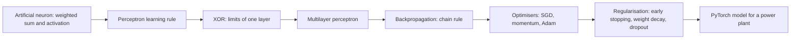
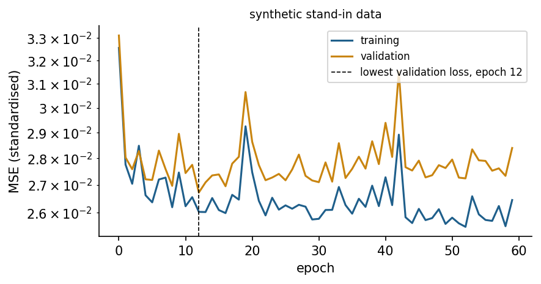

<div align="center">

# Week 10: Neural Networks: From the Perceptron to Deep Learning

**Artificial Intelligence Applications in Engineering (MUH-920 Mühendislikte Yapay Zeka Uygulamaları)**  
Prof. Dr. Utku Kose, Süleyman Demirel University

[](https://colab.research.google.com/github/utkukose/ai-applications-in-engineering-NB-lecture/blob/main/weeks/week-10/NB10_neural_networks.ipynb) [](https://utkukose.github.io/ai-applications-in-engineering-NB-lecture/weeks/week-10/lab.html) [](https://utkukose.github.io/ai-applications-in-engineering-NB-lecture/weeks/week-10/lecture.html) [](Week10_Lecture_Notes.pdf)

</div>

## Overview

Neural networks connect many simple units whose weights are learned from data. The idea goes back to the logical neuron of McCulloch and Pitts and to Rosenblatt's perceptron [1, 2]; its revival came with backpropagation, which trains networks with hidden layers [7], and its present dominance with deep architectures, large datasets and fast hardware [15, 18]. This week builds a perceptron and a multilayer network from scratch with NumPy, derives backpropagation for a small network, and then uses PyTorch to train a network that predicts the electrical output of a combined cycle power plant [8, 16].

**Estimated study time:** 10 to 12 hours.

## Learning outcomes

By the end of the week, students are expected to explain the perceptron learning rule and its limitation on non-separable data, to compute the forward pass and the gradients of a small multilayer network by hand, to choose activation functions, losses and optimisers, to train a network in PyTorch with a validation set and early stopping, to diagnose underfitting and overfitting from learning curves, and to compare a network fairly with the models of Weeks 7 and 8.

## Python in this week

The lecture ends with Python step 10: Matrices, shapes and tensors. It covers matrix products and shapes with NumPy, activation functions on arrays, and PyTorch tensors with automatic differentiation, applied to the XOR network and a one-weight loss [8, 19]. The hands-on part of the notebook opens with the same step as runnable cells and short exercises with immediate feedback, and its later sections mark further constructs as Python moves.

## Study path

| Step | Activity | Suggested time |
|---|---|---|
| 1 | Read the lecture with its animations on the [lecture page](https://utkukose.github.io/ai-applications-in-engineering-NB-lecture/weeks/week-10/lecture.html), or read the [PDF version](Week10_Lecture_Notes.pdf) | 2 hours |
| 2 | Explore the [interactive lab](https://utkukose.github.io/ai-applications-in-engineering-NB-lecture/weeks/week-10/lab.html) | 1 hour |
| 3 | Study the Python step at the end of the lecture, then run the same step at the start of the hands-on part of the [Colab notebook](https://colab.research.google.com/github/utkukose/ai-applications-in-engineering-NB-lecture/blob/main/weeks/week-10/NB10_neural_networks.ipynb) | 1 hour |
| 4 | Work through the rest of the notebook, including its Python moves and exercises | 3 hours |
| 5 | Solve the discipline challenge of your department | 1 hour |
| 6 | Take the self-assessment in the lab (tab: Check yourself) | 20 minutes |
| 7 | Write the reflection, export the learning log and complete the weekly task | 1 hour |

## Week at a glance



## Lecture

### From neurons to perceptrons

McCulloch and Pitts described an idealised neuron that sums weighted binary inputs and fires when the sum exceeds a threshold, and showed that networks of such units can compute logical functions [1]. Rosenblatt's perceptron added learning: After each example, the weights move in the direction that corrects a wrong output, w = w + eta (y - y_hat) x [2]. If the two classes can be separated by a straight line, or a hyperplane in more dimensions, the rule finds a separating line in a finite number of steps.

Minsky and Papert analysed what single-layer perceptrons cannot do [3]. The exclusive or, XOR, is the classic example: The points (0, 0) and (1, 1) belong to one class and (0, 1) and (1, 0) to the other, and no straight line separates them. Engineering data are full of such interactions, for example when a fault appears only if temperature is high and speed is low. The remedy is a hidden layer that transforms the inputs into a space where the classes become separable.

<details>
<summary><b>Check your understanding.</b> Why can a single perceptron not learn XOR?</summary>

A. The learning rate is always too large  
B. The two classes of XOR cannot be separated by a single straight line  
C. XOR has too many inputs  
D. The perceptron has no bias term

**Answer: B.** A single threshold unit draws one linear boundary, and XOR needs at least two [3].

</details>

### Multilayer networks and backpropagation

A multilayer perceptron stacks layers of units. Each unit computes a weighted sum of the outputs of the previous layer and applies a nonlinear activation function: the logistic sigmoid, the hyperbolic tangent, or the rectified linear unit, ReLU, which returns max(0, z) and eases the training of deep networks [4]. Without nonlinear activations, any stack of layers collapses into one linear map. With them, a network with one sufficiently wide hidden layer can approximate any continuous function on a bounded domain to any accuracy [5, 6], although the theorem says nothing about how many units are needed or whether training finds them.

Training minimises a loss, such as the mean squared error for regression or the cross-entropy for classification, by gradient descent. Backpropagation computes the gradient of the loss with respect to every weight efficiently by applying the chain rule layer by layer from the output back to the input [7]. Each weight then moves a small step against its gradient. Modern frameworks such as PyTorch record the operations of the forward pass and compute these gradients automatically [8].

> **Animation: A small network learns a curved boundary.** A network with one hidden layer is trained by gradient descent on points from two classes. Change the number of hidden units and the learning rate, and watch the boundary bend while the loss falls. Run it in the [web version of the lecture](https://utkukose.github.io/ai-applications-in-engineering-NB-lecture/weeks/week-10/lecture.html#anim-mlp).



*Figure 10.1. Training and validation loss of a PyTorch network for the power plant data. Early stopping keeps the weights from the epoch with the lowest validation loss.*

<details>
<summary><b>Check your understanding.</b> What does backpropagation compute?</summary>

A. The optimal number of hidden units  
B. The gradient of the loss with respect to all weights, using the chain rule  
C. The training data for the next epoch  
D. The activation function

**Answer: B.** Backpropagation is an efficient application of the chain rule that yields all partial derivatives in one backward pass [7].

</details>

### Optimisation in practice

Plain gradient descent uses the whole training set for every step. Stochastic gradient descent uses small random mini-batches, which is faster and adds noise that can help to escape poor regions. Momentum accumulates a moving average of gradients and damps oscillation across narrow valleys. Adam adapts the step size of every weight from running estimates of the first and second moments of its gradient and is a robust default [9]. The learning rate remains the most important setting: Too small and training crawls, too large and the loss oscillates or diverges.

Initialisation matters because signals must neither vanish nor explode as they pass through many layers. Glorot and Bengio proposed scaling the initial weights with the number of inputs and outputs of a layer [10]. Batch normalisation standardises the inputs of a layer over each mini-batch and often allows larger learning rates [11]. Inputs of different units, such as temperatures in degrees and pressures in millibars, should be standardised before training, as for k-means and support vector machines.

### Generalisation and regularisation

Networks with many weights can memorise their training data. The standard defences are a validation set with early stopping, which keeps the weights from the epoch with the lowest validation loss; weight decay, which penalises large weights like ridge regression; and dropout, which randomly switches off units during training so that the network cannot rely on any single unit [12]. Learning curves of training and validation loss over epochs show whether a network underfits, with both losses high, or overfits, with a growing gap.

On tabular data of moderate size, the tree ensembles of Weeks 7 and 8 are often as accurate as networks and easier to tune, so a network must earn its place by a fair comparison. Networks have long been applied in engineering: Yeh modelled concrete strength with them [13], and metaheuristics such as the ant lion optimiser have been used to train them where gradient methods struggle [14]. Their decisive advantages appear with images, signals, sequences and text, where they learn features that would otherwise have to be designed by hand [15]. Weeks 11 to 13 follow this path.

<details>
<summary><b>Check your understanding.</b> Training loss keeps falling, while validation loss has been rising for 30 epochs. What should be done?</summary>

A. Train longer with the same settings  
B. Use the weights from the epoch with the lowest validation loss and consider more regularisation  
C. Remove the validation set  
D. Increase the learning rate

**Answer: B.** A rising validation loss with falling training loss signals overfitting; early stopping and regularisation address it [12].

</details>

<!-- python-step -->

### Python step 10: Matrices, shapes and tensors

#### Vectors, matrices and the @ operator

A layer of a neural network multiplies its inputs by a weight matrix and adds a bias. When a batch of inputs is stored as a matrix X with one example per row, the whole layer is `X @ W + b`, where `@` is the matrix product. The shapes must match: A matrix of shape (4, 2) times one of shape (2, 2) gives shape (4, 2). NumPy adds the bias vector to every row automatically, a rule called broadcasting. The network below solves XOR with hand-set weights: One hidden unit acts as OR, the other as AND, and the output fires for OR but not for AND.

```python
import numpy as np

X = np.array([[0, 0], [0, 1], [1, 0], [1, 1]])   # four input examples
W1 = np.array([[1, 1], [1, 1]])                   # column 0: OR unit, column 1: AND unit
b1 = np.array([-0.5, -1.5])
H = (X @ W1 + b1 > 0).astype(int)                 # step activation
w2, b2 = np.array([1, -1]), -0.5
y = (H @ w2 + b2 > 0).astype(int)
print(X.shape, W1.shape, H.shape)
print(H)
print(y)
```

*Output*

```text
(4, 2) (2, 2) (4, 2)
[[0 0]
 [1 0]
 [1 0]
 [1 1]]
[0 1 1 0]
```

#### Activation functions

Smooth activation functions replace the step so that gradients exist. The sigmoid squashes any number into the range 0 to 1, the hyperbolic tangent into -1 to 1, and the rectified linear unit keeps positive values and sets negative ones to zero. Written with NumPy, each of them works on whole arrays.

```python
def sigmoid(z):
    return 1 / (1 + np.exp(-z))

def relu(z):
    return np.maximum(z, 0)

z = np.array([-2.0, 0.0, 2.0])
print(sigmoid(z).round(3), np.tanh(z).round(3), relu(z))
```

*Output*

```text
[0.119 0.5   0.881] [-0.964  0.     0.964] [0. 0. 2.]
```

#### Tensors

PyTorch stores data in tensors, which behave much like NumPy arrays but can also run on graphics processors and record the operations applied to them [8]. Neural network code usually works with 32-bit floats, so conversions from NumPy name the type explicitly. `.shape` works as in NumPy, `.item()` extracts a single number, and `.numpy()` converts back to an array.

```python
import torch

Xt = torch.tensor(X, dtype=torch.float32)
W1t = torch.tensor(W1, dtype=torch.float32)
print(Xt.shape, Xt.dtype)
print((Xt @ W1t).sum().item(), (Xt @ W1t).numpy().tolist())
```

*Output*

```text
torch.Size([4, 2]) torch.float32
8.0 [[0.0, 0.0], [1.0, 1.0], [1.0, 1.0], [2.0, 2.0]]
```

#### Gradients with automatic differentiation

Training needs the derivative of the loss with respect to every weight. When a tensor is created with `requires_grad=True`, PyTorch records every operation on it, and `backward` computes the derivatives with the chain rule. For the loss L = (w x - y)^2 with w = 0.5, x = 2 and y = 3, the derivative is 2 (w x - y) x = -8. A gradient descent step then moves w against the gradient, and `torch.no_grad()` stops the recording while the weight is updated.

```python
w = torch.tensor(0.5, requires_grad=True)
x_in, target = torch.tensor(2.0), torch.tensor(3.0)
loss = (w * x_in - target) ** 2
loss.backward()
print(loss.item(), w.grad.item())
with torch.no_grad():
    w -= 0.1 * w.grad                  # one gradient descent step with learning rate 0.1
print(round(w.item(), 4), round(((w * x_in - target) ** 2).item(), 4))
```

*Output*

```text
4.0 -8.0
1.3 0.16
```

The loss falls from 4.0 to about 0.16 in one step. The training loops of this week repeat exactly this pattern for thousands of weights at once.

<details>
<summary><b>Check your understanding.</b> A has shape (32, 10) and B has shape (10, 4). What is the shape of A @ B?</summary>

A. (32, 10)  
B. (10, 4)  
C. (32, 4)  
D. The product is not defined

**Answer: C.** The inner dimensions must agree, and the result keeps the outer ones: 32 rows and 4 columns.

</details>

<!-- /python-step -->

## Discipline challenges

Networks shine when relations are nonlinear and data are plentiful. Choose a row and compare a network with the best model of Weeks 7 and 8 under identical splits.

| Department | Challenge |
|---|---|
| Electrical and Electronics Engineering and Mechanical Engineering | Power plant output from ambient conditions, UCI 294, as in the notebook [16]. |
| Civil Engineering | Concrete strength with a network, following Yeh's study [13], compared with gradient boosting. |
| Civil Engineering and Physics | Heating and cooling loads of buildings as a two-output network, UCI 242 [20]. |
| Environmental Engineering and Chemical Engineering | Gas turbine NOx emissions, UCI 551, with a network and a physics-motivated feature [21]. |
| Physics and Chemistry | Critical temperature of superconductors, UCI 464 [22]. |
| Mechanical Engineering and Industrial Engineering | Failure classification on AI4I with a network and class weights [23]. |
| Computer Engineering and Mathematics | Implement the backward pass of a two-hidden-layer network in NumPy and verify it with numerical gradients. |
| Food Engineering and Biology | Dry bean classification with a network compared with the random forest of Week 8 [24]. |
| Statistics | Compare early stopping, weight decay and dropout over ten seeds and report the variability of the test error. |
| Mining Engineering, Geology and Earth Sciences Engineering | Facies classification from well logs with a network and a well-wise split [25]. |

## Interactive lab

Part A shows a single neuron with adjustable weights, bias and activation over a two-dimensional input space. Part B trains a network with one or two hidden layers on circles, XOR, two moons or a spiral, with controls for width, depth, activation and learning rate [7]. Part C compares gradient descent, momentum and Adam on a narrow valley of a loss surface [9].

[Open the interactive lab](https://utkukose.github.io/ai-applications-in-engineering-NB-lecture/weeks/week-10/lab.html)


## Colab notebook

The notebook trains a perceptron on separable data and shows its failure on XOR, then writes a two-layer network with hand-derived backpropagation in NumPy and verifies the gradients numerically. In PyTorch it trains a network for the net electrical output of a combined cycle power plant from ambient temperature, exhaust vacuum, pressure and humidity [16], with standardisation, mini-batches, Adam, early stopping and a fair comparison with linear regression and a random forest [8, 9].

[](https://colab.research.google.com/github/utkukose/ai-applications-in-engineering-NB-lecture/blob/main/weeks/week-10/NB10_neural_networks.ipynb)

Screenshots of the executed notebook:


## Self-assessment and reflection

The lab contains a 6-question self-assessment with instant feedback and a confidence rating for each answer. A confident but wrong answer marks the first topic to revisit. The reflection prompts below are also available in the lab, where answers are saved in the browser and can be exported as a learning log.

1. Which relation in your field is known to be nonlinear with interactions between inputs? Would a network or a physical model describe it better?
2. What did your learning curves tell you about the network you trained, and which change had the largest effect?
3. Which part of backpropagation became clear only when you wrote the gradients yourself in NumPy?

## Weekly task and submission

Train a PyTorch network for a regression or classification problem from your department, using the switch of the notebook or a dataset from DATASETS.md. Report the architecture, preprocessing, optimiser, learning curves, early stopping and a fair comparison with a linear model and a tree ensemble on the same test set. Discuss in about 500 words whether the network is worth its complexity, citing at least three works from this week's references [7, 9, 12].

The weekly task is optional and supports self-learning and a personal portfolio. During an active semester, it can be sent together with the exported learning log to utkukose@sdu.edu.tr or utkukose@gmail.com. Optional work carries no separate weight, but the instructor may take it into account as a discretionary adjustment of the midterm component of the grade.

## Research and report assignment (optional)

**Neural networks for engineering modelling.** Review the use of neural networks as surrogate or data-driven models in one engineering field, such as structural response, process modelling, energy prediction or materials properties. Compare network types, training data sizes, validation practices and the baselines used, and discuss when physical models or simpler learners were competitive [13, 15, 17].

This research assignment is optional and supports self-learning. When the related weeks are followed within the course during an active semester, the report can be sent to utkukose@sdu.edu.tr or utkukose@gmail.com. It carries no separate weight, but the instructor may take it into account as a discretionary adjustment of the midterm component of the grade. Unless the assignment states otherwise, a report has 1500 to 2500 words, follows the structure of an academic paper, cites at least six scholarly or official sources in square brackets and uses the template in `exams/REPORT_TEMPLATE.md`.

## References

[1] McCulloch, W. S., & Pitts, W. (1943). A logical calculus of the ideas immanent in nervous activity. *The Bulletin of Mathematical Biophysics*, *5*(4), 115-133. <https://doi.org/10.1007/BF02478259>

[2] Rosenblatt, F. (1958). The perceptron: A probabilistic model for information storage and organization in the brain. *Psychological Review*, *65*(6), 386-408. <https://doi.org/10.1037/h0042519>

[3] Minsky, M., & Papert, S. (1969). *Perceptrons: An Introduction to Computational Geometry*. MIT Press.

[4] Nair, V., & Hinton, G. E. (2010). Rectified linear units improve restricted Boltzmann machines. In *Proceedings of the 27th International Conference on Machine Learning* (pp. 807-814).

[5] Cybenko, G. (1989). Approximation by superpositions of a sigmoidal function. *Mathematics of Control, Signals and Systems*, *2*(4), 303-314. <https://doi.org/10.1007/BF02551274>

[6] Hornik, K., Stinchcombe, M., & White, H. (1989). Multilayer feedforward networks are universal approximators. *Neural Networks*, *2*(5), 359-366. <https://doi.org/10.1016/0893-6080(89)90020-8>

[7] Rumelhart, D. E., Hinton, G. E., & Williams, R. J. (1986). Learning representations by back-propagating errors. *Nature*, *323*(6088), 533-536. <https://doi.org/10.1038/323533a0>

[8] Paszke, A., Gross, S., Massa, F., et al. (2019). PyTorch: An imperative style, high-performance deep learning library. In *Advances in Neural Information Processing Systems 32* (pp. 8024-8035). <https://arxiv.org/abs/1912.01703>

[9] Kingma, D. P., & Ba, J. (2015). Adam: A method for stochastic optimization. In *3rd International Conference on Learning Representations (ICLR 2015)*. <https://arxiv.org/abs/1412.6980>

[10] Glorot, X., & Bengio, Y. (2010). Understanding the difficulty of training deep feedforward neural networks. In *Proceedings of the Thirteenth International Conference on Artificial Intelligence and Statistics, PMLR 9* (pp. 249-256).

[11] Ioffe, S., & Szegedy, C. (2015). Batch normalization: Accelerating deep network training by reducing internal covariate shift. In *Proceedings of the 32nd International Conference on Machine Learning, PMLR 37* (pp. 448-456). <https://arxiv.org/abs/1502.03167>

[12] Srivastava, N., Hinton, G., Krizhevsky, A., Sutskever, I., & Salakhutdinov, R. (2014). Dropout: A simple way to prevent neural networks from overfitting. *Journal of Machine Learning Research*, *15*(56), 1929-1958.

[13] Yeh, I.-C. (1998). Modeling of strength of high-performance concrete using artificial neural networks. *Cement and Concrete Research*, *28*(12), 1797-1808. <https://doi.org/10.1016/S0008-8846(98)00165-3>

[14] Kose, U. (2018). An ant-lion optimizer-trained artificial neural network system for chaotic electroencephalogram (EEG) prediction. *Applied Sciences*, *8*(9), 1613. <https://doi.org/10.3390/app8091613>

[15] LeCun, Y., Bengio, Y., & Hinton, G. (2015). Deep learning. *Nature*, *521*(7553), 436-444. <https://doi.org/10.1038/nature14539>

[16] Tüfekci, P. (2014). Prediction of full load electrical power output of a base load operated combined cycle power plant using machine learning methods. *International Journal of Electrical Power & Energy Systems*, *60*, 126-140. <https://doi.org/10.1016/j.ijepes.2014.02.027>

[17] Karniadakis, G. E., Kevrekidis, I. G., Lu, L., Perdikaris, P., Wang, S., & Yang, L. (2021). Physics-informed machine learning. *Nature Reviews Physics*, *3*(6), 422-440. <https://doi.org/10.1038/s42254-021-00314-5>

[18] Goodfellow, I., Bengio, Y., & Courville, A. (2016). *Deep Learning*. MIT Press.

[19] Harris, C. R., Millman, K. J., van der Walt, S. J., et al. (2020). Array programming with NumPy. *Nature*, *585*(7825), 357-362. <https://doi.org/10.1038/s41586-020-2649-2>

[20] Tsanas, A., & Xifara, A. (2012). Accurate quantitative estimation of energy performance of residential buildings using statistical machine learning tools. *Energy and Buildings*, *49*, 560-567. <https://doi.org/10.1016/j.enbuild.2012.03.003>

[21] Kaya, H., Tüfekci, P., & Uzun, E. (2019). Predicting CO and NOx emissions from gas turbines: Novel data and a benchmark PEMS. *Turkish Journal of Electrical Engineering and Computer Sciences*, *27*(6), 4783-4796. <https://doi.org/10.3906/elk-1807-87>

[22] Hamidieh, K. (2018). A data-driven statistical model for predicting the critical temperature of a superconductor. *Computational Materials Science*, *154*, 346-354. <https://doi.org/10.1016/j.commatsci.2018.07.052>

[23] Matzka, S. (2020). Explainable artificial intelligence for predictive maintenance applications. In *2020 Third International Conference on Artificial Intelligence for Industries (AI4I)* (pp. 69-74). IEEE. <https://doi.org/10.1109/AI4I49448.2020.00023>

[24] Koklu, M., & Ozkan, I. A. (2020). Multiclass classification of dry beans using computer vision and machine learning techniques. *Computers and Electronics in Agriculture*, *174*, 105507. <https://doi.org/10.1016/j.compag.2020.105507>

[25] Hall, B. (2016). Facies classification using machine learning. *The Leading Edge*, *35*(10), 906-909. <https://doi.org/10.1190/tle35100906.1>

---

<sub>Artificial Intelligence Applications in Engineering. Prof. Dr. Utku Kose, Süleyman Demirel University. ORCID [0000-0002-9652-6415](https://orcid.org/0000-0002-9652-6415). Content licensed under CC BY 4.0, code under MIT. This course is updated in line with current developments in the field. Last update: September 2026.</sub>
