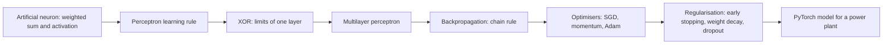
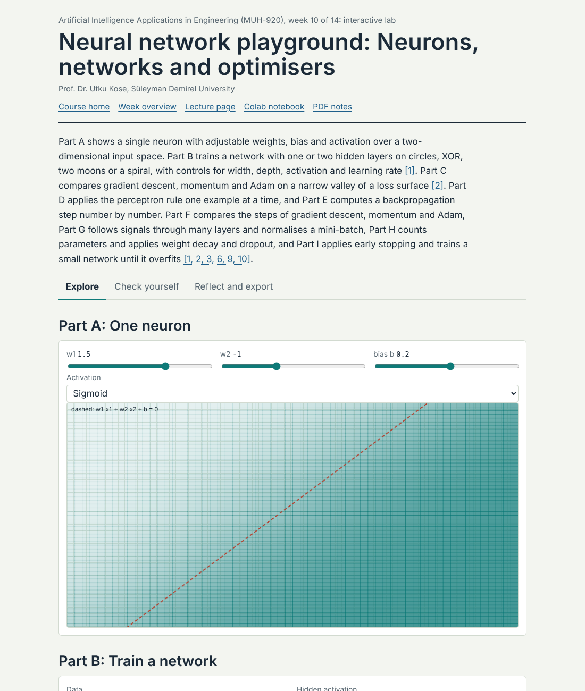
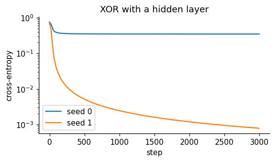
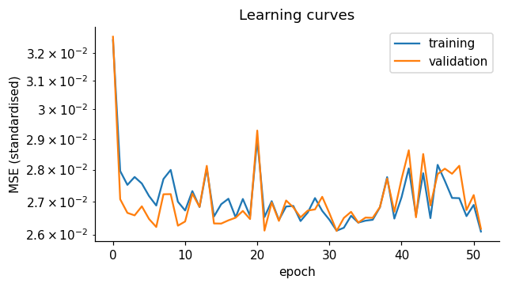

# Week 10: Neural Networks: From the Perceptron to Deep Learning

**Artificial Intelligence Applications in Engineering (MUH-920 Mühendislikte Yapay Zeka Uygulamaları)** Prof. Dr. Utku Kose, Süleyman Demirel University

   

[Week 9](../week-09/README.md) | [All weeks](../../README.md#weekly-schedule) | [Week 11](../week-11/README.md)

## Overview

Neural networks connect many simple units whose weights are learned from data. The idea goes back to the logical neuron of McCulloch and Pitts and to Rosenblatt's perceptron [1, 2]; its revival came with backpropagation, which trains networks with hidden layers [3], and its present dominance with deep architectures, large datasets and fast hardware [4, 5]. This week builds a perceptron and a multilayer network from scratch with NumPy, derives backpropagation for a small network, and then uses PyTorch to train a network that predicts the electrical output of a combined cycle power plant [6, 7].

**Estimated study time:** 10 to 12 hours.

## Learning outcomes

By the end of the week, students are expected to explain the perceptron learning rule and its limitation on non-separable data, to compute the forward pass and the gradients of a small multilayer network by hand, to choose activation functions, losses and optimisers, to train a network in PyTorch with a validation set and early stopping, to diagnose underfitting and overfitting from learning curves, and to compare a network fairly with the models of Weeks 7 and 8.

## Week at a glance

## Materials of the week

| Material | What it contains | Link |
|---|---|---|
| Lecture page | Four sections with formulas, seven worked examples, three knowledge checks, an animation and six review cards | [Open the lecture page](https://utkukose.github.io/ai-applications-in-engineering-NB-lecture/weeks/week-10/lecture.html) |
| Lecture notes | The printable version of the week: the lecture with its formulas and worked examples, Python step 10 and the outputs of its code, followed by the discipline challenges and the tasks | [Open the PDF](Week10_Lecture_Notes.pdf) |
| Interactive lab | *Neural network playground: Neurons, networks and optimisers*, with nine interactive parts, a self-assessment of six questions, three reflection prompts and an exportable learning log | [Open the lab](https://utkukose.github.io/ai-applications-in-engineering-NB-lecture/weeks/week-10/lab.html) |
| Colab notebook | Python step 10: Matrices, shapes and tensors, followed by seven hands-on sections with exercises and immediate feedback | [Open in Colab](https://colab.research.google.com/github/utkukose/ai-applications-in-engineering-NB-lecture/blob/main/weeks/week-10/NB10_neural_networks.ipynb), [view on GitHub](NB10_neural_networks.ipynb) |

## Contents

| Lecture page | Colab notebook |
|---|---|
| [From neurons to perceptrons](https://utkukose.github.io/ai-applications-in-engineering-NB-lecture/weeks/week-10/lecture.html#from-neurons-to-perceptrons) | [Python step 10: Matrices, shapes and tensors](https://colab.research.google.com/github/utkukose/ai-applications-in-engineering-NB-lecture/blob/main/weeks/week-10/NB10_neural_networks.ipynb#scrollTo=python-step) |
| [Multilayer networks and backpropagation](https://utkukose.github.io/ai-applications-in-engineering-NB-lecture/weeks/week-10/lecture.html#multilayer-networks-and-backpropagation) | [1. One neuron](https://colab.research.google.com/github/utkukose/ai-applications-in-engineering-NB-lecture/blob/main/weeks/week-10/NB10_neural_networks.ipynb#scrollTo=section-1) |
| [Optimisation in practice](https://utkukose.github.io/ai-applications-in-engineering-NB-lecture/weeks/week-10/lecture.html#optimisation-in-practice) | [2. The perceptron and its limit](https://colab.research.google.com/github/utkukose/ai-applications-in-engineering-NB-lecture/blob/main/weeks/week-10/NB10_neural_networks.ipynb#scrollTo=section-2) |
| [Generalisation and regularisation](https://utkukose.github.io/ai-applications-in-engineering-NB-lecture/weeks/week-10/lecture.html#generalisation-and-regularisation) | [3. A two-layer network with backpropagation in NumPy](https://colab.research.google.com/github/utkukose/ai-applications-in-engineering-NB-lecture/blob/main/weeks/week-10/NB10_neural_networks.ipynb#scrollTo=section-3) |
| [Review cards](https://utkukose.github.io/ai-applications-in-engineering-NB-lecture/weeks/week-10/lecture.html#review-cards) | [4. A combined cycle power plant](https://colab.research.google.com/github/utkukose/ai-applications-in-engineering-NB-lecture/blob/main/weeks/week-10/NB10_neural_networks.ipynb#scrollTo=section-4) |
|  | [5. The network in PyTorch](https://colab.research.google.com/github/utkukose/ai-applications-in-engineering-NB-lecture/blob/main/weeks/week-10/NB10_neural_networks.ipynb#scrollTo=section-5) |
|  | [6. A fair comparison on the same test set](https://colab.research.google.com/github/utkukose/ai-applications-in-engineering-NB-lecture/blob/main/weeks/week-10/NB10_neural_networks.ipynb#scrollTo=section-6) |
|  | [7. Experiments to try](https://colab.research.google.com/github/utkukose/ai-applications-in-engineering-NB-lecture/blob/main/weeks/week-10/NB10_neural_networks.ipynb#scrollTo=section-7) |

## Study path

| Step | Activity | Suggested time |
|---|---|---|
| 1 | Read the [lecture page](https://utkukose.github.io/ai-applications-in-engineering-NB-lecture/weeks/week-10/lecture.html) and answer its knowledge checks, or read the [PDF notes](Week10_Lecture_Notes.pdf) | 2 hours |
| 2 | Explore the simulation of the [interactive lab](https://utkukose.github.io/ai-applications-in-engineering-NB-lecture/weeks/week-10/lab.html#explore) | 1 hour |
| 3 | Work through [Python step 10](https://colab.research.google.com/github/utkukose/ai-applications-in-engineering-NB-lecture/blob/main/weeks/week-10/NB10_neural_networks.ipynb#scrollTo=python-step) at the start of the Colab notebook | 1 hour |
| 4 | Continue with the hands-on sections of the [notebook](https://colab.research.google.com/github/utkukose/ai-applications-in-engineering-NB-lecture/blob/main/weeks/week-10/NB10_neural_networks.ipynb) and their exercises | 3 hours |
| 5 | Solve the [discipline challenge](#discipline-challenges) of your department | 1 hour |
| 6 | Take the [self-assessment](https://utkukose.github.io/ai-applications-in-engineering-NB-lecture/weeks/week-10/lab.html#check) in the lab | 20 minutes |
| 7 | Answer the [reflection prompts](https://utkukose.github.io/ai-applications-in-engineering-NB-lecture/weeks/week-10/lab.html#reflect), export the learning log and complete the [weekly task](#weekly-task) | 1 hour |

## Preview

<table><tr><td colspan="2"> Interactive lab: Neural network playground: Neurons, networks and optimisers</td></tr><tr><td width="50%"></td><td width="50%"></td></tr><tr><td colspan="2">Outputs of the executed Colab notebook</td></tr></table>

## Discipline challenges

Networks shine when relations are nonlinear and data are plentiful. Choose a row and compare a network with the best model of Weeks 7 and 8 under identical splits.

| Department | Challenge |
|---|---|
| Electrical and Electronics Engineering and Mechanical Engineering | Power plant output from ambient conditions, UCI 294, as in the notebook [7]. |
| Civil Engineering | Concrete strength with a network, following Yeh's study [8], compared with gradient boosting. |
| Civil Engineering and Physics | Heating and cooling loads of buildings as a two-output network, UCI 242 [9]. |
| Environmental Engineering and Chemical Engineering | Gas turbine NOx emissions, UCI 551, with a network and a physics-motivated feature [10]. |
| Physics and Chemistry | Critical temperature of superconductors, UCI 464 [11]. |
| Mechanical Engineering and Industrial Engineering | Failure classification on AI4I with a network and class weights [12]. |
| Computer Engineering and Mathematics | Implement the backward pass of a two-hidden-layer network in NumPy and verify it with numerical gradients. |
| Food Engineering and Biology | Dry bean classification with a network compared with the random forest of Week 8 [13]. |
| Statistics | Compare early stopping, weight decay and dropout over ten seeds and report the variability of the test error. |
| Mining Engineering, Geology and Earth Sciences Engineering | Facies classification from well logs with a network and a well-wise split [14]. |

## Weekly task

Train a PyTorch network for a regression or classification problem from your department, using the switch of the notebook or a dataset from DATASETS.md. Report the architecture, preprocessing, optimiser, learning curves, early stopping and a fair comparison with a linear model and a tree ensemble on the same test set. Discuss in about 500 words whether the network is worth its complexity, citing at least three works from this week's references [3, 15, 16].

## Research and report assignment (optional)

**Neural networks for engineering modelling.** Review the use of neural networks as surrogate or data-driven models in one engineering field, such as structural response, process modelling, energy prediction or materials properties. Compare network types, training data sizes, validation practices and the baselines used, and discuss when physical models or simpler learners were competitive [4, 8, 17].

Both assignments are optional. During an active semester, the weekly task can be sent together with the exported learning log, and the research report on its own, to utkukose@sdu.edu.tr or utkukose@gmail.com. They carry no separate weight, but the instructor may take them into account as a discretionary adjustment of the midterm component of the grade. The [assessment section of the syllabus](../../SYLLABUS.md#assessment) gives the details, and research reports use the [Word report template](../../exams/REPORT_TEMPLATE.docx).

## References

[1] McCulloch, W. S., & Pitts, W. (1943). A logical calculus of the ideas immanent in nervous activity. *The Bulletin of Mathematical Biophysics*, *5*(4), 115-133. <https://doi.org/10.1007/BF02478259>

[2] Rosenblatt, F. (1958). The perceptron: A probabilistic model for information storage and organization in the brain. *Psychological Review*, *65*(6), 386-408. <https://doi.org/10.1037/h0042519>

[3] Rumelhart, D. E., Hinton, G. E., & Williams, R. J. (1986). Learning representations by back-propagating errors. *Nature*, *323*(6088), 533-536. <https://doi.org/10.1038/323533a0>

[4] LeCun, Y., Bengio, Y., & Hinton, G. (2015). Deep learning. *Nature*, *521*(7553), 436-444. <https://doi.org/10.1038/nature14539>

[5] Goodfellow, I., Bengio, Y., & Courville, A. (2016). *Deep Learning*. MIT Press.

[6] Paszke, A., Gross, S., Massa, F., et al. (2019). PyTorch: An imperative style, high-performance deep learning library. In *Advances in Neural Information Processing Systems 32* (pp. 8024-8035). <https://arxiv.org/abs/1912.01703>

[7] Tüfekci, P. (2014). Prediction of full load electrical power output of a base load operated combined cycle power plant using machine learning methods. *International Journal of Electrical Power & Energy Systems*, *60*, 126-140. <https://doi.org/10.1016/j.ijepes.2014.02.027>

[8] Yeh, I.-C. (1998). Modeling of strength of high-performance concrete using artificial neural networks. *Cement and Concrete Research*, *28*(12), 1797-1808. <https://doi.org/10.1016/S0008-8846(98)00165-3>

[9] Tsanas, A., & Xifara, A. (2012). Accurate quantitative estimation of energy performance of residential buildings using statistical machine learning tools. *Energy and Buildings*, *49*, 560-567. <https://doi.org/10.1016/j.enbuild.2012.03.003>

[10] Kaya, H., Tüfekci, P., & Uzun, E. (2019). Predicting CO and NOx emissions from gas turbines: Novel data and a benchmark PEMS. *Turkish Journal of Electrical Engineering and Computer Sciences*, *27*(6), 4783-4796. <https://doi.org/10.3906/elk-1807-87>

[11] Hamidieh, K. (2018). A data-driven statistical model for predicting the critical temperature of a superconductor. *Computational Materials Science*, *154*, 346-354. <https://doi.org/10.1016/j.commatsci.2018.07.052>

[12] Matzka, S. (2020). Explainable artificial intelligence for predictive maintenance applications. In *2020 Third International Conference on Artificial Intelligence for Industries (AI4I)* (pp. 69-74). IEEE. <https://doi.org/10.1109/AI4I49448.2020.00023>

[13] Koklu, M., & Ozkan, I. A. (2020). Multiclass classification of dry beans using computer vision and machine learning techniques. *Computers and Electronics in Agriculture*, *174*, 105507. <https://doi.org/10.1016/j.compag.2020.105507>

[14] Hall, B. (2016). Facies classification using machine learning. *The Leading Edge*, *35*(10), 906-909. <https://doi.org/10.1190/tle35100906.1>

[15] Kingma, D. P., & Ba, J. (2015). Adam: A method for stochastic optimization. In *3rd International Conference on Learning Representations (ICLR 2015)*. <https://arxiv.org/abs/1412.6980>

[16] Srivastava, N., Hinton, G., Krizhevsky, A., Sutskever, I., & Salakhutdinov, R. (2014). Dropout: A simple way to prevent neural networks from overfitting. *Journal of Machine Learning Research*, *15*(56), 1929-1958.

[17] Karniadakis, G. E., Kevrekidis, I. G., Lu, L., Perdikaris, P., Wang, S., & Yang, L. (2021). Physics-informed machine learning. *Nature Reviews Physics*, *3*(6), 422-440. <https://doi.org/10.1038/s42254-021-00314-5>

---

Artificial Intelligence Applications in Engineering. Prof. Dr. Utku Kose, Süleyman Demirel University. ORCID [0000-0002-9652-6415](https://orcid.org/0000-0002-9652-6415). Content licensed under CC BY 4.0, code under MIT. This course is updated in line with current developments in the field. Last update: October 2026.
