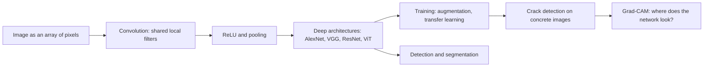
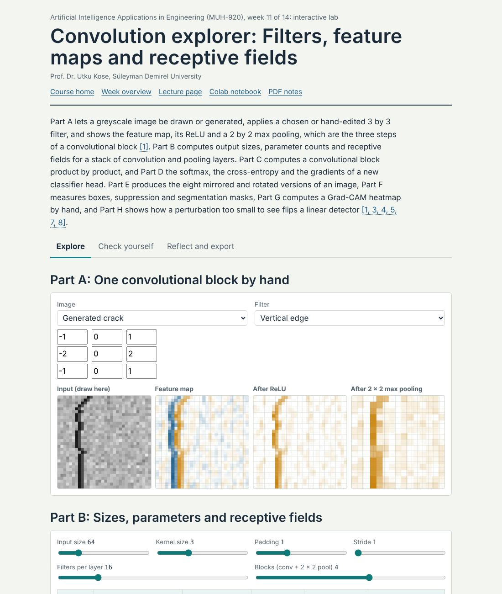
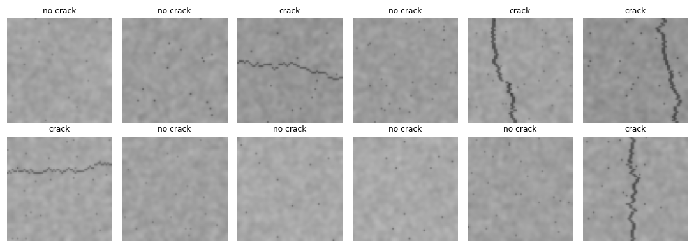
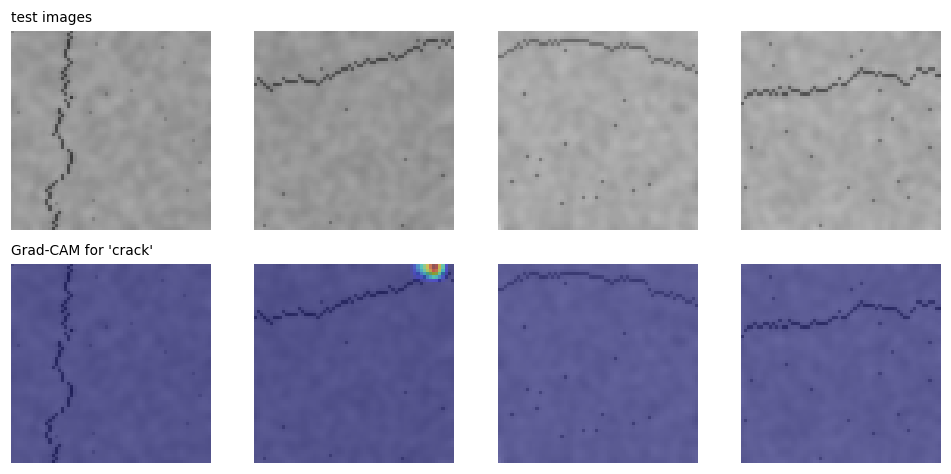

# Week 11: Seeing with Networks: Convolutional Neural Networks and Computer Vision

**Artificial Intelligence Applications in Engineering (MUH-920 Mühendislikte Yapay Zeka Uygulamaları)** Prof. Dr. Utku Kose, Süleyman Demirel University

   

[Week 10](../week-10/README.md) | [All weeks](../../README.md#weekly-schedule) | [Week 12](../week-12/README.md)

## Overview

Cameras are cheap sensors, and much engineering knowledge is visual: cracks in concrete, defects on steel strip, grains on a conveyor, fibres in a fabric, cells under a microscope. Convolutional neural networks learn visual features directly from pixels by sharing small filters across the whole image [1, 2]. Since AlexNet won the ImageNet challenge, deep convolutional networks and their successors have transformed computer vision [3, 4, 5]. This week explains convolution, pooling and modern architectures, trains a crack detector on generated concrete images, compares networks on a clothing benchmark, reuses a pretrained network through transfer learning [6], and asks the network where it looks with Grad-CAM [7].

**Estimated study time:** 10 to 12 hours.

## Learning outcomes

By the end of the week, students are expected to compute a convolution and a pooling step by hand, to calculate output sizes and parameter counts of convolutional layers, to build and train a small convolutional network in PyTorch, to explain why weight sharing makes convolutional networks efficient, to apply transfer learning and data augmentation to small engineering datasets, and to inspect a trained network with Grad-CAM and judge whether it relies on the right evidence.

## Week at a glance

## Materials of the week

| Material | What it contains | Link |
|---|---|---|
| Lecture page | Six sections with formulas, ten worked examples, three knowledge checks, an animation, a figure and six review cards | [Open the lecture page](https://utkukose.github.io/ai-applications-in-engineering-NB-lecture/weeks/week-11/lecture.html) |
| Lecture notes | The printable version of the week: the lecture with its formulas and worked examples, Python step 11 and the outputs of its code, followed by the discipline challenges and the tasks | [Open the PDF](Week11_Lecture_Notes.pdf) |
| Interactive lab | *Convolution explorer: Filters, feature maps and receptive fields*, with eight interactive parts, a self-assessment of six questions, three reflection prompts and an exportable learning log | [Open the lab](https://utkukose.github.io/ai-applications-in-engineering-NB-lecture/weeks/week-11/lab.html) |
| Colab notebook | Python step 11: Images, batches and network classes, followed by six hands-on sections with exercises and immediate feedback | [Open in Colab](https://colab.research.google.com/github/utkukose/ai-applications-in-engineering-NB-lecture/blob/main/weeks/week-11/NB11_cnn_vision.ipynb), [view on GitHub](NB11_cnn_vision.ipynb) |

## Contents

| Lecture page | Colab notebook |
|---|---|
| [Images as engineering data](https://utkukose.github.io/ai-applications-in-engineering-NB-lecture/weeks/week-11/lecture.html#images-as-engineering-data) | [Python step 11: Images, batches and network classes](https://colab.research.google.com/github/utkukose/ai-applications-in-engineering-NB-lecture/blob/main/weeks/week-11/NB11_cnn_vision.ipynb#scrollTo=python-step) |
| [Convolution, feature maps and pooling](https://utkukose.github.io/ai-applications-in-engineering-NB-lecture/weeks/week-11/lecture.html#convolution-feature-maps-and-pooling) | [1. Convolution by hand](https://colab.research.google.com/github/utkukose/ai-applications-in-engineering-NB-lecture/blob/main/weeks/week-11/NB11_cnn_vision.ipynb#scrollTo=section-1) |
| [Deep architectures](https://utkukose.github.io/ai-applications-in-engineering-NB-lecture/weeks/week-11/lecture.html#deep-architectures) | [2. A generated dataset of concrete surfaces](https://colab.research.google.com/github/utkukose/ai-applications-in-engineering-NB-lecture/blob/main/weeks/week-11/NB11_cnn_vision.ipynb#scrollTo=section-2) |
| [Training with little data](https://utkukose.github.io/ai-applications-in-engineering-NB-lecture/weeks/week-11/lecture.html#training-with-little-data) | [3. A small convolutional network](https://colab.research.google.com/github/utkukose/ai-applications-in-engineering-NB-lecture/blob/main/weeks/week-11/NB11_cnn_vision.ipynb#scrollTo=section-3) |
| [Beyond classification](https://utkukose.github.io/ai-applications-in-engineering-NB-lecture/weeks/week-11/lecture.html#beyond-classification) | [4. Where does the network look? Grad-CAM](https://colab.research.google.com/github/utkukose/ai-applications-in-engineering-NB-lecture/blob/main/weeks/week-11/NB11_cnn_vision.ipynb#scrollTo=section-4) |
| [Seeing what the network sees](https://utkukose.github.io/ai-applications-in-engineering-NB-lecture/weeks/week-11/lecture.html#seeing-what-the-network-sees) | [5. Convolutional network against a multilayer perceptron](https://colab.research.google.com/github/utkukose/ai-applications-in-engineering-NB-lecture/blob/main/weeks/week-11/NB11_cnn_vision.ipynb#scrollTo=section-5) |
| [Review cards](https://utkukose.github.io/ai-applications-in-engineering-NB-lecture/weeks/week-11/lecture.html#review-cards) | [6. Transfer learning with a pretrained ResNet-18](https://colab.research.google.com/github/utkukose/ai-applications-in-engineering-NB-lecture/blob/main/weeks/week-11/NB11_cnn_vision.ipynb#scrollTo=section-6) |

## Study path

| Step | Activity | Suggested time |
|---|---|---|
| 1 | Read the [lecture page](https://utkukose.github.io/ai-applications-in-engineering-NB-lecture/weeks/week-11/lecture.html) and answer its knowledge checks, or read the [PDF notes](Week11_Lecture_Notes.pdf) | 2 hours |
| 2 | Explore the simulation of the [interactive lab](https://utkukose.github.io/ai-applications-in-engineering-NB-lecture/weeks/week-11/lab.html#explore) | 1 hour |
| 3 | Work through [Python step 11](https://colab.research.google.com/github/utkukose/ai-applications-in-engineering-NB-lecture/blob/main/weeks/week-11/NB11_cnn_vision.ipynb#scrollTo=python-step) at the start of the Colab notebook | 1 hour |
| 4 | Continue with the hands-on sections of the [notebook](https://colab.research.google.com/github/utkukose/ai-applications-in-engineering-NB-lecture/blob/main/weeks/week-11/NB11_cnn_vision.ipynb) and their exercises | 3 hours |
| 5 | Solve the [discipline challenge](#discipline-challenges) of your department | 1 hour |
| 6 | Take the [self-assessment](https://utkukose.github.io/ai-applications-in-engineering-NB-lecture/weeks/week-11/lab.html#check) in the lab | 20 minutes |
| 7 | Answer the [reflection prompts](https://utkukose.github.io/ai-applications-in-engineering-NB-lecture/weeks/week-11/lab.html#reflect), export the learning log and complete the [weekly task](#weekly-task) | 1 hour |

## Preview

<table><tr><td colspan="2"> Interactive lab: Convolution explorer: Filters, feature maps and receptive fields</td></tr><tr><td width="50%"></td><td width="50%"></td></tr><tr><td colspan="2">Outputs of the executed Colab notebook</td></tr></table>

## Discipline challenges

Images are part of almost every discipline. Choose a row and adapt the notebook's crack classifier or its transfer-learning section to the images named there.

| Department | Challenge |
|---|---|
| Civil Engineering | Crack detection on concrete or pavement photographs, following Cha and colleagues [8]. |
| Mechanical Engineering and Textile Engineering | Surface defect classes on hot-rolled steel strip or fabric [9]. |
| Food Engineering and Biology | Grain, fruit or leaf disease images with transfer learning [10]. |
| Automotive Engineering and Computer Engineering | Traffic sign recognition with the German benchmark [11]. |
| Geological Engineering and Earth Sciences Engineering | Rock thin-section or outcrop images classified by lithology. |
| Environmental Engineering | Satellite or drone image tiles classified by land cover or pollution events. |
| Mining Engineering | Fragmentation images after blasting, classified by size class. |
| Electrical and Electronics Engineering | Printed circuit board defect images or thermal images of electrical panels. |
| Physics and Chemistry | Microscopy images of materials or crystals classified by phase or morphology. |
| Mathematics and Statistics | Show that convolution is linear and shift-equivariant and that max pooling is neither linear nor equivariant. |

## Weekly task

Train and evaluate a convolutional network for an image task related to your department. Use the generated crack images, the clothing or shape benchmark of the notebook, or a public engineering image dataset whose licence allows teaching use. Report the architecture, parameter count, augmentation, learning curves and test metrics, compare training from scratch with transfer learning, and show Grad-CAM maps for correct and wrong predictions. Discuss in about 500 words what would be needed for use on real site images, citing at least three works from this week's references [5, 6, 7].

## Research and report assignment (optional)

**Computer vision for inspection.** Review deep learning for visual inspection in one domain, such as concrete and pavement cracks, steel surface defects, fabric defects, agricultural products or electronics. Compare datasets, architectures, the use of transfer learning and augmentation, and how the studies tested generalisation to new sites or cameras [8, 9, 10].

Both assignments are optional. During an active semester, the weekly task can be sent together with the exported learning log, and the research report on its own, to utkukose@sdu.edu.tr or utkukose@gmail.com. They carry no separate weight, but the instructor may take them into account as a discretionary adjustment of the midterm component of the grade. The [assessment section of the syllabus](../../SYLLABUS.md#assessment) gives the details, and research reports use the [Word report template](../../exams/REPORT_TEMPLATE.docx).

## References

[1] LeCun, Y., Boser, B., Denker, J. S., et al. (1989). Backpropagation applied to handwritten zip code recognition. *Neural Computation*, *1*(4), 541-551. <https://doi.org/10.1162/neco.1989.1.4.541>

[2] LeCun, Y., Bottou, L., Bengio, Y., & Haffner, P. (1998). Gradient-based learning applied to document recognition. *Proceedings of the IEEE*, *86*(11), 2278-2324. <https://doi.org/10.1109/5.726791>

[3] Krizhevsky, A., Sutskever, I., & Hinton, G. E. (2017). ImageNet classification with deep convolutional neural networks. *Communications of the ACM*, *60*(6), 84-90. <https://doi.org/10.1145/3065386>

[4] Deng, J., Dong, W., Socher, R., Li, L.-J., Li, K., & Fei-Fei, L. (2009). ImageNet: A large-scale hierarchical image database. In *2009 IEEE Conference on Computer Vision and Pattern Recognition* (pp. 248-255). <https://doi.org/10.1109/CVPR.2009.5206848>

[5] He, K., Zhang, X., Ren, S., & Sun, J. (2016). Deep residual learning for image recognition. In *2016 IEEE Conference on Computer Vision and Pattern Recognition (CVPR)* (pp. 770-778). <https://doi.org/10.1109/CVPR.2016.90>

[6] Yosinski, J., Clune, J., Bengio, Y., & Lipson, H. (2014). How transferable are features in deep neural networks?. In *Advances in Neural Information Processing Systems 27* (pp. 3320-3328). <https://arxiv.org/abs/1411.1792>

[7] Selvaraju, R. R., Cogswell, M., Das, A., Vedantam, R., Parikh, D., & Batra, D. (2017). Grad-CAM: Visual explanations from deep networks via gradient-based localization. In *2017 IEEE International Conference on Computer Vision (ICCV)* (pp. 618-626). <https://doi.org/10.1109/ICCV.2017.74>

[8] Cha, Y.-J., Choi, W., & Büyüköztürk, O. (2017). Deep learning-based crack damage detection using convolutional neural networks. *Computer-Aided Civil and Infrastructure Engineering*, *32*(5), 361-378. <https://doi.org/10.1111/mice.12263>

[9] Song, K., & Yan, Y. (2013). A noise robust method based on completed local binary patterns for hot-rolled steel strip surface defects. *Applied Surface Science*, *285*, 858-864. <https://doi.org/10.1016/j.apsusc.2013.09.002>

[10] Kamilaris, A., & Prenafeta-Boldú, F. X. (2018). Deep learning in agriculture: A survey. *Computers and Electronics in Agriculture*, *147*, 70-90. <https://doi.org/10.1016/j.compag.2018.02.016>

[11] Stallkamp, J., Schlipsing, M., Salmen, J., & Igel, C. (2012). Man vs. computer: Benchmarking machine learning algorithms for traffic sign recognition. *Neural Networks*, *32*, 323-332. <https://doi.org/10.1016/j.neunet.2012.02.016>

---

Artificial Intelligence Applications in Engineering. Prof. Dr. Utku Kose, Süleyman Demirel University. ORCID [0000-0002-9652-6415](https://orcid.org/0000-0002-9652-6415). Content licensed under CC BY 4.0, code under MIT. This course is updated in line with current developments in the field. Last update: October 2026.
