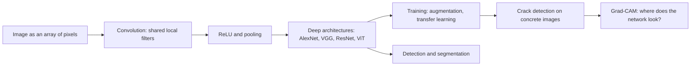
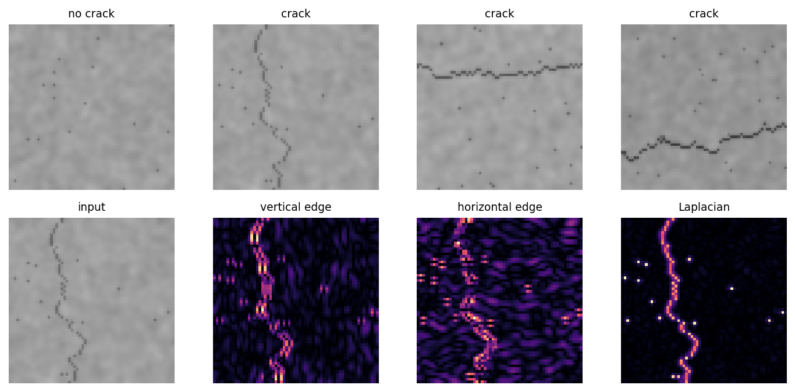

<div align="center">

# Week 11: Seeing with Networks: Convolutional Neural Networks and Computer Vision

**Artificial Intelligence Applications in Engineering (MUH-920 Mühendislikte Yapay Zeka Uygulamaları)**  
Prof. Dr. Utku Kose, Süleyman Demirel University

[](https://colab.research.google.com/github/utkukose/ai-applications-in-engineering-NB-lecture/blob/main/weeks/week-11/NB11_cnn_vision.ipynb) [](https://utkukose.github.io/ai-applications-in-engineering-NB-lecture/weeks/week-11/lab.html) [](https://utkukose.github.io/ai-applications-in-engineering-NB-lecture/weeks/week-11/lecture.html) [](Week11_Lecture_Notes.pdf)

</div>

## Overview

Cameras are cheap sensors, and much engineering knowledge is visual: cracks in concrete, defects on steel strip, grains on a conveyor, fibres in a fabric, cells under a microscope. Convolutional neural networks learn visual features directly from pixels by sharing small filters across the whole image [1, 2]. Since AlexNet won the ImageNet challenge, deep convolutional networks and their successors have transformed computer vision [4, 5, 7]. This week explains convolution, pooling and modern architectures, trains a crack detector on generated concrete images, compares networks on a clothing benchmark, reuses a pretrained network through transfer learning [9], and asks the network where it looks with Grad-CAM [16].

**Estimated study time:** 10 to 12 hours.

## Learning outcomes

By the end of the week, students are expected to compute a convolution and a pooling step by hand, to calculate output sizes and parameter counts of convolutional layers, to build and train a small convolutional network in PyTorch, to explain why weight sharing makes convolutional networks efficient, to apply transfer learning and data augmentation to small engineering datasets, and to inspect a trained network with Grad-CAM and judge whether it relies on the right evidence.

## Python in this week

The lecture ends with Python step 11: Images, batches and network classes. It covers images as arrays, cropping and flipping, stacking images into batches, the channel order of PyTorch, iterating with a DataLoader, and networks written as classes, applied to crack images [19]. The hands-on part of the notebook opens with the same step as runnable cells and short exercises with immediate feedback, and its later sections mark further constructs as Python moves.

## Study path

| Step | Activity | Suggested time |
|---|---|---|
| 1 | Read the lecture with its animations on the [lecture page](https://utkukose.github.io/ai-applications-in-engineering-NB-lecture/weeks/week-11/lecture.html), or read the [PDF version](Week11_Lecture_Notes.pdf) | 2 hours |
| 2 | Explore the [interactive lab](https://utkukose.github.io/ai-applications-in-engineering-NB-lecture/weeks/week-11/lab.html) | 1 hour |
| 3 | Study the Python step at the end of the lecture, then run the same step at the start of the hands-on part of the [Colab notebook](https://colab.research.google.com/github/utkukose/ai-applications-in-engineering-NB-lecture/blob/main/weeks/week-11/NB11_cnn_vision.ipynb) | 1 hour |
| 4 | Work through the rest of the notebook, including its Python moves and exercises | 3 hours |
| 5 | Solve the discipline challenge of your department | 1 hour |
| 6 | Take the self-assessment in the lab (tab: Check yourself) | 20 minutes |
| 7 | Write the reflection, export the learning log and complete the weekly task | 1 hour |

## Week at a glance



## Lecture

### Images as engineering data

A digital image is an array of numbers. A greyscale image of 64 by 64 pixels holds 4096 intensities, and a colour image stores three such arrays, one per channel. Engineering images come from inspection cameras on production lines, drones over bridges and power lines, microscopes, satellites, thermal cameras and X-ray systems. Treating the pixels as 4096 unrelated inputs to a multilayer network ignores two facts: Neighbouring pixels belong together, and the same pattern, such as an edge or a crack, can appear anywhere in the image. Convolutional networks build both facts into their structure.

### Convolution, feature maps and pooling

A convolutional layer slides a small filter, for example 3 by 3 weights, over the image and computes at every position the weighted sum of the pixels under it. The result is a feature map that is large where the image locally resembles the filter. A vertical-edge filter responds to vertical edges wherever they are, because the same weights are used at every position. This weight sharing drastically reduces the number of parameters compared with a fully connected layer and makes the detector equivariant to shifts [1, 2]. A layer learns many filters at once, each producing its own feature map, or channel.

Three settings shape a convolution. The kernel size sets the local window, the stride sets the step between positions, and padding adds a border so that the output can keep the input size. For an input of width W, kernel K, padding P and stride S, the output width is (W - K + 2P) / S + 1. Pooling layers then summarise small neighbourhoods, usually by their maximum, which halves the resolution and makes the representation more tolerant to small shifts. Stacking convolution, activation and pooling lets later layers see larger parts of the image: Early layers detect edges and textures, later layers combine them into parts and objects [3].

> **Animation: A filter slides over an image.** The highlighted 3 by 3 window moves across a small concrete image with a crack. Each output value is the sum of the pixels in the window multiplied by the filter weights. Choose different filters and compare the feature maps. Run it in the [web version of the lecture](https://utkukose.github.io/ai-applications-in-engineering-NB-lecture/weeks/week-11/lecture.html#anim-conv).



*Figure 11.1. Generated concrete surfaces with and without cracks (top) and their responses to a vertical-edge filter, a horizontal-edge filter and a Laplacian filter (bottom).*

<details>
<summary><b>Check your understanding.</b> An input of 64 by 64 pixels passes a 5 by 5 convolution without padding and with stride 1, followed by 2 by 2 max pooling. What is the output size?</summary>

A. 64 by 64  
B. 60 by 60  
C. 30 by 30  
D. 32 by 32

**Answer: C.** The convolution gives (64 - 5 + 0) / 1 + 1 = 60, and pooling halves it to 30.

</details>

### Deep architectures

LeNet showed in the 1990s that convolutional networks trained by backpropagation read handwritten digits reliably [2]. AlexNet, a deeper network trained on graphics processors with ReLU activations and dropout, won the 2012 ImageNet challenge by a wide margin [4, 5]. VGG networks used only small 3 by 3 filters stacked deeply [6]. Residual networks added shortcut connections that let a layer learn a correction to its input, which made networks with more than a hundred layers trainable [7]. Vision transformers split an image into patches and process them with the attention mechanism of Week 13; with enough data they match or exceed convolutional networks [8].

### Training with little data

Engineering datasets are small compared with ImageNet: a few hundred labelled crack photographs, a few thousand defect images. Two techniques make deep networks usable nonetheless. Data augmentation creates plausible variants of the training images by flipping, rotating, cropping or changing brightness, which teaches invariances that the task requires. Transfer learning starts from a network pretrained on a large dataset and retrains only its last layers or fine-tunes all of them with a small learning rate; Yosinski and colleagues showed that early layers learn general features that transfer well between tasks [9]. Cha and colleagues trained a convolutional network on patches of concrete photographs to detect cracks under varied lighting [10], and similar studies inspect steel strip surfaces [11], crops and weeds [12] and traffic signs [13].

<details>
<summary><b>Check your understanding.</b> A team has 400 labelled images of weld defects. Which approach is most promising?</summary>

A. Train a very deep network from random initial weights without augmentation  
B. Fine-tune a network pretrained on a large image dataset, with data augmentation  
C. Use a multilayer perceptron on raw pixels  
D. Remove the test set to have more training data

**Answer: B.** Pretrained features and augmentation compensate for the small dataset [9].

</details>

### Beyond classification

Classification assigns one label to an image. Object detection finds and labels every object with a bounding box; YOLO treats detection as a single regression problem and runs in real time [14]. Semantic segmentation labels every pixel; U-Net combines a contracting path with an expanding path and skip connections and became a standard for segmentation with few training images [15]. For a bridge inspector, a classifier says "crack present", a detector draws a box around each crack, and a segmentation network outlines the crack so that its length and width can be measured.

![Grad-CAM heatmaps of the crack classifier trained in the notebook. The network attends to the crack pixels rather than to the background texture [16].](figures/w11_fig2.png)

*Figure 11.2. Grad-CAM heatmaps of the crack classifier trained in the notebook. The network attends to the crack pixels rather than to the background texture [16].*

### Seeing what the network sees

High accuracy does not prove that a network uses the right evidence. A defect classifier may learn the lighting of the station where defective parts were photographed, or the ruler that appears only in images of damaged specimens. Grad-CAM weighs the feature maps of the last convolutional layer by the gradient of the class score and produces a coarse heatmap of the regions that drove the decision [16]. Checking such maps on a sample of test images, and testing the network on images from new cameras and sites, belongs to every engineering deployment. Vision models are also vulnerable to small, deliberate perturbations of the input that change their decisions, which matters wherever an attacker could manipulate the images [17].

<details>
<summary><b>Check your understanding.</b> A crack classifier reaches 99 percent test accuracy, but Grad-CAM shows that it attends to a timestamp printed in the corner of the images. What should be concluded?</summary>

A. The classifier is excellent and can be deployed  
B. The classifier may rely on a shortcut that happens to correlate with the label, so the data and the evaluation must be revised  
C. Grad-CAM is broken  
D. The images should be larger

**Answer: B.** The explanation reveals a spurious cue; accuracy on data that share the cue does not guarantee performance elsewhere.

</details>

<!-- python-step -->

### Python step 11: Images, batches and network classes

#### Images are arrays

A greyscale image is a two-dimensional array of intensities, usually scaled to the range 0 to 1, with the shape (height, width). Colour images add a third axis for the red, green and blue channels. Everything from Weeks 4 and 9 applies: Slicing crops an image, reversing an axis mirrors it, and masks find the pixels that meet a condition. The practice image below is light grey with a dark vertical crack in column 4.

```python
import numpy as np

img = np.full((8, 10), 0.7)          # light grey image, 8 rows and 10 columns
img[:, 4] = 0.1                      # a dark crack in column 4
print(img.shape, img.min(), img.max())
crop = img[2:6, 3:6]                 # rows 2 to 5, columns 3 to 5
print(crop)
print("dark pixels:", int((img < 0.3).sum()))
flipped = img[:, ::-1]               # mirror from left to right
print("crack column after flipping:", int(np.argmin(flipped.mean(axis=0))))
```

*Output*

```text
(8, 10) 0.1 0.7
[[0.7 0.1 0.7]
 [0.7 0.1 0.7]
 [0.7 0.1 0.7]
 [0.7 0.1 0.7]]
dark pixels: 8
crack column after flipping: 5
```

The slice `::-1` steps backwards through an axis. Flips and small rotations are the data augmentation of this week: They create new training images that are still valid examples of a crack.

#### From images to batches

Networks process several images at once. `np.stack` joins images of equal shape along a new first axis, which gives the shape (number of images, height, width). PyTorch convolution layers expect a channel axis in second place, (batch, channels, height, width), so greyscale images receive an axis of length one with `[:, None]`. Libraries that read colour image files usually return (height, width, channels), and `permute` reorders the axes of a tensor.

```python
import torch

batch = np.stack([img, flipped, img * 0.9])          # three images
print(batch.shape)
xb = torch.tensor(batch[:, None], dtype=torch.float32)
print(xb.shape)
rgb = torch.zeros(64, 64, 3)                          # colour image as stored in files
print(rgb.permute(2, 0, 1).shape)                     # channels first, as PyTorch expects
```

*Output*

```text
(3, 8, 10)
torch.Size([3, 1, 8, 10])
torch.Size([3, 64, 64])
```

#### Iterating in batches

A `DataLoader` serves a dataset in batches of a chosen size, optionally in shuffled order, and a `for` loop receives one batch of images and labels per pass. `enumerate` numbers the batches. The last batch is smaller when the batch size does not divide the number of examples.

```python
from torch.utils.data import TensorDataset, DataLoader

images = torch.rand(10, 1, 8, 10)
labels = torch.tensor([0, 1] * 5)
loader = DataLoader(TensorDataset(images, labels), batch_size=4, shuffle=False)
for i, (xb_i, yb_i) in enumerate(loader):
    print(i, tuple(xb_i.shape), yb_i.tolist())
```

*Output*

```text
0 (4, 1, 8, 10) [0, 1, 0, 1]
1 (4, 1, 8, 10) [0, 1, 0, 1]
2 (2, 1, 8, 10) [0, 1]
```

The expression `[0, 1] * 5` repeats a list five times, the list behaviour that NumPy arrays replace with element-wise arithmetic.

#### A network is a class

Week 6 introduced classes. A PyTorch network is a class that inherits from `nn.Module`: It gains all the machinery of a network and adds its own layers in `__init__` and its computation in `forward`. The call `super().__init__()` first runs the initialisation of the parent class. Calling the object, as in `net(xb)`, runs `forward`.

```python
from torch import nn

class TinyCNN(nn.Module):
    def __init__(self):
        super().__init__()
        self.conv = nn.Conv2d(1, 4, kernel_size=3, padding=1)
        self.pool = nn.AdaptiveAvgPool2d(1)
        self.fc = nn.Linear(4, 2)

    def forward(self, x):
        x = torch.relu(self.conv(x))
        return self.fc(self.pool(x).flatten(1))

net = TinyCNN()
print(net(xb).shape)
print(sum(p.numel() for p in net.parameters()), "parameters")
```

*Output*

```text
torch.Size([3, 2])
50 parameters
```

The convolution has 4 filters of 3 by 3 weights plus 4 biases, 40 parameters, and the linear layer has 4 times 2 weights plus 2 biases, 10 parameters.

<details>
<summary><b>Check your understanding.</b> Which shape does PyTorch expect for a batch of 16 colour images of 32 by 32 pixels?</summary>

A. (16, 32, 32, 3)  
B. (16, 3, 32, 32)  
C. (3, 16, 32, 32)  
D. (32, 32, 3, 16)

**Answer: B.** Convolution layers expect batch, channels, height and width, in this order.

</details>

<!-- /python-step -->

## Discipline challenges

Images are part of almost every discipline. Choose a row and adapt the notebook's crack classifier or its transfer-learning section to the images named there.

| Department | Challenge |
|---|---|
| Civil Engineering | Crack detection on concrete or pavement photographs, following Cha and colleagues [10]. |
| Mechanical Engineering and Textile Engineering | Surface defect classes on hot-rolled steel strip or fabric [11]. |
| Food Engineering and Biology | Grain, fruit or leaf disease images with transfer learning [12]. |
| Automotive Engineering and Computer Engineering | Traffic sign recognition with the German benchmark [13]. |
| Geological Engineering and Earth Sciences Engineering | Rock thin-section or outcrop images classified by lithology. |
| Environmental Engineering | Satellite or drone image tiles classified by land cover or pollution events. |
| Mining Engineering | Fragmentation images after blasting, classified by size class. |
| Electrical and Electronics Engineering | Printed circuit board defect images or thermal images of electrical panels. |
| Physics and Chemistry | Microscopy images of materials or crystals classified by phase or morphology. |
| Mathematics and Statistics | Show that convolution is linear and shift-equivariant and that max pooling is neither linear nor equivariant. |

## Interactive lab

Part A lets a greyscale image be drawn or generated, applies a chosen or hand-edited 3 by 3 filter, and shows the feature map, its ReLU and a 2 by 2 max pooling, which are the three steps of a convolutional block [2]. Part B computes output sizes, parameter counts and receptive fields for a stack of convolution and pooling layers.

[Open the interactive lab](https://utkukose.github.io/ai-applications-in-engineering-NB-lecture/weeks/week-11/lab.html)


## Colab notebook

The notebook computes convolutions and pooling by hand, generates a dataset of concrete surface images with and without cracks, and trains a small convolutional network on it in PyTorch. Grad-CAM shows where the network looks [16]. It then compares a convolutional network with a multilayer perceptron on Fashion-MNIST [18], or on generated shapes when the download is unavailable, and fine-tunes a ResNet-18 pretrained on ImageNet on the crack images [7, 9].

[](https://colab.research.google.com/github/utkukose/ai-applications-in-engineering-NB-lecture/blob/main/weeks/week-11/NB11_cnn_vision.ipynb)

Screenshots of the executed notebook:


## Self-assessment and reflection

The lab contains a 6-question self-assessment with instant feedback and a confidence rating for each answer. A confident but wrong answer marks the first topic to revisit. The reflection prompts below are also available in the lab, where answers are saved in the browser and can be exported as a learning log.

1. Which visual inspection in your field is done by people today? What would a camera and a network need to see, and what could mislead them?
2. Did the Grad-CAM maps of your crack classifier convince you? What test would you add before trusting the network on real photographs?
3. Which tensor shape error did you meet in the notebook, and how did printing shapes help you fix it?

## Weekly task and submission

Train and evaluate a convolutional network for an image task related to your department. Use the generated crack images, the clothing or shape benchmark of the notebook, or a public engineering image dataset whose licence allows teaching use. Report the architecture, parameter count, augmentation, learning curves and test metrics, compare training from scratch with transfer learning, and show Grad-CAM maps for correct and wrong predictions. Discuss in about 500 words what would be needed for use on real site images, citing at least three works from this week's references [7, 9, 16].

The weekly task is optional and supports self-learning and a personal portfolio. During an active semester, it can be sent together with the exported learning log to utkukose@sdu.edu.tr or utkukose@gmail.com. Optional work carries no separate weight, but the instructor may take it into account as a discretionary adjustment of the midterm component of the grade.

## Research and report assignment (optional)

**Computer vision for inspection.** Review deep learning for visual inspection in one domain, such as concrete and pavement cracks, steel surface defects, fabric defects, agricultural products or electronics. Compare datasets, architectures, the use of transfer learning and augmentation, and how the studies tested generalisation to new sites or cameras [10, 11, 12].

This research assignment is optional and supports self-learning. When the related weeks are followed within the course during an active semester, the report can be sent to utkukose@sdu.edu.tr or utkukose@gmail.com. It carries no separate weight, but the instructor may take it into account as a discretionary adjustment of the midterm component of the grade. Unless the assignment states otherwise, a report has 1500 to 2500 words, follows the structure of an academic paper, cites at least six scholarly or official sources in square brackets and uses the template in `exams/REPORT_TEMPLATE.md`.

## References

[1] LeCun, Y., Boser, B., Denker, J. S., et al. (1989). Backpropagation applied to handwritten zip code recognition. *Neural Computation*, *1*(4), 541-551. <https://doi.org/10.1162/neco.1989.1.4.541>

[2] LeCun, Y., Bottou, L., Bengio, Y., & Haffner, P. (1998). Gradient-based learning applied to document recognition. *Proceedings of the IEEE*, *86*(11), 2278-2324. <https://doi.org/10.1109/5.726791>

[3] LeCun, Y., Bengio, Y., & Hinton, G. (2015). Deep learning. *Nature*, *521*(7553), 436-444. <https://doi.org/10.1038/nature14539>

[4] Krizhevsky, A., Sutskever, I., & Hinton, G. E. (2017). ImageNet classification with deep convolutional neural networks. *Communications of the ACM*, *60*(6), 84-90. <https://doi.org/10.1145/3065386>

[5] Deng, J., Dong, W., Socher, R., Li, L.-J., Li, K., & Fei-Fei, L. (2009). ImageNet: A large-scale hierarchical image database. In *2009 IEEE Conference on Computer Vision and Pattern Recognition* (pp. 248-255). <https://doi.org/10.1109/CVPR.2009.5206848>

[6] Simonyan, K., & Zisserman, A. (2015). Very deep convolutional networks for large-scale image recognition. In *3rd International Conference on Learning Representations (ICLR 2015)*. <https://arxiv.org/abs/1409.1556>

[7] He, K., Zhang, X., Ren, S., & Sun, J. (2016). Deep residual learning for image recognition. In *2016 IEEE Conference on Computer Vision and Pattern Recognition (CVPR)* (pp. 770-778). <https://doi.org/10.1109/CVPR.2016.90>

[8] Dosovitskiy, A., Beyer, L., Kolesnikov, A., et al. (2021). An image is worth 16x16 words: Transformers for image recognition at scale. In *9th International Conference on Learning Representations (ICLR 2021)*. <https://arxiv.org/abs/2010.11929>

[9] Yosinski, J., Clune, J., Bengio, Y., & Lipson, H. (2014). How transferable are features in deep neural networks?. In *Advances in Neural Information Processing Systems 27* (pp. 3320-3328). <https://arxiv.org/abs/1411.1792>

[10] Cha, Y.-J., Choi, W., & Büyüköztürk, O. (2017). Deep learning-based crack damage detection using convolutional neural networks. *Computer-Aided Civil and Infrastructure Engineering*, *32*(5), 361-378. <https://doi.org/10.1111/mice.12263>

[11] Song, K., & Yan, Y. (2013). A noise robust method based on completed local binary patterns for hot-rolled steel strip surface defects. *Applied Surface Science*, *285*, 858-864. <https://doi.org/10.1016/j.apsusc.2013.09.002>

[12] Kamilaris, A., & Prenafeta-Boldú, F. X. (2018). Deep learning in agriculture: A survey. *Computers and Electronics in Agriculture*, *147*, 70-90. <https://doi.org/10.1016/j.compag.2018.02.016>

[13] Stallkamp, J., Schlipsing, M., Salmen, J., & Igel, C. (2012). Man vs. computer: Benchmarking machine learning algorithms for traffic sign recognition. *Neural Networks*, *32*, 323-332. <https://doi.org/10.1016/j.neunet.2012.02.016>

[14] Redmon, J., Divvala, S., Girshick, R., & Farhadi, A. (2016). You only look once: Unified, real-time object detection. In *2016 IEEE Conference on Computer Vision and Pattern Recognition (CVPR)* (pp. 779-788). <https://doi.org/10.1109/CVPR.2016.91>

[15] Ronneberger, O., Fischer, P., & Brox, T. (2015). U-Net: Convolutional networks for biomedical image segmentation. In *Medical Image Computing and Computer-Assisted Intervention (MICCAI 2015), LNCS 9351* (pp. 234-241). Springer. <https://doi.org/10.1007/978-3-319-24574-4_28>

[16] Selvaraju, R. R., Cogswell, M., Das, A., Vedantam, R., Parikh, D., & Batra, D. (2017). Grad-CAM: Visual explanations from deep networks via gradient-based localization. In *2017 IEEE International Conference on Computer Vision (ICCV)* (pp. 618-626). <https://doi.org/10.1109/ICCV.2017.74>

[17] Kose, U. (2019). Techniques for adversarial examples threatening the safety of artificial intelligence based systems. In *I. International Science and Innovation Congress (INSI Congress 2019)*. Pamukkale, Denizli, Türkiye. <https://arxiv.org/abs/1910.06907>

[18] Xiao, H., Rasul, K., & Vollgraf, R. (2017). Fashion-MNIST: A novel image dataset for benchmarking machine learning algorithms. arXiv preprint arXiv:1708.07747. <https://arxiv.org/abs/1708.07747>

[19] Paszke, A., Gross, S., Massa, F., et al. (2019). PyTorch: An imperative style, high-performance deep learning library. In *Advances in Neural Information Processing Systems 32* (pp. 8024-8035). <https://arxiv.org/abs/1912.01703>

---

<sub>Artificial Intelligence Applications in Engineering. Prof. Dr. Utku Kose, Süleyman Demirel University. ORCID [0000-0002-9652-6415](https://orcid.org/0000-0002-9652-6415). Content licensed under CC BY 4.0, code under MIT. This course is updated in line with current developments in the field. Last update: September 2026.</sub>
