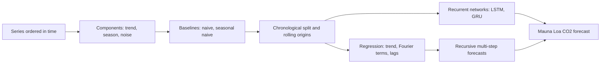
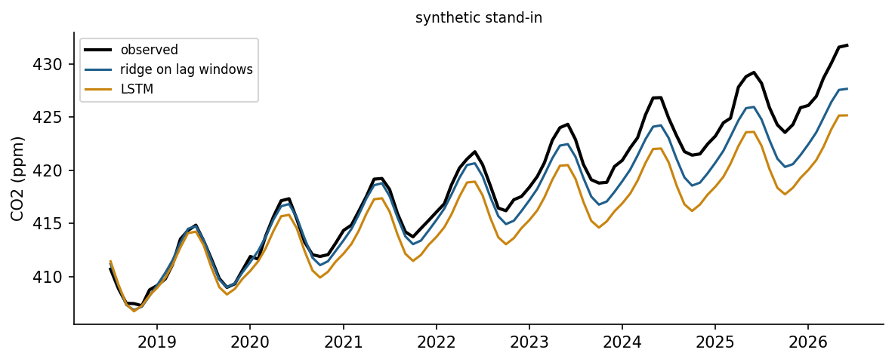

<div align="center">

# Week 12: Learning from Sequences: Time Series, Forecasting and Recurrent Networks

**Artificial Intelligence Applications in Engineering (MUH-920 Mühendislikte Yapay Zeka Uygulamaları)**  
Prof. Dr. Utku Kose, Süleyman Demirel University

[](https://colab.research.google.com/github/utkukose/ai-applications-in-engineering-NB-lecture/blob/main/weeks/week-12/NB12_time_series_forecasting.ipynb) [](https://utkukose.github.io/ai-applications-in-engineering-NB-lecture/weeks/week-12/lab.html) [](https://utkukose.github.io/ai-applications-in-engineering-NB-lecture/weeks/week-12/lecture.html) [](Week12_Lecture_Notes.pdf)

</div>

## Overview

Engineering data often arrive in order: hourly electricity demand, daily river flows, monthly production, the vibration of a machine over its life. Order carries information and imposes rules: A forecast may use only the past, and validation must respect time [1, 2]. This week decomposes series into trend and seasonality, builds honest baselines, fits regression models with seasonal terms and lag features, and trains a long short-term memory network [8]. The running example is the record of atmospheric carbon dioxide at Mauna Loa, started by Keeling in 1958 and maintained by NOAA and the Scripps Institution of Oceanography [3, 4].

**Estimated study time:** 10 to 12 hours.

> **Final project.** The final project is released this week and is due at the end of Week 14. It builds a learning system for an engineering problem and counts 60 percent of the course grade. The weekly task of this week includes the project proposal, which can be sent by e-mail for early feedback. The [project page](https://github.com/utkukose/ai-applications-in-engineering-NB-lecture/blob/main/exams/final/README.md) describes the options, the proposal, the deliverables and the evaluation criteria.

## Learning outcomes

By the end of the week, students are expected to describe trend, seasonality, autocorrelation and noise in a series, to build naive and seasonal naive baselines, to split data chronologically and evaluate forecasts with rolling origins, to construct lag windows for supervised learning, to fit trend-and-season regression and recursive multi-step forecasts, to train an LSTM in PyTorch, and to compare all models honestly on the same test period.

## Python in this week

The lecture ends with Python step 12: Time-indexed data, baselines and exceptions. It covers dates and time-indexed Series in pandas, resampling, rolling windows and shifts for lagged inputs, baseline forecasts compared on a time-ordered split, and exceptions with try and except, applied to temperature records and messy logger data [15]. The hands-on part of the notebook opens with the same step as runnable cells and short exercises with immediate feedback, and its later sections mark further constructs as Python moves.

## Study path

| Step | Activity | Suggested time |
|---|---|---|
| 1 | Read the lecture with its animations on the [lecture page](https://utkukose.github.io/ai-applications-in-engineering-NB-lecture/weeks/week-12/lecture.html), or read the [PDF version](Week12_Lecture_Notes.pdf) | 2 hours |
| 2 | Explore the [interactive lab](https://utkukose.github.io/ai-applications-in-engineering-NB-lecture/weeks/week-12/lab.html) | 1 hour |
| 3 | Study the Python step at the end of the lecture, then run the same step at the start of the hands-on part of the [Colab notebook](https://colab.research.google.com/github/utkukose/ai-applications-in-engineering-NB-lecture/blob/main/weeks/week-12/NB12_time_series_forecasting.ipynb) | 1 hour |
| 4 | Work through the rest of the notebook, including its Python moves and exercises | 3 hours |
| 5 | Solve the discipline challenge of your department | 1 hour |
| 6 | Take the self-assessment in the lab (tab: Check yourself) | 20 minutes |
| 7 | Write the reflection, export the learning log and complete the weekly task | 1 hour |

## Week at a glance



## Lecture

### Time series in engineering

A time series is a sequence of measurements indexed by time. Its behaviour usually combines a trend, a slow change of level; seasonality, a pattern that repeats with a fixed period such as a day or a year; cycles without a fixed period; and irregular noise. Neighbouring values are correlated, which is the property forecasting exploits and the property that breaks the independence assumption of the random splits used in Weeks 7 and 8. Box and Jenkins built a systematic methodology on autocorrelation and differencing [1], and Hyndman and Athanasopoulos give a modern, practical account of forecasting with open examples [2].

The Keeling curve is a textbook series. Continuous measurements at Mauna Loa since 1958 show the carbon dioxide concentration rising every year, with an annual cycle of a few parts per million caused by the growth and decay of vegetation in the northern hemisphere [3, 4]. The rise itself accelerates, so a straight line underestimates the future.

<details>
<summary><b>Check your understanding.</b> Why must the test set of a forecasting problem lie after the training period?</summary>

A. Because random splits are slower to compute  
B. Because a forecast can use only the past; random splits let the model see neighbouring future values  
C. Because test sets must always be small  
D. Because seasonality disappears in random splits

**Answer: B.** With autocorrelated data, a random split leaks information from the future into training and makes forecasts look better than they are.

</details>

### Baselines and honest evaluation

Every forecasting study needs baselines. The naive forecast repeats the last observation, and the seasonal naive forecast repeats the value from one season earlier, for example the same month of the previous year [2]. A sophisticated model that cannot beat them has learned nothing useful. Evaluation must respect time: The model is trained on data up to a forecast origin and tested on the following horizon. Rolling-origin evaluation repeats this for several origins and averages the errors, which gives a more reliable picture than a single split. Errors grow with the horizon, so results should be reported per horizon or for the horizon that matters for the decision, such as one day ahead for unit commitment in a power system [5].

> **Animation: From a series to training examples.** A window of past values forms the input and the next values form the target. Sliding the window through the training period creates the examples on which a model is trained. Change the window and horizon lengths. Run it in the [web version of the lecture](https://utkukose.github.io/ai-applications-in-engineering-NB-lecture/weeks/week-12/lecture.html#anim-window).

![Monthly carbon dioxide at Mauna Loa with forecasts for the test period from a seasonal naive baseline and a regression on trend and Fourier terms [4].](figures/w12_fig1.png)

*Figure 12.1. Monthly carbon dioxide at Mauna Loa with forecasts for the test period from a seasonal naive baseline and a regression on trend and Fourier terms [4].*

### Regression models for time series

Linear regression becomes a forecasting model when its inputs describe time. A polynomial trend captures slow change, and pairs of sine and cosine terms with the seasonal period, called Fourier terms, capture a smooth seasonal pattern with few parameters. Lagged values of the series itself, the value one month ago or twelve months ago, turn forecasting into ordinary supervised learning, so that ridge regression, random forests or gradient boosting can be used. For horizons longer than one step, the model is applied recursively, feeding its own forecasts back as lags, or a separate model is trained for each horizon. Exponential smoothing and ARIMA models are classical alternatives with well understood behaviour and prediction intervals [1, 2].

<details>
<summary><b>Check your understanding.</b> A monthly series has a yearly cycle. Which pair of features represents the first harmonic of the season?</summary>

A. month and month squared  
B. sin(2 pi m / 12) and cos(2 pi m / 12)  
C. the value of the previous day  
D. the year only

**Answer: B.** One sine-cosine pair with period 12 describes a smooth annual cycle with any phase.

</details>

### Recurrent neural networks

A recurrent network processes a sequence one step at a time and carries a hidden state from step to step, so that it can summarise the past in a fixed-size vector [6]. Training by backpropagation through time suffers from vanishing and exploding gradients, which makes long-range dependencies hard to learn [7]. The long short-term memory cell adds a memory cell and three gates, input, forget and output, that control what is written, kept and read; its design lets information and gradients flow across many steps [8]. The gated recurrent unit is a simpler relative [9]. Convolutional networks over time and attention-based transformers are strong alternatives for sequence modelling [10, 11], and surveys compare these families for forecasting [12].

Deep sequence models need data. A monthly series of about eight hundred values is small for an LSTM, and a well-designed regression with seasonal terms is often as accurate. Recurrent networks show their strength with many related series, such as the load of thousands of feeders, and with long high-frequency records, such as the degradation trajectories of turbofan engines in the C-MAPSS simulation data used for remaining useful life prediction [13].

<details>
<summary><b>Check your understanding.</b> What problem does the gating of an LSTM address?</summary>

A. The lack of a bias term in simple networks  
B. The vanishing gradient that prevents simple recurrent networks from learning long-range dependencies  
C. The need for convolution in time series  
D. The calculation of Fourier terms

**Answer: B.** Gates let information and gradients pass through many steps with little decay [7, 8].

</details>

### Forecasts for decisions

A forecast serves a decision: scheduling generation, sizing a reservoir release, ordering spare parts, or setting emission targets. Point forecasts should therefore come with uncertainty, as prediction intervals or quantiles, and probabilistic forecasting competitions in energy have made this standard practice [5]. The forecast horizon, the update frequency and the cost of errors in each direction belong in the problem statement, as the costs of misses and false alarms did in Week 8.



*Figure 12.2. Recursive multi-step forecasts of an LSTM and of a ridge regression on lag windows for the same test period, compared with the observations.*

<!-- python-step -->

### Python step 12: Time-indexed data, baselines and exceptions

#### Dates and a time index

Time series carry their time stamps with them. `pd.date_range` creates a sequence of dates, and a Series with such an index can be selected with date strings, grouped by month or resampled to a coarser time step. The practice series below is synthetic: Two years of daily mean temperatures with a mean of 12 °C, a seasonal swing of 11 °C and random variation from day to day.

```python
import numpy as np
import pandas as pd

days = pd.date_range("2024-01-01", "2025-12-31", freq="D")
doy = days.dayofyear.to_numpy()
temps = pd.Series(12 + 11 * np.sin(2 * np.pi * (doy - 110) / 365)
                  + np.random.default_rng(12).normal(0, 2.5, len(days)), index=days, name="temp_C")
print(temps.head(3).round(1))
print(round(float(temps.loc["2025-07"].mean()), 2), "°C mean in July 2025")
```

*Output*

```text
2024-01-01    1.5
2024-01-02    4.1
2024-01-03    3.3
Freq: D, Name: temp_C, dtype: float64
23.09 °C mean in July 2025
```

The selection `temps.loc["2025-07"]` keeps all days of July 2025; a date string may name a year, a month or a single day.

#### Resampling, rolling windows and lags

`resample("MS").mean()` averages each month and labels it with its first day. `rolling(30, center=True).mean()` smooths the series with a moving window of 30 days, and `shift(k)` moves the series by k steps, which creates the lagged inputs used for forecasting. Missing values appear where a shift or a window reaches beyond the data, and `dropna` removes them.

```python
monthly = temps.resample("MS").mean()
print(monthly.head(3).round(2))
smooth = temps.rolling(30, center=True).mean()
print(int(smooth.isna().sum()), "days without a full window")
lagged = pd.DataFrame({"today": temps, "yesterday": temps.shift(1), "last_year": temps.shift(365)}).dropna()
print(lagged.shape)
print(monthly.groupby(monthly.index.month).mean().round(1).head(3))
```

*Output*

```text
2024-01-01    1.25
2024-02-01    2.92
2024-03-01    5.74
Freq: MS, Name: temp_C, dtype: float64
29 days without a full window
(366, 3)
1    1.2
2    2.7
3    5.5
Name: temp_C, dtype: float64
```

The last line groups the monthly means by calendar month, so January 2024 and January 2025 are averaged together, which is the seasonal profile behind the seasonal baselines of this week.

#### Baselines on a time-ordered split

A forecast is only useful if it beats simple baselines. For time series the test period must lie after the training period, because shuffled splits would let a model use the future. Three baselines use the year 2024 for training and 2025 for testing. Persistence predicts that tomorrow equals today, the seasonal naive forecast repeats the value 365 days earlier, and the climatology predicts the mean of the same calendar month in the training year.

```python
def mae(a, b):
    """Mean absolute error of two aligned Series."""
    return float((a - b).abs().mean())

test = temps.loc["2025"]
train = temps.loc["2024"]
persistence = temps.shift(1).loc["2025"]
seasonal_naive = temps.shift(365).loc["2025"]
profile = train.groupby(train.index.month).mean()
climatology = pd.Series(profile.loc[test.index.month].to_numpy(), index=test.index)
for name, fc in [("persistence", persistence), ("seasonal naive", seasonal_naive), ("climatology", climatology)]:
    print(f"{name:15s} MAE {mae(test, fc):.2f} °C")
```

*Output*

```text
persistence     MAE 2.65 °C
seasonal naive  MAE 2.93 °C
climatology     MAE 2.15 °C
```

In this synthetic series the variation from day to day is independent noise, so the monthly profile wins. In real temperature records the weather of one day carries over into the next, and persistence becomes a strong competitor for short horizons. Every forecasting model of this week has to beat the best of such baselines on the same test period.

#### When something goes wrong: exceptions

Real data are messy. A logger may write decimal commas, text such as n/a or empty fields, and converting such text with `float` raises a `ValueError`. A `try` block runs code that may fail, and an `except` block handles the failure instead of stopping the program. The notebooks of this course use the same construction around downloads: If a data service cannot be reached, the `except` block switches to a documented synthetic stand-in. A function can also raise an exception itself when it receives input that makes no sense, which stops errors from spreading silently.

```python
raw = ["12.5", "13,1", "n/a", "", "14.0", "-2.3"]
values, failed = [], 0
for text in raw:
    try:
        values.append(float(text.replace(",", ".")))
    except ValueError:
        failed += 1
print(values, "failed:", failed)

def moving_average(x, window):
    """Mean of every run of `window` consecutive values; window must be at least 1."""
    if window < 1:
        raise ValueError("window must be at least 1")
    return [sum(x[i:i + window]) / window for i in range(len(x) - window + 1)]

print(moving_average(values, 2))
try:
    moving_average(values, 0)
except ValueError as error:
    print("error:", error)
```

*Output*

```text
[12.5, 13.1, 14.0, -2.3] failed: 2
[12.8, 13.55, 5.85]
error: window must be at least 1
```

<details>
<summary><b>Check your understanding.</b> s is a monthly Series. What does s.shift(1) contain in its first position?</summary>

A. The value of the last month  
B. A missing value (NaN)  
C. Zero  
D. The same value as s in its first position

**Answer: B.** Each value moves one step later in time, so nothing is available to fill the first position.

</details>

<!-- /python-step -->

## Discipline challenges

Ordered data exist in every field. Choose a row, respect time in every split, and always report the naive baselines next to your model.

| Department | Challenge |
|---|---|
| Environmental Engineering and Earth Sciences Engineering | Carbon dioxide at Mauna Loa, as in the notebook, or local air quality series [4]. |
| Civil Engineering and Environmental Engineering | Daily precipitation and temperature of Isparta from the Open-Meteo archive [16]. |
| Electrical and Electronics Engineering | Hourly electricity demand or photovoltaic output with daily and weekly seasonality [5]. |
| Mechanical Engineering and Automotive Engineering | Remaining useful life from degradation trajectories such as the C-MAPSS simulations [13]. |
| Geophysical Engineering | Daily counts of earthquakes in a region from the USGS catalogue, with the aftershock decay after large events [17]. |
| Industrial Engineering | Monthly demand of a product family and its effect on inventory decisions. |
| Food Engineering | Temperature records of a cold chain and forecasts of excursions. |
| Chemical Engineering and Chemistry | Soft sensing: predicting a slow laboratory measurement from fast process signals. |
| Physics and Mathematics | Forecasting a chaotic system such as the logistic map or the Lorenz equations, and the limits of predictability [18]. |
| Statistics | Compare seasonal naive, exponential smoothing and ARIMA with prediction intervals on one series [1]. |

## Interactive lab

Part A generates a monthly series with adjustable trend, seasonal amplitude, noise and an optional level shift, and compares naive, seasonal naive, moving average, trend-and-season regression and Holt-Winters exponential smoothing on a held-out final period [2]. Part B repeats the comparison over rolling origins and shows how the error grows with the horizon.

[Open the interactive lab](https://utkukose.github.io/ai-applications-in-engineering-NB-lecture/weeks/week-12/lab.html)


## Colab notebook

The notebook downloads the monthly Mauna Loa carbon dioxide record from NOAA [4], explores its trend and seasonal cycle, and holds out the last eight years as a test period. It compares naive and seasonal naive baselines, a regression on a quadratic trend and Fourier terms, a ridge regression on lag windows with recursive forecasts, and an LSTM trained in PyTorch [8, 14], all on the same test months.

[](https://colab.research.google.com/github/utkukose/ai-applications-in-engineering-NB-lecture/blob/main/weeks/week-12/NB12_time_series_forecasting.ipynb)

Screenshots of the executed notebook:


## Self-assessment and reflection

The lab contains a 6-question self-assessment with instant feedback and a confidence rating for each answer. A confident but wrong answer marks the first topic to revisit. The reflection prompts below are also available in the lab, where answers are saved in the browser and can be exported as a learning log.

1. Which series in your field would you like to forecast, at what horizon, and what decision would the forecast support?
2. Did the LSTM beat the regression with Fourier terms on the carbon dioxide data? What does the answer say about model choice for small series?
3. Where could a random split of time series data hide a leak in a project you know?

## Weekly task and submission

Forecast a time series from your department or from a public source such as NOAA, Open-Meteo or the USGS. Split the data chronologically, report the seasonal naive baseline, a regression with trend and seasonal terms and one learned model with lag windows or an LSTM, and evaluate them with at least three rolling origins. Discuss in about 500 words how the forecast would be used and how its uncertainty should be communicated, citing at least three works from this week's references [2, 5, 8]. This week also opens the final project: Write its proposal of about 600 words as described on the [final project page](https://github.com/utkukose/ai-applications-in-engineering-NB-lecture/blob/main/exams/final/README.md), and send it by e-mail for early feedback during an active semester.

The weekly task is optional and supports self-learning and a personal portfolio. During an active semester, it can be sent together with the exported learning log to utkukose@sdu.edu.tr or utkukose@gmail.com. Optional work carries no separate weight, but the instructor may take it into account as a discretionary adjustment of the midterm component of the grade.

## Research and report assignment (optional)

**Forecasting for engineering operations.** Review forecasting methods for one engineering application, such as electricity load, renewable generation, river flow, traffic or remaining useful life. Compare statistical, machine learning and deep learning approaches, the evaluation designs, and the treatment of uncertainty [5, 12, 13].

This research assignment is optional and supports self-learning. When the related weeks are followed within the course during an active semester, the report can be sent to utkukose@sdu.edu.tr or utkukose@gmail.com. It carries no separate weight, but the instructor may take it into account as a discretionary adjustment of the midterm component of the grade. Unless the assignment states otherwise, a report has 1500 to 2500 words, follows the structure of an academic paper, cites at least six scholarly or official sources in square brackets and uses the template in `exams/REPORT_TEMPLATE.md`.

## References

[1] Box, G. E. P., Jenkins, G. M., Reinsel, G. C., & Ljung, G. M. (2015). *Time Series Analysis: Forecasting and Control* (5th ed.). Wiley.

[2] Hyndman, R. J., & Athanasopoulos, G. (2021). *Forecasting: Principles and Practice* (3rd ed.). OTexts. <https://otexts.com/fpp3/>

[3] Keeling, C. D., Bacastow, R. B., Bainbridge, A. E., Ekdahl, C. A., Guenther, P. R., Waterman, L. S., & Chin, J. F. S. (1976). Atmospheric carbon dioxide variations at Mauna Loa Observatory, Hawaii. *Tellus*, *28*(6), 538-551. <https://doi.org/10.1111/j.2153-3490.1976.tb00701.x>

[4] Lan, X., & Keeling, R. (2026). *Trends in atmospheric carbon dioxide: Mauna Loa CO2 monthly mean data. NOAA Global Monitoring Laboratory and Scripps Institution of Oceanography*. <https://gml.noaa.gov/ccgg/trends/>

[5] Hong, T., Pinson, P., Fan, S., Zareipour, H., Troccoli, A., & Hyndman, R. J. (2016). Probabilistic energy forecasting: Global Energy Forecasting Competition 2014 and beyond. *International Journal of Forecasting*, *32*(3), 896-913. <https://doi.org/10.1016/j.ijforecast.2016.02.001>

[6] Elman, J. L. (1990). Finding structure in time. *Cognitive Science*, *14*(2), 179-211. <https://doi.org/10.1207/s15516709cog1402_1>

[7] Bengio, Y., Simard, P., & Frasconi, P. (1994). Learning long-term dependencies with gradient descent is difficult. *IEEE Transactions on Neural Networks*, *5*(2), 157-166. <https://doi.org/10.1109/72.279181>

[8] Hochreiter, S., & Schmidhuber, J. (1997). Long short-term memory. *Neural Computation*, *9*(8), 1735-1780. <https://doi.org/10.1162/neco.1997.9.8.1735>

[9] Cho, K., van Merriënboer, B., Gulcehre, C., et al. (2014). Learning phrase representations using RNN encoder-decoder for statistical machine translation. In *Proceedings of the 2014 Conference on Empirical Methods in Natural Language Processing (EMNLP)* (pp. 1724-1734). <https://doi.org/10.3115/v1/D14-1179>

[10] Bai, S., Kolter, J. Z., & Koltun, V. (2018). An empirical evaluation of generic convolutional and recurrent networks for sequence modeling. arXiv preprint arXiv:1803.01271. <https://arxiv.org/abs/1803.01271>

[11] Vaswani, A., Shazeer, N., Parmar, N., Uszkoreit, J., Jones, L., Gomez, A. N., Kaiser, Ł., & Polosukhin, I. (2017). Attention is all you need. In *Advances in Neural Information Processing Systems 30* (pp. 5998-6008). <https://arxiv.org/abs/1706.03762>

[12] Lim, B., & Zohren, S. (2021). Time-series forecasting with deep learning: A survey. *Philosophical Transactions of the Royal Society A*, *379*(2194), 20200209. <https://doi.org/10.1098/rsta.2020.0209>

[13] Saxena, A., Goebel, K., Simon, D., & Eklund, N. (2008). Damage propagation modeling for aircraft engine run-to-failure simulation. In *2008 International Conference on Prognostics and Health Management* (pp. 1-9). IEEE. <https://doi.org/10.1109/PHM.2008.4711414>

[14] Paszke, A., Gross, S., Massa, F., et al. (2019). PyTorch: An imperative style, high-performance deep learning library. In *Advances in Neural Information Processing Systems 32* (pp. 8024-8035). <https://arxiv.org/abs/1912.01703>

[15] McKinney, W. (2010). Data structures for statistical computing in Python. In *Proceedings of the 9th Python in Science Conference* (pp. 56-61). <https://doi.org/10.25080/Majora-92bf1922-00a>

[16] Open-Meteo (2026). *Open-Meteo free weather API: Historical Weather API and Elevation API (data licensed under CC BY 4.0)*. <https://open-meteo.com>

[17] U.S. Geological Survey (2026). *Earthquake Catalog API (FDSN Event Web Service)*. <https://earthquake.usgs.gov/fdsnws/event/1/>

[18] Kose, U., & Arslan, A. (2017). Forecasting chaotic time series via ANFIS supported by vortex optimization algorithm: Applications on electroencephalogram time series. *Arabian Journal for Science and Engineering*, *42*(8), 3103-3114. <https://doi.org/10.1007/s13369-016-2279-z>

---

<sub>Artificial Intelligence Applications in Engineering. Prof. Dr. Utku Kose, Süleyman Demirel University. ORCID [0000-0002-9652-6415](https://orcid.org/0000-0002-9652-6415). Content licensed under CC BY 4.0, code under MIT. This course is updated in line with current developments in the field. Last update: September 2026.</sub>
