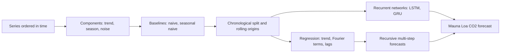
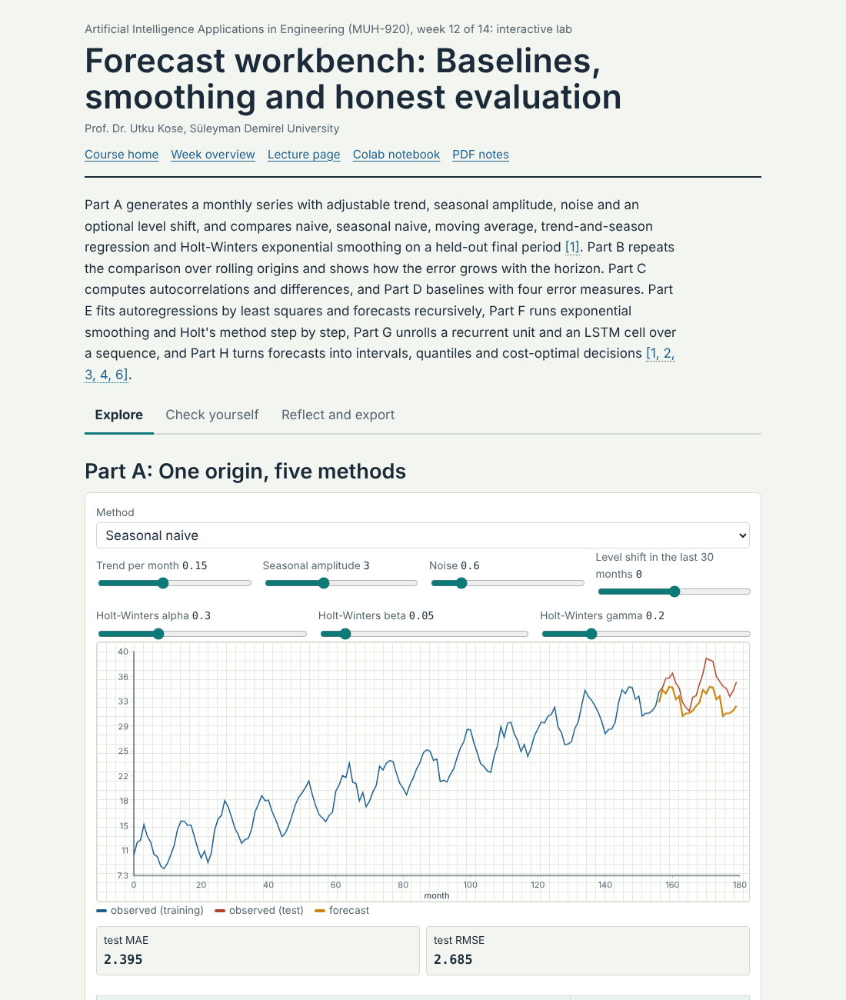
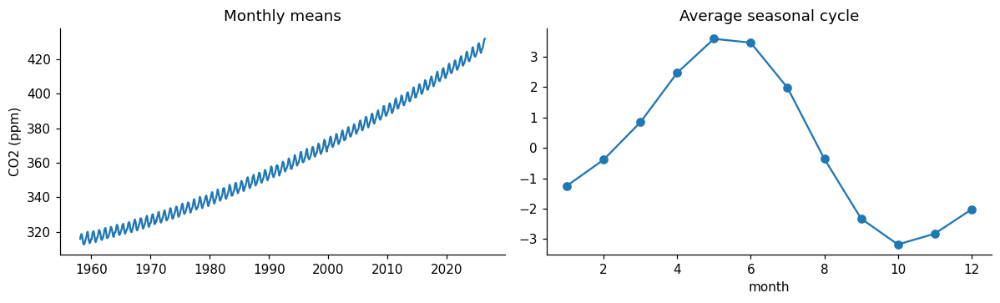
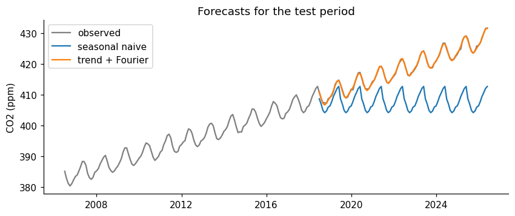

# Week 12: Learning from Sequences: Time Series, Forecasting and Recurrent Networks

**Artificial Intelligence Applications in Engineering (MUH-920 Mühendislikte Yapay Zeka Uygulamaları)** Prof. Dr. Utku Kose, Süleyman Demirel University

   

[Week 11](../week-11/README.md) | [All weeks](../../README.md#weekly-schedule) | [Week 13](../week-13/README.md)

## Overview

Engineering data often arrive in order: hourly electricity demand, daily river flows, monthly production, the vibration of a machine over its life. Order carries information and imposes rules: A forecast may use only the past, and validation must respect time [1, 2]. This week decomposes series into trend and seasonality, builds honest baselines, fits regression models with seasonal terms and lag features, and trains a long short-term memory network [3]. The running example is the record of atmospheric carbon dioxide at Mauna Loa, started by Keeling in 1958 and maintained by NOAA and the Scripps Institution of Oceanography [4, 5].

**Estimated study time:** 10 to 12 hours.

> **Final project.** The final project is released this week and is due at the end of Week 14. It builds a learning system for an engineering problem and counts 60 percent of the course grade. The weekly task of this week includes the project proposal, which can be sent by e-mail for early feedback. The [project page](https://github.com/utkukose/ai-applications-in-engineering-NB-lecture/blob/main/exams/final/README.md) describes the options, the proposal, the deliverables and the evaluation criteria.

## Learning outcomes

By the end of the week, students are expected to describe trend, seasonality, autocorrelation and noise in a series, to build naive and seasonal naive baselines, to split data chronologically and evaluate forecasts with rolling origins, to construct lag windows for supervised learning, to fit trend-and-season regression and recursive multi-step forecasts, to train an LSTM in PyTorch, and to compare all models honestly on the same test period.

## Week at a glance

## Materials of the week

| Material | What it contains | Link |
|---|---|---|
| Lecture page | Five sections with formulas, nine worked examples, three knowledge checks, an animation, a figure and six review cards | [Open the lecture page](https://utkukose.github.io/ai-applications-in-engineering-NB-lecture/weeks/week-12/lecture.html) |
| Lecture notes | The printable version of the week: the lecture with its formulas and worked examples, Python step 12 and the outputs of its code, followed by the discipline challenges and the tasks | [Open the PDF](Week12_Lecture_Notes.pdf) |
| Interactive lab | *Forecast workbench: Baselines, smoothing and honest evaluation*, with eight interactive parts, a self-assessment of six questions, three reflection prompts and an exportable learning log | [Open the lab](https://utkukose.github.io/ai-applications-in-engineering-NB-lecture/weeks/week-12/lab.html) |
| Colab notebook | Python step 12: Time-indexed data, baselines and exceptions, followed by six hands-on sections with exercises and immediate feedback | [Open in Colab](https://colab.research.google.com/github/utkukose/ai-applications-in-engineering-NB-lecture/blob/main/weeks/week-12/NB12_time_series_forecasting.ipynb), [view on GitHub](NB12_time_series_forecasting.ipynb) |

## Contents

| Lecture page | Colab notebook |
|---|---|
| [Time series in engineering](https://utkukose.github.io/ai-applications-in-engineering-NB-lecture/weeks/week-12/lecture.html#time-series-in-engineering) | [Python step 12: Time-indexed data, baselines and exceptions](https://colab.research.google.com/github/utkukose/ai-applications-in-engineering-NB-lecture/blob/main/weeks/week-12/NB12_time_series_forecasting.ipynb#scrollTo=python-step) |
| [Baselines and honest evaluation](https://utkukose.github.io/ai-applications-in-engineering-NB-lecture/weeks/week-12/lecture.html#baselines-and-honest-evaluation) | [1. The Mauna Loa record](https://colab.research.google.com/github/utkukose/ai-applications-in-engineering-NB-lecture/blob/main/weeks/week-12/NB12_time_series_forecasting.ipynb#scrollTo=section-1) |
| [Regression models for time series](https://utkukose.github.io/ai-applications-in-engineering-NB-lecture/weeks/week-12/lecture.html#regression-models-for-time-series) | [2. A chronological split and two baselines](https://colab.research.google.com/github/utkukose/ai-applications-in-engineering-NB-lecture/blob/main/weeks/week-12/NB12_time_series_forecasting.ipynb#scrollTo=section-2) |
| [Recurrent neural networks](https://utkukose.github.io/ai-applications-in-engineering-NB-lecture/weeks/week-12/lecture.html#recurrent-neural-networks) | [3. Regression on trend and Fourier terms](https://colab.research.google.com/github/utkukose/ai-applications-in-engineering-NB-lecture/blob/main/weeks/week-12/NB12_time_series_forecasting.ipynb#scrollTo=section-3) |
| [Forecasts for decisions](https://utkukose.github.io/ai-applications-in-engineering-NB-lecture/weeks/week-12/lecture.html#forecasts-for-decisions) | [4. Lag windows and recursive forecasts](https://colab.research.google.com/github/utkukose/ai-applications-in-engineering-NB-lecture/blob/main/weeks/week-12/NB12_time_series_forecasting.ipynb#scrollTo=section-4) |
| [Review cards](https://utkukose.github.io/ai-applications-in-engineering-NB-lecture/weeks/week-12/lecture.html#review-cards) | [5. An LSTM](https://colab.research.google.com/github/utkukose/ai-applications-in-engineering-NB-lecture/blob/main/weeks/week-12/NB12_time_series_forecasting.ipynb#scrollTo=section-5) |
|  | [6. All methods on the same test months](https://colab.research.google.com/github/utkukose/ai-applications-in-engineering-NB-lecture/blob/main/weeks/week-12/NB12_time_series_forecasting.ipynb#scrollTo=section-6) |

## Study path

| Step | Activity | Suggested time |
|---|---|---|
| 1 | Read the [lecture page](https://utkukose.github.io/ai-applications-in-engineering-NB-lecture/weeks/week-12/lecture.html) and answer its knowledge checks, or read the [PDF notes](Week12_Lecture_Notes.pdf) | 2 hours |
| 2 | Explore the simulation of the [interactive lab](https://utkukose.github.io/ai-applications-in-engineering-NB-lecture/weeks/week-12/lab.html#explore) | 1 hour |
| 3 | Work through [Python step 12](https://colab.research.google.com/github/utkukose/ai-applications-in-engineering-NB-lecture/blob/main/weeks/week-12/NB12_time_series_forecasting.ipynb#scrollTo=python-step) at the start of the Colab notebook | 1 hour |
| 4 | Continue with the hands-on sections of the [notebook](https://colab.research.google.com/github/utkukose/ai-applications-in-engineering-NB-lecture/blob/main/weeks/week-12/NB12_time_series_forecasting.ipynb) and their exercises | 3 hours |
| 5 | Solve the [discipline challenge](#discipline-challenges) of your department | 1 hour |
| 6 | Take the [self-assessment](https://utkukose.github.io/ai-applications-in-engineering-NB-lecture/weeks/week-12/lab.html#check) in the lab | 20 minutes |
| 7 | Answer the [reflection prompts](https://utkukose.github.io/ai-applications-in-engineering-NB-lecture/weeks/week-12/lab.html#reflect), export the learning log and complete the [weekly task](#weekly-task) | 1 hour |

## Preview

<table><tr><td colspan="2"> Interactive lab: Forecast workbench: Baselines, smoothing and honest evaluation</td></tr><tr><td width="50%"></td><td width="50%"></td></tr><tr><td colspan="2">Outputs of the executed Colab notebook</td></tr></table>

## Discipline challenges

Ordered data exist in every field. Choose a row, respect time in every split, and always report the naive baselines next to your model.

| Department | Challenge |
|---|---|
| Environmental Engineering and Earth Sciences Engineering | Carbon dioxide at Mauna Loa, as in the notebook, or local air quality series [5]. |
| Civil Engineering and Environmental Engineering | Daily precipitation and temperature of Isparta from the Open-Meteo archive [6]. |
| Electrical and Electronics Engineering | Hourly electricity demand or photovoltaic output with daily and weekly seasonality [7]. |
| Mechanical Engineering and Automotive Engineering | Remaining useful life from degradation trajectories such as the C-MAPSS simulations [8]. |
| Geophysical Engineering | Daily counts of earthquakes in a region from the USGS catalogue, with the aftershock decay after large events [9]. |
| Industrial Engineering | Monthly demand of a product family and its effect on inventory decisions. |
| Food Engineering | Temperature records of a cold chain and forecasts of excursions. |
| Chemical Engineering and Chemistry | Soft sensing: predicting a slow laboratory measurement from fast process signals. |
| Physics and Mathematics | Forecasting a chaotic system such as the logistic map or the Lorenz equations, and the limits of predictability [10]. |
| Statistics | Compare seasonal naive, exponential smoothing and ARIMA with prediction intervals on one series [1]. |

## Weekly task

Forecast a time series from your department or from a public source such as NOAA, Open-Meteo or the USGS. Split the data chronologically, report the seasonal naive baseline, a regression with trend and seasonal terms and one learned model with lag windows or an LSTM, and evaluate them with at least three rolling origins. Discuss in about 500 words how the forecast would be used and how its uncertainty should be communicated, citing at least three works from this week's references [2, 3, 7]. This week also opens the final project: Write its proposal of about 600 words as described on the [final project page](https://github.com/utkukose/ai-applications-in-engineering-NB-lecture/blob/main/exams/final/README.md), and send it by e-mail for early feedback during an active semester.

## Research and report assignment (optional)

**Forecasting for engineering operations.** Review forecasting methods for one engineering application, such as electricity load, renewable generation, river flow, traffic or remaining useful life. Compare statistical, machine learning and deep learning approaches, the evaluation designs, and the treatment of uncertainty [7, 8, 11].

Both assignments are optional. During an active semester, the weekly task can be sent together with the exported learning log, and the research report on its own, to utkukose@sdu.edu.tr or utkukose@gmail.com. They carry no separate weight, but the instructor may take them into account as a discretionary adjustment of the midterm component of the grade. The [assessment section of the syllabus](../../SYLLABUS.md#assessment) gives the details, and research reports use the [Word report template](../../exams/REPORT_TEMPLATE.docx).

## References

[1] Box, G. E. P., Jenkins, G. M., Reinsel, G. C., & Ljung, G. M. (2015). *Time Series Analysis: Forecasting and Control* (5th ed.). Wiley.

[2] Hyndman, R. J., & Athanasopoulos, G. (2021). *Forecasting: Principles and Practice* (3rd ed.). OTexts. <https://otexts.com/fpp3/>

[3] Hochreiter, S., & Schmidhuber, J. (1997). Long short-term memory. *Neural Computation*, *9*(8), 1735-1780. <https://doi.org/10.1162/neco.1997.9.8.1735>

[4] Keeling, C. D., Bacastow, R. B., Bainbridge, A. E., Ekdahl, C. A., Guenther, P. R., Waterman, L. S., & Chin, J. F. S. (1976). Atmospheric carbon dioxide variations at Mauna Loa Observatory, Hawaii. *Tellus*, *28*(6), 538-551. <https://doi.org/10.1111/j.2153-3490.1976.tb00701.x>

[5] Lan, X., & Keeling, R. (2026). *Trends in atmospheric carbon dioxide: Mauna Loa CO2 monthly mean data. NOAA Global Monitoring Laboratory and Scripps Institution of Oceanography*. <https://gml.noaa.gov/ccgg/trends/>

[6] Open-Meteo (2026). *Open-Meteo free weather API: Historical Weather API and Elevation API (data licensed under CC BY 4.0)*. <https://open-meteo.com>

[7] Hong, T., Pinson, P., Fan, S., Zareipour, H., Troccoli, A., & Hyndman, R. J. (2016). Probabilistic energy forecasting: Global Energy Forecasting Competition 2014 and beyond. *International Journal of Forecasting*, *32*(3), 896-913. <https://doi.org/10.1016/j.ijforecast.2016.02.001>

[8] Saxena, A., Goebel, K., Simon, D., & Eklund, N. (2008). Damage propagation modeling for aircraft engine run-to-failure simulation. In *2008 International Conference on Prognostics and Health Management* (pp. 1-9). IEEE. <https://doi.org/10.1109/PHM.2008.4711414>

[9] U.S. Geological Survey (2026). *Earthquake Catalog API (FDSN Event Web Service)*. <https://earthquake.usgs.gov/fdsnws/event/1/>

[10] Kose, U., & Arslan, A. (2017). Forecasting chaotic time series via ANFIS supported by vortex optimization algorithm: Applications on electroencephalogram time series. *Arabian Journal for Science and Engineering*, *42*(8), 3103-3114. <https://doi.org/10.1007/s13369-016-2279-z>

[11] Lim, B., & Zohren, S. (2021). Time-series forecasting with deep learning: A survey. *Philosophical Transactions of the Royal Society A*, *379*(2194), 20200209. <https://doi.org/10.1098/rsta.2020.0209>

---

Artificial Intelligence Applications in Engineering. Prof. Dr. Utku Kose, Süleyman Demirel University. ORCID [0000-0002-9652-6415](https://orcid.org/0000-0002-9652-6415). Content licensed under CC BY 4.0, code under MIT. This course is updated in line with current developments in the field. Last update: October 2026.
