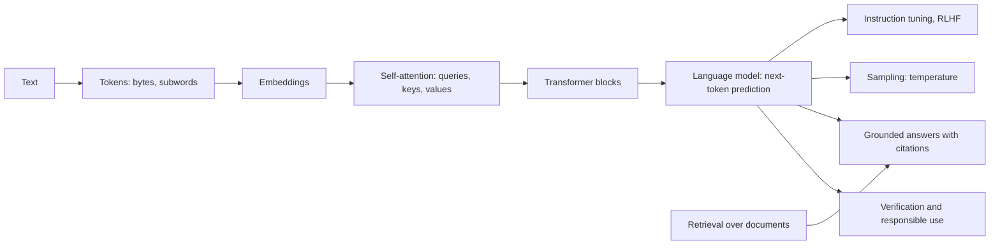
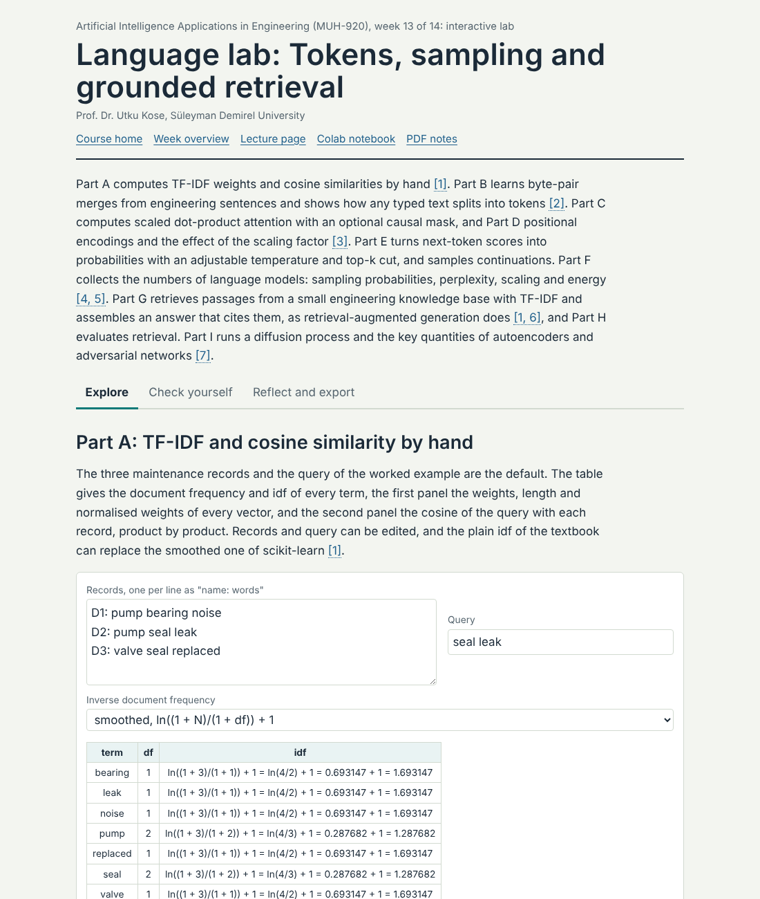
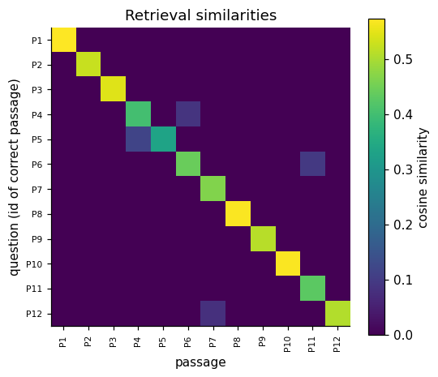

# Week 13: Attention, Transformers and Generative AI

**Artificial Intelligence Applications in Engineering (MUH-920 Mühendislikte Yapay Zeka Uygulamaları)** Prof. Dr. Utku Kose, Süleyman Demirel University

   

[Week 12](../week-12/README.md) | [All weeks](../../README.md#weekly-schedule) | [Week 14](../week-14/README.md)

## Overview

Engineering knowledge lives in text: standards, specifications, maintenance logs, test reports and code. Large language models process such text with the transformer architecture, whose self-attention lets every token weigh every other token [1]. Pretrained on vast corpora and tuned to follow instructions, they draft, summarise, translate and write code [2, 3, 4], but they also produce fluent statements that are false [5]. This week builds tokenisation, attention and a tiny transformer from scratch, connects a language task to retrieval so that answers rest on cited documents [6], surveys generative models for images and designs [7, 8], and sets out rules for responsible use in engineering work.

**Estimated study time:** 10 to 12 hours.

> **Final project.** The final project is due at the end of Week 14. The [project page](https://github.com/utkukose/ai-applications-in-engineering-NB-lecture/blob/main/exams/final/README.md) lists the deliverables and the evaluation criteria.

## Learning outcomes

By the end of the week, students are expected to explain tokenisation, embeddings and scaled dot-product attention, to compute attention weights for a small example, to describe how decoder-only language models are pretrained and tuned, to explain the effect of sampling temperature, to build and evaluate a retrieval step that grounds answers in documents, to name the main families of generative models, and to state the verification and confidentiality duties that apply when engineers use these tools.

## Week at a glance

## Materials of the week

| Material | What it contains | Link |
|---|---|---|
| Lecture page | Seven sections with formulas, nine worked examples, three knowledge checks, an animation, a figure and six review cards | [Open the lecture page](https://utkukose.github.io/ai-applications-in-engineering-NB-lecture/weeks/week-13/lecture.html) |
| Lecture notes | The printable version of the week: the lecture with its formulas and worked examples, Python step 13 and the outputs of its code, followed by the discipline challenges and the tasks | [Open the PDF](Week13_Lecture_Notes.pdf) |
| Interactive lab | *Language lab: Tokens, sampling and grounded retrieval*, with nine interactive parts, a self-assessment of six questions, three reflection prompts and an exportable learning log | [Open the lab](https://utkukose.github.io/ai-applications-in-engineering-NB-lecture/weeks/week-13/lab.html) |
| Colab notebook | Python step 13: Text, vectors and attention, followed by five hands-on sections with exercises and immediate feedback | [Open in Colab](https://colab.research.google.com/github/utkukose/ai-applications-in-engineering-NB-lecture/blob/main/weeks/week-13/NB13_transformers_llms_genai.ipynb), [view on GitHub](NB13_transformers_llms_genai.ipynb) |

## Contents

| Lecture page | Colab notebook |
|---|---|
| [Text as engineering data](https://utkukose.github.io/ai-applications-in-engineering-NB-lecture/weeks/week-13/lecture.html#text-as-engineering-data) | [Python step 13: Text, vectors and attention](https://colab.research.google.com/github/utkukose/ai-applications-in-engineering-NB-lecture/blob/main/weeks/week-13/NB13_transformers_llms_genai.ipynb#scrollTo=python-step) |
| [From words to vectors](https://utkukose.github.io/ai-applications-in-engineering-NB-lecture/weeks/week-13/lecture.html#from-words-to-vectors) | [1. Byte-pair encoding from scratch](https://colab.research.google.com/github/utkukose/ai-applications-in-engineering-NB-lecture/blob/main/weeks/week-13/NB13_transformers_llms_genai.ipynb#scrollTo=section-1) |
| [Attention and the transformer](https://utkukose.github.io/ai-applications-in-engineering-NB-lecture/weeks/week-13/lecture.html#attention-and-the-transformer) | [2. Attention in NumPy](https://colab.research.google.com/github/utkukose/ai-applications-in-engineering-NB-lecture/blob/main/weeks/week-13/NB13_transformers_llms_genai.ipynb#scrollTo=section-2) |
| [Large language models](https://utkukose.github.io/ai-applications-in-engineering-NB-lecture/weeks/week-13/lecture.html#large-language-models) | [3. A tiny character-level transformer](https://colab.research.google.com/github/utkukose/ai-applications-in-engineering-NB-lecture/blob/main/weeks/week-13/NB13_transformers_llms_genai.ipynb#scrollTo=section-3) |
| [Retrieval-augmented generation](https://utkukose.github.io/ai-applications-in-engineering-NB-lecture/weeks/week-13/lecture.html#retrieval-augmented-generation) | [4. Retrieval over an engineering knowledge base](https://colab.research.google.com/github/utkukose/ai-applications-in-engineering-NB-lecture/blob/main/weeks/week-13/NB13_transformers_llms_genai.ipynb#scrollTo=section-4) |
| [Generative models beyond text](https://utkukose.github.io/ai-applications-in-engineering-NB-lecture/weeks/week-13/lecture.html#generative-models-beyond-text) | [5. Optional: an open instruction-tuned model](https://colab.research.google.com/github/utkukose/ai-applications-in-engineering-NB-lecture/blob/main/weeks/week-13/NB13_transformers_llms_genai.ipynb#scrollTo=section-5) |
| [Responsible use in engineering work](https://utkukose.github.io/ai-applications-in-engineering-NB-lecture/weeks/week-13/lecture.html#responsible-use-in-engineering-work) |  |
| [Review cards](https://utkukose.github.io/ai-applications-in-engineering-NB-lecture/weeks/week-13/lecture.html#review-cards) |  |

The links of the notebook column open the notebook at the chosen part. Most parts use the setup cell and the results of the parts above them: Runtime > Run before (Ctrl+F8) in Colab runs those cells first. If they have not run in the current session, the first code cell of the part stops with a message.

## Study path

| Step | Activity | Suggested time |
|---|---|---|
| 1 | Read the [lecture page](https://utkukose.github.io/ai-applications-in-engineering-NB-lecture/weeks/week-13/lecture.html) and answer its knowledge checks, or read the [PDF notes](Week13_Lecture_Notes.pdf) | 2 hours |
| 2 | Explore the simulation of the [interactive lab](https://utkukose.github.io/ai-applications-in-engineering-NB-lecture/weeks/week-13/lab.html#explore) | 1 hour |
| 3 | Work through [Python step 13](https://colab.research.google.com/github/utkukose/ai-applications-in-engineering-NB-lecture/blob/main/weeks/week-13/NB13_transformers_llms_genai.ipynb#scrollTo=python-step) at the start of the Colab notebook, after running its setup cell | 1 hour |
| 4 | Continue with the hands-on sections of the [notebook](https://colab.research.google.com/github/utkukose/ai-applications-in-engineering-NB-lecture/blob/main/weeks/week-13/NB13_transformers_llms_genai.ipynb) and their exercises | 3 hours |
| 5 | Solve the [discipline challenge](#discipline-challenges) of your department | 1 hour |
| 6 | Take the [self-assessment](https://utkukose.github.io/ai-applications-in-engineering-NB-lecture/weeks/week-13/lab.html#check) in the lab | 20 minutes |
| 7 | Answer the [reflection prompts](https://utkukose.github.io/ai-applications-in-engineering-NB-lecture/weeks/week-13/lab.html#reflect), export the learning log and complete the [weekly task](#weekly-task) | 1 hour |

## Preview

<table><tr><td colspan="2"> Interactive lab: Language lab: Tokens, sampling and grounded retrieval</td></tr><tr><td width="100%" colspan="2"></td></tr><tr><td colspan="2">Output of the executed Colab notebook</td></tr></table>

## Discipline challenges

Every department writes and reads text. Choose a row and adapt the notebook's retrieval section, or its tiny language model, to the documents named there.

| Department | Challenge |
|---|---|
| Computer Engineering | Retrieval over the documentation of a software library; evaluate code suggestions against unit tests [4]. |
| Civil Engineering | Retrieval over summaries of design code clauses written by the student; answer questions with clause citations. |
| Mechanical Engineering and Industrial Engineering | Classify maintenance log entries by failure mode with TF-IDF and a linear classifier. |
| Electrical and Electronics Engineering | Extract ratings and quantities from equipment datasheets and check them against the source. |
| Chemistry and Chemical Engineering | Summarise safety data sheet sections and verify every hazard statement against the original [9]. |
| Environmental Engineering | Search environmental impact report passages for mitigation measures by topic. |
| Food Engineering and Biology | Retrieval over open protocols for laboratory methods with a check of every quantity. |
| Geological Engineering, Geophysical Engineering, Mining and Earth Sciences Engineering | Index field notes or borehole log descriptions and query lithologies. |
| Physics, Mathematics and Statistics | Implement multi-head attention in NumPy and verify it against PyTorch's `nn.MultiheadAttention`. |
| Textile Engineering and Automotive Engineering | Cluster customer complaint texts by topic and relate the clusters to process or design causes. |

## Weekly task

Build a small retrieval system for documents of your department that you are allowed to share, such as public standards summaries, course notes or open reports. Create at least ten passages and ten test questions with known answers, measure the hit rate at 1 and at 3 with TF-IDF, and discuss failure cases. If you also use a language model, show one grounded answer with citations and one answer that needed correction. Write about 500 words and cite at least three works from this week's references [1, 5, 6].

## Research and report assignment (optional)

**Language models in engineering practice.** Review how large language models are evaluated or used in one engineering activity, such as code generation, requirements engineering, standards compliance checking, maintenance log analysis or laboratory automation. Discuss accuracy, verification, confidentiality and accountability, with attention to documented failure modes [4, 5, 9, 10].

Both assignments are optional. During an active semester, the weekly task can be sent together with the exported learning log, and the research report on its own, to utkukose@sdu.edu.tr or utkukose@gmail.com. They carry no separate weight, but the instructor may take them into account as a discretionary adjustment of the midterm component of the grade. The [assessment section of the syllabus](../../SYLLABUS.md#assessment) gives the details, and research reports use the [Word report template](../../exams/REPORT_TEMPLATE.docx).

## References

[1] Vaswani, A., Shazeer, N., Parmar, N., Uszkoreit, J., Jones, L., Gomez, A. N., Kaiser, Ł., & Polosukhin, I. (2017). Attention is all you need. In *Advances in Neural Information Processing Systems 30* (pp. 5998-6008). <https://arxiv.org/abs/1706.03762>

[2] Brown, T. B., Mann, B., Ryder, N., et al. (2020). Language models are few-shot learners. In *Advances in Neural Information Processing Systems 33* (pp. 1877-1901). <https://arxiv.org/abs/2005.14165>

[3] Ouyang, L., Wu, J., Jiang, X., et al. (2022). Training language models to follow instructions with human feedback. In *Advances in Neural Information Processing Systems 35* (pp. 27730-27744). <https://arxiv.org/abs/2203.02155>

[4] Chen, M., Tworek, J., Jun, H., et al. (2021). Evaluating large language models trained on code. arXiv preprint arXiv:2107.03374. <https://arxiv.org/abs/2107.03374>

[5] Ji, Z., Lee, N., Frieske, R., et al. (2023). Survey of hallucination in natural language generation. *ACM Computing Surveys*, *55*(12), 248. <https://doi.org/10.1145/3571730>

[6] Lewis, P., Perez, E., Piktus, A., et al. (2020). Retrieval-augmented generation for knowledge-intensive NLP tasks. In *Advances in Neural Information Processing Systems 33* (pp. 9459-9474). <https://arxiv.org/abs/2005.11401>

[7] Ho, J., Jain, A., & Abbeel, P. (2020). Denoising diffusion probabilistic models. In *Advances in Neural Information Processing Systems 33* (pp. 6840-6851). <https://arxiv.org/abs/2006.11239>

[8] Rombach, R., Blattmann, A., Lorenz, D., Esser, P., & Ommer, B. (2022). High-resolution image synthesis with latent diffusion models. In *2022 IEEE/CVF Conference on Computer Vision and Pattern Recognition (CVPR)* (pp. 10684-10695). <https://doi.org/10.1109/CVPR52688.2022.01042>

[9] Boiko, D. A., MacKnight, R., Kline, B., & Gomes, G. (2023). Autonomous chemical research with large language models. *Nature*, *624*(7992), 570-578. <https://doi.org/10.1038/s41586-023-06792-0>

[10] Bommasani, R., Hudson, D. A., Adeli, E., et al. (2021). On the opportunities and risks of foundation models. arXiv preprint arXiv:2108.07258. <https://arxiv.org/abs/2108.07258>

---

Artificial Intelligence Applications in Engineering. Prof. Dr. Utku Kose, Süleyman Demirel University. ORCID [0000-0002-9652-6415](https://orcid.org/0000-0002-9652-6415). Content licensed under CC BY 4.0, code under MIT. This course is updated in line with current developments in the field. Last update: October 2026.
