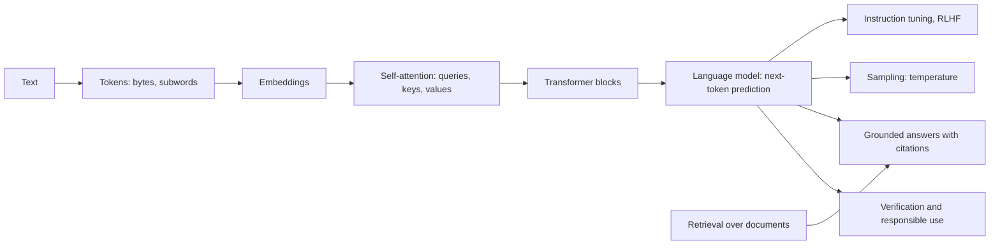
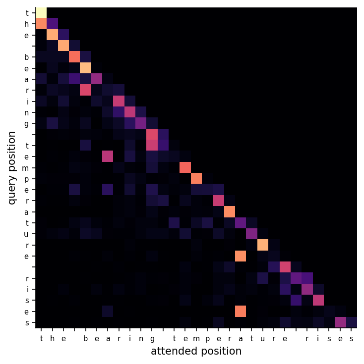
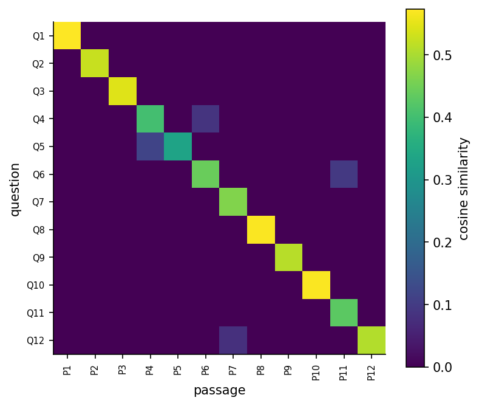

<div align="center">

# Week 13: Attention, Transformers and Generative AI

**Artificial Intelligence Applications in Engineering (MUH-920 Mühendislikte Yapay Zeka Uygulamaları)**  
Prof. Dr. Utku Kose, Süleyman Demirel University

[](https://colab.research.google.com/github/utkukose/ai-applications-in-engineering-NB-lecture/blob/main/weeks/week-13/NB13_transformers_llms_genai.ipynb) [](https://utkukose.github.io/ai-applications-in-engineering-NB-lecture/weeks/week-13/lab.html) [](https://utkukose.github.io/ai-applications-in-engineering-NB-lecture/weeks/week-13/lecture.html) [](Week13_Lecture_Notes.pdf)

</div>

## Overview

Engineering knowledge lives in text: standards, specifications, maintenance logs, test reports and code. Large language models process such text with the transformer architecture, whose self-attention lets every token weigh every other token [6]. Pretrained on vast corpora and tuned to follow instructions, they draft, summarise, translate and write code [9, 13, 15], but they also produce fluent statements that are false [17]. This week builds tokenisation, attention and a tiny transformer from scratch, connects a language task to retrieval so that answers rest on cited documents [18], surveys generative models for images and designs [21, 22], and sets out rules for responsible use in engineering work.

**Estimated study time:** 10 to 12 hours.

> **Final project.** The final project is due at the end of Week 14. The [project page](https://github.com/utkukose/ai-applications-in-engineering-NB-lecture/blob/main/exams/final/README.md) lists the deliverables and the evaluation criteria.

## Learning outcomes

By the end of the week, students are expected to explain tokenisation, embeddings and scaled dot-product attention, to compute attention weights for a small example, to describe how decoder-only language models are pretrained and tuned, to explain the effect of sampling temperature, to build and evaluate a retrieval step that grounds answers in documents, to name the main families of generative models, and to state the verification and confidentiality duties that apply when engineers use these tools.

## Python in this week

The lecture ends with Python step 13: Text, vectors and attention. It covers strings and their methods, counting words with Counter, regular expressions for quantities with units, JSON files, bag-of-words vectors with cosine similarity for retrieval, and softmax attention with a causal mask, applied to maintenance logs, specifications and word embeddings [6, 27]. The hands-on part of the notebook opens with the same step as runnable cells and short exercises with immediate feedback, and its later sections mark further constructs as Python moves.

## Study path

| Step | Activity | Suggested time |
|---|---|---|
| 1 | Read the lecture with its animations on the [lecture page](https://utkukose.github.io/ai-applications-in-engineering-NB-lecture/weeks/week-13/lecture.html), or read the [PDF version](Week13_Lecture_Notes.pdf) | 2 hours |
| 2 | Explore the [interactive lab](https://utkukose.github.io/ai-applications-in-engineering-NB-lecture/weeks/week-13/lab.html) | 1 hour |
| 3 | Study the Python step at the end of the lecture, then run the same step at the start of the hands-on part of the [Colab notebook](https://colab.research.google.com/github/utkukose/ai-applications-in-engineering-NB-lecture/blob/main/weeks/week-13/NB13_transformers_llms_genai.ipynb) | 1 hour |
| 4 | Work through the rest of the notebook, including its Python moves and exercises | 3 hours |
| 5 | Solve the discipline challenge of your department | 1 hour |
| 6 | Take the self-assessment in the lab (tab: Check yourself) | 20 minutes |
| 7 | Write the reflection, export the learning log and complete the weekly task | 1 hour |

## Week at a glance



## Lecture

### Text as engineering data

A large share of engineering knowledge is written: standards and codes, design reports, maintenance and incident logs, requirements, patents and source code. Natural language processing turns such text into data. Classic tasks include search and retrieval, classification of reports, extraction of quantities and entities, summarisation and translation. Information retrieval developed many of the tools, such as term weighting and vector space models, long before neural networks [1]. Large language models add the ability to generate text and code, which changes how engineers draft, search and program, and raises new questions about accuracy and responsibility.

### From words to vectors

A model first splits text into tokens. Whole words give huge vocabularies and fail on new words; single characters make sequences long. Byte-pair encoding starts from characters and repeatedly merges the most frequent adjacent pair into a new symbol, so that common words become single tokens while rare words split into meaningful pieces [2]. Each token is then mapped to a vector, its embedding. Word2vec showed that embeddings learned from co-occurrence capture semantic relations, so that words used in similar contexts receive similar vectors [3]. Sentence embeddings extend the idea to whole passages and support semantic search [4].

### Attention and the transformer

Attention was introduced to let a translation model look at the relevant words of the source sentence while producing each output word [5]. The transformer made attention the central operation [6]. Every token produces a query, a key and a value vector through learned linear maps. The attention weights of a token are the softmax of the dot products of its query with all keys, divided by the square root of the key dimension; its output is the weighted sum of the values. Several attention heads run in parallel and learn different relations, positional encodings inject word order, and residual connections and layer normalisation, as in the ResNets of Week 11, keep deep stacks trainable.

Two families dominate. Encoder models such as BERT see the whole text at once and are pretrained to fill in masked words, which suits classification and extraction [7]. Decoder models such as GPT are pretrained to predict the next token from the previous ones, with a causal mask that hides the future, and generate text one token at a time [8, 9]. Transformers now process images, sequences of measurements and molecules as well [10, 11].

> **Animation: Where does each token look?.** Select a token of the sentence to see its attention weights over the others. The embeddings here are small hand-made vectors, chosen for illustration rather than learned; the temperature scales the dot products before the softmax. Run it in the [web version of the lecture](https://utkukose.github.io/ai-applications-in-engineering-NB-lecture/weeks/week-13/lecture.html#anim-attention).



*Figure 13.1. Attention weights of one head of the tiny character-level transformer trained in the notebook. The causal mask leaves the upper triangle empty: No position may look at later characters.*

<details>
<summary><b>Check your understanding.</b> In scaled dot-product attention, why are the dot products divided by the square root of the key dimension?</summary>

A. To make the weights sum to one  
B. To keep the dot products from growing with the dimension, which would push the softmax into saturation  
C. To hide future tokens  
D. To reduce the number of parameters

**Answer: B.** Large dot products make the softmax nearly one-hot and its gradients tiny; the scaling keeps them in a useful range [6].

</details>

### Large language models

A language model assigns probabilities to the next token. Trained on hundreds of billions of tokens, decoder transformers develop broad abilities, and performance improves predictably with model size, data and compute, as empirical scaling laws describe [12]. GPT-3 showed that a large model can perform new tasks from a few examples in the prompt, without changing its weights [9]. Instruction tuning and reinforcement learning from human feedback then align models with what users ask for [13]. Prompts that ask for intermediate reasoning steps improve performance on multi-step problems [14], and models trained on code write and explain programs [15]. Such broadly trained models, adapted to many tasks, are called foundation models [16].

Generation samples tokens from the predicted distribution. A temperature below one sharpens the distribution towards the most likely tokens; a temperature above one flattens it and increases variety and the risk of nonsense. The model has no built-in notion of truth: It produces what is probable given its training, and fluent but unsupported statements, called hallucinations, are a known failure mode [17]. For an engineer, a model's answer about a load factor or a material property is a hypothesis to check, never a source.

<details>
<summary><b>Check your understanding.</b> A model&#x27;s next-token logits are 2.0, 1.0 and 0.0. What happens to the probability of the first token when the temperature is lowered from 1.0 to 0.5?</summary>

A. It decreases  
B. It increases, because dividing the logits by a smaller temperature enlarges their differences  
C. It stays the same  
D. It becomes exactly 0.5

**Answer: B.** Dividing by 0.5 doubles the gaps between logits, so the softmax concentrates more mass on the largest one.

</details>

### Retrieval-augmented generation

Retrieval-augmented generation combines a retriever with a generator [18]. The retriever searches a document collection, for example a company's standards or a project's reports, for passages relevant to the question. The generator then answers using those passages and can cite them. Grounding reduces hallucination, keeps answers current without retraining, and lets a reader verify each claim against its source. Retrieval can use sparse term weighting such as TF-IDF [1] or dense sentence embeddings [4]. Its quality can be measured like any classifier: For a set of questions with known relevant passages, the share of questions whose relevant passage appears among the top results is the hit rate.



*Figure 13.2. Cosine similarities between test questions and the passages of the notebook's small engineering knowledge base, computed with TF-IDF vectors. Bright cells on the diagonal mean the right passage is found first.*

<details>
<summary><b>Check your understanding.</b> What is the main engineering benefit of retrieval-augmented generation over asking a model directly?</summary>

A. It removes the need for any verification  
B. Answers are grounded in cited documents that can be checked and updated  
C. It makes the model smaller  
D. It guarantees correct answers

**Answer: B.** Retrieval ties answers to sources; checking them remains necessary, but it becomes possible [18].

</details>

### Generative models beyond text

Variational autoencoders learn a latent space from which new samples can be decoded [19]. Generative adversarial networks train a generator against a discriminator that tries to tell real from generated data [20]. Diffusion models learn to reverse a gradual noising process and now produce high-quality images; latent diffusion runs the process in a compressed space to make it efficient [21, 22]. In engineering, generative models propose designs, create synthetic training images for rare defects, and suggest candidate materials; deep learning has proposed hundreds of thousands of stable crystal structures [23], and language models have planned and run chemistry experiments with robotic equipment [24]. Every generated design still has to satisfy the physics, the codes and the tests.

### Responsible use in engineering work

Engineers remain accountable for their work, whatever tools they use. Four rules follow. Verify every factual or numerical claim against a primary source, a calculation or a test. Do not paste confidential designs, personal data or unpublished results into external services unless the organisation's policy allows it. Cite the sources that support the work, not the tool. And treat model inputs as an attack surface: Instructions hidden in documents can manipulate a model that reads them, and small perturbations can change the decisions of learned models [25]. The energy cost of training and running large models is also part of the engineering trade-off [26]. The course policy on the use of these tools is stated in the syllabus.

<!-- python-step -->

### Python step 13: Text, vectors and attention

#### Strings

Text is a sequence of characters. Strings support indexing and slicing like lists, and their methods return transformed copies: `strip` removes surrounding spaces, `lower` converts to lower case, `split` breaks a string into a list of words, and `join` glues a list of strings together. `in` tests whether a piece of text occurs, and `count` counts its occurrences. Strings cannot be changed in place, so every method returns a new string.

```python
line = "  2026-03-14 PUMP-3: High vibration at bearing DE; replaced seal.  "
clean = line.strip()
print(clean[:10], "|", clean[11:17])
print(clean.lower().split())
print("vibration" in clean.lower(), clean.count("e"))
print(" / ".join(["seal", "bearing", "impeller"]))
print(len("İSTANBUL"), len("İSTANBUL".lower()))
```

*Output*

```text
2026-03-14 | PUMP-3
['2026-03-14', 'pump-3:', 'high', 'vibration', 'at', 'bearing', 'de;', 'replaced', 'seal.']
True 4
seal / bearing / impeller
8 9
```

The last line shows a detail that matters for Turkish text. Converting the capital dotted İ to lower case with the default Unicode rules produces an i followed by a combining dot, so the lower-case string is one character longer than the original. Language-aware processing, for example search in Turkish documents, has to treat such letters explicitly.

#### Counting words

`collections.Counter` counts the elements of any sequence and reports the most common ones. The nested comprehension below turns several log entries into one list of words: The first `for` runs over the entries and the second over the words of each entry. `re.findall(r"[a-z]+", ...)` keeps runs of letters and drops digits and punctuation. A dictionary comprehension builds a dictionary in the same compact way, and `sorted` with a `key` orders items by a computed value.

```python
import re
from collections import Counter

logs = ["High vibration at pump 3, bearing replaced.",
        "Pump 3 seal leaking; seal replaced.",
        "Low flow at pump 1, strainer cleaned.",
        "Vibration normal after bearing replacement at pump 3."]
words = [w for entry in logs for w in re.findall(r"[a-z]+", entry.lower())]
counts = Counter(words)
print(counts.most_common(4))
repeated = {w: n for w, n in counts.items() if n > 1}
print(sorted(repeated, key=repeated.get, reverse=True))
```

*Output*

```text
[('pump', 4), ('at', 3), ('vibration', 2), ('bearing', 2)]
['pump', 'at', 'vibration', 'bearing', 'replaced', 'seal']
```

Word counts of this kind are the starting point of the TF-IDF retrieval of this week, which weights each word by how rare it is across all documents.

#### Patterns with regular expressions

Regular expressions describe patterns of text. `\d+` matches one or more digits, `(?:\.\d+)?` an optional decimal part, `\s*` optional spaces and `(MPa|kN|mm)` one of three units. Parentheses without `?:` capture the parts that `re.findall` returns, here pairs of value and unit taken from a specification sentence.

```python
spec = "Use C30/37 concrete with 28-day strength 38 MPa, cover 40 mm and a column load of 1250.5 kN."
pairs = re.findall(r"(\d+(?:\.\d+)?)\s*(MPa|kN|mm)", spec)
print(pairs)
print({unit: float(value) for value, unit in pairs})
```

*Output*

```text
[('38', 'MPa'), ('40', 'mm'), ('1250.5', 'kN')]
{'MPa': 38.0, 'mm': 40.0, 'kN': 1250.5}
```

#### Saving and loading structured text

Files are opened with `open` inside a `with` block, which closes the file automatically. JSON stores lists and dictionaries as text that other programs and languages can read, a convenient format for a small knowledge base of passages such as the one used for retrieval in this week.

```python
import json

passages = [{"id": "P1", "text": "Strength falls as the water-cement ratio rises."},
            {"id": "P2", "text": "Clays plot above the A-line of the plasticity chart."}]
with open("kb_demo.json", "w", encoding="utf-8") as f:
    json.dump(passages, f, indent=1)
with open("kb_demo.json", encoding="utf-8") as f:
    loaded = json.load(f)
print(len(loaded), loaded[1]["id"], loaded[1]["text"])
```

*Output*

```text
2 P2 Clays plot above the A-line of the plasticity chart.
```

#### From counts to vectors: retrieval

Retrieval compares a question with stored passages. A bag-of-words vector counts how often each word of a fixed vocabulary occurs in a text. The cosine similarity of two vectors, their dot product divided by the product of their lengths, is 1 for texts with the same word proportions and 0 for texts without a common word. Stacking the vectors of all passages into a matrix turns the comparison with a question into one matrix-vector product. This is the retrieval step of retrieval-augmented generation in its simplest form; TF-IDF weighting refines it by giving rare words more influence.

```python
import numpy as np

vocab = sorted(set(words))
col = {w: i for i, w in enumerate(vocab)}

def bow(text):
    """Bag-of-words count vector of a text over the vocabulary."""
    v = np.zeros(len(vocab))
    for w in re.findall(r"[a-z]+", text.lower()):
        if w in col:
            v[col[w]] += 1
    return v

D = np.array([bow(entry) for entry in logs])          # one row per log entry
q = bow("bearing vibration")
sim = D @ q / (np.linalg.norm(D, axis=1) * np.linalg.norm(q))
print(D.shape, sim.round(2))
print("best match:", logs[int(np.argmax(sim))])
```

*Output*

```text
(4, 15) [0.58 0.   0.   0.53]
best match: High vibration at pump 3, bearing replaced.
```

#### Softmax and attention

Attention lets every token of a sequence gather information from the other tokens [6]. Each token has a query, a key and a value vector. The scores are the dot products of queries and keys, divided by the square root of their length. A softmax along each row turns the scores into weights that are positive and sum to one, and each output is the weighted mean of the values. In a transformer, learned matrices produce queries, keys and values from the token embeddings; the toy example below uses three hand-made embeddings directly, with "pump" and "impeller" deliberately similar.

```python
def softmax(s, axis=-1):
    """Softmax along an axis; subtracting the maximum avoids overflow."""
    e = np.exp(s - s.max(axis=axis, keepdims=True))
    return e / e.sum(axis=axis, keepdims=True)

emb = np.array([[1.0, 0.0, 1.0, 0.0],      # "pump"
                [0.0, 1.0, 0.0, 1.0],      # "seal"
                [1.0, 0.0, 0.9, 0.1]])     # "impeller"
Q, K, V = emb, emb, emb
scores = Q @ K.T / np.sqrt(emb.shape[1])
weights = softmax(scores, axis=1)
print(weights.round(2))
print((weights @ V).round(2))
```

*Output*

```text
[[0.43 0.16 0.41]
 [0.21 0.57 0.22]
 [0.42 0.17 0.41]]
[[0.84 0.16 0.8  0.2 ]
 [0.43 0.57 0.41 0.59]
 [0.83 0.17 0.79 0.21]]
```

A model that generates text one token at a time must not look at future tokens. A causal mask sets the scores above the diagonal to minus infinity before the softmax, so that every token attends only to itself and to earlier tokens, as in the decoders of generative language models [9].

```python
future = np.triu(np.ones((3, 3), dtype=bool), k=1)     # True above the diagonal
print(softmax(np.where(future, -np.inf, scores), axis=1).round(2))
```

*Output*

```text
[[1.   0.   0.  ]
 [0.27 0.73 0.  ]
 [0.42 0.17 0.41]]
```

<details>
<summary><b>Check your understanding.</b> What does &quot;pump seal leak&quot;.split() return?</summary>

A. ["pump", "seal", "leak"]  
B. "pumpsealleak"  
C. ["p", "u", "m", "p"]  
D. 3

**Answer: A.** Without an argument, split breaks the string at runs of white space and returns the words as a list.

</details>

<!-- /python-step -->

## Discipline challenges

Every department writes and reads text. Choose a row and adapt the notebook's retrieval section, or its tiny language model, to the documents named there.

| Department | Challenge |
|---|---|
| Computer Engineering | Retrieval over the documentation of a software library; evaluate code suggestions against unit tests [15]. |
| Civil Engineering | Retrieval over summaries of design code clauses written by the student; answer questions with clause citations. |
| Mechanical Engineering and Industrial Engineering | Classify maintenance log entries by failure mode with TF-IDF and a linear classifier. |
| Electrical and Electronics Engineering | Extract ratings and quantities from equipment datasheets and check them against the source. |
| Chemistry and Chemical Engineering | Summarise safety data sheet sections and verify every hazard statement against the original [24]. |
| Environmental Engineering | Search environmental impact report passages for mitigation measures by topic. |
| Food Engineering and Biology | Retrieval over open protocols for laboratory methods with a check of every quantity. |
| Geological Engineering, Geophysical Engineering, Mining and Earth Sciences Engineering | Index field notes or borehole log descriptions and query lithologies. |
| Physics, Mathematics and Statistics | Implement multi-head attention in NumPy and verify it against PyTorch's `nn.MultiheadAttention`. |
| Textile Engineering and Automotive Engineering | Cluster customer complaint texts by topic and relate the clusters to process or design causes. |

## Interactive lab

Part A learns byte-pair merges from engineering sentences and shows how any typed text splits into tokens [2]. Part B turns next-token scores into probabilities with an adjustable temperature and top-k cut, and samples continuations. Part C retrieves passages from a small engineering knowledge base with TF-IDF and assembles an answer that cites them, as retrieval-augmented generation does [1, 18].

[Open the interactive lab](https://utkukose.github.io/ai-applications-in-engineering-NB-lecture/weeks/week-13/lab.html)


## Colab notebook

The notebook learns byte-pair merges from a short engineering corpus, computes scaled dot-product attention with a causal mask in NumPy, and trains a tiny character-level transformer in PyTorch that generates text at different temperatures [6]. It then builds a TF-IDF retriever over a small knowledge base of engineering passages, measures its hit rate on test questions, and assembles grounded answers with citations [1, 18]. An optional cell connects an open instruction-tuned model when the libraries and a network connection are available.

[](https://colab.research.google.com/github/utkukose/ai-applications-in-engineering-NB-lecture/blob/main/weeks/week-13/NB13_transformers_llms_genai.ipynb)

Screenshots of the executed notebook:


## Self-assessment and reflection

The lab contains a 6-question self-assessment with instant feedback and a confidence rating for each answer. A confident but wrong answer marks the first topic to revisit. The reflection prompts below are also available in the lab, where answers are saved in the browser and can be exported as a learning log.

1. Which documents of your field would you place in a retrieval system, and what would go wrong if an answer were taken without checking the passage?
2. The tiny transformer of the notebook produced text that looks like English. What does this show, and what does it not show, about understanding?
3. Write down your personal rules for using language models in coursework and engineering practice.

## Weekly task and submission

Build a small retrieval system for documents of your department that you are allowed to share, such as public standards summaries, course notes or open reports. Create at least ten passages and ten test questions with known answers, measure the hit rate at 1 and at 3 with TF-IDF, and discuss failure cases. If you also use a language model, show one grounded answer with citations and one answer that needed correction. Write about 500 words and cite at least three works from this week's references [6, 17, 18].

The weekly task is optional and supports self-learning and a personal portfolio. During an active semester, it can be sent together with the exported learning log to utkukose@sdu.edu.tr or utkukose@gmail.com. Optional work carries no separate weight, but the instructor may take it into account as a discretionary adjustment of the midterm component of the grade.

## Research and report assignment (optional)

**Language models in engineering practice.** Review how large language models are evaluated or used in one engineering activity, such as code generation, requirements engineering, standards compliance checking, maintenance log analysis or laboratory automation. Discuss accuracy, verification, confidentiality and accountability, with attention to documented failure modes [15, 16, 17, 24].

This research assignment is optional and supports self-learning. When the related weeks are followed within the course during an active semester, the report can be sent to utkukose@sdu.edu.tr or utkukose@gmail.com. It carries no separate weight, but the instructor may take it into account as a discretionary adjustment of the midterm component of the grade. Unless the assignment states otherwise, a report has 1500 to 2500 words, follows the structure of an academic paper, cites at least six scholarly or official sources in square brackets and uses the template in `exams/REPORT_TEMPLATE.md`.

## References

[1] Manning, C. D., Raghavan, P., & Schütze, H. (2008). *Introduction to Information Retrieval*. Cambridge University Press.

[2] Sennrich, R., Haddow, B., & Birch, A. (2016). Neural machine translation of rare words with subword units. In *Proceedings of the 54th Annual Meeting of the Association for Computational Linguistics* (pp. 1715-1725). <https://doi.org/10.18653/v1/P16-1162>

[3] Mikolov, T., Chen, K., Corrado, G., & Dean, J. (2013). Efficient estimation of word representations in vector space. arXiv preprint arXiv:1301.3781. <https://arxiv.org/abs/1301.3781>

[4] Reimers, N., & Gurevych, I. (2019). Sentence-BERT: Sentence embeddings using Siamese BERT-networks. In *Proceedings of EMNLP-IJCNLP 2019* (pp. 3982-3992). <https://doi.org/10.18653/v1/D19-1410>

[5] Bahdanau, D., Cho, K., & Bengio, Y. (2015). Neural machine translation by jointly learning to align and translate. In *3rd International Conference on Learning Representations (ICLR 2015)*. <https://arxiv.org/abs/1409.0473>

[6] Vaswani, A., Shazeer, N., Parmar, N., Uszkoreit, J., Jones, L., Gomez, A. N., Kaiser, Ł., & Polosukhin, I. (2017). Attention is all you need. In *Advances in Neural Information Processing Systems 30* (pp. 5998-6008). <https://arxiv.org/abs/1706.03762>

[7] Devlin, J., Chang, M.-W., Lee, K., & Toutanova, K. (2019). BERT: Pre-training of deep bidirectional transformers for language understanding. In *Proceedings of NAACL-HLT 2019* (pp. 4171-4186). <https://doi.org/10.18653/v1/N19-1423>

[8] Radford, A., Wu, J., Child, R., Luan, D., Amodei, D., & Sutskever, I. (2019). *Language models are unsupervised multitask learners*. OpenAI.

[9] Brown, T. B., Mann, B., Ryder, N., et al. (2020). Language models are few-shot learners. In *Advances in Neural Information Processing Systems 33* (pp. 1877-1901). <https://arxiv.org/abs/2005.14165>

[10] Dosovitskiy, A., Beyer, L., Kolesnikov, A., et al. (2021). An image is worth 16x16 words: Transformers for image recognition at scale. In *9th International Conference on Learning Representations (ICLR 2021)*. <https://arxiv.org/abs/2010.11929>

[11] Mousavi, S. M., Ellsworth, W. L., Zhu, W., Chuang, L. Y., & Beroza, G. C. (2020). Earthquake transformer: An attentive deep-learning model for simultaneous earthquake detection and phase picking. *Nature Communications*, *11*, 3952. <https://doi.org/10.1038/s41467-020-17591-w>

[12] Kaplan, J., McCandlish, S., Henighan, T., et al. (2020). Scaling laws for neural language models. arXiv preprint arXiv:2001.08361. <https://arxiv.org/abs/2001.08361>

[13] Ouyang, L., Wu, J., Jiang, X., et al. (2022). Training language models to follow instructions with human feedback. In *Advances in Neural Information Processing Systems 35* (pp. 27730-27744). <https://arxiv.org/abs/2203.02155>

[14] Wei, J., Wang, X., Schuurmans, D., et al. (2022). Chain-of-thought prompting elicits reasoning in large language models. In *Advances in Neural Information Processing Systems 35* (pp. 24824-24837). <https://arxiv.org/abs/2201.11903>

[15] Chen, M., Tworek, J., Jun, H., et al. (2021). Evaluating large language models trained on code. arXiv preprint arXiv:2107.03374. <https://arxiv.org/abs/2107.03374>

[16] Bommasani, R., Hudson, D. A., Adeli, E., et al. (2021). On the opportunities and risks of foundation models. arXiv preprint arXiv:2108.07258. <https://arxiv.org/abs/2108.07258>

[17] Ji, Z., Lee, N., Frieske, R., et al. (2023). Survey of hallucination in natural language generation. *ACM Computing Surveys*, *55*(12), 248. <https://doi.org/10.1145/3571730>

[18] Lewis, P., Perez, E., Piktus, A., et al. (2020). Retrieval-augmented generation for knowledge-intensive NLP tasks. In *Advances in Neural Information Processing Systems 33* (pp. 9459-9474). <https://arxiv.org/abs/2005.11401>

[19] Kingma, D. P., & Welling, M. (2014). Auto-encoding variational Bayes. In *2nd International Conference on Learning Representations (ICLR 2014)*. <https://arxiv.org/abs/1312.6114>

[20] Goodfellow, I., Pouget-Abadie, J., Mirza, M., et al. (2014). Generative adversarial nets. In *Advances in Neural Information Processing Systems 27* (pp. 2672-2680). <https://arxiv.org/abs/1406.2661>

[21] Ho, J., Jain, A., & Abbeel, P. (2020). Denoising diffusion probabilistic models. In *Advances in Neural Information Processing Systems 33* (pp. 6840-6851). <https://arxiv.org/abs/2006.11239>

[22] Rombach, R., Blattmann, A., Lorenz, D., Esser, P., & Ommer, B. (2022). High-resolution image synthesis with latent diffusion models. In *2022 IEEE/CVF Conference on Computer Vision and Pattern Recognition (CVPR)* (pp. 10684-10695). <https://doi.org/10.1109/CVPR52688.2022.01042>

[23] Merchant, A., Batzner, S., Schoenholz, S. S., et al. (2023). Scaling deep learning for materials discovery. *Nature*, *624*(7990), 80-85. <https://doi.org/10.1038/s41586-023-06735-9>

[24] Boiko, D. A., MacKnight, R., Kline, B., & Gomes, G. (2023). Autonomous chemical research with large language models. *Nature*, *624*(7992), 570-578. <https://doi.org/10.1038/s41586-023-06792-0>

[25] Kose, U. (2019). Techniques for adversarial examples threatening the safety of artificial intelligence based systems. In *I. International Science and Innovation Congress (INSI Congress 2019)*. Pamukkale, Denizli, Türkiye. <https://arxiv.org/abs/1910.06907>

[26] Strubell, E., Ganesh, A., & McCallum, A. (2019). Energy and policy considerations for deep learning in NLP. In *Proceedings of the 57th Annual Meeting of the Association for Computational Linguistics* (pp. 3645-3650). <https://doi.org/10.18653/v1/P19-1355>

[27] Python Software Foundation (2026). *The Python Tutorial (Python 3 documentation)*. <https://docs.python.org/3/tutorial/>

---

<sub>Artificial Intelligence Applications in Engineering. Prof. Dr. Utku Kose, Süleyman Demirel University. ORCID [0000-0002-9652-6415](https://orcid.org/0000-0002-9652-6415). Content licensed under CC BY 4.0, code under MIT. This course is updated in line with current developments in the field. Last update: September 2026.</sub>
