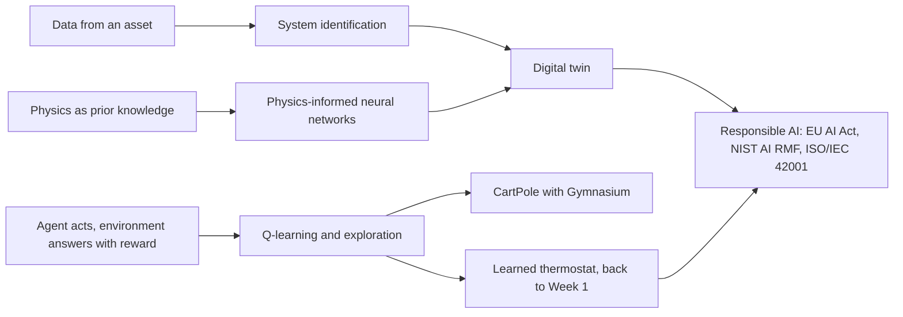
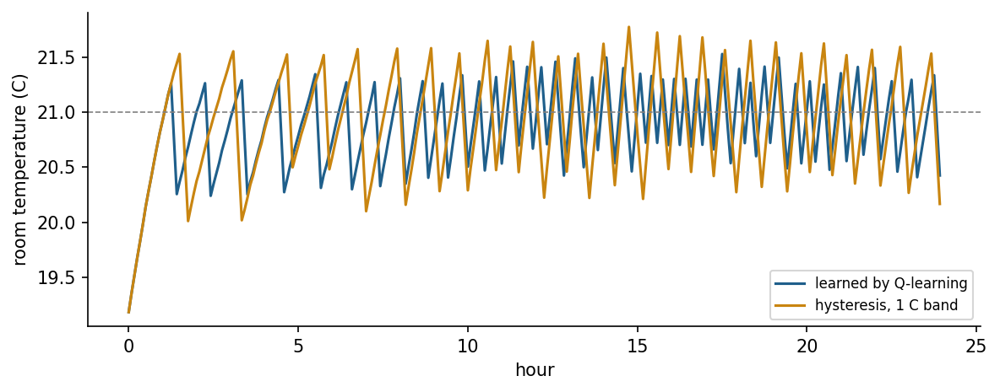

<div align="center">

# Week 14: Learning to Act, Respecting Physics and Engineering Responsibly

**Artificial Intelligence Applications in Engineering (MUH-920 Mühendislikte Yapay Zeka Uygulamaları)**  
Prof. Dr. Utku Kose, Süleyman Demirel University

[](https://colab.research.google.com/github/utkukose/ai-applications-in-engineering-NB-lecture/blob/main/weeks/week-14/NB14_rl_pinn_digital_twins.ipynb) [](https://utkukose.github.io/ai-applications-in-engineering-NB-lecture/weeks/week-14/lab.html) [](https://utkukose.github.io/ai-applications-in-engineering-NB-lecture/weeks/week-14/lecture.html) [](Week14_Lecture_Notes.pdf)

</div>

## Overview

The course began with a thermostat that followed fixed rules. It ends with agents that learn their own rules from reward, with models that obey physical laws while learning from data, and with the responsibilities that come with deploying such systems. Reinforcement learning learns a policy by trial and error [1, 2]; physics-informed neural networks add governing equations to the loss of a network [9, 10]; and digital twins keep a model synchronised with a physical asset [13, 14]. The week closes with safety, standards and regulation, including the European Union's Artificial Intelligence Act, the NIST AI Risk Management Framework and ISO/IEC 42001 [16, 17, 18], and with guidance for the final project.

**Estimated study time:** 10 to 12 hours.

> **Final project.** The final project is due at the end of this week. The weekly task of this week is a last check of reproducibility and of the report before submission, following the [project page](https://github.com/utkukose/ai-applications-in-engineering-NB-lecture/blob/main/exams/final/README.md).

## Learning outcomes

By the end of the week, students are expected to formulate a control task as a Markov decision process, to apply the Q-learning update and an epsilon-greedy policy, to explain why exploration on physical systems needs simulators and safeguards, to train a physics-informed network for an ordinary differential equation and compare it with a data-only network, to identify a simple model from data as the core of a digital twin, and to place an engineering AI system within the risk categories of the EU AI Act and the functions of the NIST framework.

## Python in this week

The lecture ends with Python step 14: Environments, learning and organised code. It covers functions with type hints, parameters in dataclasses, an environment class with the interface of Gymnasium, tabular Q-learning, a physics residual with automatic differentiation, tests with assert, modules and records of runs, applied to the heating task that closes the course [1, 5, 21]. The hands-on part of the notebook opens with the same step as runnable cells and short exercises with immediate feedback, and its later sections mark further constructs as Python moves.

## Study path

| Step | Activity | Suggested time |
|---|---|---|
| 1 | Read the lecture with its animations on the [lecture page](https://utkukose.github.io/ai-applications-in-engineering-NB-lecture/weeks/week-14/lecture.html), or read the [PDF version](Week14_Lecture_Notes.pdf) | 2 hours |
| 2 | Explore the [interactive lab](https://utkukose.github.io/ai-applications-in-engineering-NB-lecture/weeks/week-14/lab.html) | 1 hour |
| 3 | Study the Python step at the end of the lecture, then run the same step at the start of the hands-on part of the [Colab notebook](https://colab.research.google.com/github/utkukose/ai-applications-in-engineering-NB-lecture/blob/main/weeks/week-14/NB14_rl_pinn_digital_twins.ipynb) | 1 hour |
| 4 | Work through the rest of the notebook, including its Python moves and exercises | 3 hours |
| 5 | Solve the discipline challenge of your department | 1 hour |
| 6 | Take the self-assessment in the lab (tab: Check yourself) | 20 minutes |
| 7 | Write the reflection, export the learning log and complete the weekly task | 1 hour |

## Week at a glance



## Lecture

### Learning to act

In Week 1, an engineer wrote the rule of the thermostat. Reinforcement learning lets an agent find the rule itself. At every step the agent observes a state, chooses an action and receives a reward and a new state; its goal is a policy that maximises the expected sum of discounted future rewards [1]. The formal model is a Markov decision process: The next state depends only on the current state and action. The discount factor gamma, between 0 and 1, sets how far the agent looks ahead. Unlike supervised learning, nobody tells the agent the correct action; it must explore to find out which actions pay off, and exploit what it has learned to collect reward.

The value of taking action a in state s and acting well afterwards is Q(s, a). Q-learning improves an estimate of Q after every step with Q(s, a) = Q(s, a) + alpha (r + gamma max Q(s', a') - Q(s, a)), where alpha is a learning rate and the maximum runs over the actions in the next state; Watkins and Dayan proved that it converges to the optimal values under suitable conditions [2]. An epsilon-greedy policy explores with a random action with probability epsilon and exploits the best known action otherwise. Tables work for small discrete problems; for large or continuous state spaces, a neural network approximates Q, as in the deep Q-network that learned to play Atari games from pixels [3].

> **Animation: Q-learning on a cliff walk.** The agent starts at the lower left and must reach the lower right without stepping into the cliff, which costs heavily. Each step costs a little. Watch the arrows of the greedy policy and the colours of the state values change as episodes accumulate. Raise epsilon to explore more. Run it in the [web version of the lecture](https://utkukose.github.io/ai-applications-in-engineering-NB-lecture/weeks/week-14/lecture.html#anim-qgrid).



*Figure 14.1. Room temperature under the hysteresis rule of Week 1 and under a policy learned by Q-learning on the same synthetic winter day. The learned policy discovers a switching band by itself.*

<details>
<summary><b>Check your understanding.</b> Q(s, a) = 2.0, the reward is -1, gamma = 0.9, the best Q-value in the next state is 3.0 and alpha = 0.5. What is the updated Q(s, a)?</summary>

A. 1.85  
B. 2.0  
C. 1.7  
D. 3.7

**Answer: A.** The target is -1 + 0.9 x 3.0 = 1.7; the update gives 2.0 + 0.5 x (1.7 - 2.0) = 1.85.

</details>

### Reinforcement learning in engineering

Control problems were among the first testbeds of reinforcement learning: The cart-pole balancing task goes back to adaptive elements studied in the early 1980s [4], and Gymnasium now provides it with a standard interface for experiments [5]. Robotics has used reinforcement learning for manipulation and locomotion [6], and deep reinforcement learning has controlled the magnetic coils of a tokamak in a fusion experiment [7]. These successes share a feature: The agent learned mostly in simulation. Exploration on a real plant can damage equipment or endanger people, the reward may be satisfied in unintended ways, and a policy trained under one set of conditions may fail under others; Amodei and colleagues list safe exploration, reward hacking and distributional shift among the concrete problems of AI safety [8]. Simulators, constraints on actions, human oversight and gradual deployment are therefore part of any engineering use.

<details>
<summary><b>Check your understanding.</b> Why do most engineering applications of reinforcement learning train the agent in simulation first?</summary>

A. Simulations are always more accurate than reality  
B. Exploration on the real system can be unsafe or costly, and simulation allows many cheap trials  
C. Reinforcement learning cannot run on real hardware  
D. Rewards cannot be defined for real systems

**Answer: B.** Safe exploration is a central problem; simulators and digital twins provide a safe place to make mistakes [8].

</details>

### Physics-informed learning

Engineering rarely starts from zero knowledge. Conservation laws, constitutive equations and boundary conditions are known even when parameters or source terms are not. Physics-informed neural networks add the residual of the governing differential equation, evaluated at many collocation points, to the loss of a network whose input is space or time [9]. Automatic differentiation provides the derivatives of the network output exactly. The network then fits the data where they exist and obeys the physics everywhere else, which makes it far more reliable outside the measured range than a data-only network. The same framework solves inverse problems, estimating unknown coefficients of the equation from data. Karniadakis and colleagues review the broader field of physics-informed machine learning [10]; related methods discover governing equations from data by sparse regression [11, 12]. Physics-informed networks can be hard to train for stiff or multiscale problems, and classical numerical solvers remain the reference where they apply.

![A damped oscillator: a network trained only on a few early measurements fails outside them, while a physics-informed network that also satisfies the differential equation follows the exact solution [9].](figures/w14_fig2.png)

*Figure 14.2. A damped oscillator: a network trained only on a few early measurements fails outside them, while a physics-informed network that also satisfies the differential equation follows the exact solution [9].*

<details>
<summary><b>Check your understanding.</b> What does the physics term in the loss of a physics-informed network contain?</summary>

A. The squared error between predictions and labels only  
B. The residual of the governing equation, computed with automatic differentiation at collocation points  
C. The number of parameters of the network  
D. A random penalty

**Answer: B.** Minimising the residual forces the network to satisfy the equation where no data exist [9].

</details>

### Digital twins

Grieves and Vickers described a digital twin as a virtual representation of a physical product that is linked to it by data throughout its life, so that behaviour can be predicted and problems anticipated [13]. Tao and colleagues surveyed its industrial use in design, production and maintenance [14]. A twin combines a model of the asset, a data connection that keeps the model's state and parameters current, and services such as monitoring, forecasting, what-if analysis and controller testing. System identification, estimating model parameters from measured inputs and outputs, is its simplest learning component; the notebook identifies the thermal parameters of the room of Week 1 from noisy data and uses the resulting model to forecast and to test a controller. The methods of the whole course appear in twins: rules and fuzzy logic for decisions, optimisation for calibration, machine learning for components without physical models, anomaly detection for monitoring and reinforcement learning for control.

### Responsible engineering of AI systems

Engineering codes of ethics require practitioners to hold public safety paramount, and they apply to systems that include learned components. Earlier work on machine ethics and AI safety argued that safety must be designed in rather than added after deployment [15]. Regulation now makes parts of this explicit. The European Union's Artificial Intelligence Act, Regulation (EU) 2024/1689, follows a risk-based approach: A few practices are prohibited, such as social scoring and the inference of emotions in the workplace and in education except for medical or safety reasons; high-risk systems, which include safety components in the management of critical infrastructure such as water, gas, heating and electricity supply, and systems used in employment and education, must meet requirements on risk management, data governance, documentation, human oversight, accuracy and robustness; and systems such as chatbots and generators of synthetic content carry transparency obligations [16].

Frameworks turn principles into practice. The NIST AI Risk Management Framework organises activities into four functions: Govern establishes policies, roles and accountability; Map establishes the context and identifies risks; Measure analyses and tracks risks with appropriate metrics; and Manage prioritises and acts on them [17]. ISO/IEC 42001 specifies a management system for organisations that develop or use AI, in the style of other management system standards [18]. Türkiye's national strategy places trustworthy and responsible AI among its priorities [19]. The energy and resource costs of training and running models are part of the same responsibility [20].

<details>
<summary><b>Check your understanding.</b> Under the EU AI Act, which category most likely applies to an AI system that acts as a safety component in the management of a city&#x27;s water supply network?</summary>

A. Prohibited practice  
B. High-risk system  
C. No obligations at all  
D. Transparency obligation only

**Answer: B.** Safety components in the management and operation of critical infrastructure, including water supply, are listed as high-risk [16].

</details>

### The course in retrospect

The fourteen weeks form one toolbox. Search plans routes and sequences; rules encode standards; fuzzy logic turns words into control; evolutionary and swarm algorithms optimise designs; machine learning predicts, classifies and detects anomalies; deep learning perceives images and sequences; language models work with text and code; and reinforcement learning, physics-informed learning and digital twins bring learning into operation. The engineering skill lies in choosing the simplest tool that meets the requirement, validating it honestly, and knowing its limits. The final project, described in the exams folder of the repository, asks for exactly this on a problem of the student's own field.

<!-- python-step -->

### Python step 14: Environments, learning and organised code

#### Functions with clear contracts

Programs grow, and the code of a final project is read by others and by its author months later. Small functions with descriptive names, type hints and docstrings make that reading easy. Type hints such as `temp_C: float` state what a parameter should be and what the function returns. Python does not enforce them, but editors and readers rely on them. The room model of Week 1 becomes a function with default parameters.

```python
def room_step(temp_C: float, outside_C: float, heater: int,
              tau_min: float = 240.0, rate_C_per_min: float = 0.12, dt_min: float = 5.0) -> float:
    """Room temperature after one time step of the first-order model of Week 1."""
    return temp_C + (outside_C - temp_C) * dt_min / tau_min + rate_C_per_min * dt_min * heater

print(room_step(20.0, 0.0, 1))
```

*Output*

```text
20.183333333333334
```

#### Parameters in one place

A dataclass is a class that mainly stores values. The decorator `@dataclass` writes the `__init__` method automatically from the annotated fields, and `replace` creates a modified copy. Keeping all parameters of a model in one object avoids numbers scattered through the code and documents each variant of an experiment.

```python
from dataclasses import dataclass, replace

@dataclass
class RoomParams:
    tau_min: float = 240.0
    rate_C_per_min: float = 0.12
    dt_min: float = 5.0

base = RoomParams()
insulated = replace(base, tau_min=400.0)
print(base)
print(insulated.tau_min, base.tau_min)
```

*Output*

```text
RoomParams(tau_min=240.0, rate_C_per_min=0.12, dt_min=5.0)
400.0 240.0
```

#### A shared interface

Gymnasium environments share one interface: `reset` returns the first observation, and `step` returns the next observation, the reward, two flags for the end of an episode and a dictionary of extra information [5]. A simulation written with the same interface works with any agent that works with Gymnasium. The class below wraps the heating task of this week.

```python
class RoomEnv:
    """Heating task with the reset and step interface of Gymnasium environments."""

    def __init__(self, params: RoomParams, outside_C: float = -3.5, target_C: float = 21.0, horizon: int = 288):
        self.p, self.outside, self.target, self.horizon = params, outside_C, target_C, horizon

    def reset(self, temp_C: float = 18.0):
        self.temp, self.k = temp_C, 0
        return self.temp, {}

    def step(self, action: int):
        p = self.p
        self.temp = room_step(self.temp, self.outside, action, p.tau_min, p.rate_C_per_min, p.dt_min)
        self.k += 1
        reward = -abs(self.temp - self.target)
        return self.temp, reward, False, self.k >= self.horizon, {}

env = RoomEnv(base)
obs, info = env.reset()
total = 0.0
for _ in range(12):
    obs, reward, terminated, truncated, info = env.step(1 if obs < 21 else 0)
    total += reward
print(f"temperature {obs:.2f} °C, return {total:.2f}")
```

*Output*

```text
temperature 19.63 °C, return -25.00
```

#### Learning to act with tabular Q-learning

Q-learning estimates the value Q(s, a) of taking action a in state s and acting well afterwards [1]. After every step the estimate moves towards the observed reward plus the discounted value of the best action in the next state: Q(s, a) += lr (r + gamma max Q(s', .) - Q(s, a)). A table needs discrete states, so `np.digitize` maps the temperature to one of seven bands. The agent explores with a small probability epsilon and otherwise takes the action with the highest estimate. The environment class above serves unchanged.

```python
import numpy as np

bands = np.array([19.0, 20.0, 20.5, 21.0, 21.5, 22.0])     # band edges in °C: seven states

def state_of(temp_C: float) -> int:
    return int(np.digitize(temp_C, bands))

Q = np.zeros((len(bands) + 1, 2))                          # one row per state, one column per action
agent_rng = np.random.default_rng(14)
lr, gamma, eps = 0.1, 0.95, 0.1
env_q = RoomEnv(base, horizon=96)                          # episodes of eight hours
for episode in range(300):
    obs, _ = env_q.reset(temp_C=float(agent_rng.uniform(17.0, 23.0)))
    s, done = state_of(obs), False
    while not done:
        a = int(agent_rng.integers(2)) if agent_rng.random() < eps else int(Q[s].argmax())
        obs, r, terminated, truncated, _ = env_q.step(a)
        s2 = state_of(obs)
        Q[s, a] += lr * (r + gamma * Q[s2].max() - Q[s, a])
        s, done = s2, terminated or truncated
print(np.round(Q, 1))
print("heater on in states:", np.flatnonzero(Q.argmax(axis=1) == 1))
```

*Output*

```text
[[-22.7 -20.1]
 [-13.6  -9.6]
 [-10.8  -5.5]
 [ -5.9  -4.6]
 [ -4.9  -5. ]
 [ -4.9  -5.1]
 [ -5.7  -6. ]]
heater on in states: [0 1 2 3]
```

The learned policy switches the heater on in the cold bands and off in the warm ones, a thermostat rule discovered from rewards alone. The deep reinforcement learning of this week replaces the table by a neural network when the state has many continuous variables.

#### Physics in the loss

Physics-informed learning adds the residual of a governing equation to the loss of a model. The room obeys dT/dt = (T_out - T) / tau + r u. For a candidate temperature curve T(t), automatic differentiation provides dT/dt at many time points, and the mean squared residual measures how strongly the curve violates the physics. Summing T before differentiating works because every value of T depends only on its own time point. The exact solution of the unheated room gives a residual of practically zero, and a straight line does not; a physics-informed network minimises such a residual together with the error on measured data.

```python
import torch

t = torch.linspace(0.0, 240.0, 25, requires_grad=True)     # minutes
T_out, T0, tau = -3.5, 18.0, 240.0

def physics_loss(T, u=0.0, rate=0.12):
    """Mean squared residual of dT/dt = (T_out - T) / tau + rate u at the points t."""
    dTdt, = torch.autograd.grad(T.sum(), t, create_graph=True)
    return ((dTdt - (T_out - T) / tau - rate * u) ** 2).mean()

exact = T_out + (T0 - T_out) * torch.exp(-t / tau)
line = T0 - 0.05 * t
print(f"exact solution: {physics_loss(exact).item():.1e}, straight line: {physics_loss(line).item():.1e}")
```

*Output*

```text
exact solution: 0.0e+00, straight line: 4.4e-04
```

#### Tests

A test is a small piece of code that checks an expected property. The statement `assert condition` does nothing when the condition is true and raises an `AssertionError` otherwise. Physical expectations make good tests: With no temperature difference and the heater off, the room must not change, and heating must raise the temperature. Running such tests after every change catches mistakes early.

```python
def test_room_step():
    assert abs(room_step(15.0, 15.0, 0) - 15.0) < 1e-12        # no difference, no heating
    assert room_step(15.0, 15.0, 1) > 15.0                     # heating raises the temperature
    assert abs(room_step(20.0, 0.0, 0) - (20.0 - 20.0 * 5 / 240)) < 1e-12
    print("all tests passed")

test_room_step()
```

*Output*

```text
all tests passed
```

#### Modules and records of runs

Functions used in several notebooks belong in a module, a `.py` file that `import` loads. In a notebook, the first line `%%writefile` saves the rest of a cell as a file. Results should be stored together with the information needed to reproduce them: The versions of Python and of the main libraries, the parameters and the random seeds. `json` writes such a record in a readable form.

```python
%%writefile roomtools.py
"""Helpers for the heating examples of the course."""

def room_step(temp_C, outside_C, heater, tau_min=240.0, rate_C_per_min=0.12, dt_min=5.0):
    """Room temperature after one time step of the first-order model."""
    return temp_C + (outside_C - temp_C) * dt_min / tau_min + rate_C_per_min * dt_min * heater
```

*Output*

```text
Writing roomtools.py
```

```python
import json
import sys
import numpy as np
import roomtools

temps = [18.0]
for _ in range(288):
    temps.append(roomtools.room_step(temps[-1], -3.5, 1 if temps[-1] < 21 else 0))
record = {"python": sys.version.split()[0], "numpy": np.__version__,
          "params": vars(base), "final_temp_C": round(temps[-1], 3), "steps": len(temps) - 1}
with open("run_record.json", "w", encoding="utf-8") as f:
    json.dump(record, f, indent=1)
print(json.dumps(record))
```

*Output*

```text
{"python": "3.12.3", "numpy": "2.4.4", "params": {"tau_min": 240.0, "rate_C_per_min": 0.12, "dt_min": 5.0}, "final_temp_C": 21.049, "steps": 288}
```

A final project can follow the same habits with a simple layout: A README that states the problem and how to run the code, a script or notebook that obtains the data, notebooks for exploration, a module for shared functions, and a results folder with figures and run records.

<details>
<summary><b>Check your understanding.</b> What happens when the line assert room_step(15.0, 15.0, 1) &lt; 15.0 runs?</summary>

A. It prints False and continues  
B. It raises an AssertionError, because heating raises the temperature  
C. Nothing, because assert statements are only comments  
D. It returns 15.0

**Answer: B.** The condition is false, so assert stops with an AssertionError, which is how a failing test announces itself.

</details>

<!-- /python-step -->

## Discipline challenges

The last week connects learning with action and responsibility. Choose a row and sketch the agent, the physics or the twin, together with its main risk.

| Department | Challenge |
|---|---|
| Electrical and Electronics Engineering | Reinforcement learning for battery charging or demand response in a simulated microgrid, with safety limits. |
| Mechanical Engineering and Automotive Engineering | A digital twin of a pump or a vehicle subsystem that predicts temperatures and detects drift. |
| Civil Engineering | A physics-informed network for beam deflection or one-dimensional consolidation compared with the analytical solution. |
| Chemical Engineering and Chemistry | A physics-informed estimate of a reaction rate constant from sparse concentration data. |
| Environmental Engineering | Q-learning for aeration control in a simplified wastewater model with an energy penalty. |
| Industrial Engineering | Reinforcement learning for dispatching in a small simulated job shop compared with the rules of Week 3. |
| Mining Engineering | A digital twin of mine ventilation that tests fan schedules before they are applied underground. |
| Geophysical Engineering and Earth Sciences Engineering | Physics-informed interpolation of groundwater heads that respects Darcy flow. |
| Food Engineering and Biology | A twin of a drying or fermentation process identified from batch data. |
| Physics, Mathematics and Statistics | Discover the equation of a damped oscillator from data by sparse regression and compare with the physics-informed network [11]. |
| Computer Engineering and Textile Engineering | An EU AI Act and NIST AI RMF assessment of an AI system your department might deploy, such as automated fabric grading or code review. |

## Interactive lab

Part A trains a Q-learning thermostat in the room model of Week 1 and compares it with the hysteresis rule; the learned policy is shown as a table of actions over temperature and heater state [2]. Part B places eight engineering AI systems into the risk categories of the EU AI Act [16], and Part C matches project activities to the four functions of the NIST AI Risk Management Framework [17].

[Open the interactive lab](https://utkukose.github.io/ai-applications-in-engineering-NB-lecture/weeks/week-14/lab.html)


## Colab notebook

The notebook teaches the heating agent of Week 1 by Q-learning and compares the learned policy with the hand-written hysteresis rule. It balances the cart-pole of Gymnasium with a linear policy found by the cross-entropy method [4, 5]. A physics-informed network then solves a damped oscillator and is compared with a data-only network [9], and a small digital twin identifies the room's thermal parameters from noisy data and forecasts the temperature [13]. The notebook ends with a responsible-AI checklist for the final project [16, 17].

[](https://colab.research.google.com/github/utkukose/ai-applications-in-engineering-NB-lecture/blob/main/weeks/week-14/NB14_rl_pinn_digital_twins.ipynb)

Screenshots of the executed notebook:


## Self-assessment and reflection

The lab contains a 6-question self-assessment with instant feedback and a confidence rating for each answer. A confident but wrong answer marks the first topic to revisit. The reflection prompts below are also available in the lab, where answers are saved in the browser and can be exported as a learning log.

1. Which system in your field could learn its control policy by reinforcement learning, and what would make exploration on the real system dangerous?
2. Which physical law would you add to a data-driven model in your field, and what would it prevent?
3. Looking back over the fourteen weeks, which technique would you now reach for first in your own field, and which Python skill are you most proud of?

## Weekly task and submission

Prepare the final project for submission. Run its notebook in a fresh runtime from the first cell to the last, record the versions of Python and the main libraries, the parameters and the random seeds in a run record, and check the report against the template and the evaluation criteria of the final project page. Then write about 500 words of reflection on the course: Which technique family suited the problem of the project, what the baselines showed, and which risks and responsibilities would remain if the system were deployed. Cite at least three works from this week's references and three from earlier weeks [9, 16, 17].

The weekly task is optional and supports self-learning and a personal portfolio. During an active semester, it can be sent together with the exported learning log to utkukose@sdu.edu.tr or utkukose@gmail.com. Optional work carries no separate weight, but the instructor may take it into account as a discretionary adjustment of the midterm component of the grade.

## Research and report assignment (optional)

**Trustworthy learning systems in engineering.** Review how reinforcement learning, physics-informed learning or digital twins are validated before deployment in one engineering domain, and relate the practices you find to the requirements for high-risk systems in the EU AI Act and to the functions of the NIST AI RMF [7, 10, 14, 16, 17].

This research assignment is optional and supports self-learning. When the related weeks are followed within the course during an active semester, the report can be sent to utkukose@sdu.edu.tr or utkukose@gmail.com. It carries no separate weight, but the instructor may take it into account as a discretionary adjustment of the midterm component of the grade. Unless the assignment states otherwise, a report has 1500 to 2500 words, follows the structure of an academic paper, cites at least six scholarly or official sources in square brackets and uses the template in `exams/REPORT_TEMPLATE.md`.

## References

[1] Sutton, R. S., & Barto, A. G. (2018). *Reinforcement Learning: An Introduction* (2nd ed.). MIT Press.

[2] Watkins, C. J. C. H., & Dayan, P. (1992). Q-learning. *Machine Learning*, *8*(3-4), 279-292. <https://doi.org/10.1007/BF00992698>

[3] Mnih, V., Kavukcuoglu, K., Silver, D., et al. (2015). Human-level control through deep reinforcement learning. *Nature*, *518*(7540), 529-533. <https://doi.org/10.1038/nature14236>

[4] Barto, A. G., Sutton, R. S., & Anderson, C. W. (1983). Neuronlike adaptive elements that can solve difficult learning control problems. *IEEE Transactions on Systems, Man, and Cybernetics*, *SMC-13*(5), 834-846. <https://doi.org/10.1109/TSMC.1983.6313077>

[5] Towers, M., Kwiatkowski, A., Terry, J., et al. (2024). Gymnasium: A standard interface for reinforcement learning environments. arXiv preprint arXiv:2407.17032. <https://arxiv.org/abs/2407.17032>

[6] Kober, J., Bagnell, J. A., & Peters, J. (2013). Reinforcement learning in robotics: A survey. *The International Journal of Robotics Research*, *32*(11), 1238-1274. <https://doi.org/10.1177/0278364913495721>

[7] Degrave, J., Felici, F., Buchli, J., et al. (2022). Magnetic control of tokamak plasmas through deep reinforcement learning. *Nature*, *602*(7897), 414-419. <https://doi.org/10.1038/s41586-021-04301-9>

[8] Amodei, D., Olah, C., Steinhardt, J., Christiano, P., Schulman, J., & Mané, D. (2016). Concrete problems in AI safety. arXiv preprint arXiv:1606.06565. <https://arxiv.org/abs/1606.06565>

[9] Raissi, M., Perdikaris, P., & Karniadakis, G. E. (2019). Physics-informed neural networks: A deep learning framework for solving forward and inverse problems involving nonlinear partial differential equations. *Journal of Computational Physics*, *378*, 686-707. <https://doi.org/10.1016/j.jcp.2018.10.045>

[10] Karniadakis, G. E., Kevrekidis, I. G., Lu, L., Perdikaris, P., Wang, S., & Yang, L. (2021). Physics-informed machine learning. *Nature Reviews Physics*, *3*(6), 422-440. <https://doi.org/10.1038/s42254-021-00314-5>

[11] Brunton, S. L., Proctor, J. L., & Kutz, J. N. (2016). Discovering governing equations from data by sparse identification of nonlinear dynamical systems. *Proceedings of the National Academy of Sciences*, *113*(15), 3932-3937. <https://doi.org/10.1073/pnas.1517384113>

[12] Brunton, S. L., & Kutz, J. N. (2022). *Data-Driven Science and Engineering: Machine Learning, Dynamical Systems, and Control* (2nd ed.). Cambridge University Press. <https://doi.org/10.1017/9781009089517>

[13] Grieves, M., & Vickers, J. (2017). Digital twin: Mitigating unpredictable, undesirable emergent behavior in complex systems. In *Transdisciplinary Perspectives on Complex Systems (F.-J. Kahlen, S. Flumerfelt, & A. Alves, Eds.)* (pp. 85-113). Springer. <https://doi.org/10.1007/978-3-319-38756-7_4>

[14] Tao, F., Zhang, H., Liu, A., & Nee, A. Y. C. (2019). Digital twin in industry: State-of-the-art. *IEEE Transactions on Industrial Informatics*, *15*(4), 2405-2415. <https://doi.org/10.1109/TII.2018.2873186>

[15] Kose, U. (2018). Are we safe enough in the future of artificial intelligence? A discussion on machine ethics and artificial intelligence safety. *BRAIN. Broad Research in Artificial Intelligence and Neuroscience*, *9*(2), 184-197.

[16] European Parliament and Council of the European Union (2024). *Regulation (EU) 2024/1689 laying down harmonised rules on artificial intelligence (Artificial Intelligence Act)*. Official Journal of the European Union, L series, 12 July 2024. <https://eur-lex.europa.eu/eli/reg/2024/1689/oj>

[17] National Institute of Standards and Technology (2023). *Artificial Intelligence Risk Management Framework (AI RMF 1.0), NIST AI 100-1*. NIST. <https://doi.org/10.6028/NIST.AI.100-1>

[18] International Organization for Standardization (2023). *ISO/IEC 42001:2023 Information technology, Artificial intelligence, Management system*. ISO.

[19] Presidency of the Republic of Türkiye Digital Transformation Office, & Ministry of Industry and Technology (2021). *National Artificial Intelligence Strategy 2021-2025 (Ulusal Yapay Zekâ Stratejisi 2021-2025)*. Ankara. Action plan updated for 2024-2025. <https://www.cbddo.gov.tr/UYZS>

[20] Strubell, E., Ganesh, A., & McCallum, A. (2019). Energy and policy considerations for deep learning in NLP. In *Proceedings of the 57th Annual Meeting of the Association for Computational Linguistics* (pp. 3645-3650). <https://doi.org/10.18653/v1/P19-1355>

[21] Python Software Foundation (2026). *The Python Tutorial (Python 3 documentation)*. <https://docs.python.org/3/tutorial/>

---

<sub>Artificial Intelligence Applications in Engineering. Prof. Dr. Utku Kose, Süleyman Demirel University. ORCID [0000-0002-9652-6415](https://orcid.org/0000-0002-9652-6415). Content licensed under CC BY 4.0, code under MIT. This course is updated in line with current developments in the field. Last update: September 2026.</sub>
