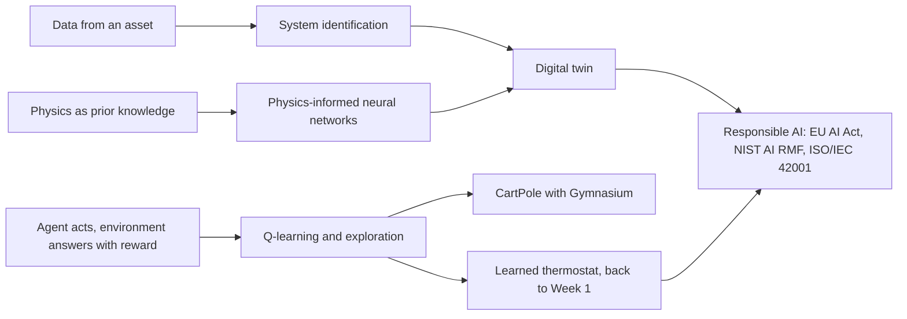
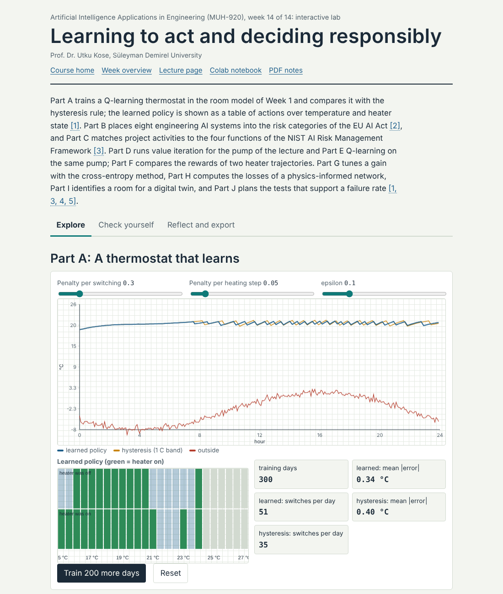
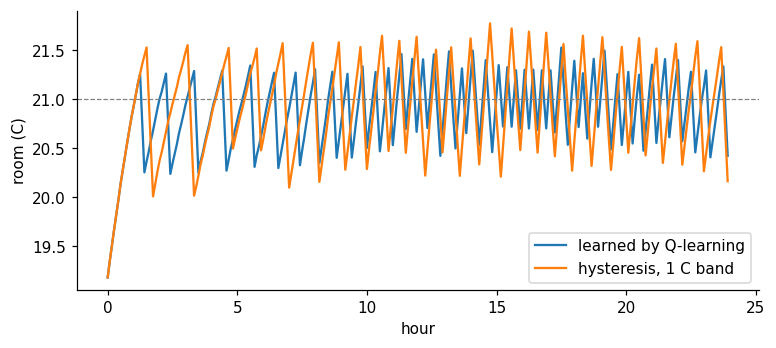
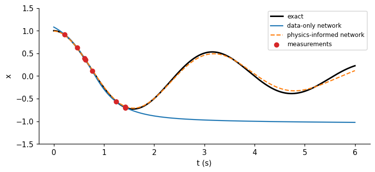

# Week 14: Learning to Act, Respecting Physics and Engineering Responsibly

**Artificial Intelligence Applications in Engineering (MUH-920 Mühendislikte Yapay Zeka Uygulamaları)** Prof. Dr. Utku Kose, Süleyman Demirel University

   

[Week 13](../week-13/README.md) | [All weeks](../../README.md#weekly-schedule) | [Final project](../../exams/final/README.md)

## Overview

The course began with a thermostat that followed fixed rules. It ends with agents that learn their own rules from reward, with models that obey physical laws while learning from data, and with the responsibilities that come with deploying such systems. Reinforcement learning learns a policy by trial and error [1, 2]; physics-informed neural networks add governing equations to the loss of a network [3, 4]; and digital twins keep a model synchronised with a physical asset [5, 6]. The week closes with safety, standards and regulation, including the European Union's Artificial Intelligence Act, the NIST AI Risk Management Framework and ISO/IEC 42001 [7, 8, 9], and with guidance for the final project.

**Estimated study time:** 10 to 12 hours.

> **Final project.** The final project is due at the end of this week. The weekly task of this week is a last check of reproducibility and of the report before submission, following the [project page](https://github.com/utkukose/ai-applications-in-engineering-NB-lecture/blob/main/exams/final/README.md).

## Learning outcomes

By the end of the week, students are expected to formulate a control task as a Markov decision process, to apply the Q-learning update and an epsilon-greedy policy, to explain why exploration on physical systems needs simulators and safeguards, to train a physics-informed network for an ordinary differential equation and compare it with a data-only network, to identify a simple model from data as the core of a digital twin, and to place an engineering AI system within the risk categories of the EU AI Act and the functions of the NIST framework.

## Week at a glance

## Materials of the week

| Material | What it contains | Link |
|---|---|---|
| Lecture page | Six sections with formulas, eight worked examples, four knowledge checks, an animation, a figure and six review cards | [Open the lecture page](https://utkukose.github.io/ai-applications-in-engineering-NB-lecture/weeks/week-14/lecture.html) |
| Lecture notes | The printable version of the week: the lecture with its formulas and worked examples, Python step 14 and the outputs of its code, followed by the discipline challenges and the tasks | [Open the PDF](Week14_Lecture_Notes.pdf) |
| Interactive lab | *Learning to act and deciding responsibly*, with ten interactive parts, a self-assessment of six questions, three reflection prompts and an exportable learning log | [Open the lab](https://utkukose.github.io/ai-applications-in-engineering-NB-lecture/weeks/week-14/lab.html) |
| Colab notebook | Python step 14: Environments, learning and organised code, followed by six hands-on sections with exercises and immediate feedback | [Open in Colab](https://colab.research.google.com/github/utkukose/ai-applications-in-engineering-NB-lecture/blob/main/weeks/week-14/NB14_rl_pinn_digital_twins.ipynb), [view on GitHub](NB14_rl_pinn_digital_twins.ipynb) |

## Contents

| Lecture page | Colab notebook |
|---|---|
| [Learning to act](https://utkukose.github.io/ai-applications-in-engineering-NB-lecture/weeks/week-14/lecture.html#learning-to-act) | [Python step 14: Environments, learning and organised code](https://colab.research.google.com/github/utkukose/ai-applications-in-engineering-NB-lecture/blob/main/weeks/week-14/NB14_rl_pinn_digital_twins.ipynb#scrollTo=python-step) |
| [Reinforcement learning in engineering](https://utkukose.github.io/ai-applications-in-engineering-NB-lecture/weeks/week-14/lecture.html#reinforcement-learning-in-engineering) | [1. One Q-learning update](https://colab.research.google.com/github/utkukose/ai-applications-in-engineering-NB-lecture/blob/main/weeks/week-14/NB14_rl_pinn_digital_twins.ipynb#scrollTo=section-1) |
| [Physics-informed learning](https://utkukose.github.io/ai-applications-in-engineering-NB-lecture/weeks/week-14/lecture.html#physics-informed-learning) | [2. The thermostat learns its own rule](https://colab.research.google.com/github/utkukose/ai-applications-in-engineering-NB-lecture/blob/main/weeks/week-14/NB14_rl_pinn_digital_twins.ipynb#scrollTo=section-2) |
| [Digital twins](https://utkukose.github.io/ai-applications-in-engineering-NB-lecture/weeks/week-14/lecture.html#digital-twins) | [3. CartPole with the cross-entropy method](https://colab.research.google.com/github/utkukose/ai-applications-in-engineering-NB-lecture/blob/main/weeks/week-14/NB14_rl_pinn_digital_twins.ipynb#scrollTo=section-3) |
| [Responsible engineering of AI systems](https://utkukose.github.io/ai-applications-in-engineering-NB-lecture/weeks/week-14/lecture.html#responsible-engineering-of-ai-systems) | [4. A physics-informed network for a damped oscillator](https://colab.research.google.com/github/utkukose/ai-applications-in-engineering-NB-lecture/blob/main/weeks/week-14/NB14_rl_pinn_digital_twins.ipynb#scrollTo=section-4) |
| [The course in retrospect](https://utkukose.github.io/ai-applications-in-engineering-NB-lecture/weeks/week-14/lecture.html#the-course-in-retrospect) | [5. A small digital twin of the room](https://colab.research.google.com/github/utkukose/ai-applications-in-engineering-NB-lecture/blob/main/weeks/week-14/NB14_rl_pinn_digital_twins.ipynb#scrollTo=section-5) |
| [Review cards](https://utkukose.github.io/ai-applications-in-engineering-NB-lecture/weeks/week-14/lecture.html#review-cards) | [6. A responsible-AI checklist for the final project](https://colab.research.google.com/github/utkukose/ai-applications-in-engineering-NB-lecture/blob/main/weeks/week-14/NB14_rl_pinn_digital_twins.ipynb#scrollTo=section-6) |

## Study path

| Step | Activity | Suggested time |
|---|---|---|
| 1 | Read the [lecture page](https://utkukose.github.io/ai-applications-in-engineering-NB-lecture/weeks/week-14/lecture.html) and answer its knowledge checks, or read the [PDF notes](Week14_Lecture_Notes.pdf) | 2 hours |
| 2 | Explore the simulation of the [interactive lab](https://utkukose.github.io/ai-applications-in-engineering-NB-lecture/weeks/week-14/lab.html#explore) | 1 hour |
| 3 | Work through [Python step 14](https://colab.research.google.com/github/utkukose/ai-applications-in-engineering-NB-lecture/blob/main/weeks/week-14/NB14_rl_pinn_digital_twins.ipynb#scrollTo=python-step) at the start of the Colab notebook | 1 hour |
| 4 | Continue with the hands-on sections of the [notebook](https://colab.research.google.com/github/utkukose/ai-applications-in-engineering-NB-lecture/blob/main/weeks/week-14/NB14_rl_pinn_digital_twins.ipynb) and their exercises | 3 hours |
| 5 | Solve the [discipline challenge](#discipline-challenges) of your department | 1 hour |
| 6 | Take the [self-assessment](https://utkukose.github.io/ai-applications-in-engineering-NB-lecture/weeks/week-14/lab.html#check) in the lab | 20 minutes |
| 7 | Answer the [reflection prompts](https://utkukose.github.io/ai-applications-in-engineering-NB-lecture/weeks/week-14/lab.html#reflect), export the learning log and complete the [weekly task](#weekly-task) | 1 hour |

## Preview

<table><tr><td colspan="2"> Interactive lab: Learning to act and deciding responsibly</td></tr><tr><td width="50%"></td><td width="50%"></td></tr><tr><td colspan="2">Outputs of the executed Colab notebook</td></tr></table>

## Discipline challenges

The last week connects learning with action and responsibility. Choose a row and sketch the agent, the physics or the twin, together with its main risk.

| Department | Challenge |
|---|---|
| Electrical and Electronics Engineering | Reinforcement learning for battery charging or demand response in a simulated microgrid, with safety limits. |
| Mechanical Engineering and Automotive Engineering | A digital twin of a pump or a vehicle subsystem that predicts temperatures and detects drift. |
| Civil Engineering | A physics-informed network for beam deflection or one-dimensional consolidation compared with the analytical solution. |
| Chemical Engineering and Chemistry | A physics-informed estimate of a reaction rate constant from sparse concentration data. |
| Environmental Engineering | Q-learning for aeration control in a simplified wastewater model with an energy penalty. |
| Industrial Engineering | Reinforcement learning for dispatching in a small simulated job shop compared with the rules of Week 3. |
| Mining Engineering | A digital twin of mine ventilation that tests fan schedules before they are applied underground. |
| Geophysical Engineering and Earth Sciences Engineering | Physics-informed interpolation of groundwater heads that respects Darcy flow. |
| Food Engineering and Biology | A twin of a drying or fermentation process identified from batch data. |
| Physics, Mathematics and Statistics | Discover the equation of a damped oscillator from data by sparse regression and compare with the physics-informed network [10]. |
| Computer Engineering and Textile Engineering | An EU AI Act and NIST AI RMF assessment of an AI system your department might deploy, such as automated fabric grading or code review. |

## Weekly task

Prepare the final project for submission. Run its notebook in a fresh runtime from the first cell to the last, record the versions of Python and the main libraries, the parameters and the random seeds in a run record, and check the report against the template and the evaluation criteria of the final project page. Then write about 500 words of reflection on the course: Which technique family suited the problem of the project, what the baselines showed, and which risks and responsibilities would remain if the system were deployed. Cite at least three works from this week's references and three from earlier weeks [3, 7, 8].

## Research and report assignment (optional)

**Trustworthy learning systems in engineering.** Review how reinforcement learning, physics-informed learning or digital twins are validated before deployment in one engineering domain, and relate the practices you find to the requirements for high-risk systems in the EU AI Act and to the functions of the NIST AI RMF [4, 6, 7, 8, 11].

Both assignments are optional. During an active semester, the weekly task can be sent together with the exported learning log, and the research report on its own, to utkukose@sdu.edu.tr or utkukose@gmail.com. They carry no separate weight, but the instructor may take them into account as a discretionary adjustment of the midterm component of the grade. The [assessment section of the syllabus](../../SYLLABUS.md#assessment) gives the details, and research reports use the [Word report template](../../exams/REPORT_TEMPLATE.docx).

## References

[1] Sutton, R. S., & Barto, A. G. (2018). *Reinforcement Learning: An Introduction* (2nd ed.). MIT Press.

[2] Watkins, C. J. C. H., & Dayan, P. (1992). Q-learning. *Machine Learning*, *8*(3-4), 279-292. <https://doi.org/10.1007/BF00992698>

[3] Raissi, M., Perdikaris, P., & Karniadakis, G. E. (2019). Physics-informed neural networks: A deep learning framework for solving forward and inverse problems involving nonlinear partial differential equations. *Journal of Computational Physics*, *378*, 686-707. <https://doi.org/10.1016/j.jcp.2018.10.045>

[4] Karniadakis, G. E., Kevrekidis, I. G., Lu, L., Perdikaris, P., Wang, S., & Yang, L. (2021). Physics-informed machine learning. *Nature Reviews Physics*, *3*(6), 422-440. <https://doi.org/10.1038/s42254-021-00314-5>

[5] Grieves, M., & Vickers, J. (2017). Digital twin: Mitigating unpredictable, undesirable emergent behavior in complex systems. In *Transdisciplinary Perspectives on Complex Systems (F.-J. Kahlen, S. Flumerfelt, & A. Alves, Eds.)* (pp. 85-113). Springer. <https://doi.org/10.1007/978-3-319-38756-7_4>

[6] Tao, F., Zhang, H., Liu, A., & Nee, A. Y. C. (2019). Digital twin in industry: State-of-the-art. *IEEE Transactions on Industrial Informatics*, *15*(4), 2405-2415. <https://doi.org/10.1109/TII.2018.2873186>

[7] European Parliament and Council of the European Union (2024). *Regulation (EU) 2024/1689 laying down harmonised rules on artificial intelligence (Artificial Intelligence Act)*. Official Journal of the European Union, L series, 12 July 2024. <https://eur-lex.europa.eu/eli/reg/2024/1689/oj>

[8] National Institute of Standards and Technology (2023). *Artificial Intelligence Risk Management Framework (AI RMF 1.0), NIST AI 100-1*. NIST. <https://doi.org/10.6028/NIST.AI.100-1>

[9] International Organization for Standardization (2023). *ISO/IEC 42001:2023 Information technology, Artificial intelligence, Management system*. ISO.

[10] Brunton, S. L., Proctor, J. L., & Kutz, J. N. (2016). Discovering governing equations from data by sparse identification of nonlinear dynamical systems. *Proceedings of the National Academy of Sciences*, *113*(15), 3932-3937. <https://doi.org/10.1073/pnas.1517384113>

[11] Degrave, J., Felici, F., Buchli, J., et al. (2022). Magnetic control of tokamak plasmas through deep reinforcement learning. *Nature*, *602*(7897), 414-419. <https://doi.org/10.1038/s41586-021-04301-9>

---

Artificial Intelligence Applications in Engineering. Prof. Dr. Utku Kose, Süleyman Demirel University. ORCID [0000-0002-9652-6415](https://orcid.org/0000-0002-9652-6415). Content licensed under CC BY 4.0, code under MIT. This course is updated in line with current developments in the field. Last update: October 2026.
